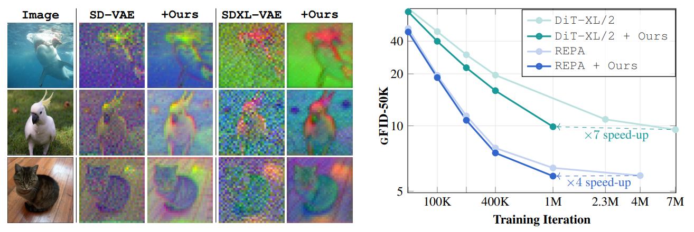

<!--
<style>
  .texttt {
    font-family: Consolas; /* 等宽字体 */
    font-size: 1em; /* 与周围文本大小一致 */
    color: teal; /* 将文本颜色设为蓝绿色 */
    letter-spacing: 0; /* 按需调整 */
  }
</style>
-->

<h1 align="center">
  <span style="color: teal; font-family: Consolas;">EQ-VAE</span>：用于改进生成式图像建模的等变性正则化潜空间
</h1>

<div align="center">
  <a href="https://scholar.google.com/citations?user=a5vkWc8AAAAJ&hl=en" target="_blank">Theodoros&nbsp;Kouzelis</a><sup>1,3</sup> &ensp; <b>&middot;</b> &ensp;
  <a href="https://scholar.google.com/citations?user=B_dKcz4AAAAJ&hl=el" target="_blank">Ioannis&nbsp;Kakogeorgiou</a><sup>1</sup> &ensp; <b>&middot;</b> &ensp;
  <a href="https://scholar.google.fr/citations?user=7atfg7EAAAAJ&hl=en" target="_blank">Spyros&nbsp;Gidaris</a><sup>2</sup> &ensp; <b>&middot;</b> &ensp;
  <a href="https://scholar.google.com/citations?user=xCPoT4EAAAAJ&hl=en" target="_blank">Nikos&nbsp;Komodakis</a><sup>1,4,5</sup>
  <br>
  <sup>1</sup> Archimedes/Athena RC &emsp; <sup>2</sup> valeo.ai &emsp; <sup>3</sup> National Technical University of Athens &emsp; <br>
  <sup>4</sup> University of Crete &emsp; <sup>5</sup> IACM-Forth &emsp; <br>

<p></p>
<a href="https://eq-vae.github.io/"></a>
<a href="https://arxiv.org/abs/2502.09509"></a>
<p></p>



</div>

<br>

<b>简述</b>：我们提出了 **EQ-VAE**，这是一个直接的正则化目标，用于促进预训练自编码器的潜空间在缩放和旋转变换下具有等变性。它会得到结构更清晰的潜变量分布，从而加速生成模型训练并提升性能。

### 本地 RAE 研究扩展

本仓库还包含面向 RAE-DINOv2、RAE-MAE 与 RAE-SigLIP2 的 token / layerwise
几何诊断、可逆 latent adapter 与阶段二生成对照实验。入口、存储约定和脚本
说明见 [experiments/README.md](experiments/README.md)，当前结论与未解决问题见
[docs/RESEARCH_STATUS.md](docs/RESEARCH_STATUS.md)。数据集从 `/data/shared` 读取；
本机生成的模型、checkpoint、结果统一存放在 `$HOME/data/eqvae`，仓库中的
`artifacts/`、`pretrained_models/` 和 `external/RAE/models/` 是兼容软链接。

### 0. 使用 Hugging Face 快速开始

如果你只想使用 EQ-VAE 来加速扩散模型训练，可以直接使用我们的 Hugging Face 检查点。
我们提供了两个模型：[eq-vae](https://huggingface.co/zelaki/eq-vae) 和 [eq-vae-ema](https://huggingface.co/zelaki/eq-vae-ema)。

| 模型 | 基础模型 | 数据集 | 训练轮数 | rFID | PSNR | LPIPS | SSIM |
|------|----------|--------|----------|------|------|-------|------|
| [eq-vae](https://huggingface.co/zelaki/eq-vae) | SD-VAE | OpenImages | 5 | 0.82 | 25.95 | 0.141 | 0.72 |
| [eq-vae-ema](https://huggingface.co/zelaki/eq-vae-ema) | SD-VAE | Imagenet | 44 | 0.55 | 26.15 | 0.133 | 0.72 |

```python
from diffusers import AutoencoderKL
eqvae = AutoencoderKL.from_pretrained("zelaki/eq-vae")
```

如果你需要原始 LDM 格式的权重，可以在这里找到：[eq-vae-ldm](https://huggingface.co/zelaki/eq-vae-ldm)、[eq-vae-ema-ldm](https://huggingface.co/zelaki/eq-vae-ema-ldm)。

### 1. 环境配置

```bash
conda env create -f environment.yml
conda activate eqvae
```

### 2. 训练 EQ-VAE

我们提供了训练脚本，用 EQ-VAE 正则化来微调 [SD-VAE](https://ommer-lab.com/files/latent-diffusion/kl-f8.zip)。详细指南见 [train_eqvae](./train_eqvae/)。

### 3. 评估重建质量

要评估 EQ-VAE 的重建结果，可在验证集上计算 rFID、LPIPS、SSIM 和 PSNR。论文中使用的是 ImageNet 验证集，命令如下：

```bash
torchrun --nproc_per_node=8 eval.py \
  --data_path /path/to/imagenet/validation \
  --output_path results \
  --ckpt_path /path/to/your/ckpt
```

### 4. 使用 EQ-VAE 训练 DiT

在 ImageNet 上使用 EQ-VAE 训练 DiT 模型：

- 首先提取潜表示：

  ```bash
  torchrun --nnodes=1 --nproc_per_node=8  train_gen/extract_features.py \
      --data-path /path/to/imagenet/train \
      --features-path /path/to/latents \
      --vae-ckpt /path/to/eqvae.ckpt \
      --vae-config configs/eqvae_config.yaml
  ```

- 然后在预先计算好的潜变量上训练 DiT：

  ```bash
  accelerate launch --mixed_precision fp16 train_gen/train.py \
      --model DiT-XL/2 \
      --feature-path /path/to/latents \
      --results-dir results
  ```

- 按如下方式评估生成结果：

  ```bash
  torchrun --nnodes=1 --nproc_per_node=8 sample_ddp.py \
      --model DiT-XL/2 \
      --num-fid-samples 50000 \
      --ckpt /path/to/dit.cpt \
      --sample-dir samples \
      --vae-ckpt /path/to/eqvae.ckpt \
      --vae-config configs/eqvae_config.yaml \
      --ddpm True \
      --cfg-scale 1.0
  ```

该脚本会生成包含 5 万张样本图像的文件夹，同时生成一个 `.npz` 文件；这些输出可以直接用于 [ADM 的 TensorFlow 评估套件](https://github.com/openai/guided-diffusion/tree/main/evaluations) 来计算 gFID。

### 致谢

本代码主要基于 [LDM](https://github.com/CompVis/latent-diffusion) 和 [fastDiT](https://github.com/chuanyangjin/fast-DiT) 构建。

### 引用

```bibtex
@inproceedings{
  kouzelis2025eqvae,
  title={{EQ}-{VAE}: Equivariance Regularized Latent Space for Improved Generative Image Modeling},
  author={Theodoros Kouzelis and Ioannis Kakogeorgiou and Spyros Gidaris and Nikos Komodakis},
  booktitle={Forty-second International Conference on Machine Learning},
  year={2025},
  url={https://openreview.net/forum?id=UWhW5YYLo6}
}
```
