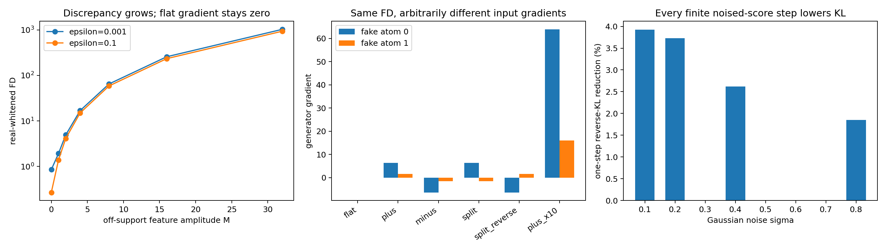

# AdvFD witness 梯度与扩散 score 反例审计

## 结论

当前能够严格成立的故事不是：

> AdvFD 的 adversarial representation 没有概率意义，而 score 有。

这个说法过强，而且在一个重要的理想化情形中是错的。真正能够成立的是：

> **AdvFD 的 real-feature whitening 只校准 representation 在真实分布上的特征值统计，
> 并不识别 representation 在生成样本处的输入导数。因而相同、甚至任意大的
> AdvFD 值可以对应零、相反或任意放大的生成器输入梯度。Gaussian noising 后的
> score difference 则是平滑分布所唯一确定的场，并给出严格的 KL 下降方向。**

这是一条真实的理论反例，但边界必须说清：

- 它证明 AdvFD 目标值本身不控制 generator correction field；
- 它不证明官方有限步优化一定学到最坏 witness；
- 它不证明 score 在所有实际训练中都优于 AdvFD；
- 直接用 real/fake score difference 后训练 generator 已被 Diff-Instruct、DMD、
  Denoising Fisher Training 等工作覆盖，不能直接作为新方法。

## 1. 先排除一个错误攻击

先只考虑 scalar feature (f) 的均值项，并用真实分布 (p) 做精确校准：

\[
\mathbb E_p f=0,
\qquad
\mathbb E_p f^2=1.
\]

若 (q\ll p)，令 (r=dq/dp)，则

\[
\mathbb E_q f
=\mathbb E_p[rf]
=\mathbb E_p[(r-1)f].
\]

因此

\[
\sup_{\mathbb E_p f=0,\,\mathbb E_p f^2=1}
(\mathbb E_qf)^2
=
\mathbb E_p(r-1)^2
=
\chi^2_{\mathrm{Pearson}}(q\|p).
\]

最优 witness 为

\[
f^*(x)
=
\frac{r(x)-1}{\sqrt{\chi^2_{\mathrm{Pearson}}(q\|p)}}
\]

（忽略整体正负号）。若 (p,q) 有光滑正密度，则

\[
\nabla r
=r(s_q-s_p).
\]

所以在这个 **shared-support、population、mean-only、无限函数类** 的特例中，
AdvFD 风格 witness 的梯度并非任意噪声，而是 density-ratio-weighted score
difference。它与 Fisher GAN、(f)-divergence distillation 的结构是相通的。

本实验还做了一个离散 control：

\[
p=(0.5,0.5),\qquad q=(0.8,0.2),\qquad f=(-1,1).
\]

数值上

\[
(\mathbb E_qf)^2=0.36
=\chi^2_{\mathrm{Pearson}}(q\|p).
\]

因此，本工作的反例不能建立在“AdvFD witness 天生没有概率意义”上；它必须从
(q\not\ll p) 以及 feature value 与 feature derivative 的脱钩入手。

## 2. 反例分布

取一维真实分布和生成分布：

\[
p=\tfrac12\delta_{-1}+\tfrac12\delta_{1},
\]

\[
q=0.8\delta_{-0.5}+0.2\delta_{2}.
\]

两者支持集不相交，但都有

\[
\mu_p=\mu_q=0,
\qquad
\operatorname{Var}(p)=\operatorname{Var}(q)=1.
\]

所以 identity representation 下的完整一维 Fréchet distance 恰好为零：

\[
D_{\mathrm{FD}}(p,q)=0.
\]

这同时关闭了 static FD 分支：若 adaptive branch 也不给出可用梯度，static branch
不能替它补救。

## 3. AdvFD 可以看见差异，但不识别 correction field

### 3.1 构造 feature 值

对任意 (M>0)，令 scalar representation 满足

\[
f_M(-1)=-1,
\qquad
f_M(1)=1,
\]

\[
f_M(-0.5)=f_M(2)=M.
\]

于是 real feature 的均值和方差恒为

\[
\mu_p^f=0,
\qquad
(\sigma_p^f)^2=1,
\]

而 fake feature 满足

\[
\mu_q^f=M,
\qquad
(\sigma_q^f)^2=0.
\]

论文 Eq. (33) 对 real/fake 共同应用 regularized real whitening 时，一维目标为

\[
D_{\mathrm{paper},\epsilon}(M)
=
\frac{M^2}{1+\epsilon}
+
\frac{1}{1+\epsilon}.
\]

发布代码的 helper 还给 fake covariance 加载同一个 (epsilon)，其目标为

\[
D_{\mathrm{official},\epsilon}(M)
=
\frac{M^2}{1+\epsilon}
+
\left(
1-\sqrt{\frac{\epsilon}{1+\epsilon}}
\right)^2.
\]

两者都随 (M^2) 发散。实验同时扫描了论文使用的
(epsilon=10^{-3}) 和发布函数默认值 (0.1)。结论不依赖这一区别。

### 3.2 相同 feature 值可以拥有任意一阶导数

四个支持点彼此不同。Hermite 插值保证：给定上述四个 feature 值后，还可以任意指定

\[
f'_M(-1),\quad f'_M(1),\quad f'_M(-0.5),\quad f'_M(2),
\]

并由一个至多七次的光滑多项式同时实现。

因此，AdvFD 在这四个支持点上看到的 feature moments 完全相同，但 generator 使用的
input Jacobian 可以任意改变。

固定 critic 后，把两个 fake atom 位置记作 (a_j)，权重记作 (w_j)。在本构造中
fake covariance 对位置的一阶导数为零，发布版目标给出

\[
\boxed{
\frac{\partial D_{\mathrm{official},\epsilon}}{\partial a_j}
=
\frac{2Mw_j}{1+\epsilon}f'_M(a_j).
}
\]

这条公式直接说明：

- 令 (f'_M(a_j)=0)，生成梯度严格为零；
- 改变导数正负号，生成梯度随之反向；
- 放大导数，生成梯度可以任意放大；
- 上述所有 critic 的 AdvFD 值完全相同。

发布代码在 G-step 使用

\[
\frac{D_{\mathrm{adv}}}
{\operatorname{sg}(D_{\mathrm{adv}})+0.01}
\]

做归一化。它只乘了一个正 scalar，无法把零梯度变成非零，也无法消除方向非识别性。

### 3.3 比“发散”更强的结论

令 fake 支持点处导数全为零，则

\[
D_{\mathrm{adv}}(M)\to\infty,
\qquad
\nabla_{a}D_{\mathrm{adv}}(M)=0.
\]

但真正更重要的不是 (M\to\infty)。AdvFD 论文已经用有限步、gradient-clipped
AdamW 的可达紧集论证实现轨迹在有限 horizon 内有界。即使只固定一个有限的
(M=4)，目标值仍不能区分零梯度、反向梯度和十倍梯度。这一 **jet
non-identifiability** 不依赖无穷参数极限。

real-feature whitening 约束的是 (f(x)) 在 real samples 上的零阶统计；它没有直接约束
(J_f(x)) 在 fake samples 上的行为。pooled whitening 或 output cap 可以限制 feature
幅度，但若不同时控制输入导数，也不能单独解决这一本质问题。

## 4. Gaussian-noised score 为什么在此反例上有严格方向

clean (p,q) 是离散分布，clean score 根本不存在。不能把一个未定义的 clean score
拿来宣称胜过 AdvFD。

对任意 (sigma>0)，定义

\[
p_\sigma=p*\mathcal N(0,\sigma^2),
\qquad
q_\sigma=q*\mathcal N(0,\sigma^2).
\]

两者此时处处为正且光滑，score

\[
s_{p_\sigma}=\nabla\log p_\sigma,
\qquad
s_{q_\sigma}=\nabla\log q_\sigma
\]

唯一确定。

### 4.1 分布空间中的严格 KL 耗散

让 (q_\sigma) 在辅助时间 (\tau) 下满足 continuity equation：

\[
\partial_\tau q_\sigma
=-
\nabla\cdot(q_\sigma v),
\qquad
v=s_{p_\sigma}-s_{q_\sigma}.
\]

则

\[
\boxed{
\frac{d}{d\tau}
\operatorname{KL}(q_\sigma\|p_\sigma)
=-
\mathbb E_{q_\sigma}
\left\|s_{q_\sigma}-s_{p_\sigma}\right\|^2
<0
}

只要 (p_\sigma\ne q_\sigma)。这不是“score 看起来朝向真实数据”的直觉，而是
reverse-KL 的 Wasserstein gradient-flow 恒等式。

### 4.2 在本离散 generator 参数化中的严格下降

令 fake atoms 为 (a_j)，固定混合权重 (w_j)。对 noised reverse KL 有

\[
\frac{\partial}{\partial a_j}
\operatorname{KL}(q_\sigma\|p_\sigma)
=
w_j
\mathbb E_{X\sim\mathcal N(a_j,\sigma^2)}
[s_{q_\sigma}(X)-s_{p_\sigma}(X)].
\]

若每个 atom 使用

\[
\dot a_j
=
\mathbb E_{X\sim\mathcal N(a_j,\sigma^2)}
[s_{p_\sigma}(X)-s_{q_\sigma}(X)],
\]

则

\[
\boxed{
\frac{d}{d\tau}
\operatorname{KL}(q_\sigma\|p_\sigma)
=-
\sum_jw_j\|\dot a_j\|^2
<0.
}

因此，score 在这个 generator 可表达的有限维子空间内也给出严格下降，而不仅是对
任意粒子 flow 的抽象结论。

## 5. 数值结果

### 5.1 相同 AdvFD，完全不同的生成梯度

固定 (M=4,epsilon=10^{-3})：

| fake 点导数 | official AdvFD | atom 0 梯度 | atom 1 梯度 |
|---|---:|---:|---:|
| `(0, 0)` | 16.921801 | 0.000000 | 0.000000 |
| `(1, 1)` | 16.921801 | 6.393606 | 1.598402 |
| `(-1, -1)` | 16.921801 | -6.393606 | -1.598402 |
| `(1, -1)` | 16.921801 | 6.393606 | -1.598402 |
| `(-1, 1)` | 16.921801 | -6.393606 | 1.598402 |
| `(10, 10)` | 16.921801 | 63.936064 | 15.984016 |

六个 AdvFD 值的最大跨度只有 (2.14\times10^{-12})。平坦 witness 的梯度范数为
(3.79\times10^{-13})，属于多项式求解的浮点残差。

### 5.2 扩散 score 的解析 control

| (sigma) | KL before | continuum (d\mathrm{KL}/d\tau) | atom-param (d\mathrm{KL}/d\tau) | finite-step KL change |
|---:|---:|---:|---:|---:|
| 0.1 | 20.192744 | -4000.002480 | -3999.994892 | -0.791999 |
| 0.2 | 5.174265 | -253.145777 | -243.140075 | -0.192740 |
| 0.4 | 1.193379 | -18.286407 | -9.856578 | -0.031286 |
| 0.8 | 0.132883 | -0.819415 | -0.194436 | -0.002458 |

四个噪声尺度下：

- continuum score flow 的导数全部严格为负；
- generator atom 参数空间中的导数全部严格为负；
- 使用位移量约为原位置尺度 1%--2% 的有限步后，numerical KL 全部下降。



## 6. 这个反例证明了什么

1. **检测差异和提供修正方向不是同一个约束。** AdvFD 可以把 moment-matched 的
   (p,q) 区分得任意明显，但其 scalar discrepancy 不决定 fake support 上的输入梯度。
2. **real whitening 解决 coordinate scale，不解决 derivative identifiability。** 它能消除
   common affine rescaling，却没有把 feature geometry 拉回到唯一的 sample-space flow。
3. **扩散平滑在支持集错位时是实质操作。** 它让 score 和 KL gradient 重新定义良好，
   不是只为数值方便加一点噪声。
4. **score difference 有可验证的下降对象。** 理想场对 noised reverse KL 有严格耗散，
   而 AdvFD 值没有给出同类的 sample-space descent 保证。

## 7. 它没有证明什么

1. **没有证明官方 AdvFD 一定失败。** 官方网络初始化、有限 learning rate、gradient
   clipping、weight decay 和 architecture implicit bias 可能偏好有用 witness。当前命题是
   “目标不保证”，不是“训练必达坏解”。
2. **没有证明 score 的实际估计更容易。** score 方案通常需要 real score 和在线 fake
   score，计算和误差都可能明显高于一个 adaptive encoder。
3. **没有证明 reverse KL 对生成质量最优。** reverse KL 有 mode-seeking 倾向；
   (f)-distill 已说明不同 divergence 会改变 score-difference 权重及 coverage/variance
   tradeoff。
4. **没有证明 KL 下降必然带来 FID 下降。** 当前是理论 counterexample，不是图像质量
   定理。
5. **没有证明优势来自 score 而不是 noising。** Gaussian smoothing 同时修复了 support
   overlap；必须补 noised AdvFD 才能区分二者。
6. **没有产生方法 novelty。** 直接用 score difference 更新可微 generator，已经属于
   Diff-Instruct / DMD / Fisher-style implicit sampler training 的邻域。

## 8. 与已有工作的准确关系

- [AdvFD](https://arxiv.org/abs/2608.11205) 学习 feature geometry，并在该 geometry 中
  最大化/最小化 Gaussian moment transport。论文自己只证明有限 optimizer horizon 的
  参数有界性及 whitening 的 affine invariance，没有证明 generator input field 唯一。
- [Fisher GAN](https://proceedings.neurips.cc/paper_files/paper/2017/file/07042ac7d03d3b9911a00da43ce0079a-Paper.pdf)
  使用 pooled real/fake 二阶矩约束 critic；full-capacity Fisher IPM 对应 chi-square
  discrepancy。这说明“calibrated adversarial witness 有概率意义”并非新发现，也说明
  real-only calibration 不是唯一选择。
- [Sobolev Descent](https://proceedings.mlr.press/v89/mroueh19a/mroueh19a.pdf)
  直接约束 critic gradient，并证明沿 optimal Sobolev critic 的粒子更新降低 MMD。
  因此本反例首先指向的是 **derivative-aware calibration**；score 只是其中一个规范场，
  不是逻辑上唯一的修复。
- [Which Training Methods for GANs Do Actually Converge?](https://arxiv.org/abs/1801.04406)
  给出非绝对连续分布下的 GAN 反例，并证明 instance noise / zero-centered gradient
  penalty 的稳定作用。本反例与其共享“低维或错位支持破坏未正则 adversarial game”
  的根源。
- [Diff-Instruct](https://proceedings.neurips.cc/paper_files/paper/2023/file/f115f619b62833aadc5acb058975b0e6-Paper-Conference.pdf)
  通过沿扩散路径积分 KL，明确处理 misaligned supports，并允许后训练任意可微
  generator。
- [DMD](https://openaccess.thecvf.com/content/CVPR2024/html/Yin_One-step_Diffusion_with_Distribution_Matching_Distillation_CVPR_2024_paper.html)
  已把 generator distribution-matching gradient 写成 target/fake score difference。
- [One-step Diffusion Models with f-Divergence Distribution Matching](https://research.nvidia.com/labs/genair/f-distill/)
  进一步说明一般 (f)-divergence 梯度是 density-ratio-weighted score difference，且
  divergence choice 决定 mode seeking、saturation 和 variance。
- [Denoising Fisher Training](https://arxiv.org/abs/2411.01453) 已研究用 denoising Fisher
  objective 训练 neural implicit sampler；这进一步压缩了“用 score 取代 GAN/AdvFD”
  能够声称的新颖空间。

## 9. 下一轮真正有判别力的实验

这条故事若继续，不能只做“AdvFD vs score”。最小公平矩阵应为：

1. clean AdvFD；
2. **noised AdvFD**：在相同 (sigma) 上给 real/fake 加噪，再训练 adaptive feature；
3. AdvFD + fake-support Sobolev/Jacobian calibration；
4. exact noised score flow；
5. learned noised score flow，使用与 critic 相近的参数/样本预算。

使用同一个 moment-matched、支持错位 generator，报告：

- held-out discrepancy，而不只看 critic train objective；
- generator input-gradient norm、方向和跨 seed 方差；
- reverse KL、Wasserstein/SWD、mode mass 与 finite-step stability；
- estimator 参数量、forward/backward 次数和训练时间。

这组对照区分三个不同解释：

- 若 noised AdvFD 已恢复，关键是 support smoothing，不是 score；
- 若 Sobolev AdvFD 已恢复，关键是 derivative calibration，不是 score；
- 只有 learned score 在同预算下稳定恢复，而两者仍失败，才支持“diffused score field
  具有 AdvFD witness 无法替代的结构优势”。

## 10. 停止条件

出现任一情况，应停止把它包装成 score-over-AdvFD 方法主线：

1. learned AdvFD 在该分布族上始终学到稳定且有效的梯度，坏 witness 只存在于人工
   Hermite 构造；
2. noised AdvFD 与 score 表现相同，说明全部收益来自 Gaussian overlap；
3. Sobolev/Jacobian regularization 用更低成本消除失败；
4. score estimator 的误差或成本使理想 KL 下降无法转化成 learned setting 的收益；
5. full score objective 单独最佳，使 static FD + residual score 的组合没有必要。

## 复现

```bash
python experiments/run_advfd_score_counterexample.py \
  --output-dir docs/data/advfd_score_counterexample_v1

python -m pytest -q tests/test_advfd_score_counterexample.py
```

机器可读结果：

- `docs/data/advfd_score_counterexample_v1/amplitude_scan.csv`
- `docs/data/advfd_score_counterexample_v1/witness_jet_scan.csv`
- `docs/data/advfd_score_counterexample_v1/noised_score_scan.csv`
- `docs/data/advfd_score_counterexample_v1/summary.json`
