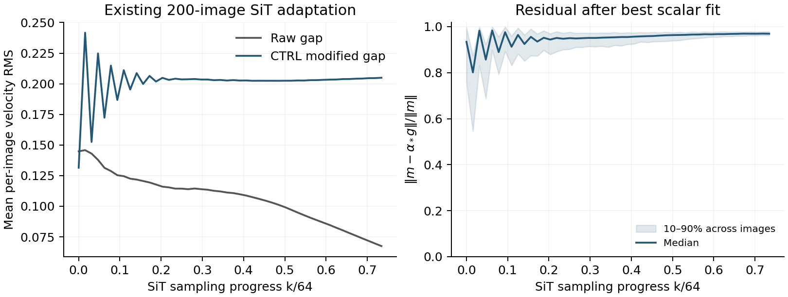
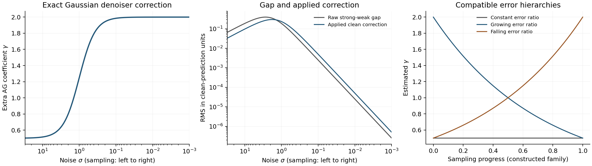

# AG 引导系数的衰减、误差消除与可检验等式

AG 可以从误差消除条件中导出引导系数，但**不存在仅凭“强模型比弱模型好”就能推出的普遍指数衰减律**。指数衰减成立需要额外条件，例如弱模型相对强模型的可消除误差比例按指数增长，或者强弱差中的可靠信号份额按指数下降。这些条件可以测量，不能由时间走到后半程直接替代。

**2026-09-12 修正研究优先级：** 用户指出仓库已有非共线证据。复查发现，SiT depth8−depth4 相对 strong−depth4 的最佳全局共线拟合仍剩 73.87% 的残差能量；RAEv2 的既有配对风险分析也早已说明风险最优系数与生成收益不一致。因此，不应把下面的比例误差模型作为当前 AG / IG 的优先机制解释。其数学等式只保留为条件模型；新的实测诊断见 [AG / IG 平滑假说分析](AG_IG_SMOOTHING_HYPOTHESIS_20260912_ZH.md)。

此前考虑过一个条件关系：在同一状态、同一噪声层，若强、弱、更弱三个模型具有特定比例误差，则相邻外推可以指向同一个去噪预测：

\[
\boxed{
D_0+\gamma(D_0-D_1)=D_1+\gamma(D_1-D_2).
}
\tag{1}
\]

若三个模型的误差确实满足几何比例，这个等式能精确消除共享误差；若存在共同偏差，它也可能指向错误结果。它提供一个有条件的 AG 系数估计器，不提供生成质量保证，且当前已有证据不支持优先采用这一前提。

下文包含论文与作者实现的核对、已有 SiT 轨迹的重新分析、新增可解析模型验证，以及可直接处理模型预测张量的参考代码。新增验证均在 CPU 上完成；没有新增真实 AG 图像质量实验，也没有把构造模型的误差下降当作 FID 收益。

**CFG-CTRL 的指数性质来自理想滑模目标，发布算法还包含其他作用。** CFG-CTRL 选择形如

\[
s=\dot e+\lambda e
\]

的滑模变量。在所选控制时间坐标中，若控制确实把系统维持在 $s=0$，且 $\lambda>0$，便有

\[
e(\tau)=e(\tau_0)\exp[-\lambda(\tau-\tau_0)].
\]

这个推导说明目标动力学具有指数收敛形状。它本身没有说明所选误差为何是生成质量的正确目标，也没有从 FID 或偏好目标唯一确定 $\lambda$。要判断它为什么有效，需要进一步验证误差、控制作用方向与生成质量的关系。[^1]

作者固定提交中的实际函数可写成

\[
s_k=g_k+(\lambda-1)m_{k-1},\qquad
m_k=g_k-K\,\operatorname{sign}(s_k).
\tag{2}
\]

这里 $g_k$ 是当前原始分支差，$m_{k-1}$ 是上一轮已经修正的差；第一次调用以当前 $g_k$ 初始化历史。返回结果为参考分支加 $w m_k$。逐坐标 sign、历史反馈和预测单位均影响结果；一般不存在仅依赖时间的标量 $\alpha_k$ 使 $m_k=\alpha_k g_k$。[^2]

直接调用作者函数，固定 $g_k=0.05,\lambda=5,K=0.2$，得到

\[
m_k=-0.15,\ 0.25,\ -0.15,\ 0.25,\ldots
\]

其平均值为原始 $g$，不是指数趋零。这个特例排除了将发布函数普遍等同于指数标量调度的解释，不否定论文在特定模型上的经验收益。

已有的 SiT-S/2 适配轨迹提供了更直接的观察。该实验用 200 个固定新噪声、Heun64，$\lambda=5,K=0.2$；附加 guidance 只在 $k=0,\ldots,47$ 生效。对每张图、每步求最好的标量拟合

\[
\alpha_*=\frac{\langle m,g\rangle}{\|g\|^2},\qquad
\rho_\perp=\frac{\|m-\alpha_*g\|}{\|m\|}.
\]

原记录只有三个 RMS，但由
$2\langle m,g\rangle=\|m\|^2+\|g\|^2-\|m-g\|^2$
即可恢复这两个量；计算先在每个样本上完成，再汇总。

|采样进度 $k/64$|原始 gap RMS，均值|修正 gap RMS，均值|最佳标量拟合后的相对残差，中位数|
|---:|---:|---:|---:|
|0.2500|0.11437|0.20356|0.95022|
|0.5000|0.09928|0.20248|0.96335|
|0.7344|0.06748|0.20491|0.96943|

这里修正后的范数约保持在 0.20，大部分向量幅度不能被沿原始 gap 的任何标量缩放解释。它表明**当前 SiT 配置的逐步作用包含显著方向变化**；最终指标能否由某条精心调节的标量曲线接近，仍是另一个实验问题。该表属于本仓库的 SiT 适配，不能外推成作者所有 SD3.5、Flux、Qwen 配置都如此。[^3]

左图为每张图 RMS 的均值；右图为相对残差的中位数及样本间 10%–90% 分位区间。横轴只覆盖原实验实际施加附加 guidance 的阶段。原始数据与派生数据均保留于配套工作簿。

**讨论 AG 的衰减前，需要固定系数与预测单位。** 以下将强模型记为 $D_S$，弱模型记为 $D_W$，二者预测同一目标的干净数据，且输入同一 $(x_\sigma,\sigma,c)$：

\[
d=D_S-D_W,\qquad
D_\gamma=D_S+\gamma d.
\tag{3}
\]

$\gamma=0$ 对应只使用强模型；AG 常见写法
$D_W+w(D_S-D_W)$
中的 $w=1+\gamma$。因此，“关闭 AG”对应 $w\to1$；直接把 $w$ 衰减至零会走向弱模型。AG 原论文将方法解释为利用兼容的强弱模型误差：弱模型应放大强模型已有的退化，而非仅仅拥有更差的综合指标。[^4]

需要区分的量至少有四个：原始差 $\|d\|$、额外系数 $\gamma$、实际预测修正 $\|\gamma d\|$、以及这项修正经过采样器时间系数后的状态位移。在 VE 参数化中，

\[
s_\gamma-s_S=\frac{\gamma d}{\sigma^2},
\qquad
\delta\!\left(\frac{dx}{d\sigma}\right)=-\frac{\gamma d}{\sigma}.
\tag{4}
\]

所以 clean prediction 中的修正趋零，并不自动意味着 score 修正也趋零。步长、参数化和剩余积分区间都影响其实际作用。后文的高斯图用干净预测单位，前面的 CTRL 图用 SiT 速度单位，二者的绝对数值不作比较。

**最直接的 AG 等式是消除强模型误差在引导方向上的投影。** 固定噪声层，令

\[
D_*=\mathbb E[X\mid x_\sigma,c],\qquad e_S=D_S-D_*.
\]

若有足够信息知道 $D_*$，标量引导的合理局部条件是

\[
\boxed{\langle e_S+\gamma d,d\rangle=0.}
\tag{5}
\]

它让修正后的误差与可用方向正交，也就是在这条直线上达到最小平方误差。只有当原始误差确实沿 $d$ 方向时，这才进一步等于全部误差被消除。

实际数据可以估计同一条件的期望版本。对真实数据 $X$ 按已声明的噪声过程得到 $x_\sigma$，定义

\[
A(\sigma)=\mathbb E\langle X-D_S,d\rangle,\qquad
B(\sigma)=\mathbb E\|d\|^2.
\]

只要 $B>0$，

\[
\begin{aligned}
L(\gamma)&=\mathbb E\|X-D_S-\gamma d\|^2\\
&=L_S-2\gamma A+\gamma^2B,\\[2mm]
\boxed{\gamma_{\rm MSE}=\frac{A}{B}.}
\end{aligned}
\tag{6}
\]

如果限制 $\gamma\ge0$，答案是 $\max(0,A/B)$。若 $B=0$，两模型在这个评价分布上没有可用的差，系数无法识别，任何有限系数都不改变输出。

还有一个便于离线测量的等价式：

\[
\boxed{
\gamma_{\rm MSE}
=\frac{L_W-L_S-B}{2B}.
}
\tag{7}
\]

因为 $X-D_W=(X-D_S)+d$，展开平方即可得到 $L_W=L_S+2A+B$。这意味着仅有 $L_W>L_S$ 不足以支持正向 AG；需要更强的条件 $L_W-L_S>B$。强模型已经解释掉的误差、强弱差自身的能量，以及差与剩余误差的相关性，必须一起看。

式 (6) 是平方风险的一维回归解，不能作为新算法的数学首创。它的价值在于把“应该减弱”的口头判断转化为可以测量的分子和分母，而不预先假设一条时间曲线。

**误差变小本身不会强制系数衰减。** 先考虑最理想的兼容误差：

\[
D_S=D_*+e,\qquad D_W=D_*+\kappa e,\qquad \kappa>1.
\]

代入 AG 得到

\[
D_\gamma-D_*=[1-\gamma(\kappa-1)]e,
\qquad
\boxed{\gamma_*=\frac{1}{\kappa-1}.}
\tag{8}
\]

这一公式给出很具体的解释：如果弱模型相对强模型的偏差越来越大，同样大小的 $\gamma$ 会过度补偿，因此需要减小系数；如果两者按相同比例一起变好，$\kappa$ 不变，最优系数就不变。原始差和实际修正都可以在这种情况下自然变小。

以从噪声到数据的进度 $\tau$ 求导，

\[
\frac{d}{d\tau}\log\gamma_*
=-\frac{d}{d\tau}\log(\kappa-1).
\tag{9}
\]

因此，只有进一步满足

\[
\kappa(\tau)-1=b_0e^{\lambda\tau}
\]

时，才会得到 $\gamma_*(\tau)=b_0^{-1}e^{-\lambda\tau}$。这给出了指数衰减的一个机制条件；它尚需在真实 AG 模型上验证。

加入不兼容误差后，在固定噪声层取标量 $b>0$，可以写成

\[
d=-b e_S+\eta,\qquad
\mathbb E\langle e_S,\eta\rangle=0,
\]

并令 $V=\mathbb E\|e_S\|^2,\ N=\mathbb E\|\eta\|^2$。利用真实后验残差的正交性，式 (6) 化为

\[
\boxed{
\gamma_{\rm MSE}
=\frac{bV}{b^2V+N}
=\frac1b
\underbrace{\frac{b^2V}{b^2V+N}}_{\text{可消除误差信号份额}}.
}
\tag{10}
\]

若 $b$ 大致稳定，而后期共享误差 $V$ 下降、非共享误差 $N$ 没有相应下降，引导的可信份额就下降，系数应随之减小。若 $N=0$，单独让 $V$ 下降却不会让系数下降。指数形式仍需要这个可信份额或相对误差比例具有相应的时间规律。

对更一般的正系数区域，式 (6) 还给出

\[
\frac{d\log\gamma_{\rm MSE}}{d\tau}
=\frac{d\log A}{d\tau}-\frac{d\log B}{d\tau}.
\tag{11}
\]

只有分子相对分母下降时才有衰减。“gap 的上界变小”只约束分母相关的量，没有给出分子的变化，因此不能单独决定最优增益。

**精确高斯模型给出了系数增长、修正衰减的反例。** 取真实干净分布、强模型分布和弱模型分布分别为

\[
p_*=\mathcal N(0,1),\qquad p_S=\mathcal N(0,2),\qquad p_W=\mathcal N(0,4),
\]

其中数字表示方差。三个分布采用相同加噪过程 $x_\sigma=X+\sigma Z$；其精确去噪器为

\[
D_V(x_\sigma,\sigma)=\frac{V}{V+\sigma^2}x_\sigma.
\]

强模型的去噪平方误差在每个正噪声层都低于弱模型。要求 AG 恢复真实去噪器，可直接解出

\[
\boxed{
\gamma_*(\sigma)=\frac12\frac{4+\sigma^2}{1+\sigma^2}.
}
\tag{12}
\]

随着去噪推进、$\sigma$ 减小，系数从高噪声极限 $0.5$ 增至低噪声极限 $2$。与此同时，在真实噪声边缘分布上，

\[
\operatorname{RMS}(\gamma_*d)
=\frac{\sigma^2}{(2+\sigma^2)\sqrt{1+\sigma^2}}
\longrightarrow0.
\tag{13}
\]

|噪声 $\sigma$，按采样方向排列|最优 $\gamma$|原始 clean gap RMS|实际 clean 修正 RMS|
|---:|---:|---:|---:|
|10|0.514851|0.189477|0.097553|
|3|0.650000|0.398049|0.258732|
|1|1.250000|0.188562|0.235702|
|0.1|1.985149|0.002494|0.004950|
|0.01|1.999850|0.000025|0.000050|

这组结果是解析反例，不是真实图像实验。它既满足同一噪声过程，也使用精确模型分数，不需要借助离散化误差解释。它说明应先明确需要减小的物理量，再决定是否减小系数。

左、中图来自同一个高斯模型；横轴噪声从左向右递减。右图来自三个构造的几何误差族，强模型的绝对误差均随进度下降，但相对误差比例分别保持、增长和下降；估计出的系数相应为常数、下降和增长。这些曲线用于检查条件推论，不是从图像采样数据拟合出的经验规律。

为避免把路径一致性误当成终点优势，另对该高斯模型积分概率流方差。在 $\sigma=10$ 初始化为真实噪声边缘，积分到 $\sigma=0.01$：式 (12) 在整条路径匹配真实边缘；一个专门为终点校准的常系数 $\gamma=1.0141617$ 也能得到同样的终点方差，只是中间边缘不同。因此，这个例子**没有证明动态系数优于所有经过调参的常系数**。

**只有两个模型时，最佳系数一般不可识别。** 保持上述强弱模型完全不变，在 $\sigma=1$ 分别考虑三种真实目标分布：

|真实干净方差|强模型去噪 MSE|弱模型去噪 MSE|最优无约束 $\gamma$|
|---:|---:|---:|---:|
|1|0.555556|0.680000|1.250000|
|2|0.666667|0.720000|0|
|2.5|0.722222|0.740000|−0.357143|

三种情况都满足强模型优于弱模型，但正确系数分别为正、零和负。若只允许正向 AG，后两行均应关闭附加引导。两个模型的输出函数及全部噪声层都相同，区别仅在真实目标，故任何不使用目标信息或结构假设的两模型公式都无法普遍识别正确答案。

不可识别性也解释了为什么“让强弱预测相等”缺少足够的目标约束：两个模型可以共同正确，也可以共同错误。共同误差不一定在差分中出现。

**第三个误差层级让假设变得可检验，并给出一个实际估计器。** 令 $D_0,D_1,D_2$ 分别为强、弱、更弱模型，在同一 $(x_\sigma,\sigma,c)$ 上计算

\[
d_0=D_0-D_1,\qquad d_1=D_1-D_2,\qquad h=d_1-d_0.
\]

式 (1) 等价于 $\gamma h=d_0$，其最小二乘解为

\[
\boxed{
\widehat\gamma_{\rm hierarchy}
=\frac{\langle d_0,d_1-d_0\rangle}
{\|d_1-d_0\|^2}.
}
\tag{14}
\]

若

\[
D_j=D_*+\kappa^j e,\qquad j=0,1,2,
\]

则 $d_1=\kappa d_0$，式 (14) 恢复式 (8)，且两次外推都等于 $D_*$。这提供了式 (1) 的误差模型依据；不能仅因为希望两次输出相等，就假定误差模型成立。

从数值分析角度看，这属于经典误差消除与 Aitken / Richardson 型外推。标量情形可写为

\[
D_{\rm ext}
=D_0-\frac{(D_1-D_0)^2}{D_2-2D_1+D_0}.
\]

其数学结构已有长期研究；将三个网络输出代入，并不自动构成新的理论贡献。可研究的内容是神经模型层级是否满足这种局部误差结构、如何低成本估计，以及估计对真实采样质量是否有预测力。[^5]

三个训练 checkpoint 的时间间隔不必然对应相同的误差倍率。模型大小、训练进度、EMA 长度、随机种子和退化方式都可能改变误差方向。只要三个版本的误差倍率不相等，式 (14) 的精确恢复结论就不成立，哪怕三者的质量排名正确。

可同时记录

\[
\widehat\kappa=\frac{\langle d_0,d_1\rangle}{\|d_0\|^2},\qquad
q_{\rm fit}=
\frac{\|d_0-\widehat\gamma(d_1-d_0)\|}{\|d_0\|}.
\tag{15}
\]

还应记录 $d_0,d_1$ 的夹角、分母大小、负系数比例及样本间波动。$q_{\rm fit}$ 反映这个局部误差族能否拟合当前输出；它不证明拟合的极限就是正确目标。

一个完全满足等式的失败反例是

\[
D_*=0,\quad D_0=0.1,\quad D_1=1.1,\quad D_2=3.1.
\]

此时 $d_0=-1,d_1=-2,\widehat\gamma=1$，两次外推都得到 $-0.9$，一致性残差严格为零。强模型原本的平方误差是 $0.01$，外推后变为 $0.81$。三个输出可分解为 $D_j=D_*+b_{\rm common}+2^j e$，其中 $b_{\rm common}=-0.9,e=1$；外推消除了层级误差，同时保留了共同偏差，破坏了强模型中原有的部分抵消。

此外，高维模型的误差可能需要不同方向采用不同系数。即便都是精确高斯，目标协方差为 $\operatorname{diag}(1,2)$、强模型为 $\operatorname{diag}(2,3)$、弱模型为 $\operatorname{diag}(4,5)$，在 $\sigma=1$ 恢复两个坐标分别要求 $\gamma=1.25$ 与 $\gamma=1$。单一全局标量无法同时做到。增加按通道或频段估计的系数可以扩展表达能力，但也增加估计误差和自由度，需要独立验证。

参考实现 [ag_error_cancellation_20260911.py](../experiments/ag_error_cancellation_20260911.py) 已提供三个函数：用真实加噪数据估计式 (6) 的系数；用三个预测张量估计式 (14) 的系数及诊断量；按式 (3) 施加 AG。它不加载模型，也不决定任何质量阈值。使用方式如下：

~~~python
from ag_error_cancellation_20260911 import hierarchy_gamma, apply_ag

# D0, D1, D2 必须来自同一状态、时间、条件和预测参数化。
stats = hierarchy_gamma(D0, D1, D2)
gamma = stats["gamma"]  # 每个样本一个无约束系数。
D_guided = apply_ag(D0, D1, gamma)
~~~

上面的原始无约束版本用于诊断，不应直接把一个接近零的分母产生的大系数用于整条轨迹。代码支持相对 ridge；正系数限制、上界、拟合失败回退和稀疏查询都是实用设计，必须标明它们改变了原始估计器。$w=1+\gamma$ 的换算也必须保留。

三个完整模型每次都查询，会把两模型 AG 的调用数从 2 增至 3；若模型成本相同，名义增加 50%。离线标定三模型关系、生成时仍使用两模型，可以避免这项在线开销，但得到的是离线系数曲线，会丢失当前状态的适应性。稀疏查询第三个模型是另一种成本取舍。

**若坚持从“分布满足同一扩散方程”推导，也能得到等式，但一般不能化成一条时间曲线。** 这一分析使用噪声方差 $u=\sigma^2$，正向加噪满足

\[
\partial_u p=\frac12\Delta p.
\]

假设强弱模型确实对应正、光滑、兼容该热方程的密度 $p_S,p_W$，并且以下归一化存在。记

\[
r=\log p_S-\log p_W,\quad
h=\|\nabla r\|^2,\quad
\pi_u=\frac{p_S^{\,1+\gamma(u)}p_W^{-\gamma(u)}}{Z_u}.
\]

固定噪声层的 AG score 是 $\nabla\log\pi_u$。但 $\pi_u$ 是否构成一条合法加噪路径，需要满足更强的等式。在足够的可积性、光滑性和边界衰减条件下，直接对密度及归一化求导得到

\[
\boxed{
\frac{(\partial_u-\tfrac12\Delta)\pi_u}{\pi_u}
=\gamma'(u)\big(r-\mathbb E_{\pi_u}r\big)
-\frac{\gamma(1+\gamma)}2
\big(h-\mathbb E_{\pi_u}h\big).
}
\tag{16}
\]

推导的关键是先对未归一化密度求热方程残差：
$\gamma' r-\frac12\gamma(1+\gamma)h$；
再利用空间积分消去拉普拉斯项，从归一化导数中减去该残差的 $\pi_u$ 期望。这里期望所用的分布不能替换成未经论证的当前生成分布。

要求右侧对所有状态为零，才是让这族乘幂密度与同一个前向扩散过程兼容。一般的 $h-\mathbb Eh$ 与 $r-\mathbb Er$ 不是同一个空间函数的标量倍数，所以一个 $\gamma'(u)$ 无法消掉所有状态的残差。把它作投影，只能得到最小二乘近似

\[
\gamma'(u)=
\frac{\gamma(1+\gamma)}2
\frac{\operatorname{Cov}_{\pi_u}(r,h)}
{\operatorname{Var}_{\pi_u}(r)},
\tag{17}
\]

前提是分母非零。它还需要边界系数来指定想强调的端点分布，并需要密度比或可用的估计方法；普通强弱网络输出没有直接提供这些信息。

在同均值、各向同性、强弱方差不同且 $\gamma>0$ 的高斯特例中，设
$a(u)=1/(V_S+u)-1/(V_W+u)$，则
$h-\mathbb Eh=-2a(r-\mathbb Er)$，式 (16) 恰好化为

\[
\gamma'=-a(u)\gamma(1+\gamma),
\qquad
\boxed{
\frac{d}{du}\log\frac{\gamma}{1+\gamma}=-a(u).
}
\tag{18}
\]

这确实给出一个“指数形式”，但指数化的是 $\gamma/(1+\gamma)$，积分变量是正向噪声方差；反向采样时 $u$ 递减。对前述 $V_S=2,V_W=4$ 的目标，解就是式 (12)，在采样方向上增长。因此不能把式 (18) 改写成“AG 系数沿采样步数指数衰减”。

式 (16) 是热方程兼容性分析的直接推导，与已有的 [semigroup guidance 讨论](SEMIGROUP_CONSISTENT_GUIDANCE_THEORY_ZH.md) 属于同一理论范围。本节用于澄清标量调度的表达限制，不作为新的高质量采样方案。已有研究也明确区分某个噪声层的乘幂 score 与整条引导 ODE 实际运输出的分布。[^6][^7]

**已有文献限制了这条路线可以主张的新意。** 截至本次核对的版本，与问题最相关的关系如下：

|工作|与本问题的直接关系|需要保留的边界|
|---|---|---|
|Autoguidance，2024|通过更弱版本放大兼容误差，再外推改善强模型|“强弱差包含有用的误差信号”已是原论文动机；模型越弱并非总越好|
|Limited-Interval Guidance，2024|通过限制有效噪声区间改善质量与成本|主要解释及实验对象是 CFG；不能据此推出所有 AG 模型都需要相同窗口|
|Feedback Guidance，2025|从显式分布误差模型反推出状态相关 guidance|采用加性混合误差假设，作者也承认该假设不一定贴近真实网络偏差|
|Learn to Guide Your Diffusion Model，2025 v1|学习时间和条件相关系数，并讨论直接去噪 MSE 的不足|其 CFG 实验中，直接 guided score matching 学到零额外 guidance；不能声称式 (6) 必然带来图像质量收益|
|C²FG，CVPR 2026|直接采用指数调度，并已在 Autoguidance 上报告实验|其公式沿反向生成方向增加权重；不能只按“decay”的文字描述判定方向|
|DG-CFG，2026 v2|给出引导 ODE 分布的路径积分表达，并据此设计时间系数|理论表达与实用调度之间仍包含设计选择；不能把所有最终参数都视为分布方程唯一决定|

对应原始文献见文末。[^4][^6][^7][^8][^9][^10]

其中 C²FG 是最直接的重合工作。原文 Eq. (14) 为

\[
w(t)=w_0\exp\!\left[\lambda\left(1-\frac{t}{t_{\max}}\right)\right].
\]

反向生成时 $t$ 从 $t_{\max}$ 降到零，$w$ 从 $w_0$ 增到 $w_0e^\lambda$。正文对 growth 和 decay 的文字使用存在方向混杂，应以明确的公式为准。Table 2 报告 EDM2-S Autoguidance 的 FID 从 1.04 到 1.03，使用 $w_0=1.7,\lambda=0.05$；这说明 AG 上的指数调度已经有人做过，微小点估计改善也不能单凭该表认定稳定显著。score 差的上界并不唯一确定质量最优的系数，这是对推理链条的分析判断。[^10]

直接去噪风险也要保留负面证据。若强模型已等于真实后验均值，$X-D_S$ 与所有当前状态函数正交，式 (6) 必然给 $\gamma=0$。实际网络误差可使答案非零，但干净数据加噪产生的状态与引导采样中到达的状态不同；有限步误差、模型偏差、分布覆盖和评价指标也会产生差异。Learn to Guide 的相关负面结果发生在 CFG，并不是 AG 必然失败的定理，却足以否定“求出 MSE 最优系数就解决了生成质量”的主张。[^9]

**最有信息量的下一项实证，是检验误差比例是否能够预测所需系数。** 一个受限且可解释的验证顺序如下：

1. 固定一对原生 AG 强弱模型、噪声参数化、采样器和配对噪声。先用独立真实数据做噪声分桶，记录 $L_S,L_W,A,B$ 及式 (7) 的系数；所有正负系数都保留，不预先压成指数曲线。
2. 有第三个合适模型时，在同一状态上记录 $d_0,d_1$ 的方向、倍率和拟合残差，比较式 (14) 与数据标定系数的关系。若误差比例不成立，应停止用该等式解释结果；单凭图像质量排序不能补足假设。
3. 在固定强度范围内比较常系数 AG、有限区间 AG、指数增长、指数下降、式 (7) 的离线曲线、式 (14) 的模型层级估计。所有方法使用相同选择预算与独立确认样本；第三模型查询计入实际 NFE 和时间。
4. 为区分“学到一个时间调度”与“当前样本信息有用”，增加一条关键对照：将在线系数替换为每个噪声桶的固定平均系数。若质量相同，证据只支持时间调度；只有在线估计在独立确认中进一步改善，才能支持状态反馈的价值。
5. 分开报告去噪 MSE、实际修正 RMS、终点分布质量及覆盖情况。若一致性残差下降而质量退化，就记录为对误差目标的否证，不用额外调参把失败重新解释成成功。

这组验证能回答“为什么需要衰减”的具体版本：是相对误差倍率变大、非共享噪声占比上升、步长和参数化改变了作用强度，还是仅仅在某个评价指标下更偏好较弱截断。它们可能同时发生，但对应的数学量与必要对照不同。

**本次新增结果的可复核范围。** [CPU 检查脚本](../experiments/audit_ag_ctrl_decay_20260911.py) 已完成作者函数二周期重放、高斯去噪与 score 身份检查、三个误差层级的精确恢复、共同偏差失败反例、两模型不可识别反例，以及高斯概率流方差积分。高斯解析身份最大绝对误差为 $8.89\times10^{-16}$；满足几何假设时三模型外推的最大目标误差为 $1.96\times10^{-15}$。低噪声处的系数估计会因小分母放大浮点误差，检查同时验证了其实际预测误差。

已有 CTRL 轨迹重新分析覆盖全部 200 个样本、48 个有效步骤，没有新增采样或替换原结果。[数值检查记录](data/ag_ctrl_decay_20260911/audit.json) 包含输入轨迹、作者函数的 SHA256 与运行版本；[支持数据工作簿](data/ag_ctrl_decay_20260911/ag_ctrl_decay_support.xlsx) 包含图表数据、反例、积分结果及来源页。工作簿已重新打开核对工作表及行数。独立 CSV 保留于同目录。

复跑环境需要 NumPy、SciPy、pandas、matplotlib、PyTorch 和 openpyxl。当前会话的 openpyxl 置于单独依赖目录，可用：

~~~bash
PYTHONPATH=/tmp/eqvae_ag_audit_dependencies python experiments/audit_ag_ctrl_decay_20260911.py
~~~

**来源与版本**

[^1]: Wang 等，2026，[CFG-Ctrl: Control-Based Classifier-Free Diffusion Guidance](https://openaccess.thecvf.com/content/CVPR2026/papers/Wang_CFG-Ctrl_Control-Based_Classifier-Free_Diffusion_Guidance_CVPR_2026_paper.pdf)，CVPR 正文及对应补充材料。滑模目标、理论假设与实验；本地归档见 readings/fsg_ctrl_mp_comparison_20260911。
[^2]: CFG-Ctrl 作者仓库，[common_cfg_ctrl.py 固定提交](https://github.com/hanyang-21/CFG-Ctrl/blob/490a628fb0999b9269541e89820e1c26b71931bc/pipeline/common_cfg_ctrl.py)，提交 490a628fb0999b9269541e89820e1c26b71931bc，2026-03-04。实际离散反馈、历史变量与本次 CPU 重放。
[^3]: 本仓库，[FSG / CFG-Ctrl：图像机制与配对 1K 结果](SIT_FSG_CTRL_HYPOTHESIS_RESULTS_20260911_ZH.md)，2026-09-11；原始输入 [ctrl_trace_rows.csv](data/sit_fsg_ctrl_hypothesis_20260911/ctrl_trace_rows.csv)。本报告只重新分析其中 smc_high 的 200 样本轨迹。
[^4]: Tero Karras 等，2024，[Guiding a Diffusion Model with a Bad Version of Itself](https://arxiv.org/html/2406.02507v3)，v3，尤其第 4 节。AG 定义、兼容退化假设及不兼容退化对照。
[^5]: Claude Brezinski，1996，[A derivation of extrapolation algorithms based on error estimates](https://doi.org/10.1016/0377-0427(95)00157-3)，Journal of Computational and Applied Mathematics 66，5–26。经典误差消除与外推框架；另见 A. C. Aitken，[On Bernoulli's Numerical Solution of Algebraic Equations](https://doi.org/10.1017/S0370164600022070)，Proceedings of the Royal Society of Edinburgh 46，289–305，出版社卷期资料列 1927。
[^6]: Enze Jiang、Zheng Ma，2026，[Analytic Distribution of Classifier-Free Guidance for Schedule Design](https://arxiv.org/html/2607.19725v2)，v2，尤其第 4 节及 Remark 4.4。一般双分布的确定性引导路径及调度；该一般形式可用于理想化 AG，但其图像实验不能直接当作真实 AG 验证。
[^7]: Felix Koulischer 等，2025，[Feedback Guidance of Diffusion Models](https://arxiv.org/html/2506.06085v1)，v1，第 3 节及 Appendix A。分布误差模型、反馈与乘幂混合不和加噪交换的讨论。
[^8]: Tuomas Kynkäänniemi 等，2024，[Applying Guidance in a Limited Interval Improves Sample and Distribution Quality in Diffusion Models](https://arxiv.org/html/2404.07724v2)，v2。噪声区间、端点效用及标量调度对照的依据。
[^9]: Alexandre Galashov 等，2025，[Learn to Guide Your Diffusion Model](https://arxiv.org/html/2510.00815v1)，v1，尤其 Appendix C.1、Eq. (31)–(35)。guided score matching 的目标及零额外引导问题；本报告以该可核对版本为准。
[^10]: Jiayang Gao 等，2026，[C²FG: Control Classifier-Free Guidance via Score Discrepancy Analysis，CVPR Open Access](https://openaccess.thecvf.com/content/CVPR2026/papers/Gao_C2FG_Control_Classifier-Free_Guidance_via_Score_Discrepancy_Analysis_CVPR_2026_paper.pdf)，并核对 [arXiv v1 HTML](https://arxiv.org/html/2603.08155v1)。Eq. (14) 的方向与 Table 2 的 AG 结果。本地 [来源归档清单](../readings/ag_ctrl_decay_20260911/source_manifest.json) 记录访问链接、日期和哈希；PDF 与 HTML 的参考文献编号不同，正文依据具体公式与表号定位。
