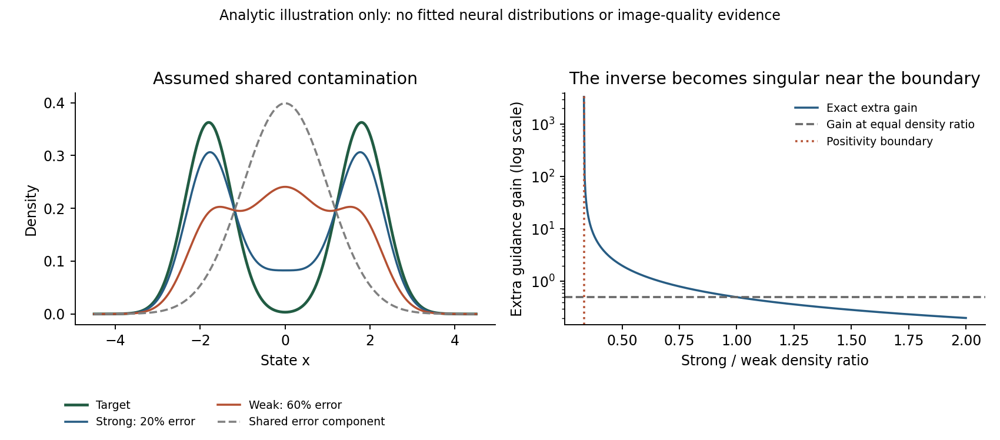

# 共同误差分布能否解释 AG / IG：密度去污染与概率流推导

2026-09-12。依据用户的[第一份分析](data/shared_contamination_20260912/reference_analysis_1.txt)、[第二份分析](data/shared_contamination_20260912/reference_analysis_2.txt)，核对原始论文及仓库旧实验后推导。

**可以作为明确的生成分布假设，而且能精确推出 AG 形式。它推出的是一个由密度比决定的状态相关系数。需要特别区分两种解释：在精确 score 层面，这个假设仍强制误差逐点共线；在实际生成分布及概率流层面，同一个采样公式可以成立，而不要求网络相对某个 Bayes 预测的误差共线。** 后一种解释更适合当前 IG，但其分布假设、密度比、污染比例和生成收益均有待验证。

以下数学恒等式已经做 CPU 数值核对。构造例只检查推导，不充当真实模型证据。上一份提案的36组初筛已全部完成，均未通过预设推进条件，独立记录在[生成实验报告](CFG_IG_PASTED_EXPERIMENTS_20260912_ZH.md)；其有界来源 gate 与这里的减法去污染公式不是同一方法。

**把“最优分布加误差分布”写成归一化模型。**

固定类别 $c$ 和噪声层 $t$，省略下标。令 $p_\star$ 是希望恢复的目标分布；若目标是真实数据，则它就是相应条件数据分布。令 $p_e$ 是一个归一化的共同污染分布。假设

\[
p_s=(1-a)p_\star+a p_e,\qquad
p_w=(1-b)p_\star+b p_e,\qquad 0\le a<b\le1. \tag{1}
\]

这里 $a,b$ 不依赖状态 $x$。简单写 $p_s=p_\star+a p_e$ 会使积分变成 $1+a$；若写成一个积分为零的有符号误差函数，则是另一种模型，不能再把系数称为污染概率。

这个模型的解释是：强弱模型共享正确生成机制，也共享失败生成机制，只是使用失败机制的概率不同。$p_e$ 可以包含很多种坏图，并不要求它是单峰、Gaussian 或逐图模糊。但是“所有失败类型的相对比例也相同”是实质限制，不能从同架构、浅层或少训练自动推出。原 AG 的相容误差动机比这个精确混合模型宽泛。[Autoguidance，§4](https://arxiv.org/html/2406.02507v3#S4)

**消去共同污染，得到精确 AG 系数。**

记

\[
\kappa=\frac ab,\qquad r(x)=\frac{p_s(x)}{p_w(x)},\qquad s_i=\nabla_x\log p_i.
\]

消去 $p_e$：

\[
\boxed{p_\star=\frac{p_s-\kappa p_w}{1-\kappa}}. \tag{2}
\]

在 $p_\star,p_s,p_w>0$ 的区域，对分子求导：

\[
\begin{aligned}
s_\star
&=\frac{p_s s_s-\kappa p_w s_w}{p_s-\kappa p_w}\\
&=s_s+\frac{\kappa}{r-\kappa}(s_s-s_w).
\end{aligned} \tag{3}
\]

因此，以强模型为基线、额外强度记作 $\gamma$ 时，

\[
\boxed{\gamma_\star(x,t)=\frac{\kappa}{r_t(x)-\kappa}}. \tag{4}
\]

若使用 $s_w+w(s_s-s_w)$ 的记法，则 $w_\star=1+\gamma_\star=r/(r-\kappa)$。这两个强度相差 1，不能混用。式 (3) 不要求 Gaussian 平滑；它是混合分布的线性逆问题。

常数 AG 可以看作在 $r\approx1$ 附近冻结这个反演系数：$\gamma_0=a/(b-a)$。只有在比值接近 1、远离正性边界且近似误差受控时，这才是一项合理近似；它不意味着同一常数在所有状态都能精确消除污染。

**为什么密度比能表示“更像正确机制”。**

令 $z=p_e/p_\star$。从式 (1) 得

\[
r(z)=\frac{1-a+az}{1-b+bz},\qquad
\frac{dr}{dz}=\frac{a-b}{(1-b+bz)^2}<0,
\]

\[
\gamma_\star(z)=\frac{a(1-b+bz)}{b-a}. \tag{5}
\]

因而，在假设为真时，强弱比越大，当前状态相对越像正确机制；强弱比越接近下界，污染占比越高。它不意味着只在 $r>1$ 的地方才引导。重要的是比值的梯度及相对大小。

例如 $a=.2,b=.6$：

|污染／目标的局部密度比 $z$|强／弱密度比 $r$|精确额外强度 $\gamma_\star$|
|---:|---:|---:|
|0（极限）|2|0.2|
|1|1|0.5|
|10|0.4375|3.2|

图中分布是人工指定的解析示意，不是 SiT 或 RAE 的拟合分布。其[密度数据](data/shared_contamination_20260912/density_illustration.csv)、[系数数据](data/shared_contamination_20260912/gain_illustration.csv)、[可编辑工作簿](data/shared_contamination_20260912/source_data.xlsx)均保留。

另一种直观解释是：式 (2) 等价于 $p_s=(1-\kappa)p_\star+\kappa p_w$。在这个等价模型中，

\[
h(x)=\frac{\kappa p_w}{p_s}=\frac\kappa r,
\qquad \gamma_\star=\frac{h}{1-h}. \tag{6}
\]

$h$ 是“强分布中的 weak 来源成分”的后验责任，系数是其赔率。它不同于原模型中纯污染成分的责任 $a p_e/p_s$，更不同于平衡 strong/weak 来源分类器直接输出的概率。

**这确实仍然推出 score 误差逐点共线。**

原始污染责任为

\[
\eta_s=\frac{a p_e}{p_s},\qquad \eta_w=\frac{b p_e}{p_w}.
\]

混合 score 满足

\[
s_s-s_\star=\eta_s(s_e-s_\star),\qquad
s_w-s_\star=\eta_w(s_e-s_\star). \tag{7}
\]

只要两种成分均有正密度，$\eta_w>\eta_s$。因此误差可以随 $x$ 转向、相对倍数也可以变化，但在同一个 $x,t,c$ 上，两个误差必须沿同一方向。把常量系数换成状态系数，只放松倍数约束，不放松这个方向约束。

如果把多个深度都视为相同 $p_\star,p_e$ 的不同污染比例，那么它们的 score 在每个状态处也必须落在一条仿射直线上。对同一桥使用精确 score 到 velocity 的共同仿射换算后，网络 velocity 差分应当满足相应必要条件。

仓库早有可用的反向证据。本次重新读取[旧 9,216 行原始表](data/imagenet100_sit_depth_difference_mechanism_v1/depth_difference_geometry_per_sample.csv)，没有重新查询网络。对 $F=v_{800}-h_4$、$W=h_8-h_4$，strong rollout 的 4,608 个状态中，逐状态允许各自拟合一个倍数后，**平均平行能量比例为 27.91%，平均正交比例为 72.09%**。这是逐样本比例的算术平均，不是此前“一个全局倍数残差 73.87%”的重复表述。[原实验说明](IMAGENET100_SIT_DEPTH_DIFFERENCE_MECHANISM_RESULTS_ZH.md)、[本次重算](data/shared_contamination_20260912/historical_geometry.csv)

这个结果反对“这些读出都是同一二成分混合的精确 score／共同桥速度”这一整套解释。它没有直接测到真实 Bayes score，也没有测量生成器真实边缘密度；因此，不能据此声称所有强弱对的实际生成分布都不存在共同成分。一个失败的三读出族也不单独否定其中任意两者与未知目标的混合关系。

**更适合 IG 的入口：在实际生成分布上去污染概率流。**

令 $q_{s,t},q_{w,t}$ 分别是两个冻结采样场 $v_s,v_w$ 实际产生的连续时间边缘密度，时间在此沿生成方向增加。它们满足

\[
\partial_tq_s+\nabla\cdot(q_s v_s)=0,\qquad
\partial_tq_w+\nabla\cdot(q_w v_w)=0. \tag{8}
\]

取一个不随时间、状态变化的 $0\le\kappa<1$。若全过程

\[
q_{\kappa,t}=\frac{q_{s,t}-\kappa q_{w,t}}{1-\kappa}>0,
\]

定义

\[
\boxed{
v_\kappa
=\frac{q_s v_s-\kappa q_w v_w}{q_s-\kappa q_w}
=v_s+\frac{\kappa}{q_s/q_w-\kappa}(v_s-v_w).
} \tag{9}
\]

直接把式 (8) 相减就有

\[
\partial_tq_\kappa+\nabla\cdot(q_\kappa v_\kappa)=0. \tag{10}
\]

若两源使用相同初始噪声分布，则 $q_{\kappa,0}=q_0$。再满足相应流的存在、唯一性及边界正则条件，用式 (9) 采样就运输这个密度族。终点若满足

\[
q_{s,1}=(1-\kappa)p_\star+\kappa q_{w,1},
\]

则该采样器终点就是 $p_\star$。这里没有把 $v_s,v_w$ 假定为它们实际密度的 score，也没有要求它们来自同一个 Gaussian 前向加噪族。有限步 Euler／Heun 仍有离散误差；连续恒等式不保证当前步数精确复现目标密度。

式 (9) 是概率通量线性叠加的减法应用。正权重版本见 [SuperDiff，Proposition 3–4](https://arxiv.org/html/2412.17762#S2.SS2)；这里给出的减法推导附带更严格的密度非负条件，不据此宣称新的叠加原理。同一扩散系数的 SDE 也可由 Fokker–Planck 方程得到对应结果；两分支扩散项不同时不能照搬。

**为什么这个版本可以容纳网络误差不共线？** 给定一个密度变化过程，速度通常不唯一。若 $u$ 满足 $\nabla\cdot(q u)=0$，则 $v$ 与 $v+u$ 产生同样的密度变化。式 (9) 恢复的是通量所产生的分布，不承诺恢复某个唯一的 Bayes 速度。解析核对构造了共享初始 Gaussian、精确共同污染的二维密度族，并给各源加入不同的零散度通量；去污染速度仍满足目标连续性方程，尽管它不等于所选规范目标速度。[核对代码](../experiments/analyze_shared_contamination_20260912.py)、[结果](data/shared_contamination_20260912/algebra_checks.json)

所以应把两种说法分开评估：score 版本对方向要求很强；实际分布版本对全过程密度关系要求很强。后者提供了继续研究的空间，但不能沿用前者的所有梯度控制结论。

**两份分析中，四个不能自动成立的结论。**

第一，$a/b$ 不是仅靠 strong/weak 分类就能识别的“真实污染比例”。即使知道两个精确密度，对每个

\[
0\le\kappa\le\kappa_{\max},\qquad
\kappa_{\max}=\mathop{\mathrm{ess\,inf}}_{x:p_w(x)>0}\frac{p_s(x)}{p_w(x)},\quad \kappa<1,
\]

式 (2) 都可能给出合法候选目标。没有额外信息，无法知道哪个才是理想分布。把可消除的最大比例等同于真实污染比例，需要目标相对参考的不可约性等额外条件；这属于已有 mixture proportion estimation 的可识别性问题。[Zhu 等，ICML 2023，§2](https://proceedings.mlr.press/v202/zhu23c/zhu23c.pdf)

多个弱深度能够增加对共同成分的检验约束，仍不会自动告诉我们哪个外推端点是“最优”。用原 IG 最佳强度反推 $\kappa=\gamma/(1+\gamma)$，只是在 $r=1$ 处匹配一个系数，不是估计污染率。

第二，全空间非负性并不温和。例如强分布是窄 Gaussian、弱分布是更宽 Gaussian，则尾部 $p_s/p_w\to0$，所以任何正 $\kappa$ 都会使某处 $p_s-\kappa p_w<0$。这种弱分布确实可以是 Gaussian 平滑，却不满足正比例共同污染模型。若只在典型区域近似成立，应明确称为局部／近似模型，不能继承全分布精确恢复结论。终点非负也不保证两个任意生成流的中间时刻非负。

第三，晚期系数衰减不是混合假设的必然推论。若式 (1) 在终点成立，再对所有成分施加同一线性加噪算子，则 $a,b,\kappa$ 保持不变。纯噪声端 $r=1$，有 $\gamma_\star=a/(b-a)$，而 score gap 因分布合一而消失。低噪声系数是否变小，取决于所访问位置的密度比，不能直接规定 $a_t\to0$。即便额外假设 $\kappa_t\to0$，也需控制 $r_t-\kappa_t$ 的相对大小，才能推出 $\gamma_t\to0$。

若对式 (9) 任意设置 $\kappa(t)$，那么

\[
\partial_tq_\kappa+\nabla\cdot(q_\kappa v_{\rm nominal})
=\frac{\dot\kappa}{(1-\kappa)^2}(q_s-q_w). \tag{11}
\]

这通常非零。要保持所宣称的时变目标密度，必须补充抵消此源项的概率通量，不能只替换一个 schedule。若 $\kappa$ 依赖 $x$，score 版本还会多出

\[
\frac{r-1}{(1-\kappa)(r-\kappa)}\nabla\kappa. \tag{12}
\]

固定 guidance 窗口可以另作自洽定义：让参考生成流在窗口外直接采用 strong 场。此时 $v_s-v_w=0$，常数 $\kappa$ 下也没有额外引导；公共后段的输运保持已有的非负密度差。这允许解释“关闭引导”的操作，但不证明哪个窗口最好，也不等于污染比例随时间归零。

第四，增加一个控制增益的更新方程，不能解决目标未知的问题。在精确 score 版本中，令 $\ell=\log(p_s/p_w)$、$g=\nabla\ell$，沿 $\dot x=v_s+c_t u g$ 有

\[
\frac{d\ell}{dt}=\partial_t\ell+g^\top v_s+c_t u\|g\|^2. \tag{13}
\]

这是任意两个密度都满足的链式法则。共同污染假设失效时，式 (13) 本身不会平白多出一个“污染不匹配扰动”；改变的是 $\ell$ 是否还能代表接近理想分布。网络场或密度估计不精确会带来另一类误差，需要分别建模。

在实际流版本，准确输入系数是 $\nabla\log(q_s/q_w)^\top(v_s-v_w)$，没有必为正的保证。用特征分类器则应换成 $\nabla\widehat\ell$；同样不能写成 $\|v_s-v_w\|^2$。阈值是否对应质量、控制是否有足够作用、基线漂移能否抵消、增益是否可观测，均未由混合假设解决。“匹配／不匹配扰动”分解是一项向量恒等式；它只说明单点标量能补偿什么方向，不构成学习未知补偿项的算法，也不证明整个非线性采样过程的终点可控性。

**误差分布只近似共享时，真正的不稳定因素是什么。**

设弱源污染为 $p_e+\Delta_e$，其中 $\int\Delta_e=0$，则

\[
p_{\rm nominal}=p_\star-\frac{a}{1-\kappa}\Delta_e
=p_\star(1-\epsilon),\qquad
\epsilon=\frac{a\Delta_e}{(1-\kappa)p_\star}. \tag{14}
\]

在 $\epsilon<1$ 的区域，

\[
s_\star-s_{\rm nominal}=\frac{\nabla\epsilon}{1-\epsilon}. \tag{15}
\]

这比把未知误差再投影一次更说明问题：低目标密度处的相对误差、以及误差的空间导数，会被反演放大。仅有小 $L^1$ 密度误差、平均较低的分类损失，都不足以保证稳定纠偏。若 $\|\epsilon\|_\infty\le\rho<1$，才有 $\|s_\star-s_{\rm nominal}\|\le\|\nabla\epsilon\|/(1-\rho)$ 这样的逐点控制。

即使成分完全共享，估计系数也有

\[
\frac{\partial\gamma_\star}{\partial r}=-\frac\kappa{(r-\kappa)^2},\qquad
\frac{\partial\gamma_\star}{\partial\kappa}=\frac r{(r-\kappa)^2}. \tag{16}
\]

因此 $r\downarrow\kappa$ 是真实的逆问题病态。此时强弱 score 可以几乎相同，因为二者都被污染形状主导；但密度比趋于 $\kappa$，并非趋于 1，不能笼统称为“来源难以区分”。

若已知 $\kappa$ 低于真实 $a/b$，并能精确采到式 (2)，恢复分布仍是一个污染混合，剩余污染比例为

\[
a_{\rm eff}=\frac{a-b\kappa}{1-\kappa}. \tag{17}
\]

它随 $\kappa$ 增加而下降，到真实比例时归零。于是其与目标的 TV 距离精确等于 $a_{\rm eff}\,\mathrm{TV}(p_e,p_\star)$。这是一个有条件的分布收益保证；FID 不受该等式直接控制，估计比例、离散采样和模型失配也尚未解决。

**与 FBG、当前来源分类头，以及下一步实验的关系。**

消去 $p_e$ 后，用户的两次混合恰好变成 $p_s=(1-\kappa)p_\star+\kappa p_w$。FBG 已采用同型污染关系并导出同型状态系数；替换 conditional/unconditional 为 strong/weak，不构成另一条去污染代数。FBG 也讨论了与 AG 的兼容性，并承认加法误差模型可能并不贴近真实系统偏差。[FBG，§2.3、§3.2、§5](https://arxiv.org/html/2506.06085v2)

若额外要求 $b<1$，弱分布也必须含有正比例目标成分，还得到 $r\le(1-a)/(1-b)$ 的上界。这确实比只写 strong/reference 的单个混合关系增加约束；多深度共享同一污染源也增加约束。它们的价值在于可检验性，没有改变式 (4) 的反演公式。

在平衡的 strong/weak 来源训练集上，若分类器能读取充分的当前状态信息并达到准确校准的 Bayes 解，

\[
D(x,t)=\frac{q_s}{q_s+q_w},\qquad r_q=\frac{D}{1-D},
\]

\[
\boxed{\gamma_\kappa(D)=\frac{\kappa(1-D)}{(1+\kappa)D-\kappa}},
\qquad D>\frac{\kappa}{1+\kappa}. \tag{18}
\]

非平衡来源先验还需修正先验赔率。当前共享特征小头估计的是其可见特征空间的来源后验；只有这些特征对密度比充分时，才能直接代替全状态比值。它不是一个可直接读取“好图概率”的分类器。

上一份提案已经检验的额外系数为 $2\gamma_{\rm base}(1-D)$，对应以 strong/weak 混合作为参考的另一种构造。式 (18) 是对生成密度做减法的反演系数，有分母和正性域。二者即使都随 $D$ 减小而增强，也不是同一方法；前一项失败不直接反证后一项。

仓库 [9 月 6 日去污染审计](RAEV2_DENSITY_DECONTAMINATION_AUDIT_20260906_ZH.md)已经研究过同型公式：假设 $\kappa=0.438202$，由两个随机 trace 探针沿轨迹估计比值，在 797 个共同可测条目中有 82 个共同违反协方差必要条件。该结果混合了分布假设、score 一致性与比值估计误差；没有生成 FID。应保留这条不利证据，不能把这轮公式当首次提出，也不能把 82 个条目说成已经识别出的真实密度反例。

最有判别力的实证入口是**直接检验生成分布的去污染结果是否更接近预先定义的目标**。例如在冻结的 strong/weak/真实数据三个样本集上，式 (2) 要求任意预先固定的测试函数满足

\[
\mathbb E_s f-\mathbb E_\star f
=\kappa(\mathbb E_w f-\mathbb E_\star f). \tag{19}
\]

可以在一部分数据估计唯一全局 $\kappa$，另一部分检验分布关系，再使用同一个系数做生成实验。有限特征关系只能否定或提供有限支持，不能验证全部密度；不能用一组 FID 最优系数反过来“证明”污染率。

另一个直接的离线分布检验是从 strong 样本以 $A(x)=1-\kappa/r(x)$ 接受样本；在精确假设下，接受分布就是式 (2)，平均接受率为 $1-\kappa$。这只是将“目标分布本身是否更好”与“IG 能否实现该输运”分开检验的办法，不建议把它当同预算部署方法：平均生成成本会增至 $1/(1-\kappa)$，有限池及近似分类器还会引入偏差。

实际后续应保留一个固定候选、原 IG、匹配时间平均与同条件置换的强对照，先看真实生成效果。已有来源小头可复用为估计基础；它还不能识别 $\kappa$，其校准也不足以保证式 (18) 在边界附近可靠。推导提供了明确、可失败的研究问题，尚未提供已验证有效、无需额外假设的控制器。

**复核记录。**

[CPU 脚本](../experiments/analyze_shared_contamination_20260912.py)核对密度恢复、score 恢复、责任恒等式、含零散度通量的实际流恢复、时变比例源项、状态比例梯度项和成分失配公式。全部代数项按 FP64 检查，阈值 $10^{-11}$。历史表的独立 FP32 归约存在约 $10^{-8}$ 级舍入差，按其实际精度核对，未把它解释为理论偏差。

[数值结果](data/shared_contamination_20260912/algebra_checks.json) · [历史来源及 SHA](data/shared_contamination_20260912/historical_source.json) · [产物 SHA 清单](data/shared_contamination_20260912/artifact_manifest.json) · [原始论文下载与 SHA](../readings/shared_contamination_20260912/source_manifest.json)。本轮推导没有解冻模型、重启蒸馏、扩大旧队列或新增生成参数网格。
