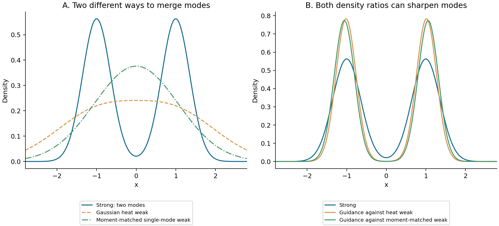
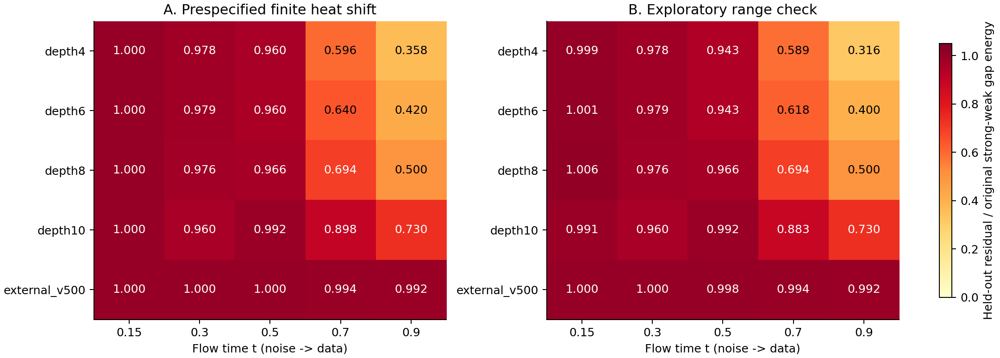
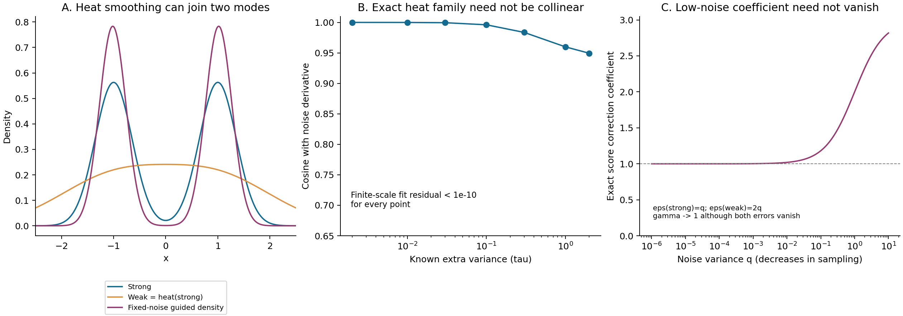

# AG / IG 的弱模型是否在平滑强模型：已有反证、直接诊断与可区分的机制

**9 月 12 日补充：简单标定对照收紧了下面结果的机制解释。** 在相同 16 个拟合 / 16 个评价输入上，仅用 strong score 幅度与径向状态的两个全局标量，低噪声 depth4/6/8/10 的平方误差减少已达 65.50% / 58.74% / 48.64% / 24.61%，接近热平移的 68.38% / 60.00% / 50.00% / 26.98%。这说明热平移拟合成功不足以唯一鉴定 Gaussian 平滑；下面原始数值保留，新增控制及研究取舍见 [CFG / IG 双主线报告](CFG_IG_RESEARCH_DIRECTIONS_20260912_ZH.md)。新增控制属于探索性再分析，尚无独立 rollout 或质量确认。

**现有结果支持一个有限的判断：部分浅层内部弱读出在低噪声时明显具有“额外 Gaussian 噪声尺度”的特征；它解释不了高、中噪声的大部分差分，也解释不了本次较早 checkpoint 的外部弱模型。** 因而值得研究的是弱模型具体丢失了哪些分布结构，以及这些结构差异是否造成 guidance 收益。现在还不能把 AG / IG 统一等同于 Gaussian 去平滑。

这不是只根据直觉提出下一轮实验：本轮读取了旧结果、核对了原始论文，并在 CPU 上实际运行了冻结模型诊断。9 月 11 日固定协议，9 月 12 日完成分析和一次明确标注的边界补充。没有新增 GPU 作业、训练、图像采样或 FID 结果。

**先撤回此前的研究优先级。** [旧 SiT 深度差分实验](IMAGENET100_SIT_DEPTH_DIFFERENCE_MECHANISM_RESULTS_ZH.md)比较

\[
F=v_{800}-h_4,\qquad W=h_8-h_4.
\]

512 张图、9 个 rollout 时刻的全局 cosine 为 0.5112，最佳共同标量拟合后的残差能量为 **73.87%**。这不是直接观察到了真实 Bayes score 的误差，而是三读出差分对比例误差模型提出的可测约束已经明显不满足。旧因果分解还显示，差分中有用的部分可以与其整体几何不同；“不是共线”不等于“相关投影没有用”。

[RAEv2 既有配对误差实验](RAEV2_QUERY_MEAN_ERROR_COMPATIBILITY_RESULTS_20260906_ZH.md)早已计算了预测风险的精确二次式。原 Full−Base 的共同风险最优系数为 −0.04150，而原 IG 有 FID 收益。这是固定 8 个图像 ID 的 teacher 证据，不能当总体定理，却足以提醒我们不能再把去噪风险修复当作生成收益的替代指标。此前把比例误差作为优先方向、又把已经做过的风险恒等式当作新验证入口，都不合适；[前一份文档](AG_CTRL_DECAY_AND_ERROR_CANCELLATION_20260911_ZH.md)已经注明修正。

**用户的双峰直觉成立，但“平滑”至少有两种不同含义。** 令当前噪声层的强 score 为 $s_S=\nabla\log p_S$，弱 score 为 $s_W=\nabla\log p_W$。AG 的附加方向是

\[
g=s_S-s_W=\nabla\log\frac{p_S}{p_W},\qquad
s_{AG}=s_S+\gamma g.
\tag{1}
\]

因此，guidance 的附加位移倾向于增加强弱密度比。准确地说，它不是“只在比值大于 1 的区域生效”：在比值小于 1 的位置也会有梯度，且在一个密度比极大点上梯度反而为零。沿单独的 $g$ 做微小正向位移，$\log(p_S/p_W)$ 的一阶变化为 $\|g\|^2$；完整采样运动还包含基础场及时间变化。

当弱分布把两个峰之间的谷填起来，$p_S/p_W$ 可以区分谷与峰，这确实能解释为什么 guidance 倾向于离开连接区域。原始 [Autoguidance 论文的 Eq. (4)–(5)](https://arxiv.org/html/2406.02507v3)已经给出这一密度比解释。[Self-Guidance 的 Eq. (4.4)、(4.6)–(4.9)](https://arxiv.org/html/2412.05827v3)进一步明确使用更高噪声参照与 heat equation，双峰及谷部抑制也是其动机。因此，“显式增加 Gaussian 噪声来做 self-guidance”已经有直接先例；要验证的新增内容是**训练不足或深度受限的弱网络是否自发产生某种可识别的粗化**。

还需要区分：在数据空间卷积概率密度，是给随机样本加坐标噪声；给每张图做空间 Gaussian blur，是变换样本本身。这不是同一个操作。密度 Fourier 变量也不能直接等同于图像纹理频率。

下面的解析例子展示“平滑感”不要求加性 Gaussian 卷积。设

\[
p_S(x)=\tfrac12\mathcal N(-a,v)+\tfrac12\mathcal N(a,v).
\]

可以构造两种弱分布：

\[
\begin{aligned}
p_W^{heat}&=\tfrac12\mathcal N(-a,v+\tau)+\tfrac12\mathcal N(a,v+\tau),\\
p_W^{merge}&=\mathcal N(0,a^2+v).
\end{aligned}
\tag{2}
\]

第一种是严格 Gaussian 平滑；第二种把双峰压缩成一个保持均值、方差的单峰描述。第二种也会填谷，也能通过密度比产生峰化，但**不可能是任何独立加性噪声的非平凡卷积**：若 $X_W=X_S+\eta$ 且 $\eta$ 独立，那么相等的有限方差强制 $\mathrm{Var}(\eta)=0$，相等的均值进一步强制 $\eta=0$，与两个密度不同矛盾。

这提供了“像平滑，但不是 Gaussian 平滑”的具体模型：**模式被合并，低阶统计可以保持，细的多峰结构丢失。** 它是可检验的备选机制，尚不是对真实 IG 的鉴定，也不主张这一数学构造本身具有新颖性。

图中 $a=1,v=0.1256,\tau=1,\gamma=1$。强分布的谷部与 $x=1$ 密度比为 0.03734；Gaussian 弱分布为 1.09707；使用 Gaussian 弱分布的固定噪声幂密度为 0.001271。这个图证明所述密度比作用可以发生，**图中的幂密度不是已经求出的 AG 采样器终点分布**。它还会把正侧峰位置推到约 1.016，说明“峰更尖”并不保证峰位置更准确。

**把 Gaussian 假说写成一个能失败的检验。** 使用加性噪声方差 $q$，记 $H_\tau p=p*\mathcal N(0,\tau I)$。最直接的假说是

\[
p_W(\cdot,q)\approx H_{\tau(q)}p_S(\cdot,q).
\tag{3}
\]

若强模型的 score 跨噪声层满足同一 heat family，则可检验

\[
s_W(y,q)\approx s_S(y,q+\tau),\qquad \tau\ge0.
\tag{4}
\]

注意，Eq. (4) 同时使用了弱强平滑关系和强场的跨噪声一致性。神经网络输出未必严格保守，也未必对应同一个终点密度的加噪 score。故 Eq. (4) 的拟合失败首先反对的是**网络场的额外噪声平移解释**，不能跳到“已证明终点分布不可能卷积”的结论。实际 sampler 的终点分布、这个终点分布加噪后的 score、网络在每个时间输出的场，以及一次 denoiser 输出的分布，必须分别对待。

仓库使用 $z_t=(1-t)\epsilon+tX$，$t$ 从噪声向数据增大。正确换元是

\[
y=z_t/t,\quad q=((1-t)/t)^2,\quad
s(y,q)=\frac{t(tv(z_t,t)-z_t)}{1-t}.
\tag{5}
\]

换到 $q'=q+\tau$ 时，必须用

\[
t'=\frac1{1+\sqrt{q'}},\qquad z'=t'y=\frac{t'}t z_t.
\tag{6}
\]

保持原 $z_t$ 不变而只换网络时间，不是 Eq. (4) 的检验。本仓库[旧跨尺度 self-guidance 实验](TELESCOPING_SCALE_SPACE_INTERNAL_GUIDANCE_ZH.md)已经研究过相关换元，且一些部署变体表现很差；那些结果是具体 guidance 方法的阴性结果，不能直接代替本次强弱关系检验。

**真实冻结模型：已运行的结果。** 强模型为 ImageNet100 SiT-S/2 800K EMA；内部弱读出为同一冻结 backbone 的 depth4/6/8/10，各训练 50K；外部弱模型为同一架构、同一训练运行的 500K EMA。这里的内部读出不是 IG 论文中的联合辅助训练模型，外部弱模型也不是原 AG 所有“小模型加少训练”配置的代表。

随机抽取 32 个 validation 图像 ID，前 16 个选 $\tau$，后 16 个检验；各时间复用相同图像及噪声。拟合对象为 5 个 teacher 噪声状态，不是生成轨迹。度量为

\[
R(q)=\frac{\sum_{i\in test}\|s_W(y_i,q)-s_S(y_i,q+\widehat\tau)\|^2}
{\sum_{i\in test}\|s_W(y_i,q)-s_S(y_i,q)\|^2}.
\tag{7}
\]

$R=1$ 表示相对不平移没有解释力；$R=0$ 才是差分被完全解释。$1-R$ 是平方拟合误差的减少比例，不直接等于一个与残差正交的因果分量占比。

[预设协议](AG_IG_SMOOTHING_DIAGNOSTIC_PROTOCOL_20260911_ZH.md)使用 $q'=q(1+\delta)$，允许正负平移作对照，主检验只选非负平移。首轮低噪声的 3 个内部读出碰到 $\delta=4$ 上界，因此按[补充记录](AG_IG_SMOOTHING_DIAGNOSTIC_AMENDMENT_20260912_ZH.md)扩大到 64，并在零附近补点。下表为这次**探索性范围检查**；原始结果完整保留，范围补充不是新的独立确认样本。

| 弱模型 | $t=.15$ 高噪声 | $t=.30$ | $t=.50$ | $t=.70$ | $t=.90$ 低噪声 |
|---|---:|---:|---:|---:|---:|
| depth4 | 0.9993 | 0.9779 | 0.9426 | 0.5889 | **0.3162** |
| depth6 | 1.0010 | 0.9794 | 0.9428 | 0.6185 | **0.4000** |
| depth8 | 1.0059 | 0.9759 | 0.9663 | 0.6940 | **0.5000** |
| depth10 | 0.9909 | 0.9601 | 0.9915 | 0.8834 | **0.7302** |
| 外部 500K | 1.0000 | 1.0000 | 0.9979 | 0.9938 | **0.9917** |

在 $t=.90$，depth4 的误差减少约 **68.4%**，depth6 为 60.0%，depth8 为 50.0%，depth10 为 27.0%；外部 500K 只有 **0.83%**。按检验图像成对 bootstrap 的 $R$ 区间分别为 [0.2750,0.3670]、[0.3546,0.4525]、[0.4511,0.5569]、[0.6896,0.7733]、[0.9903,0.9931]。这些是对固定拟合选择、有限图像和一次噪声抽样的条件区间，不是跨模型、跨 seed 的总体不确定性。

低噪声的最优 $\delta$ 依次为 8、6、4、1、0.03，均离开扩大后的上界。对于 depth4，$q=.01235$，拟合的 $\tau=.09877$；弱头在 $t=.90$ 的场，被强模型约 $t'=.75$ 的场部分解释。带符号搜索仍选择非负平移，因此这批低噪声结果符合“往更噪方向”的符号。

首轮预设网格对应的低噪声 $R$ 为 0.3584、0.4196、0.5000、0.7302、0.9917。补充改变了前两个的拟合精度，没有改变内部与外部的主要区别。

固定 $y$ 的噪声导数也作了检查。$s_W-s_S$ 与 $\partial_qs_S$ 的检验 cosine，在 depth4 随 $t=.15,.30,.50,.70,.90$ 依次为 0.0289、0.1525、0.2498、0.5411、0.6413；外部 500K 始终不超过 0.0953。步长减半后的导数相对 RMS 差异在 $t=.70$ 达 4.70%、$t=.90$ 为 3.15%，所以导数表只作辅助证据，主要判断依据有限平移。不能用这些微小高噪声投影作精确机制估计。

两次 CPU 模型调用分别为 105 次与 90 次，首轮含 5 次原生 forward 的共享读出校验；不是生成采样 NFE。全部保持 CUDA 未初始化。模型来源、EMA、源文件与 checkpoint SHA256 均经已有严格加载器核对。32 个 ID 不重复，拟合和检验分别涉及 15、16 个类别；结论仍只是小规模机制诊断。

**这批结果对原分析增加了哪些约束？** 它没有支持“弱模型整体就是强模型多加一点噪声”。它支持低噪声、浅内部读出的部分解释，而且恰在高、中噪声解释较弱。因此，如果同一配置确实表现为高/中噪声 IG 有用、低噪声应关闭，那么还要问：**有用的是否主要是无法由普通 Gaussian 噪声平移解释的结构差异，而低噪声是否更接近单纯的过度峰化？** 目前没有做生成轨迹上的分解干预，不能把这句话当作因果结果。

IG 论文确实报告低噪声关闭的经验现象，但其 Table 1 是 depth4 的 FID 19.02 优于 depth2 的 20.39，且不同深度辅助训练改变了强模型基线。因此“越浅永远越好”不是论文结论。[IG 原文 §4.2、Table 1](https://arxiv.org/html/2512.24176v2)

所贴分析用 SGG 支持“外部 AG 与内部 IG 的低噪声角色相反”，这个文献区分也过强：SGG 的大模型推断用的是跳层 SLG，训练分段用 CFG 与内部 BR；单独 AG 是比较项之一。不能把整篇的低噪声条件无关引导都标成外部 AG。[SGG 原文 §4.3、§5.1、Appendix C–D](https://arxiv.org/html/2603.20584v1)

**三个不能由平滑自动推出的结论。** 首先，有限平滑并不要求误差共线。若强场是精确 heat family，才在 $\tau$ 足够小时有

\[
s_W-s_S=\tau\partial_qs_S+O(\tau^2),\qquad
\partial_qs_S=\tfrac12\nabla\big(\nabla\!\cdot s_S+\|s_S\|^2\big).
\tag{8}
\]

有限 $\tau$ 的 score 曲线可以弯曲；所以旧的非共线结果不直接排除有限平滑。反过来，“越浅、额外平滑越强，就应越接近无穷小导数”也不成立：在无模型误差的正对照里，$\tau\to0$ 时反而更接近导数。新增二维 GMM 对照中，$\tau=.002$ 的 cosine 约 1，$\tau=2$ 时约 0.9494，所有有限尺度拟合残差都低于 $7\times10^{-18}$。网络误差与信噪比可以改变这种趋势，但需要另加证据。

其次，低噪声的 $\gamma\to0$ 需要额外条件。写成当前噪声目标的过度平滑

\[
p_S=H_{q+\epsilon_S(q)}p_{*,0},\qquad
p_W=H_{q+\epsilon_W(q)}p_{*,0},
\]

一阶误差抵消近似给出 $\gamma\approx\epsilon_S/(\epsilon_W-\epsilon_S)$。仅有 $\epsilon_S\to0$ 不够，分母也可能同时趋零。取目标为 $\mathcal N(0,1)$、$\epsilon_S=q,\epsilon_W=2q$，精确恢复目标当前噪声 score 的系数为

\[
\gamma(q)=\frac{1+3q}{1+q}\longrightarrow1.
\tag{9}
\]

两种平滑误差都消失，所需系数仍不趋零，而实际附加 score 可以趋零。系数、差分幅度、对质量的作用不能混为一谈。固定噪声的 $s_S+\gamma(s_S-s_W)$ 也一般不是精确的反向 heat evolution；有限外推不能直接称为稳定的去卷积算法。

最后，如果 $p_S(q)=H_qp_{S,0}$、$p_W(q)=H_qp_{W,0}$ 都是精确 heat family，且每个 $q$ 都满足 $p_W(q)=H_{\tau(q)}p_S(q)$，则

\[
\partial_qp_W=\tfrac12(1+\tau'(q))\Delta p_W
=\tfrac12\Delta p_W,
\]

对非平凡可归一密度要求 $\tau'(q)=0$。所以任意随时间变化的“有效额外噪声”只能先解释为近似网络场诊断，不能无条件宣称发现了两个固定终点分布之间的 Gaussian 卷积。

**进一步鉴定“是什么粗化”，应优先区分模式结构与加性扩散。** “存在某个平滑算子”太宽：若允许任意 $K(y\mid x)=p_W(y)$，任何两个分布都可关联，假说不能失败。可以预先限定以下几类，而不是事后换一个核直到拟合成功。

| 候选机制 | 能区分它的观测 | 不能独自作为证明的观测 |
|---|---|---|
| 各向同性 Gaussian 卷积 | 同坐标噪声平移；独立终点样本的均值保持与协方差增加 $\tau I$ | 生成图看起来模糊；全 score 拟合很好 |
| 各向异性独立加噪 | 协方差增量为 PSD；特征函数比符合 $\exp(-u^T\Sigma u/2)$ | 只看到某些方向方差增大 |
| 一般独立加性卷积 | $|\phi_W(u)|\le|\phi_S(u)|$，以及比值的正定性等必要约束 | 对一个投影拟合一个任意滤波曲线 |
| 模式合并 / 局部统计粗化 | 组内双峰变单峰、桥接密度增加，同时可保持组内低阶矩 | 全局方差增大或减小；单张图的纹理缺失 |
| 位置相关的局部扩散 | 预先限定低复杂度的扩散矩阵，跨样本预测差分方向和幅度 | 每点自由拟合一个矩阵 |

终点卷积检验应使用相同条件、相同采样器口径下的纯强/纯弱样本，测量原始 latent 的固定**线性**投影。不能把 Inception 或其他非线性编码后的协方差恒等式当成原空间 Gaussian 卷积的恒等式。对 Gaussian 卷积，还可检验三阶以上 cumulant 保持；Eq. (2) 的模式合并反例恰好保持方差却改变四阶 cumulant。

对当前研究，最有价值的后续因果检验是固定同一批生成状态，把 $g$ 写为

\[
g=\underbrace{s_S(q)-s_S(q+\widehat\tau)}_{h\text{，受约束的 heat 参照}}
+\underbrace{s_S(q+\widehat\tau)-s_W(q)}_{r\text{，未被解释的差异}}.
\tag{10}
\]

用独立状态拟合 $\widehat\tau$，固定其他采样设置，对 $g,h,r$ 做配对干预，同时控制作用强度和计算成本；检验收益跟随哪一项、是否只出现在特定噪声区间。$h,r$ 通常不正交，不能把两个单独干预的 FID 相加。若模式合并的解释进一步成立，还应预测哪些模式之间被连接、哪些局部方向被保留，再用这些预测检验强弱差，而不是仅用一个高相关图支持故事。

目前已经排查了“能否测”：可以，而且 Gaussian 噪声平移在内部浅层与外部较早 checkpoint 上呈现了明显不同的解释力。尚待解决的是这些可解释/不可解释的差异中，哪一部分真正改善生成质量。

**复现与证据。** [模型诊断代码](../experiments/audit_ag_ig_smoothing_20260911.py)、[范围检查代码](../experiments/refine_ag_ig_smoothing_20260912.py)、[解析对照和制图代码](../experiments/report_ag_ig_smoothing_20260911.py)；[原始拟合表](data/ag_ig_smoothing_20260911/neural_summary.csv)、[扩展拟合表](data/ag_ig_smoothing_20260911/refined_summary.csv)、[全部图表数据工作簿](data/ag_ig_smoothing_20260911/ag_ig_smoothing_support.xlsx)、[来源清单](../readings/ag_ig_smoothing_20260911/source_manifest.json)。

高维观测和精确输入保存在 `/home/zhoushunyu/data/eqvae/imagenet_sit_flow/ag_ig_smoothing_cpu_20260911`。原始模型评估脚本遇到已有运行会拒绝覆盖；仅重建表和图可运行 `python -m experiments.audit_ag_ig_smoothing_20260911 summarize` 及 `python -m experiments.report_ag_ig_smoothing_20260911`。数学恒等式、每张图误差汇总、工作簿行数和来源 hash 的检查结果见 [验证记录](data/ag_ig_smoothing_20260911/artifact_validation.json)。
