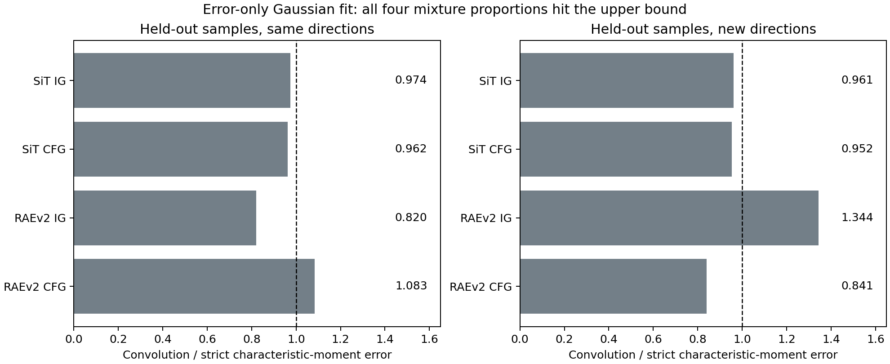

# 共同误差分布、结构化错配与加性残差

“最优分布＋共同误差分布”可以作为主要结构保留，并允许强弱模型的误差成分形状不同、各自带有加性残差。这个扩展不再要求全部 score 误差共线。它也改变了研究问题：需要判断共同污染被抵消以后，剩下的形状错配和网络近似误差是否被放大，而不能只判断强弱密度比是否变大。

最直接的推导结果是：继续使用严格混合模型的逆公式，恢复的是“目标分布＋一个可写出的剩余项”。这个剩余项有明确的卷积部分和加性部分。简单高斯卷积还揭示一种具体失败方式：强弱相减可能重新锐化错误分布中的峰。以下恒等式为本分析的推导；文献出处用于注明已有混合反演和去卷积问题，不代表文献已验证这套扩展在IG中成立。

本轮完成了两类不同工作：此前严格模型的24个真实生成筛选全部收尾，四组都没有通过固定晋级标准；新扩展则在两个模型的既有真实生成端点上完成一个固定规模的高斯核必要关系检验。后者没有增加图像生成，也没有训练新推理网络。它没有识别出可靠的混合参数，不能作为新方法有效的证据。

**沿用的研究目标仍是CFG与共享一次主干前向的IG。** 新增独立弱模型、蒸馏、按生成结果回调参数和重启旧大队列不属于这次扩展。

## 加性误差出现在哪一层

在固定噪声时刻和固定条件下，用 $P$ 表示理想密度，$S,W$ 表示强弱密度，$E$ 表示共同错误成分。不同层面的“加性”需要分别定义。

|含义|数学表达|与前面卷积假设的关系|
|---|---|---|
|错误样本加独立噪声|$X'_E=X_E+U$|$p_{X'_E}=p_E*p_U$，已经是卷积模型|
|密度有未解释的偏差|$S=S_0+\delta_S$|新增有正有负、积分为0的残差|
|网络预测有近似误差|$\widehat s_S=\nabla\log S+\xi_S$|新增向量场误差；不必是任何密度的score|

若 $U$ 依赖 $X_E$，第一行应改为一般Markov扰动核，不再是平移不变的卷积。若所谓加性项本身是一个非负概率分布，就必须同时重新分配混合权重；直接给归一化密度加一个正概率密度，会破坏总质量为1。

## 保留主要结构的模型

建议采用最小扩展：

$$
\begin{aligned}
S&=(1-a)P+aE+\delta_S,\\
W&=(1-b)P+bK_\theta E+\delta_W,
\qquad 0<a<b\leq1.
\end{aligned}
\tag{1}
$$

$K_\theta$ 是正性与质量保持的简单算子。例如小幅平移、中心高斯卷积或少量参数的随机形变。$\delta_S,\delta_W$ 均积分为0，且最终的 $S,W$ 必须非负。这里K只作用于共同错误成分；式(1)没有假设整个弱分布是强分布的平滑版。

如果希望从构造上保证正性，可写成

$$
\begin{aligned}
S&=(1-a-d_S)P+aE+d_SR_S,\\
W&=(1-b-d_W)P+bK_\theta E+d_WR_W,
\end{aligned}
$$

其中 $R_S,R_W$ 是额外污染分布，权重非负且和不超过1。令 $\delta_S=d_S(R_S-P)$、$\delta_W=d_W(R_W-P)$ 即回到式(1)，并有 $\|\delta_i\|_{\rm TV}\le d_i$。这说明加性残差可以有清楚的生成含义，不能无限自由地吸收任何观察。

一种有约束的工作假设是：K属于预先选定的小参数族，而加性残差在一个事先规定的范数中受到限制。允许任意K和任意残差时，式(1)只是一种重写，不能解释或预测AG有效性。AG原文提出强弱模型可能在相似区域产生程度不同的错误，但未证明式(1)或严格共同污染关系。[^1]

## 强弱相减后准确剩下什么

令 $\kappa=a/b$，暂按已知常数处理。严格混合模型原先给出

$$P_{\rm nom}=\frac{S-\kappa W}{1-\kappa}.$$

代入式(1)，得到精确恒等式

$$
\boxed{
P_{\rm nom}=P+D,
\quad
D=\frac{a(I-K_\theta)E+\delta_S-\kappa\delta_W}{1-\kappa}.
}
\tag{2}
$$

这仍然以理想分布和共同错误成分为核心。共同成分的强弱权重被抵消，但形状差异 $a(E-K_\theta E)$ 留下来；两源特有残差以 $\delta_S-\kappa\delta_W$ 留下来。所有这些残差最终除以 $1-\kappa$。因此，强弱污染比例越接近，精确反演越容易放大错配。

两个特例有助于理解加性误差。若K为恒等算子，且 $\delta_S=\delta_W=\delta$，则 $D=\delta$：相同的加性误差原样保留。若 $\delta_S=\kappa\delta_W$，这一组残差才被消掉。所谓“共享误差”应明确是在同一方向、同一绝对幅度，还是按污染比例共享；它们的抵消性质不同。

式(2)的 $P_{\rm nom}$ 可能变成有负值的有符号函数。积分为1不等于合法密度。允许加性残差并不会自动使原来的去污染密度恢复正性。

已有FBG从线性污染模型导出同型密度相减和自适应score系数，并讨论最大引导保护及后验近似。这里不把严格模型的系数当作新公式；研究重点是加入错配后这个逆运算还剩下什么、何时可靠。[^2]

## score与网络预测的精确剩余项

在 $P>0$ 且 $P+D>0$ 的区域，记 $s_S=\nabla\log S$、$s_W=\nabla\log W$，并定义

$$
\gamma(x)=\frac{\kappa W(x)}{S(x)-\kappa W(x)},
\qquad h(x)=\frac{D(x)}{P(x)}.
$$

不用再假定误差共线，直接求导即可得到

$$
\boxed{
s_S+\gamma(s_S-s_W)
=s_P+\nabla\log(1+h).
}
\tag{3}
$$

因此原有结构引导准确消掉的只是主要混合项；相对残差产生另一个梯度场，它一般不与 $s_S-s_W$ 平行。即使完全知道强弱密度比，仅调整一个标量系数，也通常不能把这项全部消掉。

再把网络近似误差纳入：

$$\widehat s_S=s_S+\xi_S,\qquad \widehat s_W=s_W+\xi_W.$$

沿用上面的精确密度系数后，

$$
\boxed{
\widehat s_{\rm guided}-s_P
=\nabla\log(1+h)
+\xi_S-\gamma(\xi_W-\xi_S).
}
\tag{4}
$$

这给出三个不同现象：分布形状错配形成第一项；两者相同的预测误差 $\xi_S=\xi_W$ 不会消失；两者不同的预测误差会被 $\gamma$ 放大。式(4)没有把残差假设成随机白噪声。冻结网络的误差是确定的函数，不能无依据地认为均值为0，或认为使用相同采样种子就使误差相互独立。

若系数也有估计误差，设 $\widehat\gamma=\gamma+e_\gamma$，还会多出 $e_\gamma(\widehat s_S-\widehat s_W)$。来源头准确度与结构错配是不同问题：改善分类器不能消除式(2)本来就有的D。

普通常数AG/IG不自动使用这里的精确状态系数γ。若实际使用常数g，同样需要在式(4)右侧加上 $(g-\gamma)(\widehat s_S-\widehat s_W)$。因此式(2)–(4)是混合模型对应的精确反演及其误差分析，不能直接宣称任意固定guidance强度都恢复了 $P+D$。

## 小密度误差为什么仍可能造成大偏移

式(3)中的误差为

$$\nabla\log(1+h)=\frac{\nabla h}{1+h}.$$

若在一个明确的区域内 $|h|\le r<1$，则

$$\|s_{\rm nom}-s_P\|\le\frac{\|\nabla h\|}{1-r}.$$

所以需要控制相对残差及其梯度。单独控制 $\int|\delta|$、像素均方差或密度差的平均值，不能保证score稳定。理想密度很小的区域、残差变化很快的区域，以及 $S-\kappa W$ 接近0的区域，都会放大误差。

更具体地，若 $M_K,H_K$ 分别界定 $|(E-KE)/P|$ 及其梯度，$M_i,H_i$ 界定 $|\delta_i/P|$ 及其梯度，则可令

$$
r=\frac{aM_K+M_S+\kappa M_W}{1-\kappa}<1,
$$

并得到

$$
\|s_{\rm nom}-s_P\|
\le\frac{aH_K+H_S+\kappa H_W}{(1-\kappa)(1-r)}.
\tag{5}
$$

这是一个稳定性条件，不是已从图像数据验证的界。它说明该假设需要何种约束才能解释有用的近似抵消；本轮有限端点统计不能提供这种高维梯度上界。

## 简单卷积会怎样扭曲抵消

若K是中心高斯卷积，记 $K_\tau=\exp(\tau\Delta/2)$，并假定E足够光滑、展开在所讨论的范数中有效，则

$$
K_\tau E=E+\frac\tau2\Delta E+O(\tau^2).
$$

式(2)成为

$$
D=-\frac{a\tau}{2(1-\kappa)}\Delta E
+\frac{\delta_S-\kappa\delta_W}{1-\kappa}
+O(\tau^2).
\tag{6}
$$

在一个错误成分的局部峰顶，通常 $\Delta E<0$，第一项因此为正。弱模型把这个错误峰抹宽以后，从强模型中减去它的平滑版，会留下一个更集中的正残余。**强弱比高可以来自“强模型的错误峰更尖”，不能自动当作“理想数据峰更可信”。** 这是式(6)的解释性预测；尚未据此认定真实IG的失败主要来自这个原因。

若卷积核有均值m、中心协方差Σ，原始二阶矩为 $\Sigma+mm^\top$，小扰动展开为

$$
KE-E\simeq -m\cdot\nabla E
+\tfrac12(\Sigma+mm^\top):\nabla^2E.
$$

中心核取m=0即可。平移对应一阶位置错配，中心扩散对应二阶宽度错配；它们一般产生不同方向的score残差。若用小时间Markov过程建模，更一般可写为 $K_h=I+h\mathcal L^*+O(h^2)$，其中 $\mathcal L^*$ 是质量保持的密度演化生成元。不能将所有此类算子统称为高斯平滑。

若这项高斯卷积发生在干净数据坐标，且之后共同加噪为 $z_t=\alpha_t x+\sigma_t\epsilon$，则误差成分在状态坐标上的附加卷积方差是 $\alpha_t^2\tau$。纯噪声端 $\alpha_t=0$ 时这项错配消失；靠近干净端时它重新显现。这是由坐标缩放推出来的关系，不是人为指定的指数衰减，也不能单独推出最优guidance应如何调度。它只适用于共同前向加噪族，不能自动套用到任意学习ODE的真实中间边缘。

## 为什么直接把弱模型反卷积不是现成解法

即使K、a、b已知，也必须注意K只作用于错误成分。直接对整个W反卷积，还会改变其中的理想成分。反过来，先平滑S，使其错误成分与W一致，也同时把S中的理想成分平滑了。

精确消去E的方法是对S施加K再相减：

$$
KS-\kappa W
=(1-a)KP-\kappa(1-b)P+K\delta_S-\kappa\delta_W.
$$

令 $\vartheta=\kappa(1-b)/(1-a)$，得到

$$
\boxed{
(K-\vartheta I)P
=\frac{KS-\kappa W-K\delta_S+\kappa\delta_W}{1-a}.
}
\tag{7}
$$

若K为高斯卷积，其傅里叶符号为 $\exp(-\tau\|\omega\|^2/2)$。当 $0<a<b<1$ 时，$0<\vartheta<1$，分母在

$$\|\omega\|^2=-2\log\vartheta/\tau$$

处过零。因此这种反演不仅有一般去卷积的高频不稳定，还可能在有限频率附近出现很强的误差放大。在连续欧氏空间，零点位于一个频率壳层本身不足以证明存在可积的精确零空间；稳妥结论是无约束逆算子缺乏稳定性。不能把这一点夸大成所有情况下都不唯一。

若 $b=1$，式(7)先恢复的是KP，仍需反卷积才能得到P。若K为恒等算子，则退回严格混合反演。引入正则化可以限制不稳定频率，但会引入偏差、尺度选择和密度正性问题；卷积score输出也不等于计算卷积密度的score。暂时没有由式(7)直接导出、且满足一次共享主干预算的可部署IG实现。

## 任意加性残差不能由两个输出自动识别

允许任意 $\delta_S,\delta_W$ 时，改变理想分布P，可以把相应变化吸收到残差中，而S、W保持不变。因此需要额外信息：真实数据样本、已知的扰动机制，或有独立性保证的重复测量。增加一个未知残差模型本身不提供新信息。

重复测量去卷积文献研究 $W_{jk}=X_j+U_{jk}$，其中共享潜在样本 $X_j$，而测量噪声之间及其与 $X_j$ 有独立性条件；这些额外观测可以支持未知噪声分布估计。[^3] 两个非线性采样器使用同一初始噪声，不等于获得这种独立重复测量，所以不能直接搬用该识别结论。

这并不要求放弃式(1)。应把它当成需要真实数据约束的近似模型：固定一个小K族，保留无法解释的残差，不再通过扩大残差函数族把所有结果拟合进去。

## 现有真实数据对残差量级的一条约束

上轮固定比例与来源审计还可以重新用于扩展模型。定义

$$R=S-\kappa W-(1-\kappa)P=(1-\kappa)D.$$

R积分为0。对任何事件A，如果 $S(A)-\kappa W(A)=-B<0$，则由于 $P(A)\ge0$，有 $R(A)\le-B$，从而

$$
\|R\|_{\rm TV}\ge B,\qquad
\|D\|_{\rm TV}\ge\frac{B}{1-\kappa}.
\tag{8}
$$

这里对零质量有符号测度采用 $\|R\|_{\rm TV}=\frac12\int|R|$ 的约定。本轮事件是由冻结来源分类器定义、再用独立两源审计数据统计频率的事件，因此它不需要分类器给出精确密度比。将时间查询按审计方式平均，可将式(8)用于包含时间及条件的联合空间。

|来源审计|固定旧κ|负事件质量点估计B|有效残差TV下界点估计 $B/(1-\kappa)$|
|---|---:|---:|---:|
|SiT IG|0.4870|0.1010|约0.197|
|SiT CFG|0.6451|0.1978|约0.557|
|RAEv2 IG/CFG|见数据表|本事件没有给出正的点估计下界|不能据此认为残差为0|

这些是有限样本估计，不是确定的总体下界；重采样范围保存在[残差量级数据](data/structured_mismatch_20260912/residual_bounds.csv)。旧κ来自端点探索性拟合，未传播其估计误差；审计对象是旧κ移植到全程实际采样边缘后的模型，不能把表格读成干净端点模型也必然需要同样残差。

在这个限定范围内，SiT的数据提醒我们：用“很小的加性误差”补上原来的全程精确解释，需要承担定量负担。若加性残差为0，还由 $a\le\kappa$ 得到 $\|E-KE\|_{\rm TV}\ge B/\kappa$ 的必要条件点估计。小卷积方差不必对应小TV距离，尤其当E有尖锐结构；不能再从这个界直接判定核宽度。

## 新完成的简单高斯检验

使用两个模型各Strong、Weak、Null的1000个原生latent端点，保留同噪声和类别配对；真实P从类别匹配、训练／验证分开的真实latent池取得。前500个样本拟合，后500个留出；16个固定线性随机投影中前8个拟合、后8个只测试，每个取三个固定频率。另乘固定类别符号，加入少量条件联合矩约束，没有拟合逐类别系数。

关键是在线性原生latent投影上测试卷积关系。非线性Inception特征一般不与高斯卷积交换，不能在那一空间拟合Gaussian后宣称验证了原始latent平滑。有限的联合特征也只构成必要关系，不能保证全部条件分布正确。

无加性残差时，式(1)要求特征函数满足

$$
\phi_W=\frac{g_\tau}{\kappa}\phi_S+
\left[1-b-\left(\frac1\kappa-b\right)g_\tau\right]\phi_P,
\quad g_\tau=e^{-\tau\|\omega\|^2/2}.
\tag{9}
$$

有加性残差时，右侧再增加 $\phi_{\delta_W}-g_\tau\phi_{\delta_S}/\kappa$。注意式(9)中P前的项；只拟合“弱与真实的差＝强与真实的差的平滑版”，会漏掉理想成分被平滑带来的项。

严格模型只拟合κ，卷积模型拟合κ、b、τ，固定三个起点求解同一目标，未看生成FID。加性残差不拟合额外函数。全部范围、源文件和固定协议见[端点协议](STRUCTURED_MISMATCH_ENDPOINT_PROTOCOL_20260912_ZH.md)。

|模型／主线|已用投影上的留出残差比|全新投影上的留出残差比|参数识别|
|---|---:|---:|---|
|SiT IG|0.974|0.961|κ达到0.98上界|
|SiT CFG|0.962|0.952|κ达到上界，b达到下界|
|RAEv2 IG|0.820|1.344|κ达到上界，b达到下界|
|RAEv2 CFG|1.083|0.841|κ达到上界，b达到下界|

比值为卷积模型与严格模型的复矩残差均方之比，低于1表示这一组统计关系的误差下降，完全不是FID或图像质量提升。SiT IG全新投影上的描述性重采样范围略低于0，其余多数差异范围跨过0；不应把这一项挑出作为总体成功。

四组κ都达到上界，说明这个有限特征拟合没有识别出可靠的“理想＋共同错误”比例。κ接近1时，理想分布在 $S-\kappa W=(1-\kappa)P$ 中的系数趋近0，目标会倾向于描述两个生成来源本来就接近。拟合也未强制隐含E是非负密度，有限样本误差会影响参数，所以这些边界解不能回填为新guidance参数。

这项结果既没有支持高斯核就是IG误差机制，也没有排除带约束加性残差、非高斯核或更合适坐标的模型。它说明继续增加拟合自由度不能解决当前识别问题。本次检查到此停止，不扩展核网格，也不启动由边界参数驱动的生成。

## 如何据此处理，而不增加一个独立推理模型

处理分为三个层次。首先，在解释层保留式(1)，明确AG只近似抵消主要污染；不要再把相同误差分布、精确密度比、实际轨迹边缘一致性当成已经成立的事实。已有的负结果限制的是这些具体实例，而不是“理想＋错误”这个研究出发点。

其次，在构造参考时，区分有用的污染比例差和有害的形状／预测差。式(2)与式(4)说明，单纯让弱模型更差并不够：如果变差主要来自新的错配，guidance会把它反向放大。理想参考应该增加可抵消的同类错误，同时保持小的差异残差。这是参考设计应满足的约束；目前尚无真实生成结果证明某个新loss实现了它。它也不要求训练一个额外独立弱主干。

最后，在反演层只主张与信息量相称的修正。若能离线确认K并估计残差，就可以研究式(7)的有正性约束的正则反演，或在训练时减少这项已确认的错配；未经识别便在采样中盲目反卷积不合理。一般方向的残差无法由现有两个输出和一个标量系数精确消除。裁剪或减小强度只能限制放大，并不等于解决了错配；把这种保护另讲成一个控制故事，不构成新的核心方法。

本次不把推导包装成已经完成的算法。此前24臂生成的完整结果、真实成本与固定样本图见[实验报告](SHARED_CONTAMINATION_EXPERIMENTS_20260912_ZH.md)：四组均未达到“优于全部控制至少2 FID”的400样本筛选标准。新的卷积检验只复用已有端点；因此目前仍没有这套扩展带来同预算生成收益的实验证据。

## 从密度推导到SiT与RAE的范围

对于共同线性高斯桥的精确Bayes场，速度与score具有同一仿射关系，因此系数和为1的引导可以对应到上述score代数。但学习到的速度场未必是其实际采样密度的这种规范速度场，不能把网络输出无条件等同于 $\nabla\log S$。

若直接研究实际概率流，记 $J_S=Sv_S$、$J_W=Wv_W$。固定κ时，密度 $P+D=(S-\kappa W)/(1-\kappa)$ 与流量 $(J_S-\kappa J_W)/(1-\kappa)$ 满足线性连续性关系。它运输的是含残差的密度。要恢复P，还需要相应的残差流量，而非只知道端点D。这个层次保留了此前“实际流不要求score误差共线”的区别。

CFG还需要在条件联合分布或固定条件下约束式(1)。将类别汇总后，完美条件模型和完美null可以有相同的图像边缘分布，此时纯图片矩根本无法识别条件污染。IG和CFG因此继续分别研究；新检验中的类别符号只能缓解部分盲点，不能消除这个识别问题。

## 证据与复核资料

主要恒等式——密度残差、score残差、网络加性误差、消去E的算子及特征函数关系——通过独立的平滑正密度数值检查，记录见[algebra_checks.json](data/structured_mismatch_20260912/algebra_checks.json)。这些检查只验证代数，没有进行toy性能筛选。

全部新检验数据见[工作簿](data/structured_mismatch_20260912/source_data.xlsx)、[留出表](data/structured_mismatch_20260912/heldout.csv)、[参数表](data/structured_mismatch_20260912/parameters.csv)。原始投影、类别、真实样本索引、所有固定优化起点和输入哈希保存在 `/home/zhoushunyu/data/eqvae/experiments/structured_mismatch_20260912`。首次投影因数组dtype提升而未开始即退出，旧代码与日志已保留，修复只显式统一FP32，未改变实验范围。

[^1]: Tero Karras et al. [Guiding a Diffusion Model with a Bad Version of Itself](https://arxiv.org/html/2406.02507v3), 2024, §4。原始AG动机与方法。
[^2]: Felix Koulischer et al. [Feedback Guidance of Diffusion Models](https://arxiv.org/html/2506.06085v2), v2, 2025, §§3.2–3.4、附录A–B。线性污染逆公式与实施边界。
[^3]: Aurore Delaigle, Peter Hall, Alexander Meister. [On deconvolution with repeated measurements](https://arxiv.org/abs/0804.0713), *Annals of Statistics* 36(2), 665–685, 2008；[作者全文](https://researchers.ms.unimelb.edu.au/~aurored/dhm9.pdf)，§2.1。重复观测与误差独立性条件。

参考来源包括以上三篇原始论文、仓库内的固定协议与原始实验产物，以及两份已归档的原始参考分析：`docs/data/shared_contamination_20260912/reference_analysis_1.txt`、`reference_analysis_2.txt`。结构化错配、加性剩余项与本轮证据的连接为本报告推导，不主张已有论文已经证明，也未完成新颖性排查。
