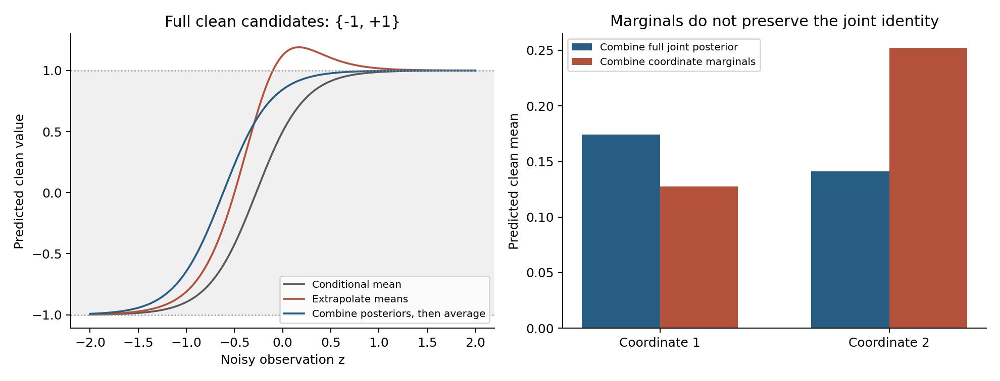
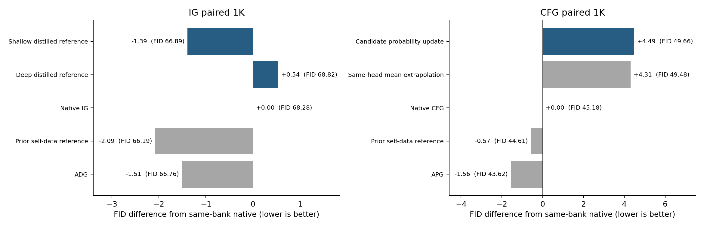

# CFG 的后验运算与 IG 的参考函数

**后续状态：蒸馏方向已按最新要求停止，包含尚未训练的学生状态聚合后续。** 本文保留已完成实验和推导，不再作为当前候选。[停止记录](SIT_REFERENCE_AGGREGATION_CANCELLATION_20260912_ZH.md)与[新的真实数据loss方向](IG_BAYES_RISK_RESEARCH_20260912_ZH.md)分别记录。

本轮分别检验两个构造：IG 将已有质量收益、但需要额外推理前缀的参考函数，离线蒸馏为共享主干上的小读出；纯 CFG 用真实干净 latent 监督候选概率，比较概率组合后求均值与直接均值外推。两者都保留冻结的 strong，不使用生成过程中的局部价值探针、方向投影或多系数分解。

<!-- STATUS_START -->
三个读出与10组新配对1K已全部完成，详细核验通过。没有候选通过预设推进门槛，未启动5K或迁移。
<!-- STATUS_END -->

## IG：弱参考的含义与它的计算位置可以分开

IG 使用 G=S+a(S-W)。如果 W 的监督目标就是 S，足够强的学生最终会使差值归零。这个极限并不意味着所有内部读出都必须保持浅层，也不意味着更深的特征不能计算一个有用的弱参考。它只说明：监督目标决定了学生最后被要求计算哪个函数。

将目标换成固定的 W_T 后，学生的函数族为 z↦R_phi(H(z),t,c)，目标是最小化对 W_T(z,t,c) 的拟合风险。即使使用末层特征，这个监督目标仍然要求它输出另一个参考函数。W_T 不等于 S，因此即使拟合完全成功，引导也不会消失。

本轮教师有具体来源。[既有独立弱前缀实验](SIT_PREFIX_CONFIRMATION_RESULTS_20260912_ZH.md)在一组新5K中把原IG的FID40.4318降低到36.1732，但复制四层前缀增加了推理计算，已经被排除为部署方案。这项记录只能证明那个指定参考函数值得被复现，不能证明一个小读出足以复现它。这里不再通过“weak更差所以应该有效”推测质量方向，而是固定已有实际质量证据的函数，检验其低成本可实现性。

教师只在离线产生监督时执行。部署时仍走一遍原strong主干，从第4层或第12层取特征，一个301840参数的原尺寸读出预测弱速度。不增加独立前缀，不对输入反传，也不查询额外teacher。参数数目相同不代表两种初始化相同：浅层头由原IG头初始化，末层头由strong的速度通道初始化；因此深度比较同时包含这两个已明确固定的因素，不能孤立归因为“信息更多”。

### 目标函数为什么应当落在真实采样状态上

令教师过程与学生过程分别满足

\[
\dot z_T=G_T(z_T,t),\quad G_T=S+a(S-W_T),
\qquad
\dot z_\phi=G_\phi(z_\phi,t),\quad G_\phi=S+a(S-W_\phi).
\]

在同一状态，误差严格为

\[
G_\phi-G_T=-a(W_\phi-W_T).
\]

若 G_phi 在相关区域对状态的Lipschitz常数有可积上界L(t)，同一起点的轨迹满足

\[
\|z_\phi(1)-z_T(1)\|
\le\int_0^1 e^{\int_t^1L(s)ds}|a(t)|
\|W_\phi(z_T(t),t)-W_T(z_T(t),t)\|dt.
\]

证明只需在轨迹误差导数中加减G_phi(z_T,t)，再使用Gronwall不等式。平方风险可由Cauchy–Schwarz继续界定，但未知的L(t)不能被省略，更不能把训练集MSE代入后宣称获得严格终点保证。这里没有估计局部Jacobian来调权，也没有把该标准稳定性关系命名为新定理。

它给出的实际选择是：拟合数据来自已有效教师引导实际经过的状态，而不是将其终点再次加噪。后者训练的对象已经在[前轮报告](GUIDANCE_REFERENCE_LOSS_RESEARCH_20260912_ZH.md)中严格区分。教师轨迹上的小误差加上足够的稳定性才有机会保留行为；教师状态分布上的经验平均误差小，本身不能排除学生偏移后的失败。

本轮离线采样1000条轨迹，各类10条，走到IG截止时间t=.5。每条轨迹在四个时间段内各取一个predictor状态，共4000状态；800条轨迹的3200状态用于训练，剩余200条的800状态验证。训练部分恰好覆盖每个类别与每个有效引导步一次。两个学生使用完全相同的状态索引，3000步、B32、固定优化器和最终EMA，不按FID或验证误差挑checkpoint。

### 与已有方法的关系

普通蒸馏、内部读出、在生成轨迹上匹配预测均已有充分先例。SSG在冻结像素主干上，用自身合成样本训练内部参考，但其监督是样本重建，且主要配置包含一至两个transformer adapter。本轮拟合已经有效的外部参考函数，并限制为原尺寸读出；不是完整复现SSG。SSG的linear-only消融本身表现较差，因此“只训小头一定够用”不是合理前提。[^ssg]

CFG的OPD研究还讨论了两分支同时变化时的误差相互补偿。本轮IG的strong完全冻结，不存在任意改变两个分支而保持组合输出的同一种自由度；但参考误差的强度放大和分布偏移问题仍然存在。[^opd] 这些差异界定实验对象，尚不足以建立新的论文贡献。

## 纯 CFG：先求均值会丢掉什么

对线性FM路径Z_t=tX+(1-t)epsilon，给定状态的精确速度由干净变量后验均值决定：

\[
v(z,t,c)=\frac{\mathbb E[X\mid Z_t=z,c]-z}{1-t}.
\]

原CFG对条件与null速度外推，等价于对两者的干净后验均值作同样外推：m_CFG=(1+a)m_c-a m_u。平均值没有保存后验中的多个候选及其相对可信度。两个候选为-1与1时，条件概率(.25,.75)、null概率(.5,.5)、a=2，均值外推给出1.5；先规范化p_c^3/p_u^2再求均值，则得到13/14。这个例子说明两种操作不同，也说明后者保持有限候选的凸包，但不证明真实图像质量改善。

对具有相同协方差的两个Gaussian后验，两种运算的均值恰好相同。因此，概率运算若有实质增益，必须利用Gaussian共同协方差近似之外的结构，不能把通常的CFG在任何情形下都说成错误。协方差不同或后验多峰时，均值信息一般不足以恢复概率组合后的均值。

### 完整后验有一个精确恒等式

设两个干净联合分布为p(X)、q(X)，同一个加噪似然为K_t(z|X)，a为常数。假定相关幂密度可积，定义r_a(X)∝p(X)^{1+a}/q(X)^a。Bayes公式给出

\[
\begin{aligned}
p(X\mid z)^{1+a}q(X\mid z)^{-a}
&\propto [K_t(z\mid X)p(X)]^{1+a}[K_t(z\mid X)q(X)]^{-a}\\
&=K_t(z\mid X)p(X)^{1+a}q(X)^{-a}.
\end{aligned}
\]

所以**完整干净联合后验先做概率组合，确实等于先组合干净分布再加噪所对应的后验**。由这个后验得到的精确均值，才是目标r_a的正确FM速度。这里的K只出现一次，是因为两个指数之和为1。

与之不同，在每个噪声层直接组合p_t(z)、q_t(z)的score，不一般对应K_t r_a。CFG的实际采样分布与静态乘幂密度之间的区别已有理论工作；新近的路径积分分析也明确保留了这个区别。[^analytic] 本段是基本Bayes代数的独立展开，仓库先前也已有共同候选概率的相关推导，不能声称首次解决了CFG的分布理论。

有限支持例子的数值验证误差为4.44e-16。这个恒等式仍要求完整联合后验、公共加噪似然和固定a；不能直接套在下面的patch边际、strong锚定及有限引导窗口上。若真实类别由干净图像唯一确定，则精确p(X|c)/p(X)在该类别支持上为常数，幂组合还会退化为原条件分布；这提醒我们，精确分布恒等式本身不是有限模型需要guidance的充分解释。

图左展示同一组有限候选下的预测均值；图右是联合概率组合与逐坐标边际组合的反例。两者均值相差0.12058，说明即使各边际概率都精确，也不能由边际组合恢复完整联合组合。[解析计算](data/reference_compilation_20260912/posterior_identity_checks.json)与[曲线数据](data/reference_compilation_20260912/posterior_mean_curves.csv)可复核。

### 本轮具体实现与不能省略的近似

使用真实训练latent的131072个2×2×4 patch，固定256中心和30次Lloyd更新形成共享codebook。冻结strong后，一个394240参数读出从末层特征预测干净patch最近中心的类别，使用交叉熵监督；训练时一半输入随机去掉条件。被去掉的类别不传给读出，因此null仍是合法的无类别输入分支。这个概率的监督事件是清楚定义的干净候选，不把attention权重解释为图像后验。

令候选为c_k，条件与null logits为l_c,l_u，定义

\[
m_c=\sum_k\operatorname{softmax}(l_c)_kc_k,\quad
m_u=\sum_k\operatorname{softmax}(l_u)_kc_k,
\quad m_a=\sum_k\operatorname{softmax}((1+a)l_c-a l_u)_kc_k.
\]

比较两个固定采样器：

\[
v_{\rm probability}=S+\frac{m_a-m_c}{1-t},
\qquad
v_{\rm mean}=S+\frac{a(m_c-m_u)}{1-t}.
\]

它们共用同一个分类读出、同一codebook和原有conditional/null主干前向。采用strong锚，是为了零强度严格恢复原模型，避免候选重建误差改变无引导基线；代价是总的干净预测不再具有完整凸包保证。不能据m_a有界宣称完整采样器一直处于真实图像流形。

概率组合也可以写成有限候选上的变分问题：最大化a E_r[log(p_c/p_u)]-KL(r||p_c)。最优r正是上述softmax。这个标准KL正则形式没有额外引入可调局部价值，也不意味着它优化FID。其在a=0的响应是Cov_pc(X,log(p_c/p_u))，一般不等于m_c-m_u；因此均值外推不是该非线性运算无条件成立的一阶展开。

本实现的主要风险是：codebook只有有限精度；读出只近似条件概率；patch边际没有完整联合相关性；strong锚与时间窗口打破前述精确生成恒等式。尤其是给定完整Z后，外部patch的似然可以随类别变化，不能认为针对单patch仍自动拥有与完整X相同的公共似然。实验测试的是这种廉价近似是否有效。

概率域CFG在离散diffusion中已有明确算法，逐token因子化也是已知近似；本轮不能认领概率组合本身的原创性。[^discrete] DDCM也已有codebook与CFG，但其codebook是预先生成的随机噪声，主要目标包括压缩生成；本轮是从连续模型特征读取干净latent候选概率，并保留原确定性sampler。[^ddcm] 两者并非同一实现，也不能仅凭这种差别声称具有充分的新颖性。

## 生成结果与成本

<!-- RESULTS_START -->
**1000图配对评估**

|主线／方法|FID↓|sFID↓|IS↑|Full/prefix|采样与解码GPU秒|
|---|--:|--:|--:|--:|--:|
|IG：浅层参考蒸馏|66.8875|209.9251|34.8971|128/0|102.60|
|IG：末层参考蒸馏|68.8197|209.7215|34.9156|128/0|103.62|
|CFG：候选概率组合|49.6644|211.0294|52.1925|224/0|164.57|
|CFG：同读出均值外推|49.4846|209.9817|53.6435|224/0|164.57|
|IG：原IG|68.2781|208.5747|34.5137|128/0|103.99|
|IG：既有自身数据参考|66.1928|209.2703|34.9580|128/0|102.19|
|CFG：原CFG|45.1793|207.9674|63.7084|224/0|159.92|
|CFG：既有自身数据参考|44.6059|209.1203|64.7881|224/0|162.51|
|CFG：APG|43.6182|211.1380|64.3980|224/0|178.22|
|IG：ADG|66.7650|208.3005|34.6892|128/0|111.67|

**离线训练与推理成本**

|训练|参数|GPU秒|
|---|--:|--:|
|ig_shallow|301840|10.76|
|ig_deep|301840|13.38|
|cfg_categorical|394240|49.04|

离线教师轨迹生成72.28 GPU秒，codebook Lloyd更新0.36 GPU秒，三个读出训练合计73.18 GPU秒。本轮10000张质量图像的采样/解码合计1353.87 GPU秒。这些是同步后的作业或batch时段之和，不是多卡墙钟加速比；不含模型加载、缓存读取、FID提取和审计，codebook时间不含训练patch抽样。

预设1K推进名单：[]；5K确认名单：[]。

[逐组质量与实际成本](data/reference_compilation_20260912/results.csv) · [训练记录](data/reference_compilation_20260912/training.csv)

以下固定展示第一批前4个输入，无图像筛选；少量样本不承担整体质量结论。

<!-- RESULTS_END -->

浅层蒸馏相对原IG的FID改善1.3907，但仍比已有自身数据参考差.6947；末层读出的教师MSE更低，FID反而更差，不能以回归误差排名替代生成质量。CFG概率组合比同读出均值外推差.1798，比原CFG差4.4852；当前实现不支持概率组合带来收益。以上是同一新1K的探索结果，未通过晋级，不构成可靠的新方法。

本轮新1K使用种子2026121220，和此前反复探索的bank分开。所有质量对照在同一新bank重跑；不能把这里的FID与前轮旧bank数值直接相减。IG保持每图128次full/0prefix，CFG保持224次full/0prefix；读出实际耗时另报，不能把NFE相同表述为延迟完全相同。

两个IG头只用一个训练seed、两个固定计算位置和3000步；CFG只用一个codebook、一个训练seed、一个固定额外强度。当前实现若失败，只约束这个预算和函数族，不能据此否定所有参考蒸馏或概率后验方法。若未超过全部预设强对照，不扩宽度、层数或guidance网格来延迟质量判断。完整门槛、训练来源、确认种子及源码规则见[冻结协议](SIT_REFERENCE_COMPILATION_PROTOCOL_20260912_ZH.md)。

近期针对两个rectified-flow transformer、八种已有guidance方法的复评，也没有发现跨其全部指标一致优于CFG的替代方法。[^revisiting] 这与本任务的模型和评价并不相同，不能用来解释本轮成败；它只支持继续保留原CFG和强已有方法作为实测对照，不依赖论文中的宽泛改进措辞。

## 来源与实验入口

主要新增实现位于[实验模块](../experiments/sit_reference_compilation_20260912/run.py)，数学图与反例由[独立分析脚本](../experiments/analyze_compiled_guidance_theory_20260912.py)生成。离线监督的教师与strong权重、全部源码、互斥数据池和旧队列停止标记均按SHA保存；旧宽队列保持停止。文献快照与SHA见[来源清单](../readings/guidance_compilation_20260912/source_manifest.json)。

[^ssg]: *A Frozen Pixel-Space Diffusion Model Can Guide Itself with Its Own Samples*, arXiv:2607.29122v1，2026。阅读方法、实验及adapter消融，尤其Table6对linear-only与非线性adapter的区别。[原文](https://arxiv.org/html/2607.29122v1)。
[^opd]: Bingnan Li等，*Rethinking Classifier-Free Guidance in On-Policy Diffusion Distillation*, arXiv:2607.24731v1，2026。阅读分支目标不确定性、负分支条件不对称与PDM方法。[原文](https://arxiv.org/html/2607.24731v1)。
[^analytic]: Enze Jiang、Zheng Ma，*Analytic Distribution of Classifier-Free Guidance for Schedule Design*, arXiv:2607.19725v1，2026。阅读问题定义、score组合与实际路径分布的区别及schedule构造动机；未将其schedule作为本轮候选。[原文](https://arxiv.org/html/2607.19725v1)。
[^discrete]: Yair Schiff等，*Simple Guidance Mechanisms for Discrete Diffusion Models*, arXiv:2412.10193v1，2024。§3.1给出概率幂组合与逐token因子化实现。[原文](https://arxiv.org/html/2412.10193v1)。
[^ddcm]: Guy Ohayon等，*Compressed Image Generation with Denoising Diffusion Codebook Models*, arXiv:2502.01189v4，2025，ICML。阅读噪声codebook机制与附录C.6的compressed CFG。[原文](https://arxiv.org/html/2502.01189v4)。
[^revisiting]: Artem Sergievskii、Artyom Turevich、Sergey Kastryulin，*Revisiting Classifier-Free Guidance Methods in Latent Diffusion Models*, arXiv:2608.16786v1，2026。阅读研究范围、固定模型协议及指标分歧结论；不据摘要外推普遍无效。[原文](https://arxiv.org/html/2608.16786v1)。
