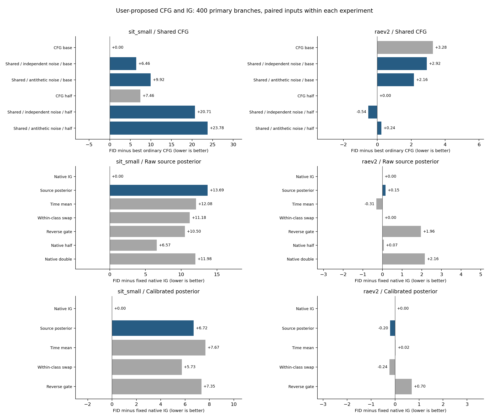

# 验证用户粘贴的CFG与IG想法：真实生成实验

2026-09-12。按用户要求先验证真实生成效果；保留两条优先候选，局部依赖弱化仍为文本中的备用方向，未当成已经验证的第三项。用户随后追加的[共同污染分布推导](AG_IG_SHARED_CONTAMINATION_DERIVATION_20260912_ZH.md)另文记录，没有改变本轮冻结方法或挑选参数。

CFG使用同条件样本共享额外gap，2×2初始噪声／共享方式，两个固定强度；IG用冻结模型实际Strong/Weak路径训练一个来源分类头，检验来源后验是否值得用于减弱反对Weak的力度。两者都从第一轮纳入SiT与RAEv2。

**评价口径。** 每臂实际生成400对、800条路径，固定第一分支的400张进入主FID/IS；不按图像挑选，不把两条相关输出一起混入主指标。不同实验阶段的噪声不同，不能跨CFG／IG直接比较绝对FID；校准IG刻意复用原IG探索bank，不是独立确认。RAE是预先随机选定的400类子集，参考为完整ImageNet，因此有小样本和类别覆盖限制。这里的IS不等于类别正确率，若有正信号，还需新的完整类别1K／5K与条件正确性检查。

400图仅用于筛选明显成败。时间均值控制由本组原IG轨迹估计固定schedule，它与当前探索bank共用数据，不能把这一控制说成已经完成独立schedule泛化验证；新的确认必须冻结schedule再换噪声。主要后验和置换方法不使用跨样本总体均值。

**实际成本。** CFG每输出SiT224、RAE200次完整前向；IG每输出SiT128、RAE100次。每个独立主评价样本实际用了两条路径的成本，保持两张输出时另有相关性。全部IG推理无独立weak前缀。原IG基线为了构造时间均值还记录r，其计时包含该校准用途；来源头和token池化的开销不能通过NFE抹去。

**一次有依据的修订。** SiT原来源分类头的硬分类准确率高于随机，但NLL与Brier不合格，因此不能叫作已校准后验。保留原实验后，使用来源标签拟合单个逆温度，检查另一半来源轨迹，再运行相同生成对照。校准未使用FID、未更新Strong/Weak或更换MLP；它改善来源概率不代表改善生成。此前已看过200条的汇总验证统计，拆分校准检查仍属于探索性修订。

协议：[CFG共享推动](CFG_SHARED_PUSH_PROTOCOL_20260912_ZH.md) · [IG来源后验](IG_SOURCE_POSTERIOR_PROTOCOL_20260912_ZH.md) · [概率校准修订](IG_SOURCE_CALIBRATION_AMENDMENT_20260912_ZH.md)。原始[用户提案](data/guidance_pasted_20260912/proposal.txt)留档。

只改初始噪声耦合并保持单样本生成映射不变，不会改变单样本边缘；因此独立CFG的相反噪声格只复用已逐位检查相同的第一分支资产，不伪造第二分支。[Couple to Control，§3](https://arxiv.org/html/2605.11311v1)。IG的后验反馈与[Feedback Guidance](https://arxiv.org/html/2506.06085v2)接近，当前不据新公式宣称新颖性。

**36组固定生成初筛全部完成。** CFG共享推动、原始IG来源后验、校准IG来源后验，在两模型上均未通过预设推进条件。没有追加1K／5K或参数扫描。

|模型|方案|候选FID|规定对照中最好FID|差值|进入独立确认|
|---|---|--:|--:|--:|---|
|sit_small|共享CFG|84.3138|77.8542|+6.4596|否|
|sit_small|原始来源IG|117.7914|104.1027|+13.6886|否|
|sit_small|校准来源IG|110.8191|104.1027|+6.7164|否|
|raev2|共享CFG|94.3783|94.9168|-0.5385|否|
|raev2|原始来源IG|92.8487|92.3795|+0.4692|否|
|raev2|校准来源IG|92.4899|92.4566|+0.0333|否|

CFG比较两个强度中最好的普通版本；IG后验须同时胜过原IG、半／双强度、时间均值、同条件置换和反向gate。门槛为FID至少降低2且IS至少保留原对照的90%；这是预先冻结的资源筛选规则，不是显著性检验。

SiT的两项候选均恶化；RAE共享半强度有不足1 FID的微小下降，校准来源IG与原IG基本持平。来源状态的逐样本对应关系也未胜过同条件置换。当前结果不足以支持继续扩大这些固定构造，也不证明所有分布去污染或其他共同污染模型均不可能有效。

sit_small：CFG两点中普通最好77.8542，共享最好84.3138，差+6.4596。
raev2：CFG两点中普通最好94.9168，共享最好94.3783，差-0.5385。

**sit_small／cfg_screen_400：6组已评价**

|方法|FID↓|IS↑|主样本|生成路径|完整前向/输出|采样解码GPU秒|
|---|--:|--:|--:|--:|--:|--:|
|普通CFG 原强度|77.8542|61.7840|400|800|224|124.54|
|共享CFG 独立噪声 原强度|84.3138|55.4564|400|800|224|123.81|
|共享CFG 相反噪声 原强度|87.7784|49.7167|400|800|224|126.60|
|普通CFG 半强度|85.3152|53.6207|400|800|224|124.31|
|共享CFG 独立噪声 半强度|98.5627|43.2720|400|800|224|123.92|
|共享CFG 相反噪声 半强度|101.6391|39.7890|400|800|224|124.51|

**raev2／cfg_screen_400：6组已评价**

|方法|FID↓|IS↑|主样本|生成路径|完整前向/输出|采样解码GPU秒|
|---|--:|--:|--:|--:|--:|--:|
|普通CFG 原强度|98.1993|31.2115|400|800|200|1278.69|
|共享CFG 独立噪声 原强度|97.8378|30.6280|400|800|200|1282.79|
|共享CFG 相反噪声 原强度|97.0783|30.1736|400|800|200|1278.83|
|普通CFG 半强度|94.9168|30.0491|400|800|200|1276.14|
|共享CFG 独立噪声 半强度|94.3783|29.5526|400|800|200|1273.76|
|共享CFG 相反噪声 半强度|95.1591|29.3331|400|800|200|1277.65|

**sit_small／ig_screen_400：7组已评价**

|方法|FID↓|IS↑|主样本|生成路径|完整前向/输出|采样解码GPU秒|
|---|--:|--:|--:|--:|--:|--:|
|原IG|104.1027|35.1868|400|800|128|80.58|
|来源后验|117.7914|30.9605|400|800|128|81.28|
|时间均值|116.1809|32.8429|400|800|128|79.89|
|同条件置换|115.2806|31.3267|400|800|128|80.96|
|反向gate|114.6036|28.9801|400|800|128|80.93|
|原IG 半强度|110.6692|35.5438|400|800|128|79.47|
|原IG 双强度|116.0823|27.1597|400|800|128|79.27|

**raev2／ig_screen_400：7组已评价**

|方法|FID↓|IS↑|主样本|生成路径|完整前向/输出|采样解码GPU秒|
|---|--:|--:|--:|--:|--:|--:|
|原IG|92.6944|27.9634|400|800|100|642.43|
|来源后验|92.8487|27.9870|400|800|100|644.15|
|时间均值|92.3795|27.7619|400|800|100|639.09|
|同条件置换|92.6958|27.3145|400|800|100|644.63|
|反向gate|94.6548|27.2873|400|800|100|643.95|
|原IG 半强度|92.7663|27.3983|400|800|100|638.67|
|原IG 双强度|94.8530|28.4800|400|800|100|638.43|

**sit_small／ig_calibrated_screen_400：5组已评价**

|方法|FID↓|IS↑|主样本|生成路径|完整前向/输出|采样解码GPU秒|
|---|--:|--:|--:|--:|--:|--:|
|原IG|104.1027|35.1868|400|800|128|78.09|
|来源后验|110.8191|35.2725|400|800|128|78.19|
|时间均值|111.7745|34.1625|400|800|128|76.90|
|同条件置换|109.8368|35.1513|400|800|128|78.27|
|反向gate|111.4493|31.2130|400|800|128|77.68|

**raev2／ig_calibrated_screen_400：5组已评价**

|方法|FID↓|IS↑|主样本|生成路径|完整前向/输出|采样解码GPU秒|
|---|--:|--:|--:|--:|--:|--:|
|原IG|92.6944|27.9634|400|800|100|641.25|
|来源后验|92.4899|27.7887|400|800|100|643.47|
|时间均值|92.7178|28.0487|400|800|100|637.89|
|同条件置换|92.4566|27.7973|400|800|100|646.62|
|反向gate|93.3914|27.4671|400|800|100|646.77|

**来源概率校准（不是图像质量）**

|模型|逆温度|原NLL|校准NLL|原Brier|校准Brier|
|---|--:|--:|--:|--:|--:|
|sit_small|0.070408|2.0350|0.5641|0.2661|0.1931|
|raev2|0.131087|1.9940|0.6103|0.2727|0.2053|

[完整数据CSV](data/guidance_pasted_20260912/quality.csv) · [图表数据工作簿](data/guidance_pasted_20260912/source_data.xlsx)。

**验证与成本。** 已核对36臂的样本覆盖、输入与产物SHA、标签、潜变量有限性、两条路径以及逐批耗时；用同一缓存特征重算FP64 FID，最大差异5.41e-05，未声称使用独立特征提取器。两个模型校准前后的原IG主分支像素完全相同。全部方法源文件与冻结输入检查通过。

36臂实际采样与解码共17074.41个批次GPU秒，生成28,800条路径；独立主分支评价共14,400张，其中校准原IG是刻意重放。GPU秒是各批设备耗时之和，不是墙钟时间，也不含CPU评价或离线来源生成。

sit_small：离线来源轨迹68.81 GPU秒；49,665参数的分类头训练3.83 GPU秒。温度校准在CPU完成，未训练去噪模型。

raev2：离线来源轨迹1186.28 GPU秒；184,833参数的分类头训练5.96 GPU秒。温度校准在CPU完成，未训练去噪模型。

来源数据按完整seed分成1000训练对、100校准对和100审计对；所有900份来源特征文件、来源标签、时刻、噪声、温度缩放与原头继承关系已核对。此前已查看过200对的汇总验证，故仍是探索性校准。旧队列及蒸馏STOP文件保持原SHA。[来源与图像归档](data/guidance_pasted_20260912/final_provenance.json)。

固定前4个主分支图像，无选图：

sit_small：[cfg_screen_400](data/guidance_pasted_20260912/sit_small_cfg_screen_400_first4.png) · [ig_screen_400](data/guidance_pasted_20260912/sit_small_ig_screen_400_first4.png) · [ig_calibrated_screen_400](data/guidance_pasted_20260912/sit_small_ig_calibrated_screen_400_first4.png)。

raev2：[cfg_screen_400](data/guidance_pasted_20260912/raev2_cfg_screen_400_first4.png) · [ig_screen_400](data/guidance_pasted_20260912/raev2_ig_screen_400_first4.png) · [ig_calibrated_screen_400](data/guidance_pasted_20260912/raev2_ig_calibrated_screen_400_first4.png)。

本轮两个优先想法的固定验证已结束，备用局部依赖构造未运行；整体研究目标仍未达成。精确去污染系数与本轮有界gate的不同，见[后续推导](AG_IG_SHARED_CONTAMINATION_DERIVATION_20260912_ZH.md)。
