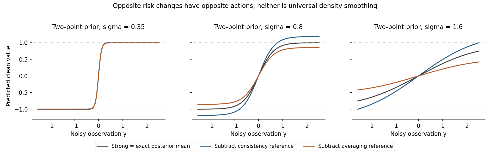
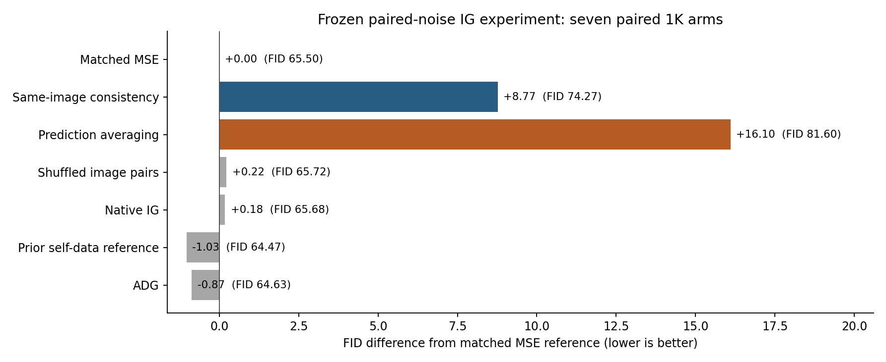

# CFG／IG 续研：弱参考的函数平滑、密度平滑与配对损失

日期：2026-09-12。用户本次明确要求设为持续目标，工具目标已设为active；纯CFG和一次共享主干前向的IG保持独立主线。蒸馏与其聚合后续、旧宽队列、独立weak前缀继续停止。以下将已有文献、独立推导、实际实验分开记录。

<!-- STATUS_START -->
四个真实数据IG读出和七组新配对1K均已完成，审计通过。主要候选FID74.27，同预算MSE65.50，已有参考64.47；本轮没有生成收益。配对loss分支停止，未启动5K、迁移或系数搜索。
<!-- STATUS_END -->

**这轮的实际问题。** 上轮四次损失没有改善生成。本轮不再从误差指数选更好看的一点，而是检验一个确定的训练干预：同一张真实图像、同一时间、两份独立噪声，改变它们的预测在loss中如何配对。整个部署仍是原来的一个主干、一个第四层读出。这个构造可以精确说明总体最优预测如何变化，也可以给出其不能解释为密度平滑的反例。

**文献提供的约束。** [Selective Underfitting，§3–4](https://arxiv.org/html/2510.01378v1)区分训练样本高概率出现的区域与采样经过的区域，并研究改变监督区域的干预。它使“训练拟合程度决定生成好坏”这一笼统说法更不可信；它没有证明AG/IG的weak必是strong的平滑分布，也没有给出本轮loss。[Zhou等的score smoothing论文，§2–3](https://arxiv.org/html/2601.19285v1)明确研究去掉噪声条件与改变经验score的softmax温度；这两种现成构造不能重新命名为我们的新方法。

同图增强后约束预测接近，在[Π-model／Temporal Ensembling，§2](https://arxiv.org/pdf/1610.02242v3)已有；按数据几何正则化函数的思想在[Manifold Regularization](https://jmlr.org/papers/v7/belkin06a.html)也已存在。下面的平方风险与算子求逆是标准数学工具。当前能探索的差异仅是：用这种风险有意构造IG的负参考，检验相减能否修复冻结strong的特定偏差。没有生成优势时，不能把这套代数包装为核心创新。

**训练究竟做了什么。** 给定类别c、时间t，采样一张真实latent X及独立ε1、ε2：

\[
z_i=tX+(1-t)\epsilon_i,\qquad
d(z_i)=z_i+(1-t)W(z_i),\qquad
r_i=W(z_i)-(X-\epsilon_i).
\]

因此d_i-X=(1-t)r_i。四个固定目标如下；E同时包括数据、噪声与坐标平均。

|训练|损失|含义|
|---|---|---|
|普通FM|\(\frac14E[\|r_1\|^2+\|r_2\|^2]\)|同图两噪声均独立接受真实监督|
|同图一致性，主要候选|\(L_{FM}+\frac14E\|r_1-r_2\|^2\)|对同图的噪声变化更不敏感|
|先平均，反向对照|\(\frac12E\|(r_1+r_2)/2\|^2\)|两次预测平均正确，允许单次预测更不稳定|
|打乱图像配对|上一行，X1、X2为同类独立图像，各有自己的target|检验共享clean图像的影响|

先平均损失恰等于\(L_{FM}-\frac18E\|r_1-r_2\|^2\)。它是非负的平方损失；这里的负号来自恒等展开，没有优化无界的负MSE。所有系数由固定的双样本目标定义，没有扫描系数或噪声副本数。

**为什么这会改变最优预测。** 固定t、c，记\(m(z)=E[X\mid z]\)，定义

\[
(Tf)(z)=E_{X\mid z}\,E_{z'\mid X} f(z').
\]

它先依据当前z对可能的clean图像求后验，再对那张图重新加噪。这里只是分析中定义该算子；实际训练直接从真实图像生成噪声对，推理不估计T、后验、谱或局部指标。真实条件分布交替采样的不变性是经典事实，可参照[Generalized Denoising Auto-Encoders，§2](https://arxiv.org/pdf/1305.6663v4)；该文也区分了真实条件分布与不一定相容的近似条件模型。

在\(L^2(p_t)\)内，T保持常数、自伴、半正定，且\(0\preceq T\preceq I\)。例如

\[
\langle f,Tg\rangle
=E_X[E(f(z)\mid X)E(g(z)\mid X)],
\]

以及

\[
\frac12E\|f(z)-f(z')\|^2
=\langle f,(I-T)f\rangle.
\]

忽略与f无关的常数、以及固定t的正比例因子，普通风险为\(\frac12\|f-m\|^2\)。对两个新风险求变分，得到

\[
\boxed{d_{consistent}=(2I-T)^{-1}m},\qquad
\boxed{d_{average}=2(I+T)^{-1}m}.
\]

若Tf=ηf，前者对这类变化乘\(1/(2-η)\in[1/2,1]\)，后者乘\(2/(1+η)\in[1,2]\)。这说明两者是方向相反的干预；不需要假设strong/weak误差共线。打乱图像后，两个残差在给定c、t下独立，目标变成\(\frac14E\|r\|^2+\frac14\|Er\|^2\)；无限容量最优解仍是原条件均值，而非上面的T变换。

**Gaussian特例揭示了一个方向陷阱。** 将输入标准化写成Y=X+σε，若\(X\sim N(\mu,C)\)，则

\[
d_{consistent}(y)=\mu+\frac C2\left(\frac C2+\sigma^2I\right)^{-1}(y-\mu),
\]
\[
d_{average}(y)=\mu+2C(2C+\sigma^2I)^{-1}(y-\mu).
\]

前者对应更窄的Gaussian先验，后者对应更宽的先验。Gaussian情况下更宽，不足以推出一般双峰情形中的引导方向正确。对于等权±a二点先验，m(y)=a tanh(ay/σ²)，T在该奇函数上的特征值为\(η=E[\tanh(aY/σ²)\mid X=a]\)。因此前者收缩m，后者放大m；strong减后者会向两峰中间推。这是在生成结果出来前，把“先平均”降为反向对照的原因，主要候选已冻结为同图一致性。

**函数平滑仍不等于密度平滑。** 上式T的不变分布就是p_t，故对函数施加它，并没有把p_t本身换成某个更平滑的分布。更强的反例来自二维三点先验\((-1.3,-.2),(.4,1.6),(1.1,-.9)\)，权重(.2,.5,.3)，σ=.9。在y=(.25,.15)，由新denoiser换算的“score”存在非零curl；100阶Gaussian求积下，一致性与先平均分别为−.005320989和+.006344479，60阶结果之差小于4e−10。它们甚至不能在该邻域作为某个光滑正密度的梯度。

二点例子的指导clean预测也可能超出原±1支持，本轮固定曲线最大超出约.18682。总体风险的强凸性、平滑性和唯一最优解均不能消除这个问题。代码及数值：[解析脚本](../experiments/analyze_replica_reference_20260912.py)、[检查结果](data/replica_reference_20260912/theory_checks.json)、[完整曲线](data/replica_reference_20260912/two_point_curves.csv)。

**解释AG还缺什么。** 若额外假设strong与weak恰好分别为同一个正算子L的两条正则化解\((I+\lambda_sL)^{-1}m\)、\((I+\lambda_wL)^{-1}m\)，其中\(0<\lambda_s<\lambda_w\)，以\(a=\lambda_s/(\lambda_w-\lambda_s)\)相减，可消去一阶正则化偏差。对L的特征值u，组合响应为

\[
1-\frac{\lambda_s\lambda_wu^2}{(1+\lambda_su)(1+\lambda_wu)}.
\]

这只是带明确前提的经典偏差抵消代数。冻结SiT并未按本轮一致性目标训练，实际strong没有被证明满足该共同算子假设；本轮也不拟合该谱或λ。因而即使新weak平滑得完全符合推导，生成仍可变差。本轮生成实验正是要检查这个缺口，训练分歧降低不算通过。

**真实实验与成本。** 所有训练用真实数据、固定strong、原尺寸共享第四层读出，16图对／更新，3000更新，最终EMA。协议、源码、权重、随机流冻结；部署不需要第二份噪声或第二模型。完整规则见[冻结协议](SIT_REPLICA_REFERENCE_PROTOCOL_20260912_ZH.md)。

<!-- RESULTS_START -->
**七组新配对1000图：相同噪声、标签及采样器**

|方法|FID↓|sFID↓|IS↑|Full/prefix|采样与解码GPU秒|
|---|--:|--:|--:|--:|--:|
|同预算MSE|65.4999|208.7125|37.0242|128/0|101.00|
|同图一致性（主要候选）|74.2687|215.4150|33.5202|128/0|101.18|
|先平均（反向对照）|81.5984|221.0882|28.3958|128/0|101.11|
|打乱图像配对|65.7210|208.6336|37.1203|128/0|99.10|
|原IG|65.6760|208.4853|36.8611|128/0|99.29|
|已有自身数据参考|64.4664|208.5390|37.1355|128/0|99.69|
|ADG|64.6293|207.5620|37.2476|128/0|108.38|

|训练|参数|训练GPU秒|保留集MSE|同图预测分歧|平均预测MSE|
|---|--:|--:|--:|--:|--:|
|同预算MSE|301840|47.54|0.926457|0.898759|0.701767|
|同图一致性（主要候选）|301840|48.57|0.974327|0.651855|0.811363|
|先平均（反向对照）|301840|46.41|0.977167|1.246483|0.665546|
|打乱图像配对|301840|47.04|0.926526|0.901003|0.701275|

主要候选相对同预算MSE的FID差为 **+8.7688**。一致性损失降低了同图分歧，先平均损失降低了平均预测误差，但二者均明显损害生成。打乱配对接近MSE，不支持把结果解释为多取一次噪声或简单缩放训练loss即可改善。

四个训练合计189.56 GPU秒；七组采样/解码合计709.76 GPU秒。时间不含模型加载、数据读取、特征提取及审计，不能由前向次数相同推断延迟严格相同。共同初始化与原始候选随机流一致；打乱组按设计使用第二张图，因此实际监督输入并非四组全部相同。

原始batch、样本覆盖、权重和成本检查通过；FID/sFID由同一缓存特征另用FP64算术核对，这不是独立特征提取验证。1K用于筛除明显失败候选，不能支持小幅改善的统计结论。固定推进名单为空，未启动5K、跨模型或系数搜索。

[逐组质量与成本](data/replica_reference_20260912/results.csv) · [训练记录](data/replica_reference_20260912/training.csv) · [图表数据工作簿](data/replica_reference_20260912/source_data.xlsx)

固定展示首批前4个输入，无图像筛选；这些少量样本不承担总体结论。

<!-- RESULTS_END -->

**本轮纯CFG的取舍。** 继续读了[Learn to Guide Your Diffusion Model，§3](https://arxiv.org/html/2510.00815v1)以及[Adversarial Learning of Classifier-Free Guidance Schedules，§2–3、附录B.6–7](https://arxiv.org/html/2608.14038v1)。前者研究分布匹配，实际主要采用固定同一clean图像的更强一致性条件；后者采用边缘分布匹配与训练时判别器，并已比较共享／独立噪声及图像配对。因此“把训练loss换成MMD／GAN”“用配对噪声降低估计方差”本身都不足以构成新CFG主线。本轮没有把论文方法接成另一组局部统计量调scale。

这里有两个需要保留的理论边界。第一，只有strong是精确条件Bayes速度时，普通FM风险沿额外guidance方向的最优权重必为0；有限函数类中的训练最优不自动满足这个前提。第二，要求同一clean图像加噪后都重建回来，比要求生成边缘分布正确强得多。前者可能把正常的后验多解当成错误；把一致性loss写得更复杂不能自动修复这个问题。

纯CFG本轮尚没有经实验证明的新候选。下一轮优先推进CFG，候选必须比现有分布匹配guidance多一个实质结构，并对模式质量分配提出可失败预测；不把IG失败后的系数扫描迁过去。IG这次的两个相反风险均失败后，停止这个固定配对loss构造，也不把“去掉curl”直接升级成下一次生成实验的理由。仍需要从冻结strong实际缺失的生成结构出发，而非先挑一个有闭式解的弱模型风险。

本轮原文PDF及SHA保存在[source manifest](../readings/replica_reference_20260912/source_manifest.json)。原始生成资产均在`/home/zhoushunyu/data/eqvae/experiments/sit_replica_reference_20260912/`，未改动历史实验或恢复旧宽队列。整体持续目标尚未完成。

最终[执行与冻结文件核验](data/replica_reference_20260912/final_verification.json)通过；这证明实验可核查，不改变方法失败的结论。用户随后要求优先验证新粘贴方案并减少toy／理论前置，下一轮按[CFG共享推动协议](CFG_SHARED_PUSH_PROTOCOL_20260912_ZH.md)执行。
