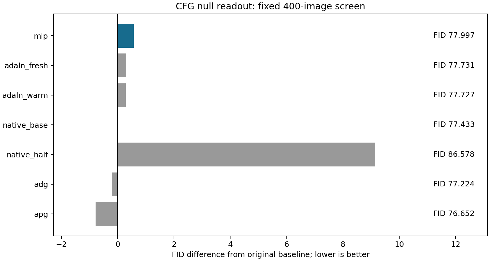
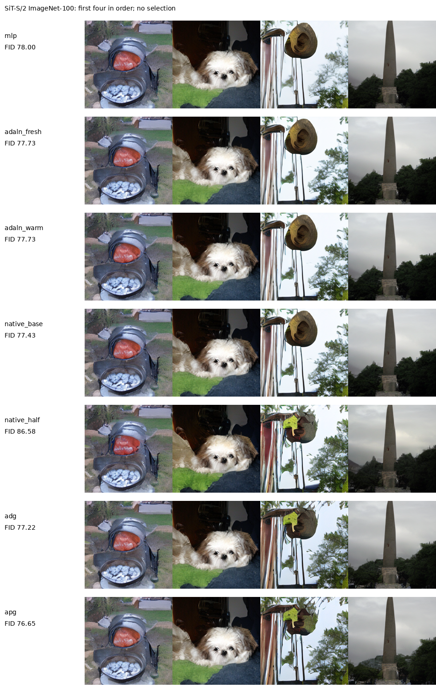

# 纯CFG无条件读出的固定生成结果

三个重新训练的无条件读出都没有优于原CFG。本轮MLP FID为77.9967，原CFG为77.4335，既有APG适配为76.6516。MLP比原CFG高0.5632，比最佳控制高1.3452，未达到比全部六个控制至少低2的预设门槛。停止这项构造，不进入1K，也不追加头宽、深度、学习率、训练时长或guidance强度搜索。

七臂各400张新图，共2800张，种子2026121361、每类4图、同噪声和标签。三种null头只读完整12层null特征，用相同真实数据FM训练3000步；分别为MLP从零输出初始化、原AdaLN从官方零初始化、原AdaLN从预训练末层续训。条件分支及全部主干冻结，训练不使用strong预测或生成数据。所有新头和原CFG额外系数1.25，半强度为0.625；沿用left_time<0.75窗口。第二噪声文件不使用，每图只有一条路径。

| arm         |     fid |   inception_score | newly_generated   |   full_calls_per_output |
|:------------|--------:|------------------:|:------------------|------------------------:|
| mlp         | 77.9967 |           60.0614 | True              |                     224 |
| adaln_fresh | 77.7313 |           59.1964 | True              |                     224 |
| adaln_warm  | 77.727  |           59.4726 | True              |                     224 |
| native_base | 77.4335 |           60.0703 | True              |                     224 |
| native_half | 86.5782 |           46.8493 | True              |                     224 |
| adg         | 77.2239 |           58.2379 | True              |                     224 |
| apg         | 76.6516 |           59.831  | True              |                     224 |

全部七臂为64步Heun、224次full、0额外prefix。CFG仍需原条件末层，因此MLP实际额外保存310,688参数，两个AdaLN控制各308,000；不能只报新旧头之差2,688。同卡batch8、轮换预热后各三次完整采样及解码，中位数MLP相对原CFG增加约0.69%。但第三轮多臂出现约2秒长尾，明显高于约1.25秒常态；保留全部逐次值，不据这组三次计时给出精确开销结论。失败构造不再追加速度调优。

| arm         |   median_seconds |   min_seconds |   max_seconds |   relative_to_original |   batch |   repeats |
|:------------|-----------------:|--------------:|--------------:|-----------------------:|--------:|----------:|
| mlp         |          1.25814 |       1.25778 |       2.06784 |             0.00687287 |       8 |         3 |
| adaln_fresh |          1.24727 |       1.24506 |       2.06445 |            -0.00183201 |       8 |         3 |
| adaln_warm  |          1.25237 |       1.24501 |       2.05462 |             0.00225148 |       8 |         3 |
| native_base |          1.24955 |       1.24553 |       1.25073 |             0          |       8 |         3 |
| native_half |          1.26208 |       1.25436 |       1.30363 |             0.0100254  |       8 |         3 |
| adg         |          1.32615 |       1.32352 |       1.91562 |             0.061301   |       8 |         3 |
| apg         |          1.27789 |       1.26916 |       1.95108 |             0.0226801  |       8 |         3 |

共享训练循环时间不含加载与最终验证；验证MSE未用于挑checkpoint或调整方案。

| arm         |   validation_mse |   parameters |   steps |   shared_loop_seconds |
|:------------|-----------------:|-------------:|--------:|----------------------:|
| mlp         |         0.797972 |       310688 |    3000 |               64.7695 |
| adaln_fresh |         0.796178 |       308000 |    3000 |               64.7695 |
| adaln_warm  |         0.795062 |       308000 |    3000 |               64.7695 |

400图是固定小规模筛选，不能凭小FID差宣称总体显著变差；确定的是没有达到预先要求的实际改善。这个失败不能证明所有CFG无条件分支都不值得改进，也不能把SiT浅层IG读出的收益推广到完整主干后的null读出。本轮APG为仓库既有cfg_apg_07适配：强度2、velocity差的负动量-0.5、截断与clean方向投影；不冒充论文clean历史的逐项等价实现。新代码与既有实现的完整轨迹逐项相同，Heun两stage读取同一旧历史并提交第一stage历史。条件输出不变、null直接读出及零guidance退回原模型检查均通过。[Unconditional Priors Matter](https://arxiv.org/html/2503.20240v2)主要在微调模型中用另一模型改善无条件先验，它不能证明这里的末层读出是瓶颈。[APG](https://arxiv.org/html/2410.02416v2)与[ADG](https://arxiv.org/html/2506.11039v1)提供既有比较方法，本轮没有新增可用的纯CFG方法。

全部新生成样本的逐批图像、标签、噪声、请求及源码/权重SHA和调用数已核对，FID从同一Inception缓存特征用FP64复算；这不是独立特征提取器验证。复用对照沿用已核验FID，同时重新校验样本、指标、特征与参考统计SHA。

[冻结协议](CFG_NULL_READOUT_PROTOCOL_20260913_ZH.md) · [源数据工作簿](data/cfg_null_readout_20260913/source_data.xlsx) · [判定](data/cfg_null_readout_20260913/decision.json) · [核验记录](data/cfg_null_readout_20260913/verification.json)。
