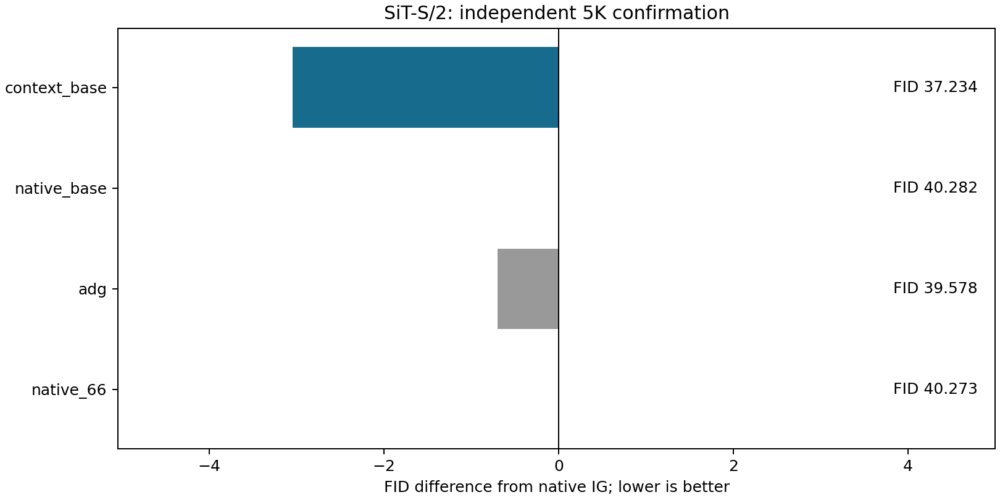
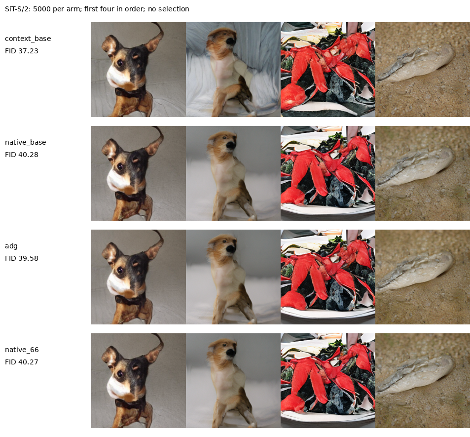

# 上下文读出的独立5K与成本验证

这次具体上下文读出通过独立5K的固定效应门槛，包括更高主干预算的原IG对照。

候选最初是Local试验中的Context对照，在400图中被选中，随后在独立1K通过门槛，再在这组全新5000噪声上确认。训练、checkpoint、引导强度和时间窗口均未改变。原IG与ADG是同128次full对照；原IG66步是132次full的成本对照，分段窗口的离散落点也随网格变化。四组都只用一条生成路径，每类50图。质量采样秒数来自并行GPU工作者，不能用来判定同卡速度。

| arm          |     fid |   inception_score |   primary_samples |   full_calls_per_output |
|:-------------|--------:|------------------:|------------------:|------------------------:|
| context_base | 37.2343 |           39.4512 |              5000 |                     128 |
| native_base  | 40.2817 |           37.5417 |              5000 |                     128 |
| adg          | 39.5775 |           37.4043 |              5000 |                     128 |
| native_66    | 40.2734 |           37.555  |              5000 |                     132 |

固定判定：

- candidate_fid: 37.234254676065405
- best_control: adg
- best_control_fid: 39.57750158085156
- delta: -2.343246904786156
- native_delta: -3.0474760548090103
- adg_delta: -2.343246904786156
- native66_delta: -3.0391757542403752
- passes_frozen_5k_gate: True
- wall_time_control_covers_capture: True
- statistical_significance_established: False
- cross_model_success: False
- novelty_established: False
- goal_complete: False

同卡轮换计时包含完整采样及解码，加载与审计另计。

| arm          |   median_seconds |   batch |   repeats |   seconds_relative_to_native |
|:-------------|-----------------:|--------:|----------:|-----------------------------:|
| context_base |         0.76867  |       8 |         3 |                    0.0292665 |
| native_base  |         0.746813 |       8 |         3 |                    0         |
| adg          |         0.783363 |       8 |         3 |                    0.0489404 |
| native_66    |         0.771602 |       8 |         3 |                    0.0331929 |

额外完成了不改变采样公式的实现精简：在原共享前向中直接替换弱读出，不再同时计算原弱头。固定24条完整轨迹的latent及解码像素逐项一致。原弱头301,840参数，新头304,528参数，替换后净增加2,688。该实现同卡中位耗时相对原IG+0.29%。这组计时单独报告，冻结5K采样代码未被修改。

| arm             |   median_seconds |   batch |   repeats |
|:----------------|-----------------:|--------:|----------:|
| native_base     |         0.764076 |       8 |         3 |
| context_capture |         0.782719 |       8 |         3 |
| context_direct  |         0.766292 |       8 |         3 |
| native_66       |         0.77951  |       8 |         3 |
| adg             |         0.800421 |       8 |         3 |

通过该门槛不等于统计显著性检验，也没有证明混合模型或加性误差机制。RAEv2的原400图试验没有同样收益，因此不能声称跨模型成立。冻结中间读出已有先例，MLP结构本身不是新贡献。

[ADG](https://arxiv.org/html/2506.11039v1)是既有基线；[SSG](https://arxiv.org/html/2607.29122v1)已研究冻结中间adapter；[RevIN官方代码](https://github.com/ts-kim/RevIN)提供恢复实例统计的相关先例。这些先例用于限定贡献边界，不代表它们证明本实验的解释。

审计核对全部标签、噪声和源码/权重hash、单条生成路径及调用数，并从同一缓存特征FP64复算FID。它不构成独立特征提取器验证。

[冻结协议](CONTEXT_REFERENCE_5K_PROTOCOL_20260912_ZH.md) · [源数据工作簿](data/context_reference_5k_20260912/source_data.xlsx) · [核验记录](data/context_reference_5k_20260912/verification.json)。
