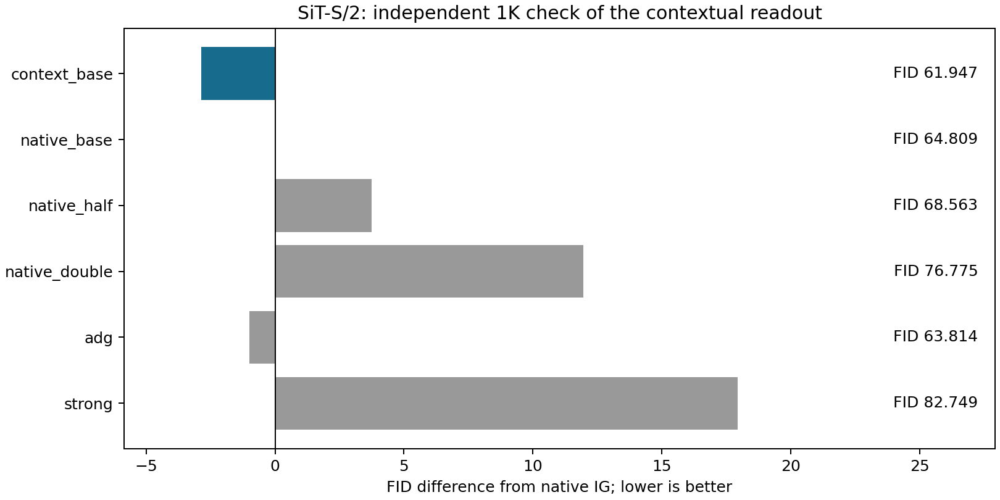
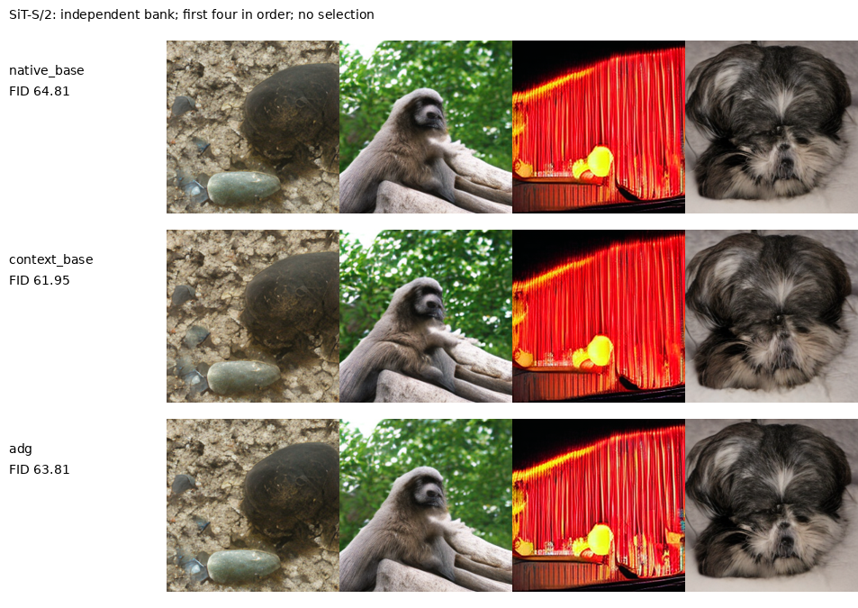

# 上下文读出对照的独立1K核查

上下文读出通过预先规定的1K资源门槛，仍需要新的5K与更严格成本比较，尚无核心方法成功结论。

上一阶段Local参考失败，但SiT的Context对照在400图上比原IG最好强度低2.97 FID。本轮明确将这个对照作为事后选择，另取1000个全新噪声、每类10图，与原IG三档幅度、ADG和Strong同时比较。未更新训练、checkpoint、窗口或强度；该1K只验证具体读出信号，不能证明冻结主干加MLP的新颖性。

| model     | candidate    |   candidate_fid | best_control   |   best_control_fid |    delta |   native_delta |   adg_delta |   inception_ratio | passes_1k_resource_gate   | original_candidate_was_a_control   | independent_generation_bank   | novelty_established   | goal_complete   |
|:----------|:-------------|----------------:|:---------------|-------------------:|---------:|---------------:|------------:|------------------:|:--------------------------|:-----------------------------------|:------------------------------|:----------------------|:----------------|
| sit_small | context_base |         61.9471 | adg            |            63.8138 | -1.86673 |       -2.86193 |    -1.86673 |           1.10414 | True                      | True                               | True                          | False                 | False           |

| arm           |     fid |   inception_score |   seconds |   primary_samples |   generated_paths |   full_calls_per_output |   prefix_calls_at_inference |
|:--------------|--------:|------------------:|----------:|------------------:|------------------:|------------------------:|----------------------------:|
| context_base  | 61.9471 |           40.0727 |   94.1858 |              1000 |              1000 |                     128 |                           0 |
| native_base   | 64.809  |           36.293  |   95.3025 |              1000 |              1000 |                     128 |                           0 |
| native_half   | 68.5631 |           35.2001 |   92.3583 |              1000 |              1000 |                     128 |                           0 |
| native_double | 76.7746 |           29.0548 |   92.0243 |              1000 |              1000 |                     128 |                           0 |
| adg           | 63.8138 |           35.9726 |  100.756  |              1000 |              1000 |                     128 |                           0 |
| strong        | 82.7487 |           30.6733 |   91.0213 |              1000 |              1000 |                     128 |                           0 |

所有臂每图128次full、0次额外prefix，Context读出使用旧3000步最终EMA。原IG、ADG、Strong不安装新增捕获hook，Context才安装。质量采样秒数含采样和解码，不含加载、预检、CPU特征提取或审计。

|   batch |   repeats |   native_seconds |   context_seconds |   relative_change |   extra_parameters | provenance                                                                |
|--------:|----------:|-----------------:|------------------:|------------------:|-------------------:|:--------------------------------------------------------------------------|
|       8 |         3 |          0.73659 |          0.753772 |         0.0233257 |             304528 | same retained head and runtime; benchmark from preceding completion stage |

上表是上一阶段对相同EMA及运行时所做的同卡3次计时，清楚标记复用来源；并非本次重新测量。相同主干调用数不等于相同墙钟预算，若继续扩大验证，须把原IG增加相近计算的对照纳入。

## 解释与不能得出的结论

Local与Context原本用相同读出结构和训练批次，差别是是否读取跨patch计算后的表示。Local失败说明这一固定信息限制没有提供可靠的改进方向。Context与原IG又同时改变了读出结构和训练过程，即使数值下降，也不能唯一归因于“更准确的弱模型”“更匹配的共同误差”或某个频率机制。

加性预测误差的分析仍给出约束：强弱共同比例的主要偏差可能被对比抵消，参考特有预测误差则会随引导幅度放大。本轮没有独立识别这些误差项，因此不以公式替代生成证据，也不把验证MSE下降当成方法成功。

[ADG](https://arxiv.org/html/2506.11039v1)是已有角度引导方法，本轮直接继承仓库函数并检查入口一致性。[SSG](https://arxiv.org/html/2607.29122v1)已研究冻结主干上的中间adapter，故此类结构本身不是新贡献；本轮没有采用其合成数据监督。当前仍未完成具有实质新意、解释性理论和可靠同预算收益的长期目标。

[冻结协议](CONTEXT_REFERENCE_CONFIRM_PROTOCOL_20260912_ZH.md) · [原Local筛选](IG_INPUT_LOCAL_RESULTS_20260912_ZH.md) · [源数据工作簿](data/context_reference_confirm_20260912/source_data.xlsx) · [核验记录](data/context_reference_confirm_20260912/verification.json)。
