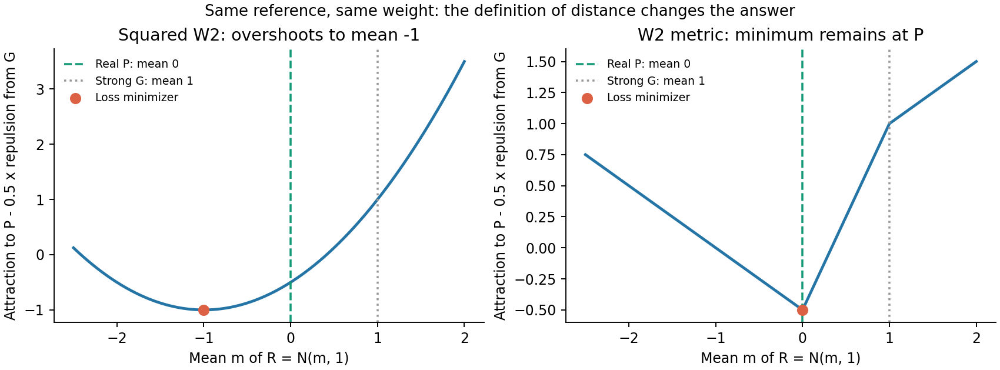

**利用真实、强、弱、外推四种分布之间的差距设计目标：推导与研究判断**

日期：2026-09-15。本文针对用户提出的“能否利用几种差距，最大化其中某些量或构造其他目标”。完成了文献核对、代数与梯度检查、反例及一个估计方差示例；没有修改正在运行的训练，也没有把数学示例当作 SiT/JiT/RAEv2 质量结果。

结论：可以设计，但必须区分距离、平方距离、密度比与判别分数。最值得优先研究的是**固定强模型作参照，匹配真实所需修正与外推实际修正**。它能产生目标明确的密度比方案，也能产生保留原分布匹配目标的差分估计方案。直接最大化强／外推或强／弱的分离，缺少指向真实分布的依据。

记 P 为真实目标，G 为冻结强模型单独采样的分布，Q_phi 为弱模型单独采样的分布，R_phi 为实际强弱外推采样的分布。下文省略类别 c，所有比较应保持类别先验、预处理和采样口径一致。此处的 G 是整条强模型轨迹的终点，不是外推轨迹中强网络的一次局部预测。R 必须由真实部署的多步外推过程产生。

**一、哪些“差距目标”没有增加新的内容**

对于固定的分布距离 d，P/G 都固定，因此

\[
\max_\phi\{d(P,G)-d(P,R_\phi)\}
\equiv\min_\phi d(P,R_\phi).
\]

相对改善率 `[d(P,G)-d(P,R)]/d(P,G)` 在分母非零时也只是常数缩放。这是有意义的评价指标，却没有凭空给 W 增加方向信息。

若“差距”是同一个标量 critic f 的均值差，则更需小心：

\[
(\mathbb E_Pf-\mathbb E_Gf)
-(\mathbb E_Pf-\mathbb E_Rf)
=\mathbb E_Rf-\mathbb E_Gf.
\]

如果把这个表达式直接当作 critic 的全部训练目标，真实 P 已被消掉。若 f 是另行在 P/G 上训练的固定函数，P 的信息仍通过 f 间接保留，但仅最大化这个固定奖励仍可能发生集中到高分区域的问题。两种情况不能混同。

同理，当前四分类的 logit 差满足

\[
(l_P-l_G)-(l_R-l_G)=l_P-l_R,
\qquad
(l_P-l_Q)-(l_R-l_Q)=l_P-l_R.
\]

这在**任意四个 logit** 上成立，甚至不需要判别器训练到最优。用同一个四分类器构造若干这样的比值差，最后会严格回到原 P/R logit；加入同源 logit 的循环一致性损失也会恒为零。四个 logit 的六个成对差只有三个独立函数，这句话针对 logit 差，不是说六种一般分布距离也只有三个自由量。

**二、“更接近真实，同时更远离强模型”可以有两种完全不同的结果**

先看平方距离：

\[
L(R)=d^2(P,R)-\lambda d^2(G,R).
\]

用最简单的等方差高斯验证。P=N(0,1)，G=N(1,1)，R=N(m,1)，取 d=W_2，则

\[
L(m)=m^2-\lambda(m-1)^2,
\qquad m^*=-\frac{\lambda}{1-\lambda},\quad0<\lambda<1.
\]

当 lambda=.5，最优均值为 -1，而真实均值为 0。这个目标奖励模型越过真实位置继续远离 G。lambda>=1 时在此例中没有有限下界。平方 MMD、FID 这种平方 Wasserstein 型量，不能因为名字包含“距离”就套用三角不等式。

但如果 d 是满足三角不等式的真正 metric，考虑不平方的目标

\[
L_\lambda(R)=d(P,R)-\lambda d(G,R),\qquad0\le\lambda<1,
\]

则由 d(G,R)<=d(G,P)+d(P,R)，有

\[
L_\lambda(R)-L_\lambda(P)
\ge(1-\lambda)d(P,R)\ge0.
\]

因此，在全部可表示分布中，P 仍是唯一全局最优点。Wasserstein 距离和合适 characteristic kernel 的非平方 MMD 可以提供这种几何结构；任意交叉熵差、有限判别分数、平方距离都不自动满足该条件。[WGAN](https://arxiv.org/abs/1701.07875)、[Kernel Two-Sample Test](https://www.jmlr.org/papers/v13/gretton12a.html)

还存在一个对我们当前小头尤其重要的限制：**真实 P 未必在弱头能达到的分布族中。** 即使 d 是 metric，加排斥项也可能改变有限模型中的最优候选。例如只允许 R=N(.1,1) 或 R=N(-.2,1)，lambda=.5 时，前者更接近真实，但上述 loss 分别为 -.35 和 -.40，会选择较差的后者。

所以，这项证明只能支持它作为一个有条件的探索方向，不能证明它会改善 depth4 小头。lambda 越接近 1，对越过真实目标后的偏离约束越弱；lambda=1 在此高斯例中整条 m<=0 射线都最优。用 learned critic 近似 Wasserstein 时，还要分别把 P/R 与 G/R 的距离估计好，不能把负权重那项直接塞进同一个 joint-max 并假定它仍在估计原来的两个距离。

**三、更推荐的目标：匹配“真实对强”的密度比与“外推对强”的密度比**

设 p,g,r 为某个共同样本空间、共同基准测度下的密度，支持与可积条件使下式有限。强模型相对真实的不足，可用

\[
h_{PG}(x)=\log\frac{p(x)}{g(x)}
\]

描述。某处 p/g 高，说明真实数据在这里的相对占比高于强模型。它比一个整体 FID 数字多了“差距在哪里”的信息。另一个量

\[
h_{RG}(x)=\log\frac{r_\phi(x)}{g(x)}
\]

描述外推相对强模型究竟改变了哪里。理想目标是在恰当的分布权重下让两者匹配，而不是无限放大任何一项。

一个明确的目标是

\[
\boxed{J(R)=\mathbb E_{x\sim R}h_{PG}(x)-D_{KL}(R\|G).}
\]

其中第一项奖励走向强模型相对欠缺的区域，第二项约束无方向的分布偏移。二者恰好满足

\[
J(R)=\mathbb E_R\left[\log\frac p g-\log\frac r g\right]
=-D_{KL}(R\|P).
\]

这是代数恒等式，不是新的 KL 定理。它保留了到真实分布的 reverse KL 目标；在受限分布族中也没有另加一个“远离 G”的偏好。它的价值在于**怎样把未知分布差异分解成可训练、可能更稳定的估计问题**。

如果去掉 KL 项，单纯最大化 E_R log(p/g) 就不成立。离散例子 P=(.2,.3,.5)，G=(.6,.3,.1)，最优固定奖励策略会把全部质量放在第三个位置，因为那里 p/g=5；它不会还原 P 的三个占比。不能把“强模型相对最缺的地方”当成永远采样的唯一目标。

若给偏移项加 beta，需明确它和采样外推系数 a/w 无关：

\[
J_\beta(R)=\mathbb E_R\log(p/g)-\beta D_{KL}(R\|G),
\qquad
r_\beta^*\propto p^{1/\beta}g^{1-1/\beta}.
\]

beta=1 才保留真实 P；beta>1 的理想目标停在 P/G 的几何插值，beta<1 则发生密度层面的外推，而且归一化可能需要额外可积条件。不要把 beta 当作不改变目标的稳定参数随意扫描。

实现上可以采用两个判别任务：

1. 使用独立真实训练数据和已有强端点库，拟合 P/G 的二分类 logit h_PG；充分检查后固定它。
2. 随弱头变化，在线拟合当前 R/G 的二分类 logit h_RG。
3. 更新 W 时冻结两套判别参数，最小化 `mean(h_RG(x_R)-h_PG(x_R))`，梯度通过 x_R 的完整采样过程返回 W。

对于最优且空间导数正确的密度比估计器，冻结当前 h_RG 后的这一步仍给出正确 KL 生成器梯度。原因是变化分布 r 的那部分额外项为 `integral partial_phi r = 0`。CPU 离散 softmax 分布检查中，直接 KL 与冻结比值的生成器梯度最大误差为 8.33e-17。

这里用两个**独立拟合的比值估计器**才有不同的有限样本训练机制；若直接沿用原四分类的一组 logits，上述差分精确消去 G，只是在原 P/R logit 上换成线性 loss。当前弱头使用 `softplus(l_R-l_P)`；换成 `l_R-l_P` 会改变梯度权重，不能称为完全相同的训练。

如果两任务共享可训练隐藏层，仅冻结 P/G 的输出层仍不能固定 h_PG；可以共享固定视觉 encoder，使用分别管理的判别头。实际 classifier 并非精确密度比估计器，所以“KL 恒等式”不等于保证有限模型训练有效。支持不重叠、判别器过拟合、梯度误差和固定视觉特征的盲区都需要实际检验。它首先匹配的是判别器能够观察的空间，不自动等于像素空间。

该方向与固定 reference 的判别式后训练已有直接联系。[DDO](https://arxiv.org/abs/2503.01103) 用可学习生成模型与固定 reference 的似然比隐式构造判别器。本方案则通过显式二分类器估计实际外推终点的比值，不能将 diffusion 局部去噪误差直接冒充 R 的精确终点 log-likelihood。密度比跨中间分布拆解也有 [TRE](https://arxiv.org/abs/2006.12204) 的先例；“多了参考分布”本身不是新颖性证明。

**四、另一个值得优先试的方向：匹配纠错量，并利用强模型降低估计波动**

令 psi 是固定特征或 RKHS 特征映射，mu_X=E_X psi(x)。定义

\[
A=\mu_P-\mu_G\quad\text{真实需要的修正},\qquad
B_\phi=\mu_{R_\phi}-\mu_G\quad\text{外推实际的修正}.
\]

合理目标是让 B 接近 A：

\[
L=\|B_\phi-A\|^2=\|\mu_{R_\phi}-\mu_P\|^2.
\]

它也可写成最大化

\[
\boxed{\mathcal I(R)=2\langle A,B\rangle-\|B\|^2
=\|\mu_P-\mu_G\|^2-\|\mu_P-\mu_R\|^2.}
\]

第一项奖励正确方向，第二项防止过量修正。只最大化内积会无限沿 A 增大 B；只最大化方向余弦既无法确定修正幅度，也无法排除过冲。在 characteristic kernel 下，上式是 MMD 的分布几何；仅用 Inception 均值则只匹配一阶特征统计，不能声称匹配完整分布。[MMD GAN](https://arxiv.org/abs/1705.08584)

这个恒等式没有创造新的总体 MMD 目标。真正可研究的变化在**估计器**：用同一 epsilon、同一类别分别跑强模型和实际外推，构造

\[
d_i=\psi(R_\phi(\epsilon_i,c_i))-\psi(G(\epsilon_i,c_i)).
\]

强分支停止梯度，E d_i=B_phi。真实／强参考库可提前估计 A，新的小批量主要估计“这次到底改了什么”。当两条路径的特征有足够正相关时，差分可能比从头估计 R 的统计更稳定；一般并没有必然降低方差的保证。

不能直接把小批量平均差平方后当作无偏总体目标。对于独立样本对 d_i，在 A 固定、参考库与当前批次独立的条件下，可用

\[
\widehat L=\|A\|^2-\frac2n\sum_i\langle A,d_i\rangle
+\frac1{n(n-1)}\sum_{i\ne j}\langle d_i,d_j\rangle.
\]

它对 `||A-E d||²` 无偏；末项是 U-statistic，不能替换成包含对角线的均值平方后仍声称目标不变。若 A 来自有限参考库，估计器相对该经验 A 无偏，不是对未知总体 A 自动精确。若 kernel/特征在对抗学习，必须在同一版本下计算 A 与 d，旧缓存不能跨 encoder 更新继续充当当前参考。

本次用 P=N(0,1)、G=N(1,1)、R=N(.8,1)、psi(x)=(x,x²)，batch24，20000 次 CPU 重复检查：直接估计的梯度标准差约 2.267，同噪声强参考差分约 .278，方差比约 .015。这个构造只说明**存在明显降低方差的情形**；不证明 Inception/RBF/真实图片上也降低，更不证明 FID 提升。平方小批量均值的梯度偏差也被显式检验。

本路线仍需要强样本与 R 的噪声配对。不能从任意强端点库抽一张同类别图片，就称它是同噪声控制变量。可离线保存带噪声身份的强库，再按对应噪声生成当前 R，但有限库、噪声复用和训练／评价隔离应在实验口径中说明。

现有 [强端点库生成代码](/home/zhoushunyu/eqvae/experiments/guidance_dynamic_50k_20260915/endpoints.py:39) 使用由模型、来源、split、batch start 确定的 NumPy SeedSequence，并保存整批 initial_noise_sha256。因此可以先复原并核验噪声，再用相应 R 做配对，而不必每次训练重新跑强模型的完整轨迹。本轮只核对了生成规则，没有把这项新估计器接入训练；历史模型/数值设置的来源仍需沿库记录核对。

当前 batch24 覆盖 100 类，若采用类别完全隔离的 conditional MMD，一个批次内同类配对会很少。需要设计类别子批次或足够的参考统计；不能将无条件特征对齐的证明直接当成条件分布已经匹配。这个调整应与目标消融分开记录。

**五、Q 应当怎样加入，才不改变“让它自己寻找适合的弱分布”**

Q 与 W 的角色不必被强制写成另一个要最小化的距离。当前 W 的更新来自实际 R；Q 是同一 W 单独运行的结果。最大化 d(G,Q) 可让 Q 变成任意坏分布，并不保证外推 R 好；最小化 d(P,Q) 则重新加入“弱模型自己也要拟合真实”的约束，可能与实际外推最优方向冲突。

Q 有三个较合理的用途：作为判别表示的辅助负例、作为诊断独立弱行为的输出、在有证据支持时作为密度比估计的中间参照。最后一种同样有

\[
\mathbb E_R\log(p/q)-D_{KL}(R\|Q)=-D_{KL}(R\|P).
\]

理想目标没有新内容；只有独立估计各比值、且中间分布有助于估计时，才可能产生工程收益。任意 Q 不一定是好的桥梁。若使用同一个四分类器的 logits，Q 会像 G 一样严格消去，连这项独立估计器的差别都没有。

另外，不能一般地规定 `mu_R-mu_G = -a(mu_Q-mu_G)`。强弱线性组合发生在沿途的速度场上，最终分布由非线性多步动力学产生；当前引导还有只在前半程启用的时间窗，而 Q 独立运行整个过程。即便某个小扰动线性化中出现近似反向关系，也不能直接推广成完整端点定律。

若想让四源都提供辅助监督，可继续保留 P/G、P/Q 的辅助分类任务，但 W 的主目标应明确对应 P/R 或上述等价的密度比目标。辅助 Q 的计算失败也不应悄悄成为 R 主目标的成功判据。是否值得额外采 Q，必须用同预算消融回答。

**六、与文献的对应以及实验优先级**

| 相关研究 | 能借鉴什么 | 不能直接推出什么 |
|---|---|---|
| [Relativistic GAN](https://arxiv.org/abs/1807.00734) | 比较真实与生成的相对判别分数已有成熟形式 | 任意 P/G/Q/R 排名都对应正确分布距离 |
| [WGAN](https://arxiv.org/abs/1701.07875) | 在距离空间讨论吸引、排斥与几何关系 | 当前四分类 CE 已经是 Wasserstein 距离 |
| [MMD GAN](https://arxiv.org/abs/1705.08584)、[Demystifying MMD GANs](https://arxiv.org/abs/1801.01401) | 用 kernel 分布差异、分析估计器和学习梯度 | 固定低维特征匹配自动保证所有图像细节 |
| [Repulsive MMD-GAN](https://arxiv.org/abs/1812.09916) | 判别器的吸引／排斥项安排会影响表示学习 | 该论文证明应该把 R 无限推离冻结 G；其排斥设计主要针对 D 对真实样本表示的处理 |
| [DDO](https://arxiv.org/abs/2503.01103) | 固定生成 reference 与密度比用于后训练已有直接先例 | 当前自由弱头的局部 denoising loss 就是实际 R 的 log-density |
| [TRE](https://arxiv.org/abs/2006.12204) | 中间参照可以缓解困难的密度比估计 | 任意弱分布都适合作中间桥梁 |
| [AdaGAN](https://arxiv.org/abs/1701.02386) | 根据已有模型的覆盖不足训练补充成分 | 概率混合的残差分布定理可直接用于速度场相减外推 |

最优先的实际比较是：保持强模型、50K 弱头初始化、外推系数与时间窗、训练噪声和评价协议一致，比较直接 P/R 判别、独立拟合的 P/G+R/G 密度比、以及固定特征下同噪声差分估计。第一项是目标清楚的基线；第二项检验固定误差参照是否改善训练；第三项检验有限 batch 下的梯度估计是否更稳定。先不要同时更换网络、训练预算、时间窗和特征 encoder。

非平方 metric 的吸引／排斥可以作为后续探索，但有限可达分布反例使它不适合作为首先取代主目标的方案。对 Q 增加距离目标的优先级更低，因为那会额外规定独立弱行为，而用户当前的出发点是让其服务于实际 R。

可以把研究假设收敛为：**固定强模型提供稳定的错误参照与配对样本，能否提高端点反馈对小弱头的训练效率，而非只让训练判别分数更高。**这比罗列六个距离再加权更容易证明、否证和实现。上述恒等式、三角不等式推导都不作为新定理声称；潜在贡献在共享弱头结构上的估计与优化效果，需要真实模型结果支持。

数学检查代码：[validate.py](/home/zhoushunyu/eqvae/experiments/distribution_gap_objectives_20260915/validate.py)。原始数值：[validation.json](data/distribution_gap_objectives_20260915/validation.json)。图像：[PNG](data/distribution_gap_objectives_20260915/metric_vs_squared.png)、[PDF](data/distribution_gap_objectives_20260915/metric_vs_squared.pdf)。复现命令：`python -m experiments.distribution_gap_objectives_20260915.validate`。本轮全部为 CPU 数学检查，没有新增图像训练或质量扫描。
