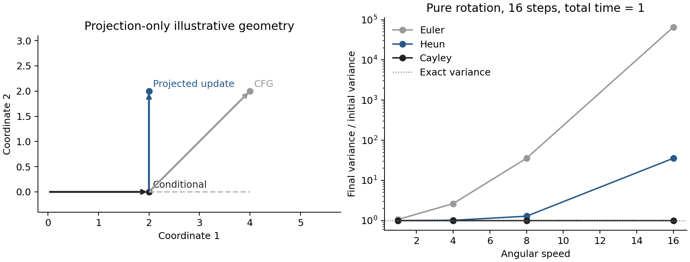

# FSG 输出、条件差旋度与 APG

这份分析最有价值的推进，是把“条件是否已经写入 latent”变成可观察的未来结果，并把未知模型误差缩小为可以检查的结构性质。继续推导后，有三处需要进一步区分：撤条件后的终点差与原 FSG 残差的关系；条件差的非保守性与分布误差的关系；APG 的几何投影与理想后验梯度的关系。这些区分可以产生更具体的实验假设，而不必提前放弃仍在筛选的方向。

最值得深入的三个问题是：**条件分支各自无害的旋转，在 CFG 外推后是否变得不相容；旋度何时主要造成有限步积分误差；APG 应当根据什么未来影响保留或删除一个方向。** 条件撤除与自适应前瞻可以作为这一框架中的决策变量。下面明确区分已有论文结论、直接数学推导与尚待图像实验检验的假设。

**符号与讨论范围。** 采用当前 SiT 的时间方向：$t=0$ 是噪声，$T=1$ 是终点。$x$ 表示当前 noisy latent，$v_c,v_u$ 分别是条件场和 null 场，$g=v_c-v_u$。标准 CFG 写为

$$
v_w=v_u+w g=v_c+(w-1)g.
$$

因此，$w=0$ 是 null，$w=1$ 是条件模型；当前实验配置中的增量强度是 $a=w-1$。$C_t,U_t$ 表示从当前时刻到同一终点的条件和 null 流映射。涉及半群恒等式的推导先假设确定、光滑、存在唯一解的精确 ODE；实际有限步续生成需要另外检查数值误差。

**APG 的操作。** APG 是 Adaptive Projected Guidance，来自 Sadat、Hilliges 与 Weber 的 ICLR 2025 论文。它在 denoised prediction 空间修改 CFG：先用负动量处理条件差，再限制范数，最后相对条件 denoised prediction 投影，减弱平行分量。作者通常使用 $\eta=0$；这是一项经验选择。附录 Algorithm 1 明确给出了顺序，且要求将不同模型输出转换到 denoised prediction 后操作。[^1]

记条件、无条件的干净样本预测为 $D_c,D_u$，则

$$
\Delta_k=D_{c,k}-D_{u,k},\qquad
m_k=\Delta_k+\beta m_{k-1},\quad m_{-1}=0,
$$

$$
\bar m_k=m_k\min\!\left(1,\frac{r}{\|m_k\|}\right),\qquad
m_{\parallel}=\frac{\langle\bar m_k,D_c\rangle}{\|D_c\|^2}D_c,
\qquad m_{\perp}=\bar m_k-m_{\parallel},
$$

$$
D_{\rm APG}=D_c+(w-1)(m_{\perp}+\eta m_{\parallel}).
$$

零范数处使用数值保护。下面的几何解释和数值例子是对这些更新的直接分析，不是将分量命名为真实语义标签。

**先理解 CFG 的外推。** 条件分支已经给出一个较符合条件的预测，CFG 再沿“条件预测减无条件预测”的方向继续走。它同时放大这条差向量中所有成分。如果某个成分主要使已有颜色、强度或特征响应进一步增大，放大它不必然增加新的条件信息。

把 $D_c$ 看作从原点指向当前干净预测的一根箭头。与这根箭头平行的修改改变其长度；垂直修改在一阶上改变方向。APG 的投影提供一种很便宜的区分方式：减少直接沿既有预测继续增大的分量，把更多更新预算留给改变方向的分量。这里的“长度”和“方向”是 denoised latent 空间的几何量；它们与图像的饱和度、语义之间存在经验联系，但不是同义词。

例如，忽略动量与裁剪，设

$$
D_c=(2,0),\qquad \Delta=(1,1),\qquad w-1=2.
$$

CFG 给出 $(4,2)$；删除平行分量后给出 $(2,2)$。前者同时增强第一坐标并改变第二坐标，后者保留了第二种修改。若第一坐标是已经过强的视觉响应，这种选择可能有利；若第一坐标恰好承载必要的条件信息，它也可能有代价。因此不能将平行分量直接定义为“错误”，也不能将垂直分量直接定义为“纯语义”。

左图仅展示投影几何，未加入动量、裁剪或真实模型。右图是可精确求解的二维旋转系统，稍后给出推导。图表数据可检查：[几何坐标 CSV](data/apg_release_curl_20260911/projection_geometry.csv)、[旋转方差 CSV](data/apg_release_curl_20260911/rotation_variance.csv)，另提供[矢量图](figures/apg_release_curl_20260911/projection_and_rotation.svg)。

**投影保证的是一阶径向中性。** 若 $u\perp D_c$，那么

$$
\left.\frac{d}{d\epsilon}\frac12\|D_c+\epsilon u\|^2\right|_{\epsilon=0}=0.
$$

但有限更新仍满足

$$
\|D_c+a u\|^2=\|D_c\|^2+a^2\|u\|^2.
$$

因此 APG 的正交投影不等于精确保范数，也不等于投影回真实图像流形。若 $\langle\Delta,D_c\rangle<0$，原来的平行分量还可能在降低幅度；删除它同样未必有利。这些是由公式直接得到的适用边界。

**负动量更像抑制持续重复的方向。** 当 $\beta=-0.5$，且每一步差向量都是同一个 $\Delta$，缓冲区依次为

$$
\Delta,\quad0.5\Delta,\quad0.75\Delta,\quad0.625\Delta,\ldots,
\qquad m_\infty=\frac23\Delta.
$$

持续一致的更新被减弱，符合“避免不断重复放大同一个特征”的直觉。不过这不是通用去噪滤波器：若输入正负交替，稳态振幅会变成 $1/(1+\beta)=2$ 倍。负动量可能放大快速交替的方向，裁剪则限制实际使用的更新。线性缓冲递推的稳定条件为 $|\beta|<1$，不能仅凭“负”就认为稳定。[数值序列](data/apg_release_curl_20260911/momentum_response.csv)验证了这两种相反的响应。

**当前 SiT 基线的具体含义。** 本地 [operators.py](../experiments/sit_guidance_portfolio_20260910/operators.py) 使用

$$
D_c=x+(1-t)v_c,\qquad
u=P_{D_c}^{\perp}\operatorname{clip}\big(g+\beta m_{\rm prev},\;2\|g\|\big),
\qquad v=v_c+a u.
$$

这是 APG 在当前速度模型上的适配版本。投影锚点是干净预测 $D_c$，并非速度 $v_c$；仅在速度空间直接对 $v_c$ 投影，会得到不同的方法。当前版本还使用相对范数阈值和速度空间的跨步缓冲，两个 Heun 阶段固定历史，整步结束后提交左端查询的缓冲。

单个时刻的正比例转换与投影可以交换，但跨时刻动量不能直接交换。令 $b_k=1-t_k$，论文形式的 clean 缓冲满足

$$
m_k^D=b_k g_k+\beta m_{k-1}^D.
$$

若写成等价速度缓冲，必须是

$$
m_k^v=g_k+\beta\frac{b_{k-1}}{b_k}m_{k-1}^v.
$$

当前固定 $\beta$ 的速度缓冲不等于这个表达式；相对阈值也不同于固定 clean 范数阈值。因此当前结果应标记为“APG 适配版”。这是基线解释与未来复现需要明确的事项，已冻结的筛选不应在中途替换实现。

**对所给分析的第一处推进：撤条件残差的精确身份。** 所给文本定义

$$
z_s=\Phi_c(t,s)x,\qquad
E_{\rm release}(t,s)=d\big(U_s(z_s),C_t(x)\big).
$$

由于精确条件流满足 $C_t(x)=C_s(z_s)$，所以

$$
\boxed{E_{\rm release}(t,s)=d\big(U_s(z_s),C_s(z_s)\big).}
$$

它是沿条件轨迹访问新状态后计算的 FSG 型终点差。操作上多了条件前缀及可选的切换时间；固定状态上的输出本身并未产生新的零集合。$s\to T$ 时两条后缀仍都会缩短为恒等映射，终点差仍可自动归零。这里能研究的是**何时切换、依据什么终点语义切换**，而不是仅凭更改比较流程就获得了非退化的成功证书。

若 $C_t$ 与 $C_s$ 各自使用重新划分的八步网格，上述半群关系只近似成立。数值差异可能来自后缀网格变化；实际比较应复用一致的后缀离散化，或单独计量这种差异。

FSG 将短区间与长区间固定点迭代联系起来，论文实际同时安排前瞻区间和迭代次数，早、中、晚阶段约按 $3:2:1$ 分配。[^2] 恒等式 $\partial_h(\Phi_c(t,t+h)x-\Phi_u(t,t+h)x)|_{h=0}=g$ 的确成立，无需轨迹是直线。不过这只能说明残差的一阶关系；不能跳过输入、求解步骤和离散化，直接断言两个完整算法互为极限。

**真正有用的新量是继续保留条件的边际收益。** 定义

$$
F(s)=U_s(z_s).
$$

null 终点映射满足输运方程 $\partial_sU_s+J_Uv_u=0$，因此沿条件前缀有

$$
\boxed{F'(s)=J_U(s,z_s)(v_c-v_u)(s,z_s).}
$$

若前缀使用 $v_u+w(s)g$，右侧相应乘 $w(s)$。再选择固定终点语义读出 $q=\Psi_c$，得到

$$
\frac{d}{ds}q(F(s))=Dq(F(s))J_U(s,z_s)g(s,z_s).
$$

这个量有直接含义：再使用一小段条件，会把“撤条件后的最终结果”改善还是恶化。它同时考虑当前条件方向与未来动力学，不会仅因两条后缀都变短而被强制解释为成功。

所给文本关于 $q(U_t(x))$ 的被动守恒性质是正确的。它保留了对最终结果的直接指向，但读出本身仍可能不准确。对 SDE，合适的对象是 $V(t,x)=\mathbb E[q(X_T)\mid X_t=x]$；被动过程中它一般是鞅，而非逐路径常数：

$$
dV=\nabla V^{\mathsf T}B u\,dt+\nabla V^{\mathsf T}\sigma\,dW_t.
$$

不能把确定性终点映射的守恒式直接用于一条重新抽噪声的随机未来。DEFT 的广义 $h$-transform 为条件采样提供了相关框架，但有限分类器分数并不自动成为精确的 $h$ 函数。[^3]

**对所给分析的第二处推进：旋度确实识别结构不一致，但不是误差大小。** 在标准 Gaussian 插值 $x_t=\alpha_t x_1+\sigma_t\epsilon$ 中，使用条件期望定义的规范速度场满足

$$
v^*(x,t)=\frac{\dot\alpha_t}{\alpha_t}x+
\left(\frac{\dot\alpha_t}{\alpha_t}\sigma_t^2-\dot\sigma_t\sigma_t\right)\nabla_x\log p_t(x).
$$

条件分支相减后，$g^*=\kappa_t\nabla_x\log p_t(c\mid x)$。对当前线性噪声到数据路径，$\kappa_t=(1-t)/t$，式子在 $0<t<1$ 上使用。因此，在相同空间坐标与欧氏度量下，$\operatorname{skew}(J_{g^*})=0$。若 $g_\theta=g^*+d$，则

$$
\operatorname{skew}(J_{g_\theta})=\operatorname{skew}(J_d).
$$

这识别的是误差**导数**的一部分。它没有识别完整误差向量 $d$，也没有给出一个可直接相减的 $g_{\rm rotational}(x)$。将向量场分解为梯度分量与其余分量通常需要指定区域、边界条件与密度加权；一个点上的反对称矩阵不能替代这种全局分解。尤其不能直接令 $g_{\rm rotational}=\operatorname{skew}(J_g)x$。

两个简单反例限定了这个指标的含义：$d(x)=M e_1$ 可以任意大而旋度为零；$d_\epsilon(x,y)=(\epsilon\sin(y/\epsilon^2),0)$ 的幅值处处不超过 $\epsilon$，但原点旋度的大小是 $1/\epsilon$。因此“小旋度意味着准确”和“大旋度意味着大幅度误差”都不成立。

这也不是 2025 年才出现的理论问题。原始 CFG 论文已经讨论神经网络给出的场一般不保守；ICML 2023 的 QCSBM 将 Jacobian 的反对称性作为训练正则并用随机迹估计降低成本；ICLR 2024 的 gauge freedom 工作给出了保持密度演化的条件。[^4][^5][^6] 2025 年 Wasserstein Gradient Flow Matching 论文进一步报告闭合路径积分和子 Jacobian 的非保守证据，但其重新解释属于理论视角与经验论证，不能替代已具条件的密度保持定理。[^7]

**APG 本身可以创造非零旋度。** 一个直接反例是二维 $g(x,y)=(1,0)=\nabla x$，并取 clean 锚点 $D_c(x,y)=(x,y)$。忽略动量、裁剪，在 $x^2+y^2>0$ 上投影得到

$$
u=P_{D_c}^{\perp}g=
\left(\frac{y^2}{x^2+y^2},-\frac{xy}{x^2+y^2}\right),
\qquad
\partial_xu_2-\partial_yu_1=-\frac{y}{x^2+y^2}.
$$

原始条件差没有旋度，投影后通常有旋度；同时 $D_c^{\mathsf T}u=0$，它完成了一阶径向约束。这是一种球面切向梯度的几何结构，欧氏空间中的非保守性本身不妨碍它服务于这个目标。

该例不声称所有 APG 更新都满足某个全局最优控制问题。它表明诊断时必须分别记录**原始 learned gap**与**经过投影、状态增益、历史处理后的实际 guidance**。后者的旋度可能由控制律主动引入，不能一律算成网络近似误差。类似地，状态相关标量增益也会引入

$$
J_{w(x)g}=wJ_g+g\nabla w^{\mathsf T},
$$

即使原始 $g$ 是梯度场，额外一项也未必对称。

**新的理论线索：分支内无害的旋转，未必与 CFG 外推相容。** 对给定正密度 $p$，加入向量场 $r$ 而不改变密度演化的条件是

$$
\nabla\!\cdot(p r)=0.
$$

这是密度加权的散度条件，并非零旋度条件。[^6] 因此“非保守不一定有害”是正确的，但不能由此直接排除 CFG 放大后的损害：null 分支和条件分支对应不同密度，对其中一个密度无害的方向，对另一个未必无害。

以下是从该条件直接得到的推导。固定时刻，令 $s_u=\nabla\log p_u$、$s_c=\nabla\log p_c$，两分支附加项分别满足

$$
\nabla\cdot(p_u r_u)=0,\qquad \nabla\cdot(p_c r_c)=0.
$$

在可归一化时定义瞬时倾斜密度 $\pi_w\propto p_u^{1-w}p_c^w$，以及 CFG 混合后的附加项 $r_w=(1-w)r_u+w r_c$。由乘积求导直接有

$$
\begin{aligned}
\frac{\nabla\cdot(\pi_w r_w)}{\pi_w}
&=\nabla\cdot r_w+r_w^{\mathsf T}\big((1-w)s_u+w s_c\big)\\
&=\boxed{w(1-w)(r_u-r_c)^{\mathsf T}(s_c-s_u).}
\end{aligned}
$$

两条分支各自满足密度保持条件，混合后的场仍可能产生非零的密度变化项。决定它的还有附加项与**条件后验方向**之间的耦合；旋度范数一个标量无法表达这种关系。

这里 $\pi_w$ 是用于检查瞬时结构的指定密度。一般非平稳扩散中，不能未经证明就把整条 CFG 轨迹的实际边缘分布写成 $p_u^{1-w}p_c^w$。上式没有作出这种断言，也没有把未知的 $r_u,r_c$ 变成可直接观察的量。

**一个完全可解的反例。** 考虑扩散系数为 $\sqrt2 I$ 的二维 Langevin SDE。从合法联合分布 $C\sim\mathcal N(0,I/2)$、$X\mid C=c\sim\mathcal N(c,I/2)$ 出发，在 $c=m$ 时有

$$
p_u=\mathcal N(0,I),\qquad p_c=\mathcal N(m,I/2),\qquad
m=(1,0),\qquad A=\begin{pmatrix}0&-1\\1&0\end{pmatrix}.
$$

两分支漂移为

$$
f_u(x)=-x,\qquad f_c(x)=2(m-x)+A(x-m).
$$

条件分支中的 $A(x-m)$ 围绕条件均值旋转，满足 $\nabla\cdot(p_c A(x-m))=0$，所以两分支各自具有正确的目标平稳分布。注意这说的是采样分布正确，不是说它们都等于规范 score。

对它们做 CFG 混合，得到

$$
f_w(x)=-(1+w)x+2w m+wA(x-m).
$$

记 $k=1+w$。其平稳协方差精确为 $I/k$，但平稳均值变成

$$
\mu_w=(kI-wA)^{-1}w(2I-A)m.
$$

若去掉旋转项，规范 Langevin CFG 的平稳均值是 $2wm/k$。当 $w=2$ 时，两者分别为

$$
\mu_w=(16/13,2/13)\approx(1.231,0.154),\qquad
\mu_w^*=(4/3,0)\approx(1.333,0).
$$

这是连续时间的分布差异，与采样器步长无关。它说明“分支分别正确”不足以保证它们的外推组合正确。另一方面，若两分支围绕相同均值旋转，则可保留很大的反对称 Jacobian 而没有上述均值偏差；条件几何是关键变量。[12 个精确配置的数据](data/apg_release_curl_20260911/gauge_mixing_stationary.csv)保留了这个例子的完整结果。

离散类别也可构造同样现象：取 $p_u=\frac12\mathcal N(m,I)+\frac12\mathcal N(-m,I)$，目标类 $p_c=\mathcal N(m,I)$，$r_u=0$、$r_c=A(x-m)$。在 $m=(1,0),x=(0,1),w=2$ 处，上述加权散度除以密度恰为 $-2$，因此混合的附加项不能保持指定倾斜密度。该例满足无条件分布是类别混合的要求。

这个推导给原分析一个更强、也更窄的研究问题：**可观察的局部旋转响应，是否会在条件差较大、分支分布几何差异较大时，更容易干扰条件引导？** 它没有证明神经网络误差就是这些 gauge 项，也没有证明删除旋度一定正确。可将其作为机制假设，比较条件差、旋转响应、未来语义变化之间的相互作用，而不只画“旋度与坏图”的单变量相关图。

**第二种独立机制：旋转本身无害，离散积分却有害。** 取最简单的 ODE

$$
\dot x=\omega A x,\qquad A^{\mathsf T}=-A,\quad A^2=-I.
$$

精确流 $e^{\omega tA}$ 是正交变换，保持每个样本的范数，也保持各向同性高斯分布。令 $z=h\omega$，Euler 与 Heun 的单步矩阵为

$$
R_E=I+zA,\qquad R_H=(1-z^2/2)I+zA.
$$

直接相乘可得

$$
R_E^{\mathsf T}R_E=(1+z^2)I,\qquad
R_H^{\mathsf T}R_H=(1+z^4/4)I.
$$

因此有限步积分产生向外的人工膨胀，而真实连续系统没有这种膨胀。以总时长 1、16 步、$\omega=16$ 为例，最终协方差倍数分别为 $65536$ 和约 $35.53$；精确值是 1。这些是刻意选取的可解系统数值，不是图像模型的测量值。

同一线性系统的隐式中点/Cayley 更新

$$
R_C=(I-zA/2)^{-1}(I+zA/2)
$$

精确正交。这个对比证明了一种可能机制：高 guidance 放大局部旋转频率后，生成异常可能来自**场与采样器的组合**。它没有证明当前 SiT 的 FID 差异由该机制解释，也不能把一个局部测得的 $A$ 直接套到整个高维非线性场上。

还应区分旋转与局部伸长。令实际采样场 Jacobian 为 $J_F=S+A$，$S^{\mathsf T}=S$、$A^{\mathsf T}=-A$。线性化扰动满足

$$
\frac{d}{dt}\|\delta\|^2=2\delta^{\mathsf T}S\delta.
$$

反对称项没有直接的瞬时范数增长贡献；它能随时间把扰动转入伸长方向。非正规耦合、时间变化和求解器误差仍可能重要。因此应同时记录对称伸长、反对称旋转与步长，不能用旋度代替全部“稳定性”。

**由此产生的第一个新方案：让结构诊断选择积分精度。** 在少数固定状态上，估计实际采样场的局部结构，并比较一个粗步与同区间细步的差异。候选触发量应带实际步长，例如 $h\|\operatorname{skew}(J_F)\|$，同时考虑 $h\lambda_{\max}(S)$；其中 $F=v_u+w g$，不能只检查 $J_g$ 而忽略基础场。

若旋度主要预测粗细步差，而将后续积分细化后语义或外观异常明显缓解，应优先把计算花在局部细化上。若精细积分后偏差仍存在，则更接近前述场本身的组合误差。需要比较固定更多步数、普通局部误差触发的自适应步长，以及结构触发方案，并将所有探针成本计入。只有“同等总成本更好”才能支持新的调度价值。

这不同于现有第 30 项的“约束未来输出在粗细网格下一致”：这里改变的是主轨迹的积分决策。Cayley 和自适应积分本身是已有数学工具；潜在贡献是条件差结构能否提供额外、低成本、具有预测力的信息。如果进一步研究局部线性求解，正确的局部模型应为 $\dot\delta=F(x,t)+J_F\delta$，而非直接用 $J_Fx$ 代替原场。

**第二个新方案：根据未来影响校准 APG 的两个分量。** APG 使用 $D_c$ 作为当前幅度方向的代理。可以把它升级为一个可直接检验的问题：沿平行分量与正交分量各作小扰动，哪一种真正改善最终条件结果，哪一种主要引起不希望的幅度变化？这比预设一个固定 $\eta$ 更具有因果含义。

设 $F=U_t(x)$，用 $q(F)$ 表示目标语义读出，用 $\nu(F)$ 表示少量明确的终点外观量，例如通道二阶矩。记

$$
M=Dq(F)J_U,\qquad N=D\nu(F)J_U.
$$

最直接的局部控制问题是

$$
\min_u\frac12\|u-g\|^2,
\qquad Nu=0,\qquad Mu\ge b,\qquad \|u\|\le U_{\max}.
$$

$b$ 是固定的非负语义进展要求，可在基点 $Mg>0$ 时取 $b=\kappa Mg$。只保留 $Nu=0$ 时，解是

$$
u=\left[I-N^{\mathsf T}(NN^{\mathsf T})^\dagger N\right]g.
$$

它是在输入空间中，距离原始指导最近、且对选定终点量一阶不变的更新。若 $\nu(F)=\frac12\|F\|^2$，需要移除的法向是 $J_U^{\mathsf T}F$，而不是直接使用 $F$ 或当前 $D_c$。这说明“用 future 替换 APG 的锚点”仍少了一个通过未来动力学拉回输入空间的步骤。

实际可以只在 $g_{\parallel},g_{\perp}$ 张成的二维空间中识别 $M,N$，避免完整 Jacobian。两个方向分别作有限扰动，并使用相同的续生成网格、同一语义读出检验。控制要求冲突时可能没有可行解；应保留零动作或明确软化约束，不能声称任何状态都能同时保语义与幅度。最终还需以实际非线性终点读取验收，因为一阶约束不是有限步保证。

这是对既有第 40 项语义约束、第 41 项未来形变代价和第 42 项终点矩保持的整合与定向扩展。新的可检验部分是 **APG 的平行/垂直分解是否对应不同的未来因果作用，以及用这些作用校准投影是否有收益**，不能把 QP 或终点矩本身重新称为新贡献。同资产简单语义控制、固定 APG、带相同探针预算的 APG 都应作为对照。

**第三个新方案：用继续引导的边际价值选择撤除时机。** 从 $F'(s)=J_Ug$ 出发，可以将切换问题写成

$$
s^*=\arg\max_{s\in[t,T]}\left[q(F(s))-\lambda\,C(t,s)\right],
$$

其中 $C(t,s)$ 包含继续使用条件的增量成本；真正执行在线搜索时，还必须计入查询不同 $s$ 的成本。第 46 项已经测试固定语义门槛下的交接，新方案增加的是“再继续一段是否值得”的判断。

一个可实现版本只试少数固定候选切换时刻，以共同终点语义要求约束可接受候选，再选择成本较低或收益较高的一项。不能因为某一时刻的导数首次为负就宣称全局最佳停止：语义收益可能先降后升，当前无收益也不排除未来的组合收益。停止规则必须与其有限观察范围一致。

自适应前瞻可以放入同一个决策框架。不同物理 horizon $H$ 各提出一个候选 $\delta_H$，但全部用**同一个终点、同一个评价尺度**读取

$$
\Delta q_H=q\big(U_t(x+\delta_H)\big)-q\big(U_t(x)\big).
$$

然后比较实际收益与提出候选、验证候选、选择 horizon 的总成本。独立验证可使用更细的同终点网格；一次比较多个候选的全部查询都要计费。

原文的 $\|M_H^{\mathsf T}e_H\|/\operatorname{Cost}(H)$ 对单个已固定输出的最陡下降方向有意义，却不能未经校准横向比较不同输出。只需将某个 $e_H$ 改写为 $c_He_H$，其零集合不变，而分子被乘 $c_H^2$。此外，物理时距 $H$ 与求解器步数是两个变量：同样八步可以覆盖不同 $H$，代价相近但数值误差不同。前瞻选择需要同时控制输出尺度、时间范围和计算精度。

**相关工作的边界。** 下表说明为何这些方案需要落在具体的新机制上。已有终点评价与控制研究并不意味着所有输出设计都已完成，但“增加一个 reward”“动态调整 guidance”本身不足以区别已有工作。

|工作|经原文核对的核心内容|对本研究的具体约束|
|---|---|---|
|Dynamic CFG，ICLR 2026|训练轻量 latent evaluator，复用每步条件/null 预测，对候选 CFG 强度作贪心选择。[^8]|不能把在线评价后选择强度作为新贡献；它的 evaluator 训练与额外资产也应计入比较。|
|Learn to Guide，ICLR 2026|学习依赖条件与两个时间点的 guidance 权重，以分布/自一致性目标训练，并扩展 clean reward。[^9]|“终点 reward + 可学习 schedule”已有；其方法也不等于对每个样本反复跑完整未来。|
|Adaptive Diffusion Guidance via Stochastic Optimal Control，AISTATS 2026|理论允许状态、时间、条件相关控制；图像实验附录的主要参数化是每个训练时间步一个标量。[^10]|应区分理论策略类与实际实现。原分析末段的 AISTATS 说法应引用此文，而非 Dynamic CFG。|
|PCI，ICLR 2026|主要通过 base prompt 切换到概念增强 prompt，测最终概念插入成功；也讨论删除，后者有额外混淆。[^11]|不能声称首次发现概念锁定或首次改变条件时机；也不能将其插入成功率直接当作 null 撤除证书。|
|QCSBM 与 gauge freedom|前者研究训练时保守性正则；后者研究什么附加场可以保持密度演化。[^5][^6]|测非保守性已有基础；推断 guidance 可靠性还需要条件几何、实际轨迹与离散化证据。|

APG 的成功与上述文献共同提示：一个在欧氏空间中不保守的指导场，可以有明确的几何目标，也可能在生成上有效。这里的潜在研究贡献，是解释何种非保守性可以容忍、何种非保守性在条件外推中出现问题，以及如何用可承受的查询预算区分它们。当前检索不足以认证“首次”，本文将这些称为待验证假设与推导线索。

**旋度诊断应如何测量。** 在固定状态 $x,t,c$ 上，如果 $w$ 与空间无关，那么

$$
\frac{\|J_{wg}-J_{wg}^{\mathsf T}\|_F}{\|J_{wg}\|_F}
=\frac{\|J_g-J_g^{\mathsf T}\|_F}{\|J_g\|_F},\qquad w\ne0.
$$

所以只改变同一点的标量 guidance 强度，归一化旋度不会变化。若沿不同强度的轨迹测量，观察到的变化反映了访问状态的变化。实验应分开报告“同状态的场性质”与“不同策略访问的状态分布”，并同时保留绝对旋度、Jacobian 尺度和实际步长。分母近零的状态单独标记，避免靠比值制造异常。

对 $K$ 个各向同性随机向量 $z$，可以分别估计

$$
\mathbb E\|(J-J^{\mathsf T})z\|^2=\|J-J^{\mathsf T}\|_F^2,
\qquad \mathbb E\|Jz\|^2=\|J\|_F^2.
$$

这要求 JVP 与 VJP，具有实际计算和内存成本。两个估计的比值一般不是无偏比值估计；应记录样本数和探针方差。若不使用自动微分，还可对独立、协方差为 $I$ 的 $p,q$ 利用

$$
\mathbb E\big[p^{\mathsf T}Jq-q^{\mathsf T}Jp\big]^2
=\|J-J^{\mathsf T}\|_F^2.
$$

$Jp,Jq$ 可用中心差分近似，但需要额外场查询，并检查扰动尺度与有限精度。对于固定的两个输入方向 $Q$，$Q^{\mathsf T}(J-J^{\mathsf T})Q$ 只描述该二维子空间，不能冒称全局旋度。现有第 50 项属于这种局部投影约束。

一个有判别力的后续真实模型实验，应先固定一小套状态与种子，在相同状态上记录原始 gap、投影后指导和实际完整场，并作配对干预。比较对象包括保持 guidance 而细化积分、保持积分而修改投影、以及保持总计算预算的普通基线。若要研究“语义失败”，读出应来自共同终点，而不是早期 noisy latent 的未经校准分类值；控制使用的评价器与最终质量评价也需区分。相关性只用于定位假设，生成干预才检验机制。

**与当前 53 项筛选的关系。** 已有目录中，第 2 项检验固定滚动时距，第 30 项检验粗细未来输出，第 40–42 项检验语义约束与未来外观代价，第 46 项检验语义达标交接，第 50 项检验局部可积性，第 52–53 项检验真实语义验收与有限候选选择。[^12] 新推导没有替代这些实验结果。特别是旋度正则、终点矩保持和语义交接，均不能重新计算为完全独立的新方向。

当前最有区别的增量是：把旋度的**场组合误差**与**积分误差**拆开；把 APG 的分量选择与未来语义/外观的实测响应连接；把条件撤除从单一阈值扩展为带查询成本的继续价值判断。这些方向各有明确的反例与强对照，能够在没有 FID 改善时给出清楚的负结论。

**推导的复核材料。** [CPU 核验脚本](../experiments/audit_apg_release_curl_20260911.py)和[完整 JSON 结果](data/apg_release_curl_20260911/audit.json)提供以下可复现检查。这些检查验证公式与示例，不涉及神经模型生成，也不提供任何新的 FID 结论。

|检查|规模|结果|
|---|---:|---|
|非线性三角 ODE 的撤条件等价式、被动守恒及边际导数|64 个状态/时间组合|最大导数误差约 $2.94\times10^{-11}$|
|APG 投影旋度、有限更新范数、对称部分增长恒等式|128 组|旋度有限差分最大误差约 $1.26\times10^{-10}$|
|clean 与速度缓冲的带比例换算|32 步|换算误差约 $2.48\times10^{-16}$；固定速度动量与 clean 原式不等价|
|纯旋转的精确/Euler/Heun/Cayley 方差|64 个配置|全部符合解析表达式|
|双随机探针旋度公式|四维中穷尽 256 对 Rademacher 探针|期望与 Frobenius 范数平方一致|
|分支 gauge 混合的平稳均值与散度式|12 个配置，另加合法离散类别混合例|全部符合解析表达式；散度恒等式最大误差约 $2.14\times10^{-14}$|
|输出缩放、同状态 guidance 缩放|直接数值反例|输出放大十倍使候选下降指标放大百倍；同状态归一化旋度不变|

报告中的数值图表均由上述脚本生成。其他可检查的数据包括[动量参数化 CSV](data/apg_release_curl_20260911/momentum_parameterization.csv)、[动量响应 CSV](data/apg_release_curl_20260911/momentum_response.csv)、[gauge 混合 CSV](data/apg_release_curl_20260911/gauge_mixing_stationary.csv)。[来源清单](../readings/apg_release_curl_20260911/source_manifest.json)保留原文地址、下载副本与内容哈希。

**来源。**

[^1]: Seyedmorteza Sadat, Otmar Hilliges, Romann M. Weber. [Eliminating Oversaturation and Artifacts of High Guidance Scales in Diffusion Models](https://arxiv.org/html/2410.02416v2). ICLR 2025；所读 arXiv v2 为 2025-06-03。方法见 §4，预测形式见 Appendix B，具体实现见 Appendix D / Algorithm 1。[本地原文](../readings/apg_release_curl_20260911/apg.pdf)。
[^2]: Kaibo Wang, Jianda Mao, Tong Wu, Yang Xiang. [Towards a Golden Classifier-Free Guidance Path via Foresight Fixed Point Iterations](https://arxiv.org/html/2510.21512v1). arXiv:2510.21512，2025，方法与 practical design 段。[本地原文](../readings/fsg_followup_20260910/fsg_html.html)。
[^3]: Alexander Denker et al. [DEFT: Efficient Fine-Tuning of Diffusion Models by Learning the Generalised h-transform](https://proceedings.neurips.cc/paper_files/paper/2024/hash/22d258dfbdf840ccbf266bbc545dd95f-Abstract-Conference.html). NeurIPS 2024。[本地原文](../readings/apg_release_curl_20260911/deft.pdf)。
[^4]: Jonathan Ho, Tim Salimans. [Classifier-Free Diffusion Guidance](https://arxiv.org/abs/2207.12598). arXiv 2022；短版发表于 NeurIPS 2021 workshop，§3.2。[本地原文](../readings/apg_release_curl_20260911/cfg.pdf)。
[^5]: Chen-Hao Chao, Wei-Fang Sun, Bo-Wun Cheng, Chun-Yi Lee. [On Investigating the Conservative Property of Score-Based Generative Models](https://proceedings.mlr.press/v202/chao23a.html). ICML 2023，§4.1、Appendix A.4。[本地原文](../readings/apg_release_curl_20260911/conservative.pdf)。
[^6]: Christian Horvat, Jean-Pascal Pfister. [On gauge freedom, conservativity and intrinsic dimensionality estimation in diffusion models](https://proceedings.iclr.cc/paper_files/paper/2024/hash/d553f0e0abb80e2a60328d634583bd2e-Abstract-Conference.html). ICLR 2024，式 (11)、Theorem 1。[本地原文](../readings/apg_release_curl_20260911/gauge.pdf)。
[^7]: An B. Vuong, Michael T. McCann, Javier E. Santos, Yen Ting Lin. [Are We Really Learning the Score Function? Reinterpreting Diffusion Models Through Wasserstein Gradient Flow Matching](https://arxiv.org/abs/2509.00336). arXiv v1，2025-08-30，§2–3。[本地原文](../readings/apg_release_curl_20260911/wgfm.pdf)。
[^8]: Pinelopi Papalampidi et al. [Dynamic Classifier-Free Diffusion Guidance via Online Feedback](https://proceedings.iclr.cc/paper_files/paper/2026/hash/cef8b22f26953d8bdaf93bb64b7cc72f-Abstract-Conference.html). ICLR 2026，§3.2–3.3。[本地原文](../readings/apg_release_curl_20260911/dcfg.pdf)。
[^9]: Alexandre Galashov et al. [Learn to Guide Your Diffusion Model](https://proceedings.iclr.cc/paper_files/paper/2026/hash/d199e76b714c2611051e1b9e4bd882f1-Abstract-Conference.html). ICLR 2026，§3，式 (19)–(21) 与 reward 扩展。[本地原文](../readings/apg_release_curl_20260911/learn_guide.pdf)。
[^10]: Iskander Azangulov et al. [Adaptive Diffusion Guidance via Stochastic Optimal Control](https://proceedings.mlr.press/v300/azangulov26a.html). AISTATS 2026，§3–4 与图像实验参数化附录。[本地原文](../readings/apg_release_curl_20260911/soc.pdf)。
[^11]: Ada Görgün et al. [Temporal Concept Dynamics in Diffusion Models via Prompt-Conditioned Interventions](https://proceedings.iclr.cc/paper_files/paper/2026/hash/6d5f304fb4ed0243851e41699dca4287-Abstract-Conference.html). ICLR 2026，§3 与 Appendix A.4。[本地原文](../readings/apg_release_curl_20260911/pci.pdf)。
[^12]: [FSG 与控制输出的五十个实验假设](FSG_CONTROL_50_IDEAS_20260910_ZH.md)、[三条重点推导](FSG_CONTROL_THREE_PRIORITY_IDEAS_20260910_ZH.md)，本地研究目录，2026-09-10；[所给分析副本](../readings/apg_release_curl_20260911/provided_analysis.txt)，2026-09-11 提供。
