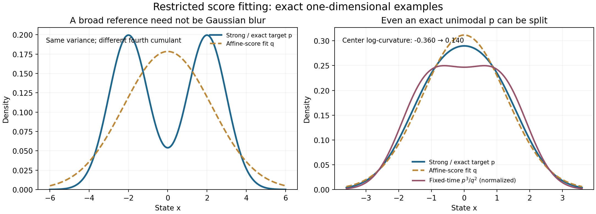
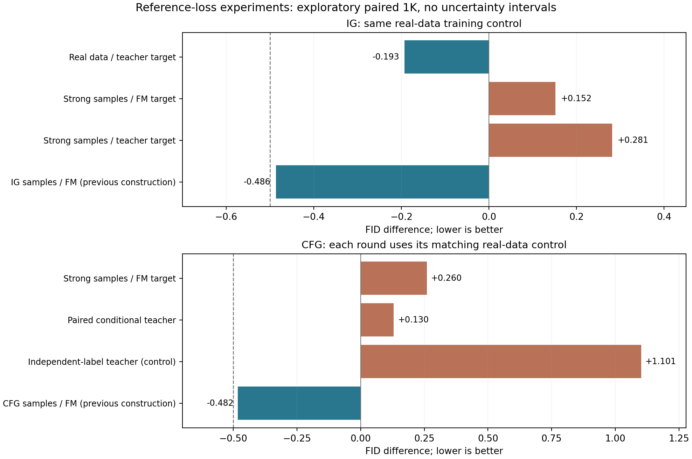

# weak 的 loss：从“更差的模型”转向可控的近似目标

2026-09-12。本文承接[前两轮同推理预算研究](GUIDANCE_SHARED_BUDGET_RESEARCH_20260912_ZH.md)，响应用户关于“冻结 strong，让 weak 学习 strong 分布，以及重新研究 weak loss”的建议。第三轮四个新读出与14组配对1K、第四轮纯CFG两个新读出与7组配对1K均已完成并通过全部详细审计。本文的解析例子不是新的图像生成效果证据。

目前最值得保留的判断是：**weak 的好坏不能由它自己的去噪误差单独决定。需要同时规定它学习哪个对象、在什么状态分布上学习，以及它能表达哪些函数。** strong 的预测函数、strong 采样的终点分布、当前 guided 过程的轨迹分布是三个不同对象。“让 weak 学 strong”只有明确其中哪一个以后，才成为可以验证的假设。

实验最终没有产生通过预设强对照门槛的新候选。IG在真实数据上拟合strong，相比同预算真实目标只降低0.1926 FID，仍落后此前IG自身样本参考；换成strong生成数据时，同一个teacher loss反而比FM高0.1294 FID。纯CFG配对teacher优于独立类别teacher，却未胜过真实目标或APG。以下推导因此作为有边界的解释与假设约束保留，不能称为已验证有效的新方法。

## 1. 用户关于类似误差的想法，能成立到哪里

记指导速度为 G=S+a(S-W)，a>0。若某项偏差 e 同时出现在 S 和 W 中，它在相减后消失，但仍在最前面的 S 中保留。因此，“共享偏差”直接带来的好处是**避免额外放大**，不是自动纠错。更不需要推断全部强弱误差近似共线。[AG](https://arxiv.org/html/2406.02507v1) 已强调退化的兼容性并提供人工匹配/不匹配退化实验；它不是任意强弱模型都满足的误差定律。

密度比梯度是两分支为合法score时的同噪声层解释。任意神经网络速度经score转换后，未必存在对应的可积密度，更未必组成一个自洽的加噪分布族。因此，密度比公式说明如何使用参考，却不能单独决定参考的训练loss。

下面是一个能产生明确预测的理想化。固定噪声时间与条件，真实平均速度为 u，S=u+e。将 weak 的读出函数族视为 L2 的闭线性子空间，P 表示最小平方逼近。真实 FM target Y 的条件均值是 u，故真实目标总体最优读出 W_N=Pu；拟合 frozen strong 的总体最优读出 W_D=PS。对相同 a，

\[
 P(G_N-u)=(1+a)Pe,\qquad P(G_D-u)=Pe.
\]

两者的正交补相同，因而

\[
 \boxed{R(G_N)-R(G_D)=a(a+2)\|Pe\|_{L^2}^{2}.}
\]

R 可取对 u 的平方风险；改为对 Y 的风险只增加同一个不可约噪声项。这个恒等式说明：teacher 训练使 weak 继承它能够表达的 strong 偏差，让这部分偏差的放大倍数从 1+a 回到1。它不要求 e_W 是 e_S 的全局倍数，也没有在推理时投影或调分量。

证明适用的是总体最优线性函数族。实际 AdaLN 与 linear 联合训练、跨时间和类别共享参数，不满足任意线性投影的全部条件；1500步也不是总体极限。该代数更没有证明真实生成分布的改善。仓库[旧 predictable-gap 实验](SMALL_SIT_PREDICTABLE_GAP_RESULTS_20260909_ZH.md)已经包含一种拟合 strong 的仿射残差读出，raw 没有改善，本轮完整 readout 的 teacher loss 是不同容量/优化方式的复测，不能认领为首次提出这种思路。

还有一个不能回避的极限：若 weak 的输入和容量足够使 W=S，则 G=S，guidance 完全消失。浅层整组特征经过确定的后续网络即可计算 strong，故不能把“网络较浅”直接说成 Shannon 信息缺失。这里限制的是廉价读出的计算函数族，而不是凭层数宣称丢失了信息。

## 2. 为什么学习 strong 的样本分布，不等于拟合 strong 预测

第三轮比较两种目标：

\[
 L_{\rm field}=\mathbb E\|W(H(Z,t,c))-\operatorname{sg}S(Z,t,c)\|^2;
\]
\[
 L_{\rm generated}=\mathbb E_{X\sim q_S,\epsilon,t}
 \|W(H(tX+(1-t)\epsilon,t,c))-(X-\epsilon)\|^2.
\]

q_S 是冻结 strong **不加 guidance** 时实际采样得到的终点分布。第二种 loss 在重新加噪 q_S 后训练；它并不是沿生成轨迹直接回归 S，也不是学习新 guided 过程的当前状态密度。

一个完整反例不需要非保守场。令一维 S(z,t)=kz，从标准正态出发走到 t=1，终点为 N(0,exp(2k))。这个终点重新线性加噪后的精确 FM 速度系数却为

\[
 u_{q_S}(z,t)/z=
 \frac{t e^{2k}-(1-t)}{t^2e^{2k}+(1-t)^2}.
\]

k=.3、t=.4 时，该系数约 .19776，而 S 的系数是 .3。只有 strong 已经是与指定加噪路径自洽的精确速度时，二者才一致。由此得到一个可失败预测：固定 weak 容量与优化，改变数据来源和 target 可能产生不同质量行为，即使都被口头称为“学习 strong”。

IG 用 real/strong-generated × FM/teacher 的2×2设计；real/FM复用前轮完全相同预算的最终权重。另保留 IG 自身 guided 样本训练的读出，以及固定半强度与 ADG。CFG 先单独检验 strong-generated 类混合数据。数据没有质量筛选，生成训练噪声与FID bank分离。具体控制见[第三轮冻结协议](SIT_STRONG_REFERENCE_PROTOCOL_20260912_ZH.md)。

[SIMS](https://arxiv.org/html/2408.16333v1) 已有生成数据训练负参考，[SSG](https://arxiv.org/html/2607.29122v1) 已有冻结主干并在自身合成数据上训练内部参考。后者主要采用额外 transformer adapter；我们的原尺寸 latent readout 并非完整复现。新样本来源比较用于约束解释，不能把“自己生成样本训 weak”重新包装成新方法。

## 3. “像平滑”可以来自 loss 和容量，而非额外高斯噪声

用户关于双峰被 weak 连成一片的直觉，有一个干净的数学实现：假定 teacher 是精确 score s_p，weak 只能表示仿射 score Az+b，在 X~p 上最小化

\[
 \mathbb E_p\|AX+b-s_p(X)\|^2.
\]

在足够衰减、协方差可逆的条件下，分部积分给出 E_p[s_p]=0、E_p[s_p(X)(X-m)^T]=-I，因此最优解是

\[
 W^*(X)=-\Sigma_p^{-1}(X-m_p).
\]

这正是与 p 匹配均值、协方差的高斯分布的 score。它把高阶结构压进同一个均值/协方差近似，能够把双峰变成一片，却**不等于 p 加一次高斯模糊**。例如 p=.5N(-m,1)+.5N(m,1) 的四阶累积量为 -2m^4；与任意高斯卷积都保留这一累积量，而拟合出来的高斯 q 的四阶累积量为0。

左图 m=2：原分布双峰，仿射 score 拟合得到连接双峰的高斯，二者总方差相同。右图说明锐化不自动正确：m=.8 时 p 本身为单峰，而固定噪声层的规范化 p^(1+a)/q^a 在 a=2 时产生两个峰。中心的 log-density 二阶导数从 -.36 变为 +.1395；分裂阈值 a>m^(-4)-1≈1.4414。这个人为制造的双峰不是恢复真实峰。

图中紫色曲线只是**固定噪声层的 score 势函数对应密度**，不是 guided ODE 的终点分布。这里不能由静态指数密度直接推出最终采样规律；[PCG](https://arxiv.org/html/2408.09000v2) 和原 AG 对这一边界已有讨论。

这个例子给出研究方向上的限制：平滑机制应由 loss 与可表达函数族推出，不能只根据图形更宽就命名为高斯平滑。但真实 IG readout 对 z 是复杂非线性映射，尚未证明它服从上述高斯近似。仓库此前也做过矩粗化等失败实验，因此本段是解析约束，不是再启动一批 Gaussian surrogate 扫描。计算、曲线和检查保存在[解析检查](data/guidance_reference_loss_20260912/score_projection_checks.json)与[绘图代码](../experiments/illustrate_guidance_reference_loss_20260912.py)。

## 4. 一个不依赖 IG 的纯 CFG loss

CFG 有一个精确的信息限制：null 参考不接收类别。对真实配对 (X,C)，用同一 Z=tX+(1-t)ε，让 null 读出回归 **conditional strong**：

\[
 \boxed{L_{\rm posterior}=\mathbb E\|U(H_\emptyset(Z,t))-\operatorname{sg}S(Z,t,C)\|^2.}
\]

给定 Z 时，真实配对类别自然来自 p(C|Z,t)。不向 U 输入类别，它就需要学习 conditional teacher 的后验平均。若 S=E[Y|Z,t,C] 精确，tower property 给出 E[S|Z,t]=E[Y|Z,t]，即正确 null 目标。此时对任何只依赖 Z,t 的 U，原 FM loss 与此 loss 只差与 U 无关的 E||Y-S||²；精确 teacher 去除了部分随机监督噪声。有限 strong 会把平均偏差传给 null，不能再称完全无偏。

一个有区分力的对照是：保持 Z、null输入、预算不变，只把 conditional teacher 的类别改为独立 C'~p(C)。这种 loss 的总体目标是类别先验平均。在精确 score 假设下，两种参考分别对应

\[
 q_{\rm posterior}(z)=\sum_c\pi_c p(z|c),\qquad
 q_{\rm independent}(z)\propto\prod_c p(z|c)^{\pi_c}.
\]

前者是类别混合，后者是类别密度的几何平均。两个等方差高斯类别已经能严格区分它们，无需在生成过程中训练分类器、估计局部价值或遍历类别。

这也解释了两条主线的一个实质差别：在CFG中，null缺少类别这一约束，即使容量足够、训练充分，仍使其总体最优预测成为类别边际而非每个类别的预测；conditional/null gap不必归零。IG若给予weak足够计算容量来复现同条件的strong，则gap归零。前者有明确的信息限制，后者主要依赖计算限制；不能把同一teacher loss在二者中的极限行为混为一谈。

[ICG](https://arxiv.org/html/2407.02687v2) 已在推理时随机替换条件来近似 null，原文也指出有限网络遇到非配对输入的近似问题；它不提供随机先验类别等于后验平均的一般恒等式。[Unconditional Priors Matter](https://arxiv.org/html/2503.20240v2) 说明改善 null 也能改善 CFG，限制了“负参考越差越好”的说法。[DASH](https://arxiv.org/html/2606.00798v1) 已分别蒸馏 conditional/null 分支，它的 null target 是教师 null；本轮是让看不到类别的 null 学习配对 conditional teacher。上述基本条件期望结构仍属于标准理论，尚未建立独立方法新颖性。

第四轮只训配对/独立条件 teacher 两个原尺寸 null 头，复用2K真实数据、固定1500步，七组完整生成对照；独立条件仅作为替代假设对照，不事后升为主候选。详见[第四轮冻结协议](CFG_POSTERIOR_REFERENCE_PROTOCOL_20260912_ZH.md)。

## 5. 实验判定、成本与下一步边界

<!-- EXPERIMENT_RESULTS_START -->
新增六个读出训练、两轮共21组配对1K已全部完成，原始batch与缓存FID/sFID详细审计均通过。全部冻结配置均未改变引导窗口、步数或训练预算。

|IG：第三轮|FID↓|相对同预算real/FM|
|---|--:|--:|
|原IG|65.4011|+0.3802|
|real/FM|65.0208|+0.0000|
|real/teacher|64.8283|-0.1926|
|strong samples/FM|65.1729|+0.1521|
|strong samples/teacher|65.3023|+0.2815|
|IG自身samples/FM|64.5345|-0.4863|
|固定半强度原IG|70.4898|+5.4690|
|ADG|64.6900|-0.3308|

第三轮CFG strong-data为45.7971，同预算real/FM为45.5370，CFG自身数据为45.0567，APG为44.5040。

|纯CFG：第四轮|FID↓|sFID↓|IS↑|
|---|--:|--:|--:|
|原CFG|45.7074|206.4101|60.6777|
|real/FM|45.5388|206.3877|60.6405|
|配对conditional teacher|45.6688|206.4139|60.7464|
|独立类别teacher，对照|46.6401|204.7193|58.9866|
|CFG自身samples/FM|45.0569|207.8749|61.5936|
|固定半强度原CFG|51.0076|210.3985|52.5425|
|APG|44.5038|209.8553|62.4432|

图中每一差值都使用同轮重跑的real/FM对照；虚线只表示对这个对照的.5推进门槛，正式推进还要求同时超过所有指定强对照。无置信区间，不能用短线长短宣称显著性。

|新增训练|参数|训练GPU秒|留出guided MSE|
|---|--:|--:|--:|
|ig_teacher|301840|25.31|0.7162997|
|ig_strong|301840|25.20|0.7171674|
|ig_teacherstrong|301840|24.65|0.7163672|
|cfg_strong|308000|42.51|0.7406755|
|cfg_posterior|308000|42.98|0.7401596|
|cfg_independent|308000|42.34|0.7419586|

本次新增strong训练样本合成157.66 GPU秒，六个新头训练合计202.99 GPU秒，21组质量采样/解码合计2857.94 GPU秒。均为各batch/作业的GPU占用时段之和，不是多卡墙钟加速比；不含模型加载、预检、FID评估和审计。

第三轮推进名单：[]；第四轮：[]。规则及SHA在各轮screen_review.json保留。

[全部21组FID/sFID/IS与实际成本](data/guidance_reference_loss_20260912/results.csv) · [六个训练记录](data/guidance_reference_loss_20260912/training.csv) · [第三轮详细审计](data/strong_reference_screen_1k/audit.json) · [第四轮详细审计](data/posterior_reference_screen_1k/audit.json)

固定展示第一个batch的前4个输入，不筛选样本；少量图像不承担质量优劣结论。

<!-- EXPERIMENT_RESULTS_END -->

IG 保持128 full / 0 prefix，CFG保持224 full / 0 prefix，不增加推理时 teacher、独立 weak 主干或 adapter。实际采样及解码耗时另报。合成训练数据与 teacher 训练存在一次性离线成本；现有 matched real/FM 实现也计算 strong 用于共用核验，原目标训练可以被优化为更便宜的实现。因此“同步数、同样本数”不能表述为各自最优实现下训练 FLOPs 完全相同。

这几种新loss均没有超过全部指定强对照，当前构造停止。IG两个teacher版本的留出guided MSE接近，却有不同FID，不能用teacher-state MSE决定参考的质量排序。CFG的独立类别teacher虽然FID和IS更差，但sFID更低，保留这一指标分歧；配对/非配对差异没有识别唯一因果机制。每轮只用一个训练种子、固定原尺寸readout、2K训练数据和1500步，结果只约束这些实现；重复探索bank上的差值也没有独立确认。未启动5K或其他模型迁移，不宣称否定所有容量、数据规模和模型上的frozen-reference loss。

研究优先级据此收窄为：**loss必须定义一个有意保留差异的弱近似，同时约束其差异所代表的内容。** 仅让它降低自己的FM误差或更接近strong，都不足以给出质量保证。概率比、条件期望和受限score拟合提供了明确边界，但还没有形成兼具新意与可靠生成收益的核心方法。

进一步阅读了2026年8月的 [Sobolev Regularized Score Difference Estimation](https://arxiv.org/html/2608.18237v2)。该文直接学习源/目标概率比，用梯度正则约束概率比的导数，给出有条件的统计收敛分析，并研究ECG迁移。这提醒我们：若下一步转向直接学习密度比，分类损失小不能代替引导梯度可靠；例如 sin(nx)/n 的函数值趋于0，导数却不趋于0。本轮训练的是速度向量，没有“先拟合标量再求导”这一步，故不能把该文的失败机制直接套来解释当前结果。该路线本身也已有文献；如果要压入单次共享前向，仍需先解决离线梯度目标到现有readout的可实现性。本轮未额外训练这个估计器。

新增文献的原文快照与SHA256：[来源清单](../readings/guidance_reference_loss_20260912/source_manifest.json)。此前的IG/SSG/SIMS/PCG等快照见[前轮来源清单](../readings/guidance_shared_budget_20260912/source_manifest.json)。
