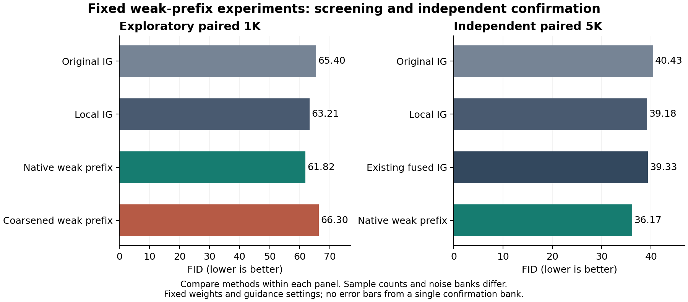

# CFG与IG：从五个候选到有边界的方法迭代

**后续成本审查：独立弱前缀路线已停止。** 该方案需要额外的浅层模型前向，不符合保持原生 IG 共享计算的要求。下方 SiT 正结果保留为增加计算后的工程对照，不能表述为同预算 IG 改进；所计划的 JiT 完整生成比较未启动，没有跨模型质量结论。[含义、成本与停止记录](JIT_PREFIX_TRANSFER_DECISION_20260912_ZH.md)

本轮得到一个可保留的生成质量结果：**让原IG的浅层前缀在原分布上独立短训，再作为弱参考，优于当前三个固定IG对照。** 收益来自原分布训练对照；预定的高阶粗化候选失败。它在结构上更接近轻量AG，尚不能作为新理论或论文核心。

原五候选59组及后续16组1K实验已完成，随后完成同一新bank上的四项5K比较。独立确认没有重训或调参数，全部详细审计通过。

|同一新5K输入|FID↓|sFID↓|IS↑|采样及解码GPU秒|
|---|--:|--:|--:|--:|
|原IG|40.4318|71.7386|37.7101|545.19|
|局部IG|39.1767|72.4840|38.3089|610.87|
|历史融合IG|39.3305|75.5205|37.3394|638.55|
|原分布弱前缀|36.1732|65.0195|40.2585|548.81|

四项实测均为128 full+64 prefix；原IG在这里重算前缀以保持比较布局，其原生共享实现可省去64 prefix，不能据此声称新方案与最高效原IG计算相同。相对局部IG，native的FID低3.0035，本次采样耗时低约10.2%；训练主循环另计68.27 GPU秒。一次独立bank与一个小SiT模型不足以建立跨模型或总体显著性结论。

[四项5K数据](data/guidance_research_cycles_20260912/confirmation_5k.csv) · [可导出PDF图](figures/guidance_research_cycles_20260912/prefix_screen_and_confirmation.pdf) · [最终取舍与权重身份](data/guidance_research_cycles_20260912/final_review.json)

本轮依据最新要求推进“读论文—解释性假设—小规模生成实验—修改方法”的循环。旧宽队列暂缓，原五候选的59组仍按原协议完成；新增部分是一个CFG候选，以及同一IG粗化构造的预测头和弱前缀两次结构检验，没有扩展强度网格。所有阴性结果保留。

## 研究判断正在怎样改变

**“弱模型对应一个较粗分布”可以指导设计，但还不是生成改善的充分解释。** 一旦精确score存在，强弱差总能写成某个对数密度比的梯度。这个改写说明算法偏向哪里，却没有回答为什么那个方向能修复强模型的实际错误。若先任意制造一个较差模型，再事后为密度比命名，很容易得到一批有数学外观却没有预测力的方法。

一个最小反例说明缺的是什么：强预测为0，弱预测为−1，真实答案既可以是+.1，也可以是−.1；两种情况下强预测都更准确，但沿强减弱的正方向移动只对前一种有用。因而“强比弱好”本身连修正方向的正负都不能确定。需要补充关于**具体学习偏差**的假设，并用该假设事先指定训练干预和对照。给一个已经放错位置的峰再做锐化，也只会把错误强化；峰谷图不能单独承担质量解释。

第一轮的训练干预正好约束了这件事：高阶粗化在预定四点网格中各自最低FID优于同量原分布弱模型，却未超过普通IG；当前网格内语义类别配对也不及随机配对。因而，后续不再以“可以画出更平滑的分布”作为扩大实验的理由。

两个容易混淆的对象也必须分开。去噪均值是给定噪声图像的条件期望，attention行是内部信息聚合的概率权重，生成终点的密度则由整个采样过程决定。它们之间没有自动的等价关系。[SG的平滑解释](https://arxiv.org/html/2412.05827v5)提供一个具体参考；[CFG实际分布的路径积分分析](https://arxiv.org/html/2607.19725v1)则明确限制了把逐时刻密度幂直接当作终点分布的做法。本轮不复用已有schedule作为新发现。

## 原五候选：完整生成之后的取舍

下表FID均来自预定1K网格，各自最低点有选择效应；不是全局最优，也不是跨方法固定强度的因果对照。

|候选|事先假设及具体干预|关键生成读数|取舍|
|---|---|---|---|
|59 高阶粗化|同类样本做保均值、协方差的归一化求和，弱参考缺少高阶结构|70.21；等量native外部弱模型77.78，普通IG65.40|先做弱头与弱前缀两次结构检验；均未支持粗化收益，结束当前构造|
|60 空间依赖粗化|四块空间区域独立抽样，削弱区域间依赖|71.16，未超过普通IG65.40|结束当前拼接分布构造；不推出所有依赖机制无效|
|61 类别拓扑混合|按邻近类别构造弱条件分布，检验类别关系是否有用|54.89；随机类别50.54，CFG45.71|当前语义拓扑没有优势，停止扩展|
|62 条件分布不变刷新|通过条件ODE共轭噪声刷新，避免任意再加噪破坏模型边缘|45.47；CFG45.71、APG44.50，full调用480对224|没有形成相对强基线的质量/成本优势|
|63 防御混合|把强分布混入弱分布，限制密度比极端值|71.23，未超过普通IG65.40|精确极限只是原方向的状态增益；降级为幅度对照并结束|

方法定义、原先可失败的预测与完整控制组见[五候选理论稿](FIVE_MECHANISM_IDEAS_20260912_ZH.md)、[取舍复盘](FIVE_MECHANISM_IDEAS_REVIEW_20260912_ZH.md)及[完整结果](SIT_MEASURE_GUIDANCE_RESULTS_20260912_ZH.md)。这些选择以实际生成结果约束数学解释，避免把模型训练损失或一个局部代理指标当成成功。

## 一项推导直接缩减了候选，而不是增加实验

原第63项把强分布混回弱分布：$q_\epsilon=(1-\epsilon)p+\epsilon q$。对正的可微密度，直接求导得到

$$\nabla\log p-\nabla\log q_\epsilon
=\frac{\epsilon q}{(1-\epsilon)p+\epsilon q}
\bigl(\nabla\log p-\nabla\log q\bigr).$$

所以在精确场极限，这只是原引导方向的状态相关缩放。密度比有界可以解释鲁棒性动机，但不足以把它称为一条独立的新方向。有限模型训练误差可能使方向改变，不过“多了一种训练误差”同样不是创新理由。本轮将它降级为已有粗化方向的幅度控制对照，不做后续搜索。

这里的共线是明确混合密度的代数恒等式，不是此前已经被数据反对的“强弱模型误差沿同一质量轴”假设。两种命题不能互相替代。

## CFG迭代：检验先改变候选权重，再做平均

这里还有一个比“局部凸性”更实质的目标约束。设强弱数据分布为$p,q$，共用加噪核$k_t(y\mid x)$，其完整干净图像后验为$\pi_P(x\mid y,t)$、$\pi_Q(x\mid y,t)$。在$q$覆盖$p$支撑、相关归一化常数有限时，Bayes公式直接给出

$$\operatorname{Normalize}_x\!\left[\pi_P(x\mid y,t)^{1+\alpha}\pi_Q(x\mid y,t)^{-\alpha}\right]
=\operatorname{Normalize}_x\!\left[k_t(y\mid x)p(x)^{1+\alpha}q(x)^{-\alpha}\right].$$

原因是共同加噪似然的指数恰好为1。**完整后验的概率组合，确实可以对应同一个端点目标；两个后验均值的线性组合一般做不到。** 要让各时刻对应同一个端点目标，要求全程固定$\alpha$，并要求真实的完整后验。它不适用于任意attention矩阵，也不能直接为分段时间强度提供终点保证。这是标准Bayes代数；[Characteristic Guidance](https://proceedings.mlr.press/v235/zheng24f.html)等已有工作也从扩散路径一致性研究非线性修正，不将“非线性修正”本身认领为新意。

这个约束把后续问题收窄为：是否存在成本可承受、具有真实概率含义的预测表示，而不是继续给两个均值设计几何变换。下面的attention实验只是一个有风险的实现尝试，不能因为上式正确，就提前认为代理满足上式。

一个有具体内容的可能性是：某些过度引导来自直接外推平均结果。例如两个候选值为−1与1，强模型给它们(.25,.75)，弱模型给(.5,.5)，额外强度2时，均值外推得到1.5，已经超出候选范围。若先做规范化的概率对比

$$r_\alpha(k)\propto r_c(k)^{1+\alpha}r_u(k)^{-\alpha},\qquad
m_\alpha=\sum_k r_\alpha(k)v_k,$$

则仍是候选值的凸组合。该例中结果约为.92857。这里真正改变的是对多个解释的取舍；两个平均值本身不足以恢复这个操作，三个以上候选时结果也未必落在原CFG直线上。

这套概率代数已有基础，我们仓库9月10日也已有[明确推导和不可识别反例](IG_HYPOTHESIS_POSTERIOR_RETHINK_20260910_ZH.md)，不能重新当作新理论。[DoLa](https://arxiv.org/html/2309.03883v2)在共同词表上对比深浅层预测，并加合理候选约束；其实际对比式和筛选规则与本轮不同。

本轮只试一个可直接利用的代理：在同一个条件隐藏状态上，分别用条件和null调制得到attention logits，保持条件value字典，计算 $A=\operatorname{softmax}(L_c+(L_c-L_u))$。全层统一，强度固定为1，不选头、不选层、不使用局部价值读数。对照包括线性attention外推、只改变temperature、条件embedding外推、手动attention核，以及原strong、IG、CFG和APG。

**最脆弱的假设写在实验前：attention不等于真实图像模式的后验，局部null调制也不等于整个无条件模型。** 即便局部聚合保持凸性，后续网络仍可能扩大或扭曲结果。因此本轮检验的是一个具体方法，不声称已经解决连续生成的后验表示问题。若结果失败，不凭借softmax的漂亮性质继续扫参数。

最近邻文献也限制新颖性：[HeadHunter/SoftPAG官方实现](https://github.com/cvlab-kaist/HeadHunter)已经研究概率和logit空间的attention扰动；[UNCAGE](https://arxiv.org/html/2508.05399v1)用正负attention关系改变离散生成的解遮罩顺序。因此“在attention上做对比”不是首次。只有具体的条件/null共同value构造超过这些简单替代解释和强基线，才值得继续讨论贡献。

详见[冻结协议](SIT_POSTERIOR_GUIDANCE_PROTOCOL_20260912_ZH.md)。一个候选、八个必要对照；不把额外QKV和矩阵乘法隐藏在128次full调用后面，真实GPU秒同时报告。

**生成后的判断：** 唯一概率候选已完成1K，FID为84.7802；同轮strong为87.0835、CFG为45.7074、APG为44.5040。当前attention实现未形成有效CFG改进，不扩大强度、层数或头选择。这个失败直接约束代理实现，不能反过来否定完整后验的Bayes恒等式；同样不能借恒等式仍然成立而继续为代理辩护。线性attention为84.3084，进一步说明该概率实现没有优于最直接的替代方案；全部对照保留在下表。

## IG迭代：保留粗化定义，改变弱参考的实现位置

第一轮的高阶粗化有有限的正向信号：外部弱模型AG在同一预定四点网格中，原分布短训对照的最低FID为77.78，粗化为70.21；这不是同一强度的点对点比较。普通IG是65.40，局部IG是63.20。实际问题变成：能否把这个分布干预放入原有IG的浅层头，同时保留强主干与较低采样成本？

粗化沿用固定 $C_4$：同类四个独立样本相加后按 $1/\sqrt4$ 缩放，并恢复均值。它保留协方差、压低高阶累积量，在高斯分布上不变，并与既定高斯加噪路径相容。因此它提出的是“弱参考缺少高阶分布结构”的假设，不是一般模糊或降低分辨率。

实际只训练两个301,840参数的原depth4头：一个继续学习原分布，一个学习粗化分布。二者从相同50K头初始化，强模型全冻结，随机流与1500步训练量配对。随后在相同噪声、原IG峰值0.8、原时间形状下，仅比较原头、短训原分布头、短训粗化头三组；没有范数匹配和分量重加权。

必须同时胜过原头和等量短训对照，才能认领这个IG方法有进展。若只比短训对照好，可能只是减轻了继续训练的退化；若两者都输给原头，结束此固定短训构造，不加密层数或强度。预测头容量不足和短训未收敛仍是失败结果的适用范围，不能推论所有粗化方法无效。

[IG原文](https://arxiv.org/html/2512.24176v1)已提出内部监督与引导，本轮研究的差异仅在弱头的训练分布，并且采用冻结主干的本地小SiT测试环境。完整训练边界和数学限制见[冻结协议](SIT_INTERNAL_COARSE_PROTOCOL_20260912_ZH.md)。这属于第59项的结构迭代，不增加一个新idea编号。

**第三轮结果：** 原头65.402814，原分布短训头65.000022，粗化头65.651362；三组均完成并通过独立FID/sFID核验。当前固定头版本失败，不做强度补扫。

## 最后一个粗化结构检验：允许弱前缀适配

保留前两阶统计的干预，对最佳仿射去噪器不可见。若 $Y=tX+(1-t)\epsilon$、$V=X-\epsilon$，且 $\epsilon\sim N(0,I)$ 与 $X$ 独立，则

$$A_t=\operatorname{Cov}(V,Y)\operatorname{Cov}(Y)^{-1}
=[t\Sigma-(1-t)I][t^2\Sigma+(1-t)^2I]^{-1},\qquad
b_t=\mu-A_t t\mu.$$

原分布和$C_4$分布具有相同$\mu,\Sigma$，所以它们的最佳仿射预测 $A_tY+b_t$ 一样。实际浅层特征是非线性的，不能据此断言上一轮失败原因已经找到；这个极限提出的是一次可失败的结构预测：弱模型的非线性特征可能需要一起适配。

第四轮只让独立复制的同一前四层及预测头接受训练，strong全冻结。native与clt分别从同一权重初始化，均1500步，沿用相同学习率、数据、随机流、强度和时间区间。正式四组为原IG、局部IG、native弱前缀、clt弱前缀；均计入额外64次prefix。原IG单独重算前缀是计算布局对照，不声称提高效率。**只有clt同时超过三项对照，才考虑固定配置的新噪声确认；否则结束当前C_4构造链。** 不再通过加层、增加训练轮数或调整强度延后判断。详见[实验前冻结协议](SIT_PREFIX_COARSE_PROTOCOL_20260912_ZH.md)。

**第四轮结果：** 原IG65.402327、局部IG63.205382、native弱前缀61.819696、clt弱前缀66.300268；四组完成并通过审计。当前粗化版本未通过任何一项关键质量比较，按协议结束C_4链。同一固定验证抽样在t=.5上，native目标MSE由.932470降至.863187，clt由1.082238降至1.034615；两者都更好地学习了各自目标，但只有native转化成质量优势。不同目标的MSE绝对值不直接比较。native对照的收益属于另一个发现：允许弱前缀在原分布上适配，可能比继续使用冻结的内部前缀更合适。它既不是粗化机制证据，也不是新的AG原理。由于前缀权重独立、采样时另行执行，这一版本在结构上已经更接近轻量AG；它不保留原生IG共享一次主干前向的全部成本优势。

## 对照发现进入独立5K，不回到参数搜索

三组固定配置——原IG、局部IG、native弱前缀——在新5000噪声上确认；种子2026091205，每类50图。没有额外训练，也没有改变深度、引导强度或时间区间。明确记录native由原对照组事后提升为候选，且不包含失败的clt版本。

这一步只回答此前61.82相对63.21/65.40的收益能否在新输入上复现。即使通过，也首先是一个更强的弱参考基线；不能将它写成高阶平滑理论已被证实。见[事先冻结的确认协议](SIT_PREFIX_CONFIRMATION_PROTOCOL_20260912_ZH.md)和[独立5K结果](SIT_PREFIX_CONFIRMATION_RESULTS_20260912_ZH.md)。

**独立5K结果：** 原IG40.431806、局部IG39.176741、native弱前缀36.173207；三组详细审计全部通过。native相对原IG降低4.258599，相对局部IG降低3.003534。当前测得的采样及解码时间为548.81 GPU秒，局部IG为610.87，比例约0.8984。训练主循环另计68.27 GPU秒，不含数据加载、验证和预检。这是一个可保留的质量信号，但尚无跨模型确认。

复查历史后发现，仓库还存在[已做过另一组5K确认的融合IG](SIT_GUIDANCE_FUSION_CONFIRMATION_RESULTS_20260910_ZH.md)。其旧FID38.998526不能与本轮36.173207直接相减。因此仅补跑原先固定的`ig_local_residual_11`，与本轮使用完全相同的5K噪声和标签，不调整原方法参数。补充结果为39.330470，native为36.173207，后者低3.157262；补充的完整审计也已通过。这个[补充对照协议](SIT_PREFIX_INCUMBENT_PROTOCOL_20260912_ZH.md)在当前native的5K结果生成前已记录，只有三组确认通过才执行；它不是第二次独立噪声复验。

## 补读文献进一步排除了哪些“新”想法

[SIMS，2024](https://arxiv.org/html/2408.16333v1)已用自身生成数据微调辅助模型，并将其作为负参考；因此“让模型再学习一次自己的偏差，再反向引导”不是新方法。[SGG，2026年3月](https://arxiv.org/html/2603.20584v1)已经按时间衔接条件引导与弱模型引导，并把引导写入训练目标；简单的“先确定类别、后细化类内结构”及早CFG晚IG同样不足以构成新意。

更直接的最近邻是[SSG，2026年7月31日](https://arxiv.org/html/2607.29122v1)。它冻结预训练像素扩散主干，用自身合成数据训练中间adapter，再做内部引导；其表6还显示纯线性adapter较差、加入一个transformer block明显改善。这个证据发生在像素JiT和其特定训练配置上，不是我们latent小SiT的复现结论，也不能用它证明本轮仿射极限就是失败原因。它明确要求今后的“冻结内部头”方案比较这个最近邻，而不能只比较联合训练IG。

上述SSG的依据是中间预测的图像频谱差异。它没有自动识别弱模型的完整生成密度。设图像向量为$X$，均值协方差为$\mu,\Sigma$，下面三个操作不能互换：

|操作|随机变量定义|二阶统计的结果|
|---|---|---|
|数据分布的Gaussian卷积|$X'=X+\sigma\epsilon$|$\Sigma'=\Sigma+\sigma^2I$|
|对图像做线性模糊|$X'=BX$|$\Sigma'=B\Sigma B^T$|
|当前高阶粗化|$X'=\mu+\frac12\sum_{i=1}^4(X_i-\mu)$|$\Sigma'=\Sigma$|

弱头输出“更糊”并不选择其中任何一个完整分布关系。尤其是中间**条件均值**的高频功率更少，不等于从该弱场生成的干净样本协方差已知。这是本轮应保留的解释边界，而非新增频段分解算法。

另一个理想极限也约束纯CFG理论：若类别支撑严格不交、$p=\sum_c\pi_c p_c$，则类$c$的支撑上$p=\pi_c p_c$，因此$\operatorname{Normalize}(p_c^{1+\alpha}p^{-\alpha})=p_c$。在这个极限，完整后验的概率幂并没有另造一个“更好”的类内目标。标准CFG的实际轨迹还涉及学习误差、时间一致性和数值积分；其质量作用不能只由端点幂公式推断。这个简单Bayes推论不作为新定理或新方法。

## 实验读数与下一步判定

<!-- RESULTS_BEGIN -->
更新：2026-09-12T12:25:24+08:00。FID越低越好；前四轮为同bank 1K筛选，第五轮为独立5K，第六轮使用相同5K补充一个旧对照；不可将1K与5K直接相减。

**cycle01：59/59组，状态 complete；最终审计 通过。**

|方法|已提交/计划|当前最低FID|该点强度|Full/prefix调用|采样及解码GPU秒|
|---|--:|--:|--:|--:|--:|
|strong|1/1|87.0820|0|128/0|95.12|
|ig_local|1/1|63.2024|0.8|128/64|131.55|
|cfg_native|1/1|45.7078|1.25|224/0|172.52|
|cfg_apg|1/1|44.5037|2|224/0|169.42|
|ig_native|1/1|65.4013|0.8|128/0|104.66|
|weak_native|4/4|77.7782|2.75|192/0|134.70|
|i59_clt|4/4|70.2111|1.25|192/0|134.45|
|i60_factor|4/4|71.1648|0.5|192/0|133.33|
|i61_local_label|4/4|54.8950|2.75|224/0|161.15|
|i63_defensive|4/4|71.2345|2.75|192/0|137.77|
|weak_heat|4/4|87.3631|0.5|192/0|137.38|
|weak_plain_mix|4/4|85.5303|0.5|192/0|137.66|
|weak_random_label|4/4|50.5401|2.75|224/0|156.02|
|i62_conditional_refresh|8/8|45.4717|1.25|480/0|315.73|
|gaussian_refresh|4/4|47.2187|1.25|224/0|156.36|
|roundtrip_control|4/4|45.7063|1.25|480/0|318.69|
|hard_pair_control|4/4|49.9599|2|224/0|159.68|
|unguided_refresh|2/2|86.5848|0|384/0|257.88|

**cycle02：9/9组，状态 complete；最终审计 通过。**

|方法|已提交/计划|当前最低FID|该点强度|Full/prefix调用|采样及解码GPU秒|
|---|--:|--:|--:|--:|--:|
|strong|1/1|87.0835|0|128/0|101.14|
|ig_local|1/1|63.2024|0.8|128/64|127.88|
|cfg_native|1/1|45.7074|1.25|224/0|172.25|
|cfg_apg|1/1|44.5040|2|224/0|174.48|
|routing_odds|1/1|84.7802|1|128/0|137.31|
|routing_linear|1/1|84.3084|1|128/0|141.07|
|routing_temperature|1/1|261.6242|1|128/0|113.17|
|embedding_extrapolation|1/1|86.9799|1|128/0|95.89|
|manual_kernel|1/1|87.0773|0|128/0|112.62|

**cycle03：3/3组，状态 complete；最终审计 通过。**

|方法|已提交/计划|当前最低FID|该点强度|Full/prefix调用|采样及解码GPU秒|
|---|--:|--:|--:|--:|--:|
|ig_internal_original|1/1|65.4028|0.8|128/0|97.92|
|ig_internal_native|1/1|65.0000|0.8|128/0|99.71|
|ig_internal_clt|1/1|65.6514|0.8|128/0|101.54|

**cycle04：4/4组，状态 complete；最终审计 通过。**

|方法|已提交/计划|当前最低FID|该点强度|Full/prefix调用|采样及解码GPU秒|
|---|--:|--:|--:|--:|--:|
|ig_prefix_original|1/1|65.4023|0.8|128/64|114.30|
|ig_local|1/1|63.2054|0.8|128/64|127.43|
|ig_prefix_native|1/1|61.8197|0.8|128/64|118.23|
|ig_prefix_clt|1/1|66.3003|0.8|128/64|116.09|

**cycle05：3/3组，状态 complete；最终审计 通过。**

|方法|已提交/计划|当前最低FID|该点强度|Full/prefix调用|采样及解码GPU秒|
|---|--:|--:|--:|--:|--:|
|ig_prefix_original|1/1|40.4318|0.8|128/64|545.19|
|ig_local|1/1|39.1767|0.8|128/64|610.87|
|ig_prefix_native|1/1|36.1732|0.8|128/64|548.81|

**cycle06：1/1组，状态 complete；最终审计 通过。**

|方法|已提交/计划|当前最低FID|该点强度|Full/prefix调用|采样及解码GPU秒|
|---|--:|--:|--:|--:|--:|
|ig_local_residual|1/1|39.3305|0.9|128/64|638.55|

<!-- RESULTS_END -->

审计范围：第一轮59组全部检查元数据及覆盖，其中18组额外核对原始数据和独立重算FID/sFID；随后9、3、4组全部进行这项详细审计。第五轮三组同样已完成详细审计；第六轮旧对照同样已完成完整详细审计。独立算术核验使用已缓存的Inception特征，不声称重新提取特征。

每个候选先按冻结配置与直接对照比较。只有实质性的正向信号才进入独立噪声确认；1K差距很小、只改善弱基线、或靠显著增加计算获得的结果，不触发参数网格。旧517组资产与暂停标记仍保留，新的研究循环复盘优先于历史自动续跑顺序。

本文区分四种证据：数学恒等式、训练和入口核验、固定1K生成结果、独立确认。前两者不当作质量结论；独立确认也不自动证明新颖性或解释机制。当前没有因完成若干轮实验而宣称找到论文核心。

[原五候选完整结果](SIT_MEASURE_GUIDANCE_RESULTS_20260912_ZH.md) · [CFG迭代结果](SIT_POSTERIOR_GUIDANCE_RESULTS_20260912_ZH.md) · [IG弱头结果](SIT_INTERNAL_COARSE_RESULTS_20260912_ZH.md) · [IG弱前缀结果](SIT_PREFIX_COARSE_RESULTS_20260912_ZH.md)。原文副本及下载状态保存在[来源清单](../readings/guidance_research_cycles_20260912/source_manifest.json)。

## 复现与保留资产

[原分布/粗化弱前缀训练](../experiments/sit_prefix_coarse_20260912/train.py)、[固定采样实现](../experiments/sit_prefix_coarse_20260912/core.py)、[独立5K确认入口](../experiments/sit_prefix_confirmation_20260912.py)、[旧对照重放入口](../experiments/sit_prefix_incumbent_20260912.py)均与各自协议和请求一起冻结。环境为`/home/zhoushunyu/miniconda3/envs/myenv/bin/python`，工作目录为仓库根目录。

已完成入口会先校验并复用已有结果；更改代码、输入或权重后不能复用原请求身份。新研究应另开协议和输出目录。[逐轮证据清单](data/guidance_research_cycles_20260912/evidence.json)记录请求、结果和输入SHA；各轮review JSON记录结果出来后的决定。原始样本、缓存特征、训练请求和checkpoint保留在`/home/zhoushunyu/data/eqvae/experiments/`下的对应实验目录。

## 本轮保留与终止

保留native弱前缀的固定权重、实现和同bank确认结果，作为额外计算预算下的工程对照。后续成本审查已停止推进此路线；它不再被列为符合共享主干预算的 IG 候选，也不要求低成本 IG 方法把它视为同预算对照。未确立其相对AG、SSG等最近邻的新颖性，也未做跨模型质量确认。纯CFG的attention代理本轮未成功，不能以这一额外计算方案的正结果替代CFG结论。

终止当前C_4弱分布链与概率attention代理；不通过调整强度、增加层数或扩大训练量继续维持原解释。旧517组宽队列保持暂停。下一轮需要提出能解释**为什么某种弱参考修正实际生成错误**的具体方法假设，并胜过本轮更强对照；不能再只以“弱模型更糊”或“密度比指向峰值”作为质量理由。
