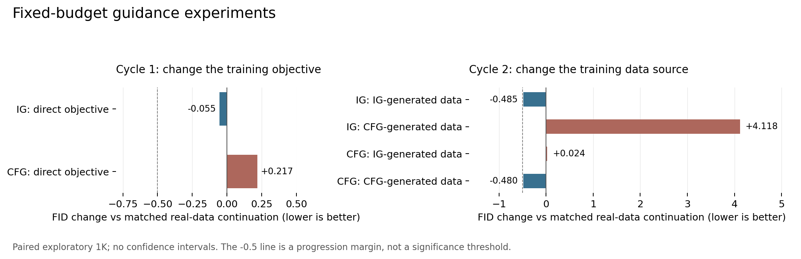

# 在原推理预算内重新研究 CFG 与 IG

后续更新：用户提出冻结strong训练weak与研究loss后，又完成了第三、四轮六个新读出与21组配对1K，全部审计通过；仍无新候选达到推进条件。后续推导、质量结果及成本见[参考loss研究报告](GUIDANCE_REFERENCE_LOSS_RESEARCH_20260912_ZH.md)。本文保留前两轮的完整记录。

本轮把两条主线都落到了固定配置的生成实验上。第一轮改变参考读出的训练目标，完成四个训练和八组配对 1K；第二轮据此改变参考学习的数据分布，完成六个训练和十组配对 1K。全部生成与详细审计已结束，两轮均未通过预先规定的推进标准，未扩大参数搜索。所有候选保持原主干查询次数。当前没有新的独立 5K 正结果，也没有跨模型有效性结论。

我现在更重视的问题是：**参考分支为什么会包含恰好需要被减掉的偏差？** “更浅”“更模糊”“质量更差”可以描述一个参考，却都没有单独回答这个问题。一个值得继续发展的理论，至少要预先规定参考怎样产生、它针对哪种生成错误，以及哪项对照会使该解释失败。增加公式数量或给强弱差重新命名，都不能补足这一步。

本报告延续[用户的成本约束](JIT_PREFIX_TRANSFER_DECISION_20260912_ZH.md)：IG 使用一次共享主干前向；CFG 保持现有条件和 null 前向。独立弱前缀的 SiT 正结果仍保留，但不计为满足约束的新方法，JiT 的该路线不重启。旧宽队列保持暂停。下面的“停止”指具体构造没有通过实验，不表示整体研究目标已经完成。

**先澄清原来平滑解释中缺少的一步。** 若 strong 和 weak 确实是同一噪声层两个密度的精确 score，则其差是 ∇log(p/q)。它沿着比值增长的方向施力；并不是只在 p/q>1 的区域才有引导。更关键的是，p/q 上升既可能修复模型过度产生的错误，也可能进一步压缩本来正确的多样性。

一个足以排除过强结论的例子是 p=N(0,1)、q=N(0,σ²)，σ²>1。q 确实是 p 的高斯平滑，但静态密度组合 p^(1+a)/q^a 的方差是 [1+a−a/σ²]⁻¹，小于 1。若目标本来就是 p，这个组合偏离目标。该例仅说明“存在平滑关系”不是分布质量改善的充分条件；它不否认有限神经模型中适当引导可能改善图像。

另外，每个时刻的幂乘 score 与最终采样分布不同。PCG 已给出精确 score 下 CFG-ODE、CFG-SDE 与静态幂乘目标不同的例子，并推导特定连续 SDE 极限的 predictor–corrector 解释。它约束我们不能从一个局部密度比恒等式直接推出 FID 改善。[PCG 原文](https://arxiv.org/html/2408.09000v2)

对 IG 还应区分信息不足与计算能力不足：最后输出本来就是早层 hidden state 经过后续网络的确定性函数。因此，不能仅凭“层数浅”就把早层状态当成统计意义上丢失信息的观测。真正受限的可能是用该状态产生预测的读出函数族。下面两轮都保持原读出容量，避免用增加网络来回避这一问题。

**第一轮：参考训练是否与实际用途不一致。** 原弱头被训练为独立预测真实 velocity，但在生成时它出现在一个减法中。这提示一个具体假设：原训练会留下某类可由参考读出学习的系统偏差，而直接训练最终 guided 预测可以纠正它。这个假设不要求两个模型的误差共线。

记真实 flow-matching 目标 Y=X−ε，冻结 strong 为 S，参考输入为 H，参考为 W(H)，已有额外引导系数 a(t)>0。最终预测为

$$G=S+a(S-W).$$

保持强模型、读出结构、推理公式和 a(t) 不变，只把参考目标从 Y 换成

$$T=S+\frac{S-Y}{a},\qquad
\|W-T\|^2=\frac{1}{a^2}\|G-Y\|^2.$$

这不是用另一个高成本模型做采样，也没有在线优化。IG 训练原 depth4 读出；CFG 复制原 final readout，作为 null 专用的同尺寸读出，条件输出仍使用原头。CFG 仅多存一份小头，原 null 前向中用它替换输出层。

在固定时间、平方可积、可表示任意 H 的函数的理想回归问题中，原最优参考与新最优参考分别为

$$W_0=E[Y\mid H],\qquad
W_*=E[S\mid H]+a^{-1}E[S-Y\mid H].$$

设 R(W)=E||S+a(S−W)−Y||²，则

$$W_*-W_0=(1+a^{-1})E[S-Y\mid H],$$

$$R(W_0)-R(W_*)=(1+a)^2E\|E[S-Y\mid H]\|^2.$$

推导只用了条件期望和平方损失的正交性，是标准回归恒等式，不是新定理。它给出一个解释性条件：如果 strong 的误差在参考可用的信息下存在系统偏差，原目标并不专门消除这个偏差。若 strong 已是精确条件均值，tower property 使 E[S−Y|H]=0，新旧最优目标一致。因此理论没有要求把一个准确的模型故意弄坏。

但读出的实际函数族有限，有限训练未必达到上述最优解；更不能把 teacher-state 的平方风险视为生成分布质量。在当前实验中，连“新目标比同预算原目标更容易获得低风险”都没有得到有说服力的证据。相关损失和梯度等式、完美强预测极限的数值检查在[冻结协议](SIT_GUIDED_OBJECTIVE_PROTOCOL_20260912_ZH.md)中记录，不能把这些代数检查当成质量验证。

四组训练固定 1500 步、batch32、lr=1e−4，最终 EMA；每条线的原目标续训和候选使用相同训练输入随机流。SiT-S/2 800K EMA 强模型全程冻结，IG 从 depth4_v 50K EMA 初始化。真实训练池为 25600 图，验证池为不交的 3200 图。所有正式生成使用相同 1000 噪声、标签、Heun64、解码与 FID 参考。

|第一轮，FID↓|原始参考|同预算原目标续训|直接训练 guided 预测|已有低成本参考|
|---|---:|---:|---:|---:|
|IG|65.4012|64.8497|64.7947|ADG 64.6906|
|CFG|45.7078|45.4384|45.6553|APG 44.5036|

IG 候选较原始参考降低约 0.607，但原目标续训已降低约 0.552；两者只差约 0.055。CFG 候选反而比原目标续训高约 0.217。两条线都没有超过其已有 ADG/APG 参考，更没有满足事先规定的至少 0.5 FID 推进余量。[全部指标与成本](SIT_GUIDED_OBJECTIVE_RESULTS_20260912_ZH.md)

|第一轮训练|真实验证 guided MSE，前→后|训练主循环 GPU 秒|
|---|---:|---:|
|IG 原目标续训|0.718946→0.716866|24.46|
|IG direct|0.718946→0.717008|25.19|
|CFG 原目标续训|0.740157→0.740219|42.01|
|CFG direct|0.740157→0.740195|42.04|

**第一轮的裁决是停止这个构造。** 结果不证明任何 guided-aware 训练都无用；它具体否定了“在此强模型、原读出和固定短训下，仅替换该目标就足以产生实用改进”的推进假设。不能把 0.055 的探索差值写成新方法，也不应在失败后再增加训练步数或扫 guidance 强度。

这也不是首次有人把 guidance 纳入训练。IG 已使用中间监督；SGG 的一个训练方案修改 strong 的目标，而保持 weak 的原目标。OPD 研究了同时移动两分支时 guided matching 的不可识别问题；本轮固定 strong 排除了那种联合补偿自由度，但这并不保证新目标有用。[IG](https://arxiv.org/html/2512.24176v1)、[SGG §4.3](https://arxiv.org/html/2603.20584v1#S4.SS3)、[OPD](https://arxiv.org/html/2607.24731v1)

我也推敲了用更低方差目标挽救该损失。Stable Velocity 已研究用参考样本集合降低 flow target 方差，并给出相应的路径及目标条件。简单加入多个 clean 参考、用高维核后验平均，既有直接近邻，又面临后验权重集中及有限样本偏差；当前没有足够证据把第一轮失败归因于 target variance。因此没有据此再开一组步数或参考样本数搜索。[Stable Velocity](https://arxiv.org/html/2602.05435v1)

**第二轮：参考是否应该学习生成器实际多产生的东西。** 第一轮仍把真实数据作为参考的学习对象。另一条逻辑是，strong 的训练目标和其最终输出分布并不相同：训练误差、guidance 和数值积分会让生成器形成自身偏差。若负参考学习这些输出的分布，它可能集中刻画需要被减去的过度产生模式。

这个动机有一个明确的理想边界。在固定噪声层，设当前密度 q、目标密度 p 为正、光滑，并满足边界通量消失等条件。令 u=∇log(p/q)，以 ∂τq=−∇·(qu) 输运 q，分部积分得到

$$\frac{d}{d\tau}\mathrm{KL}(q\Vert p)
=-\int q\|\nabla\log(q/p)\|^2dx.$$

这说明 q 的身份很重要：它应当是当前需要纠正的分布。公式沿演化全程成立，需要场中的 q 同步代表当前密度；若负参考一次训练后固定，不能把这个全程性质照搬过去。任意较模糊的参考也不自动继承该结论。然而，用自己生成的样本训练负参考，本身已经是 SIMS 的核心构造；本轮不认领这一宽泛想法。[SIMS §3](https://arxiv.org/html/2408.16333v1#S3)

SSG 已进一步使用冻结主干和合成数据训练中间 adapter。它主要研究像素模型，并包含额外 transformer adapter 的配置；我们的原尺寸 latent 读出不等同于该论文的完整复现。Neon 则把自身样本训练后的参数更新做负向外推；其分析需要误差与采样偏差方向等条件，不能从“使用自身样本”直接推出本实验成功。[SSG 方法与消融](https://arxiv.org/html/2607.29122v1#S3)、[Neon §3.1](https://arxiv.org/html/2510.03597v2#S3.SS1)

本轮新增的是一个限定范围的来源交叉检验，而不是新起一个算法名字。用原 IG 与原 CFG 在相同新噪声上各生成 2000 个 clean latents，再加入同规模真实数据。每类都固定 20 个样本，不筛选好图，不使用评价噪声；真实组也固定一次 VAE posterior 抽样，避免它拥有更多增强。两种读出分别在 real / IG-generated / CFG-generated 上训练，共六个最终 EMA。

如果每条线都更受益于“自身采样器”的数据，而另一来源不能替代，这与偏差匹配的假设一致。若同一来源在两条线上都更好，就应考虑数据质量、覆盖或一般参考学习等解释。两种模式都不能单靠交互替代质量成功：候选仍须超过原始、同规模 real 续训及 ADG/APG，才能进入独立确认。

CFG 的假设比 IG 更弱：null 参考学习类别混合密度 q，而不是每个类别的 q_c。因此固定噪声层的条件 KL 下降公式不能直接用于 CFG。这个区别保留在方法解释中，不为了给两条线套上统一故事而省略。

|第二轮，FID↓|原始参考|等量真实数据续训|IG 生成数据训练|CFG 生成数据训练|已有低成本参考|
|---|---:|---:|---:|---:|---:|
|IG|65.4024|65.0222|64.5367|69.1406|ADG 64.6916|
|CFG|45.7079|45.5373|45.5616|45.0570|APG 44.5038|

两条线在这次交叉中都更偏好自己的数据来源：IG 自身数据较同规模真实数据低 0.4855 FID，CFG 自身数据低 0.4803。IG 从 CFG 数据训练参考后，比自身数据训练高 4.6038。这个结果说明负参考的训练来源不能按原采样器的图像 FID 简单排序，与来源匹配的假设相容；它还不能识别唯一的纠错机制，两种数据来源也同时改变了内容、覆盖与分布形状。

**第二轮仍未通过质量推进规则。** IG 自身数据组仅比 ADG 低 0.1549 FID；CFG 自身数据组比 APG 高 0.5532。两者也都未达到相对同规模真实数据 0.5 的预设余量。没有为了接近阈值而降低标准、延长训练或选新强度。

多指标也没有给出统一优势：IG 自身数据的 sFID 为208.3169，ADG为207.4378；CFG自身数据的sFID为207.8740，好于APG的209.8527，但其FID较差。因此应把这里保留为特定配置的质量取舍，不能宣称全面胜出。所有 IS、sFID 和实际成本均列在完整结果中。

图中各候选都减去本轮、同条线的真实数据续训对照。虚线 −0.5 仅是推进余量，不是统计显著性边界；推进还要求胜过原始参考和 ADG/APG，因此不能只看是否穿过虚线。[图的全部底层数据](data/guidance_shared_budget_20260912/all_results.csv) · [PDF](data/guidance_shared_budget_20260912/comparison.pdf)

第二轮的[冻结协议](SIT_SAMPLER_REFERENCE_PROTOCOL_20260912_ZH.md)规定了训练预算、来源、种子、成本和推进标准；[动态结果](SIT_SAMPLER_REFERENCE_RESULTS_20260912_ZH.md)保存每组完成后的完整评价。质量使用历史探索 bank，不是独立确认。

**继续推导后，第三条看似自然的路线应先被排除。** 第二轮弱头学习的是生成终点重新加噪的分布，记为 K_t q_1。它一般不是原生成过程真正经过的边际 r_t。把它们混同，就会错误地把上面的 KL 下降公式当成整条采样轨迹的保证。

这个差异不需要诉诸神经网络误差。考虑干净 strong 分布 N(0,1)、weak 分布 N(0,4)，共用线性 Gaussian path，并以 a=.8 做精确 velocity 外推。若 V_p=t²+(1−t)²、V_w=4t²+(1−t)²，则实际 ODE 方差

$$R_t=V_p^{1+a}/V_w^a,$$

而将其终点重新加噪得到的方差为 t²R_1+(1−t)²。在 t=.5，它们分别是 0.240225 和 0.332469；两个端点相同，整个路径仍不同。这是前述路径一致性问题的一个直接可计算例子，不是本轮真实模型的机制测量。[解析计算](data/guidance_shared_budget_20260912/sampler_law_checks.json)

如果把下一轮改为“直接学习 r_t 的 score”，又会出现一个更强的归约。先明确这只是理想构造：r_t 必须是修改后同一个 guided 过程的当前边际；离线拟合上一轮轨迹通常不满足这一自洽条件。定义参考 velocity

$$W_r(z,t)=\frac{z}{t}+\frac{1-t}{t}\nabla\log r_t(z).$$

这里是把任意 r_t score 转成线性加噪坐标下的 velocity 形式，并不声称原 r_t 本身来自该加噪路径。将其代入 G=S+a(S−W_r)，记 κ=a(1−t)/t≥0，得到

$$G=(1+a)S-\frac{a}{t}z-\kappa\nabla\log r_t.$$

这里固定同一个条件推导；CFG 的 null 混合密度不能直接代替逐类的 r_t。连续性方程于是变成

$$\partial_t r=-\nabla\cdot\left(\left[(1+a)S-\frac{a}{t}z\right]r\right)+\kappa\Delta r.$$

在 t>0 的适当正则区间，这正是下面 SDE 的 Fokker–Planck 方程：

$$dZ_t=\left[(1+a)S(Z_t,t)-\frac{a}{t}Z_t\right]dt+
\sqrt{2a(1-t)/t}\,dB_t.$$

也就是说，若参考真能精确学习当前边际，则这一理想“新引导”的密度演化可以用随机采样直接实现。该推导没有给普通 IG 弱头认证；也不保证有限步 ODE 与离散 SDE 相同。t=0 的奇异边界还需要单独处理，不能直接套入原 64 步实现。

这与 SiT 已有的可调扩散系数采样族有直接联系：把 S 对应的 score 写为 (tS−z)/(1−t)，上述 drift 就是 S+κ score。因此不应把训练一个轨迹密度参考、然后得到这种连续极限，包装成新的低成本 guidance。此路没有再开 GPU 搜索。[SiT 的随机采样构造](https://www.ecva.net/papers/eccv_2024/papers_ECCV/papers/09828.pdf)、[Stochastic Interpolants](https://arxiv.org/abs/2303.08797)

在二维 Gaussian mixture 和一个任意光滑 strong 场上，两种 PDE 右端的 FP64 差值不超过 2.7×10⁻¹⁵。这个检查验证归约的符号与系数，不能当成图像生成正结果。[可运行检查](../experiments/check_guidance_sampler_law_20260912.py)

**当前证据应怎样约束后续选择。** 本轮的两个训练干预分别问：参考的目标是否错了、参考的数据对象是否错了。前者没有胜过同预算续训；后者观察到来源差异，但没有通过强对照下的推进标准。两条构造均在本次固定预算下停止。我们没有因局部误差改善就宣布成功，也没有把已知的 SSG、SIMS 或 SDE 换名作为创新。

新意仍须来自一个尚未被已有方法覆盖的具体设计，并在当前预算下提供真实优势。改变读出容量、训练共享前缀或离线蒸馏昂贵参考，可能有工程价值，但这些动作本身没有回答偏差为何适合被减掉。如果以后采取它们，需要同时保留 strong 质量、同预算原目标训练和最接近论文的对照，不再仅以击败原弱头作为终点。

当前所有 1K 都是探索。0.5 FID 是预先设置的推进余量，不是显著性阈值；未通过不能证明总体差异严格为零。通过者才固定权重、强度、训练源和采样算法，在新 5K 噪声上确认，再安排其他模型；不能把小 SiT 的探索最低值写成普适结果。

**成本与复核入口。** 第一轮 IG 每图 128 full / 0 prefix，CFG 为224 / 0；第二轮沿用同样次数。第一轮生成及解码的累计 GPU 秒分别为 IG 原始96.83、原目标续训107.80、direct101.40，CFG 原始154.76、原目标续训155.73、direct156.44。这些是实际本轮作业时间，存在 GPU 运行波动；相同 NFE 不能单独证明逐图延迟完全相等。

第一轮正式八组、第二轮正式十组的原始输出、coverage、训练随机流和 strong 不变检查均通过，并从缓存 Inception 特征重新计算了 FP64 FID/sFID。这里没有声称逐图重新提取了 Inception 特征。第二轮生成训练集额外花费累计单卡时间 IG 162.71秒、CFG 271.80秒；六个训练主循环合计201.53秒。原始分片、类别和索引覆盖及输入哈希已核验。该一次性训练成本没有计入部署推理。

第二轮采样及解码的累计 GPU 秒：IG 原始99.95、自身数据102.24；CFG原始156.88、自身数据158.25。IG 读出为301840参数，替换原读出；CFG null读出为308000参数，多存约1.23MB FP32参数，在既有 null 前向中替换原 final readout。以上时间不足以单独宣称严格零延迟开销，但已核验不存在独立弱前缀或新增主干查询。

|复核内容|入口|
|---|---|
|第一轮完整结果与训练信息|[结果](SIT_GUIDED_OBJECTIVE_RESULTS_20260912_ZH.md)、[逐组 CSV](data/sit_guided_objective_20260912/all_results.csv)|
|第一轮冻结实现|[代码目录](../experiments/sit_guided_objective_20260912/)|
|第二轮数据、训练与质量入口|[协议](SIT_SAMPLER_REFERENCE_PROTOCOL_20260912_ZH.md)、[代码目录](../experiments/sit_sampler_reference_20260912/)|
|路径分布与 SDE 归约的独立计算|[JSON](data/guidance_shared_budget_20260912/sampler_law_checks.json)|
|本轮主要论文原文快照及 SHA256|[来源清单](../readings/guidance_shared_budget_20260912/source_manifest.json)|
|历史失败、独立前缀正结果及成本纠正|[此前研究复盘](GUIDANCE_RESEARCH_CYCLES_20260912_ZH.md)、[成本决定](JIT_PREFIX_TRANSFER_DECISION_20260912_ZH.md)|

第一轮训练请求 SHA256 为 3469c539cd58c98310ed0b3b29b67a540aab0c30b7fc051b206675c511f71bb9；1K 质量请求为 71ab5ee7e0562d2290dec1bb4300bbd4a596f0723a5710453d176358632f134f。第二轮质量请求为 ab6edd4fd76b49bad0608d0ef4b4019431ca253afbfb56081e3c7ae2290f9ceb。冻结协议和源码与结果绑定，后续解释写入本报告而不回改已运行协议。
