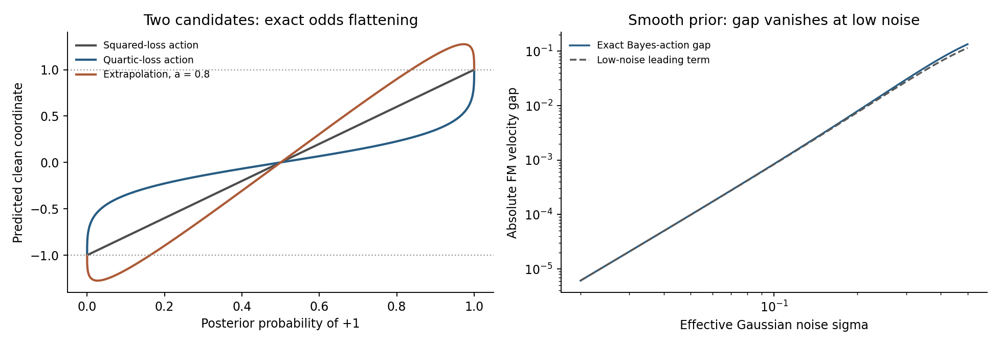
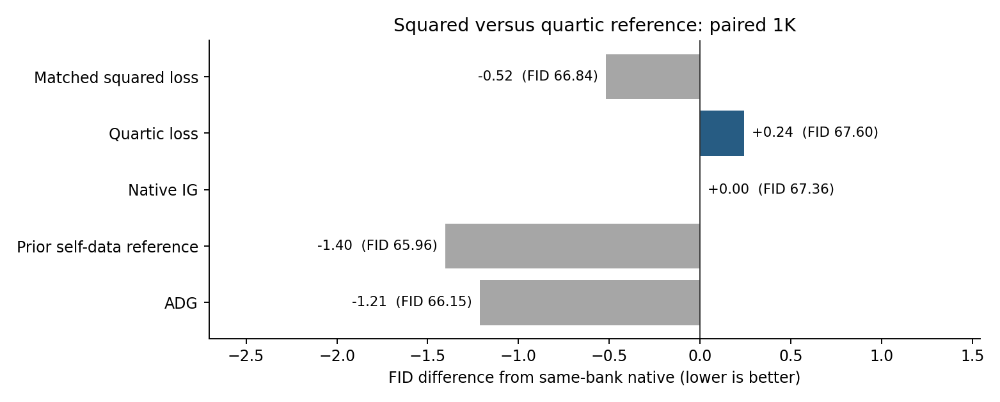
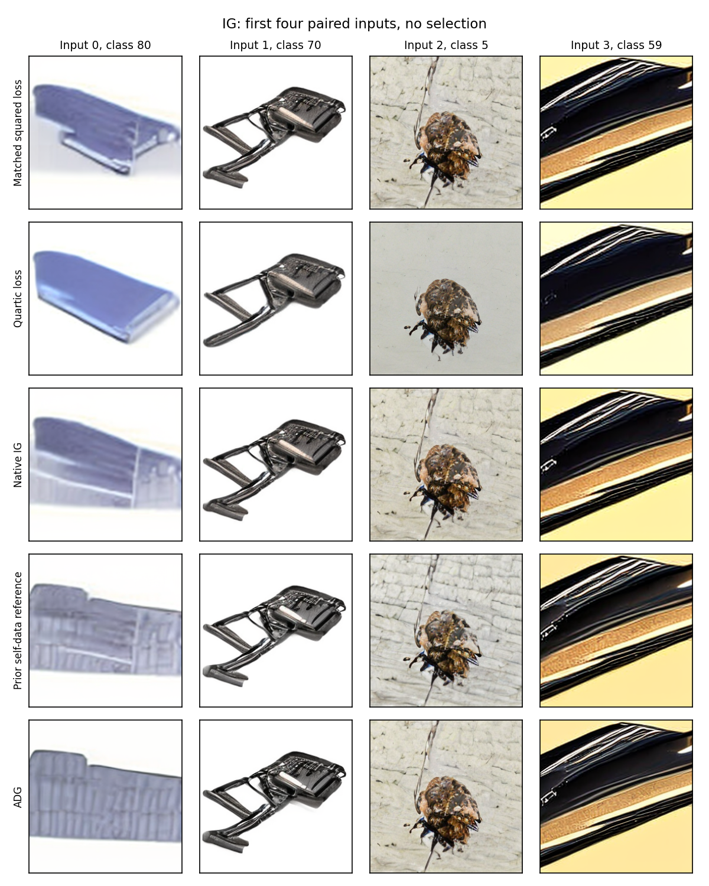

# 用训练损失定义弱参考

本轮检验一个直接的IG构造：强模型保持原有预测，内部弱读出以真实数据的四次误差损失训练。监督为线性flow matching的真实样本速度，不使用任何模型预测作教师。目标是让弱参考表达一种可推导的后验统计偏差，观察强减弱是否有生成收益。

<!-- STATUS_START -->
两个真实数据读出和五组新配对1K均已完成，原始样本与缓存指标核验通过。四次损失未通过推进门槛，未启动5K、迁移或损失指数网格。
<!-- STATUS_END -->

## 从预测的统计含义出发

给定噪声状态z和时间t，平方误差的无限容量最优估计是条件均值。训练损失改变估计的条件统计量是经典决策理论；Noise2Noise也直接使用了这一事实，区分均值、median及mode目标。[Noise2Noise，§2](https://proceedings.mlr.press/v80/lehtinen18a/lehtinen18a.pdf)。本轮不能认领这项基本事实的原创性，研究对象是将特定非平方风险的读出作为IG负参考是否有效。

记条件随机变量为X，设四阶矩有限。逐坐标考虑

\[
m_2=\arg\min_b\mathbb E[(b-X)^2\mid z,t],
\qquad
m_4=\arg\min_b\mathbb E[(b-X)^4\mid z,t].
\]

m2是均值。m4更重视偏离预测较远的候选，所以在某些不对称后验中会更靠近次要候选。它不是“训练得更差”的同一均值，也不是拟合另一个网络；即使都训练到各自最优值，两个目标仍可能不同。

IG原工作提供了共享中间特征与廉价内部读出的计算结构。[Internal Guidance](https://arxiv.org/abs/2512.24176)。本轮保持原结构，明确改变被估计的统计量。AG的强弱密度比解释不自动适用于这个新的非平方读出，因此以下以Bayes action和速度场表述，不假定它是高斯平滑后的score。[Autoguidance](https://arxiv.org/abs/2406.02507)。

## 两个候选时，弱参考压平赔率

设后验只取两个不同值a、b，权重为p、1-p。四次风险的一阶条件为

\[
p(m_4-a)^3+(1-p)(m_4-b)^3=0.
\]

由此得到

\[
m_4=\frac{p^{1/3}a+(1-p)^{1/3}b}{p^{1/3}+(1-p)^{1/3}}.
\]

它把原赔率p/(1-p)替换为其三次方根。例如候选为+1与-1，权重.9与.1，m2=.8，m4约.3507。额外强度.8的外推给出约1.1595，说明它确实向优势候选推进，也立即暴露了越过支持集的问题。不能从“参考保留次要可能性”推出整个guided输出保持在候选凸包或图像流形内。

这个两点结论还适用于任意维度的两个确定候选、逐坐标四次损失，因为每个坐标的距离因子在最优性条件中抵消。但有三个以上候选或有不同的簇内离散程度时，一般不再等价于后验概率的统一乘幂。本轮保留一个三点反例，两者预测相差约.23939，而不是把两点等式推广成完整图像分布定理。

## 精确决定修正的是第三中心矩

令mu=E[X|z,t]、V=Var(X|z,t)、kappa3=E[(X-mu)^3|z,t]，写m4=mu+delta。最优性条件严格化为

\[
\delta^3+3V\delta-\kappa_3=0.
\]

V>0时左侧严格单调，实根唯一，并且delta与kappa3同号。因此IG中理想的m2-m4沿第三中心矩的反方向：更远、更稀少的尾部会把m4拉向自己，而强减弱会向相反方向推进。

这给出比“只要多峰就有效”更严格的预测：第三中心矩为零就没有这个修正。对称高斯、对称双峰都无修正；有些不对称分布也可能第三中心矩恰为零。它不能识别全部后验不确定性，更不能保证被压制的尾部是错误样本。稀有但正确的模式也可能被压制，导致覆盖下降。FID、sFID、IS应分别报告，不能用一项指标宣称全面质量改善。

当偏斜较小时，delta约为kappa3/(3V)。这里的V只用于解释最优统计量，实际采样不估计方差、不分解向量，也不据局部读数调guidance系数。所有非线性由离线训练的同一个弱读出承担。

## 为什么低噪声下可能自然变弱

在一维Gaussian观察Y=X+sigma epsilon中，设平滑密度为p_sigma(y)，score为s_sigma。条件累积量满足

\[
V=\sigma^2+\sigma^4\partial_y s_\sigma(y),
\qquad
\kappa_3=\sigma^6\partial_y^2s_\sigma(y).
\]

这是由Gaussian似然的对数配分函数求导得到的Tweedie累积量关系；Efron的§2明确写出了通过配分函数求导得到后验累积量的推导。[Tweedie’s Formula and Selection Bias](https://pmc.ncbi.nlm.nih.gov/articles/PMC3325056/)。代回上式，在相关导数有界、V/sigma²远离零且sigma趋于零时，

\[
m_4-m_2=\frac{\sigma^4}{3}\partial_y^2s_\sigma(y)+O(\sigma^6).
\]

线性FM中令Y=z/t，sigma=(1-t)/t；两种clean统计量的速度差为(m2-m4)/(1-t)。在上述正则条件下，它随t趋于1以O((1-t)^3)消失。这个推导描述精确后验统计量的差，不保证有限读出也有同样渐近行为。真实图像分布接近低维流形、密度导数不有界或读出存在误差时，条件可能不成立；本轮也仍保留既有IG截止时间，没有据此声称可以取消截止。

一个光滑Gaussian混合先验的解析计算核对累积量关系及低噪声渐近式。图中也保留两点外推超过候选支持的现象。[计算记录](data/bayes_risk_reference_20260912/theory_checks.json)、[两点曲线](data/bayes_risk_reference_20260912/two_point_curves.csv)、[低噪声曲线](data/bayes_risk_reference_20260912/low_noise_curves.csv)。

## 本轮实现与判定

固定SiT strong和共享第四层特征，两个301840参数读出均从原IG头初始化。使用互斥真实训练／验证池，训练目标为u=X-epsilon；每个输入z=tX+(1-t)epsilon，t在(.01,.99)均匀采样。square目标为mean((W-u)^2)/2；quartic目标为mean((W-u)^4)/4。两头采用完全相同的真实数据、噪声、时间、训练步数和优化器设置。没有教师监督，也没有生成数据监督。

训练3000步、B32、AdamW1e-4、EMA.995，固定最终EMA。质量评估使用一组新的配对1000输入，同时重跑同预算square、原IG、既有自身数据参考、ADG四个对照。全部保持Heun64及原IG强度和截止，每图128次full与0次prefix；实际耗时另报。四次损失必须比所有对照低至少.5 FID，才进入固定权重的新5K。协议和实现冻结于质量采样前，不搜索损失指数或增加容量。[冻结协议](SIT_BAYES_RISK_REFERENCE_PROTOCOL_20260912_ZH.md)。

<!-- RESULTS_START -->
**新配对1000图**

|方法|FID↓|sFID↓|IS↑|Full/prefix|采样与解码GPU秒|
|---|--:|--:|--:|--:|--:|
|同预算MSE|66.8430|209.3841|35.4724|128/0|97.56|
|四次损失|67.6047|208.7578|35.3249|128/0|99.42|
|原IG|67.3618|209.0969|36.1081|128/0|100.66|
|已有自身数据参考|65.9570|209.9788|36.8795|128/0|101.45|
|ADG|66.1495|208.7074|35.9884|128/0|113.15|

|训练目标|参数|训练GPU秒|保留集MSE|保留集四阶误差|
|---|--:|--:|--:|--:|
|ig_square|301840|45.72|0.909275|2.900898|
|ig_quartic|301840|45.26|0.912816|2.876190|

共同初始化的保留集MSE为0.909214、四阶误差为2.898761。两个训练合计90.98 GPU秒，全部质量采样/解码合计512.24 GPU秒。时间不含加载、数据读取、特征提取与审计；不把相同前向次数说成延迟完全相同。

四次损失相对同预算MSE的FID差为+0.7618。推进名单[]，确认名单[]。

[逐组质量与成本](data/bayes_risk_reference_20260912/results.csv) · [训练与保留集记录](data/bayes_risk_reference_20260912/training.csv)

固定展示首批前4个输入，无图像筛选；不由这4张图推断总体效果。

<!-- RESULTS_END -->

**当前固定构造未通过质量筛查。** quartic的FID比同预算square高.7618，比原IG高.2430，比已有自身数据参考高1.6477。它的sFID优于square和原IG、略劣于ADG，所以不能写成所有指标都退化；但预设FID门槛未通过，不进入5K或迁移。保留集四阶误差从2.898761降到2.876190，同时MSE升到.912816，只支持训练改变了其风险侧重，不能说明学到了精确后验统计量。两个训练和全部质量进程均已结束，不追加指数或训练步数。

[完整图表数据工作簿](data/bayes_risk_reference_20260912/research_data.xlsx)包含质量、训练、两点后验及低噪声曲线四张表；[最终核验](data/bayes_risk_reference_20260912/final_verification.json)记录源码、输入、停止状态和原始质量审计。文献的本地快照与SHA见[来源清单](../readings/bayes_risk_reference_20260912/source_manifest.json)。

## 结论的边界

即使quartic胜过square，当前对照也只证明这个固定loss改动有效。有限模型中高次风险还会增加尾部和大误差样本的训练权重，改变不同时间的有效拟合侧重。只有进一步区分这些作用、得到独立确认并超过强对照，才能把后验统计解释发展成有证据的机制。反过来，如果训练达成各自目标却生成没有收益，就停止当前配置；不通过增加指数、层数或系数网格来维持假说。

目前理论定位是：经典Bayes risk的一种IG用途，具有两点赔率恒等式、第三矩条件和明确反例。检索过loss／Lp／quartic与diffusion guidance等组合，尚未找到完全相同的参考构造；这不是原创性证明。已有非MSE图像回归和各种loss-based diffusion guidance必须区分：后者常在采样时对外部任务loss求梯度，本轮是在训练时改变内部负参考的回归目标。

纯CFG保持独立主线。前一轮的候选概率组合49.6644、同读出均值外推49.4846，均劣于原CFG45.1793与APG43.6182；这些属于前一组噪声，不能与本轮IG数值直接比较。该具体CFG构造停止追加调参，新的IG风险目标没有被机械复制到null分支。[前轮完整报告](CFG_IG_COMPILED_RESEARCH_20260912_ZH.md)。
