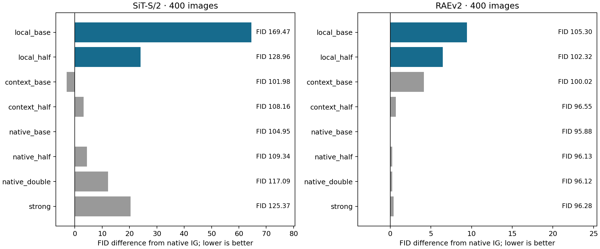
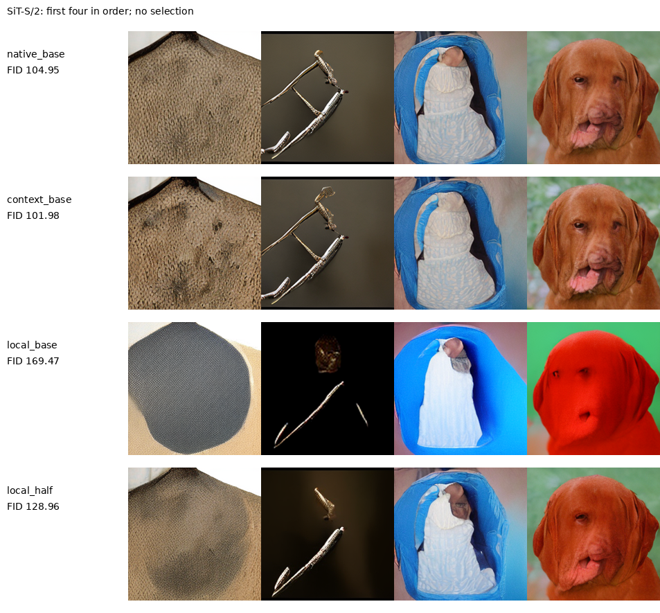
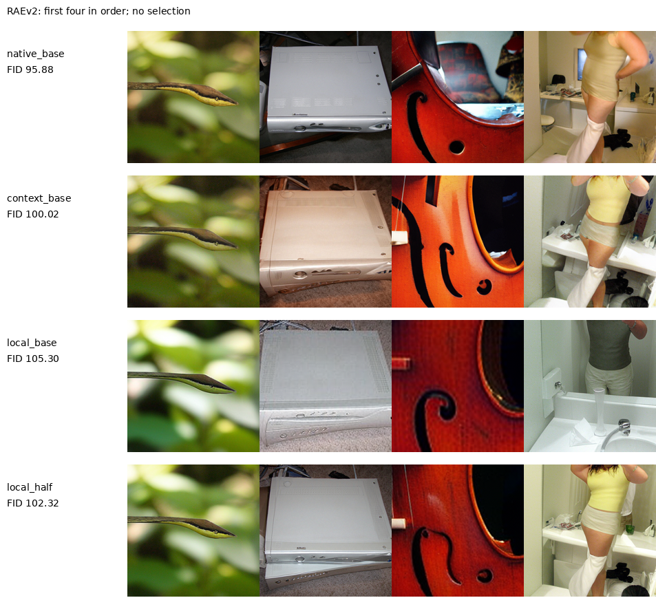

# 输入局部内部参考的真实生成检验

所有Local候选均未通过冻结筛选，当前输入局部构造结束；未为Local启动1K／5K、重新训练或超参数搜索。

本轮补完用户粘贴文本中的备用方案：两模型的Local／Context读出此前均已用真实数据训练3000步，但生成被暂缓。本轮直接使用保留的最终EMA，在新输出目录完成原先固定的16臂、每臂400张、共6400张单路径图像。这不是新提出的idea，也没有替换共同污染与加性残差的主要分布假设。纯CFG目标仍在继续，本轮没有新的CFG生成候选。

| model     | candidate   |   candidate_fid | best_control   |   best_control_fid |    delta |   native_fid |   context_same_strength_fid |   inception_ratio | passes   |
|:----------|:------------|----------------:|:---------------|-------------------:|---------:|-------------:|----------------------------:|------------------:|:---------|
| sit_small | local_base  |         169.47  | context_base   |           101.982  | 67.4879  |     104.948  |                    101.982  |          0.418901 | False    |
| sit_small | local_half  |         128.958 | context_base   |           101.982  | 26.976   |     104.948  |                    108.155  |          0.76676  | False    |
| raev2     | local_base  |         105.3   | native_base    |            95.8752 |  9.4249  |      95.8752 |                    100.019  |          0.981469 | False    |
| raev2     | local_half  |         102.323 | native_base    |            95.8752 |  6.44736 |      95.8752 |                     96.5504 |          1.05054  | False    |

SiT的Context对照在400图上比原IG最好幅度低约2.97 FID，RAEv2的Context没有超过原IG。SiT这一意外信号已按[单独冻结的事后选择协议](CONTEXT_REFERENCE_CONFIRM_PROTOCOL_20260912_ZH.md)进入全新1K，加入原IG三档、ADG和Strong。它不改变本轮Local失败与无晋级的判断，也不能据此宣称原候选成功。

Local只读取第一次attention前的空间token、原始时间／类别条件和固定位置编码。Context读取第4／8层后的token，使用完全相同的读出结构、初始参数、训练数据与批次。两者的差别是可用上下文，实际拟合难度仍不同。

在理想总体MSE最优、表示能够保留对应输入信息的条件下，局部clean预测为 $E[X_j\mid Z_j,t,c,j]$，与各patch条件边缘的乘积分布相容。强弱score之差因此可强调跨patch依赖。有限容量、有限训练头及冻结主干误差都不保证实现该密度关系。RAE的单token已是语义latent，不能把它称为原图局部感受野。该假说不意味着弱分布是强分布的高斯平滑，也不自动满足共同污染的混合关系。

以质量对照检验信息限制：只有胜过Context、原IG不同幅度和Strong全部6个非Local对照至少2 FID、且IS保留原IG的90%，才允许进入新1K。Local仅优于Context不能作为成功。400图只是筛选，RAE仅覆盖400类，不能用其小幅FID变化支持完整ImageNet的统计结论。

## 全部生成与成本

| model     | arm           |      fid |   inception_score |   seconds |   primary_samples |   generated_paths |   full_calls_per_output |   prefix_calls_at_inference |
|:----------|:--------------|---------:|------------------:|----------:|------------------:|------------------:|------------------------:|----------------------------:|
| sit_small | local_base    | 169.47   |           12.895  |   41.7156 |               400 |               400 |                     128 |                           0 |
| sit_small | local_half    | 128.958  |           23.603  |   39.5667 |               400 |               400 |                     128 |                           0 |
| sit_small | context_base  | 101.982  |           35.4629 |   41.1753 |               400 |               400 |                     128 |                           0 |
| sit_small | context_half  | 108.155  |           31.4144 |   39.1281 |               400 |               400 |                     128 |                           0 |
| sit_small | native_base   | 104.948  |           30.7828 |   38.0442 |               400 |               400 |                     128 |                           0 |
| sit_small | native_half   | 109.339  |           31.9956 |   37.9695 |               400 |               400 |                     128 |                           0 |
| sit_small | native_double | 117.088  |           25.9461 |   38.3265 |               400 |               400 |                     128 |                           0 |
| sit_small | strong        | 125.37   |           25.662  |   38.29   |               400 |               400 |                     128 |                           0 |
| raev2     | local_base    | 105.3    |           26.1217 |  321.704  |               400 |               400 |                     100 |                           0 |
| raev2     | local_half    | 102.323  |           27.96   |  321.046  |               400 |               400 |                     100 |                           0 |
| raev2     | context_base  | 100.019  |           26.9115 |  321.177  |               400 |               400 |                     100 |                           0 |
| raev2     | context_half  |  96.5504 |           26.9369 |  321.22   |               400 |               400 |                     100 |                           0 |
| raev2     | native_base   |  95.8752 |           26.6149 |  318.925  |               400 |               400 |                     100 |                           0 |
| raev2     | native_half   |  96.1264 |           26.7273 |  320.106  |               400 |               400 |                     100 |                           0 |
| raev2     | native_double |  96.1191 |           26.4363 |  320.232  |               400 |               400 |                     100 |                           0 |
| raev2     | strong        |  96.2788 |           25.7699 |  320.476  |               400 |               400 |                     100 |                           0 |

每图SiT为128次full、RAEv2为100次full，额外prefix为0。全部样本单独进入主评价，不做图像挑选或粒子重复。原生弱输出与Strong来自原共享前向；Local／Context额外读出只有被使用时才求值。

| model     | arm          |   batch |   repeats |   native_seconds |   candidate_seconds |   relative_change |   extra_parameters |
|:----------|:-------------|--------:|----------:|-----------------:|--------------------:|------------------:|-------------------:|
| sit_small | local_base   |       8 |         3 |          0.73659 |            0.754167 |        0.0238627  |             304528 |
| sit_small | context_base |       8 |         3 |          0.73659 |            0.753772 |        0.0233257  |             304528 |
| raev2     | local_base   |       4 |         3 |          3.19669 |            3.22438  |        0.00866084 |            5635744 |
| raev2     | context_base |       4 |         3 |          3.19669 |            3.22684  |        0.00942934 |            5635744 |

计时为同卡、同批量，预热后各3次完整采样和解码。原IG不安装捕获hook，候选安装，故相对耗时包含这项实现开销。额外头参数、内存操作和延迟已单列，没有把相同主干NFE表述成完全零成本。

## 保留的训练与实现检查

| model     |   steps |   batch |   training_seconds |   parameters_per_head |   local_validation_mse |   context_validation_mse |
|:----------|--------:|--------:|-------------------:|----------------------:|-----------------------:|-------------------------:|
| sit_small |    3000 |      32 |            30.2425 |                304528 |               1.10098  |                 0.883548 |
| raev2     |    3000 |       8 |            67.0889 |               5635744 |               0.518027 |                 0.305192 |

训练秒数是历史两头联合训练循环耗时，不是本轮新增训练，也不含模型加载和数据准备。训练请求的源文件、数据及checkpoint哈希已重新核验。模型参数仍冻结；hook不改变原Strong／Weak输出；只改目标patch外的输入时Local该patch预测逐位不变；共享捕获与直接embedding／prefix计算逐位一致；零引导恢复Strong。这些检查验证实现与成本，不证明生成机制或总体密度假说。

## 已有工作与取舍

[Sliding Window Guidance](https://bmva-archive.org.uk/bmvc/2025/assets/papers/Paper_26/paper.pdf)已有通过限制远程输入构造参考的路线。本轮使用共享embedding上的局部读出，不认领“局部参考”本身。[SSG预印本](https://arxiv.org/html/2607.29122v1)研究冻结像素模型、训练中间adapter并用其自身生成样本监督；这也排除了将冻结主干加小头当作普遍新贡献。本轮只用真实数据，未恢复已停止的合成数据／蒸馏路线。

本轮结果与既有共同污染反演、反射交替分别记录，不用失败候选之间的局部胜出缩小长期成功要求。仍须取得有实质新意、解释性理论和可靠同预算收益的核心方法，长期目标未完成。

[原协议](IG_INPUT_LOCAL_PROTOCOL_20260912_ZH.md) · [补完协议](IG_INPUT_LOCAL_COMPLETION_20260912_ZH.md) · [源数据工作簿](data/input_local_completion_20260912/source_data.xlsx) · [核验记录](data/input_local_completion_20260912/verification.json) · [原文归档](../readings/input_local_completion_20260912/source_manifest.json)。
