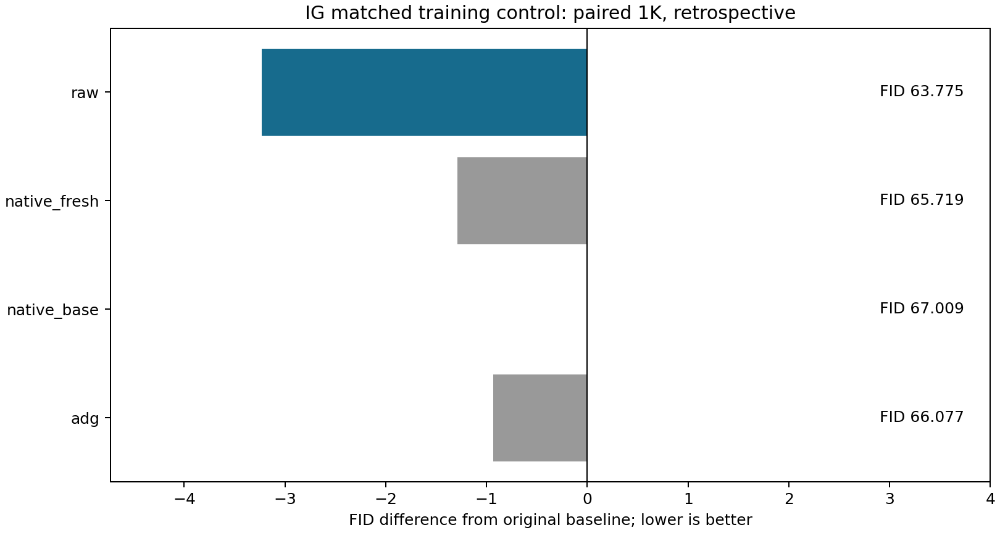
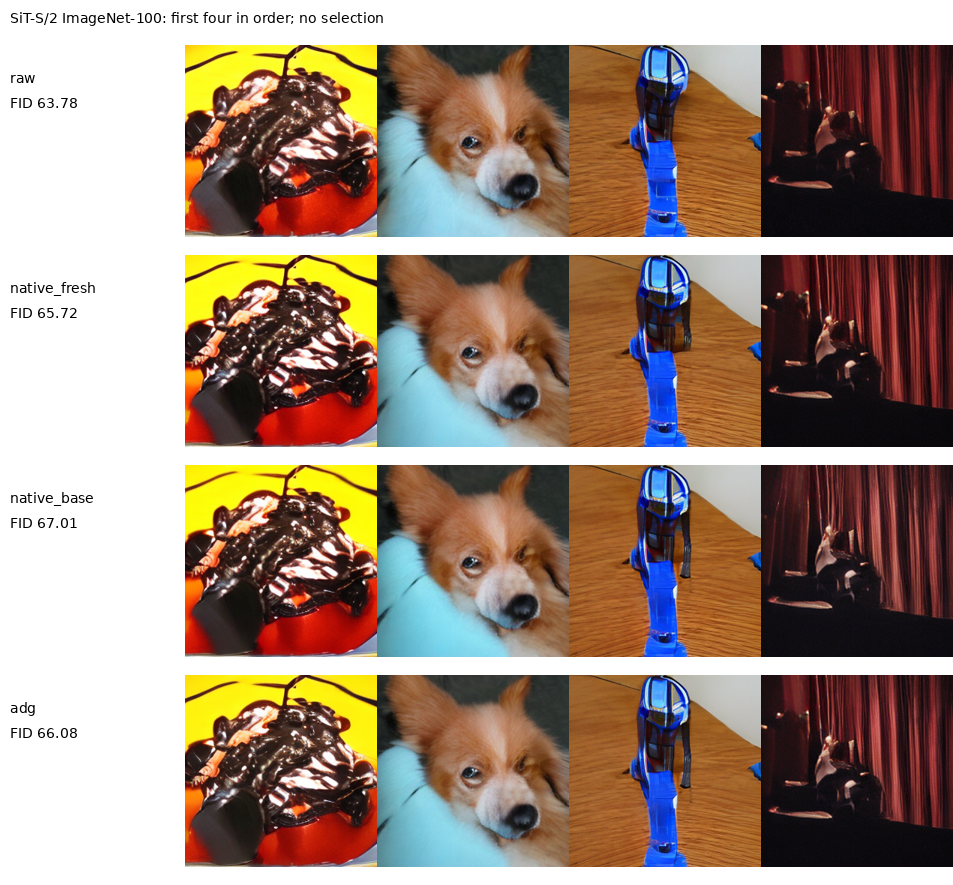

# IG原结构读出的等训练补充控制

相同3000步训练后，原结构新头FID为65.7192，保留MLP为63.7752；MLP仍低1.9440并满足IS门槛。因此训练配置变化没有解释掉全部差异，整套读出结构与输入处理应继续保留为研究因素。原结构重训也比旧头67.0089改善1.2896，不能把原来的全部收益归于结构，更不能将这些FID差值作可加的因果贡献分配。

这是看到先前生成结果后的补充控制。只新生成原结构新头1000图，复用已保存Raw、原IG及ADG各1000图；种子2026121341，第一噪声、备用第二噪声及标签文件逐个SHA一致。第二噪声不参与生成，每类10图、每图一条路径。它不是新独立确认，也不是4000张新图。原结构保留AdaLN+Linear和原条件输入，从官方零初始化开始；MLP同批次重放最终EMA逐tensor等于保留权重。强模型、depth4、真实数据、clean/噪声/时间、batch32、优化器、EMA与IG设置均固定。两头的输入标准化、参数化和位置输入仍不同，不能唯一归因于MLP非线性。

| arm          |     fid |   inception_score | newly_generated   |   full_calls_per_output |
|:-------------|--------:|------------------:|:------------------|------------------------:|
| raw          | 63.7752 |           39.1047 | False             |                     128 |
| native_fresh | 65.7192 |           36.351  | True              |                     128 |
| native_base  | 67.0089 |           35.4437 | False             |                     128 |
| adg          | 66.0774 |           36.1518 | False             |                     128 |

所有质量比较均为64步Heun、128次full、0额外prefix。原结构新旧头均301,840参数，下表只比较本轮同卡的新旧原结构完整采样与解码。保留MLP为304,528参数，直接替换原弱头后净增2,688；另一组已核验同卡计时相对原IG增加0.29%，24条完整轨迹与原捕获实现像素及latent逐项一致。两批计时独立，不跨批相除。[可复用入口与成本记录](CONTEXT_REFERENCE_DIRECT_READOUT_20260913_ZH.md)保留全部证据。

| arm             |   median_seconds |   min_seconds |   max_seconds |   relative_to_original |   batch |   repeats |
|:----------------|-----------------:|--------------:|--------------:|-----------------------:|--------:|----------:|
| native_original |         0.739531 |      0.739149 |      0.740065 |            0           |       8 |         3 |
| native_fresh    |         0.739623 |      0.738438 |      0.740664 |            0.000124742 |       8 |         3 |

共享训练循环时间不含加载与最终验证；验证MSE未用于挑checkpoint或调整方案。

| arm          |   validation_mse |   parameters |   steps |   shared_loop_seconds |
|:-------------|-----------------:|-------------:|--------:|----------------------:|
| raw          |         0.883548 |       304528 |    3000 |               32.3169 |
| native_fresh |         0.92335  |       301840 |    3000 |               32.3169 |

本检验通过的是固定效应门槛，没有估计多训练种子置信区间。3000步是固定比较预算，未证明两个优化问题都已收敛，未区分结构容量、优化速度、位置输入及输入处理。验证MSE只记录，不等同采样质量。它也没有识别共同污染系数或加性误差场。[此前独立5K](CONTEXT_REFERENCE_5K_RESULTS_20260912_ZH.md)仍支持具体SiT读出收益，[归一化检验](IG_READOUT_NORMALIZATION_RESULTS_20260912_ZH.md)没有支持统计丢失解释，RAEv2的原400图也未见相同收益。[SSG](https://arxiv.org/html/2607.29122v1)已有冻结中间adapter的先例，不能把小MLP本身包装成核心新意。

全部新生成样本的逐批图像、标签、噪声、请求及源码/权重SHA和调用数已核对，FID从同一Inception缓存特征用FP64复算；这不是独立特征提取器验证。复用对照沿用已核验FID，同时重新校验样本、指标、特征与参考统计SHA。

[冻结协议](IG_READOUT_MATCHED_CONTROL_PROTOCOL_20260913_ZH.md) · [源数据工作簿](data/ig_readout_matched_control_20260913/source_data.xlsx) · [判定](data/ig_readout_matched_control_20260913/decision.json) · [核验记录](data/ig_readout_matched_control_20260913/verification.json)。
