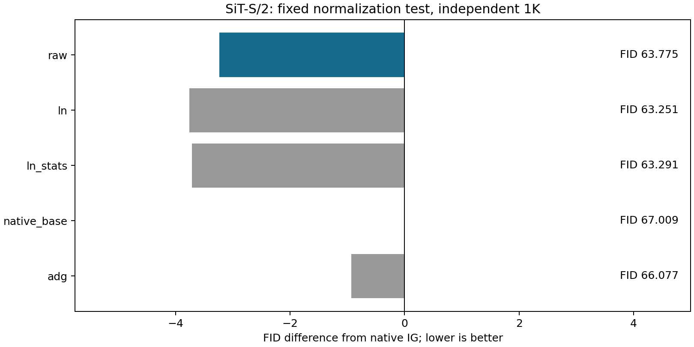
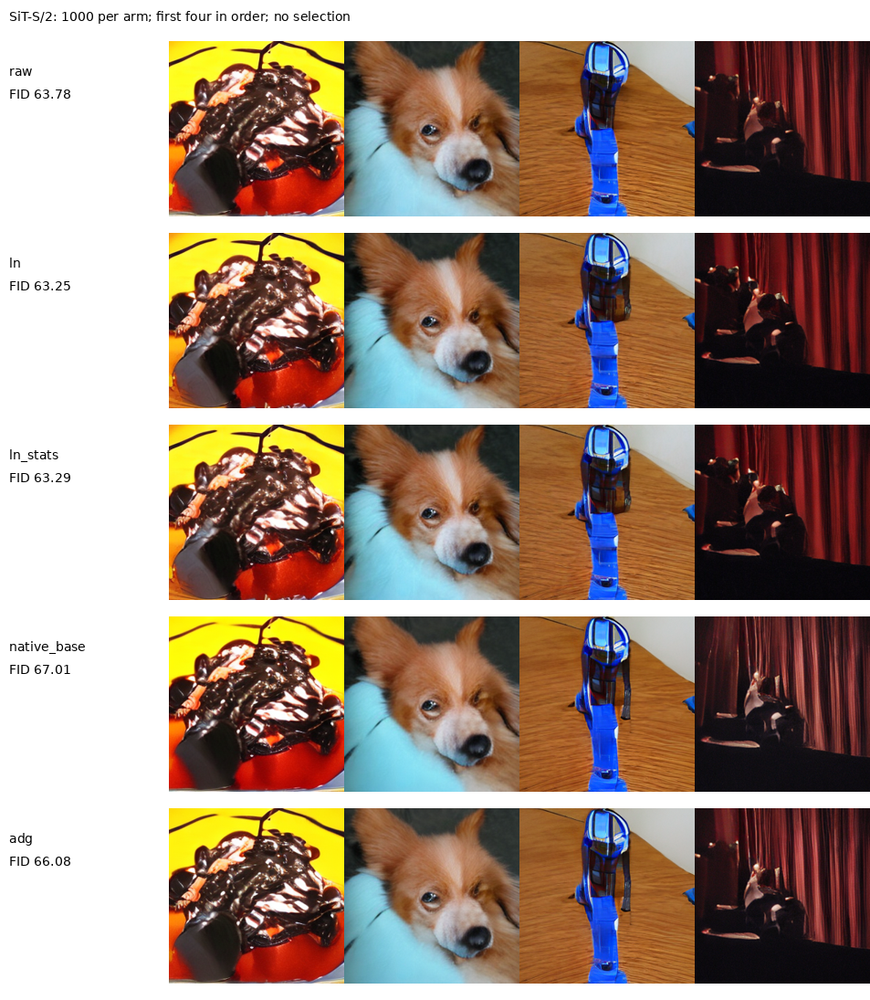

# 归一化统计解释的真实生成检验

固定生成对照没有支持“归一化统计解释当前收益”这一完整预测。

三个参考共享相同depth4特征、训练数据、噪声、时间、MLP宽度、训练3000步和最终EMA。Raw保留原特征，LN先做token内LayerNorm，LN+stats另输入均值与带epsilon的尺度。后者只增加768个权重，没有引导系数、局部门控或额外前缀。Raw最终EMA与旧Context逐tensor比较的结果也保留。每臂1000个新噪声、每类10图，同128次full，与原IG和ADG一起评估。

| arm         |     fid |   inception_score |   primary_samples |   full_calls_per_output |
|:------------|--------:|------------------:|------------------:|------------------------:|
| raw         | 63.7752 |           39.1047 |              1000 |                     128 |
| ln          | 63.2511 |           38.5581 |              1000 |                     128 |
| ln_stats    | 63.291  |           38.5823 |              1000 |                     128 |
| native_base | 67.0089 |           35.4437 |              1000 |                     128 |
| adg         | 66.0774 |           36.1518 |              1000 |                     128 |

固定判定：

- raw_fid: 63.77517942586394
- ln_fid: 63.25106893236915
- ln_stats_fid: 63.29099472943142
- ln_minus_raw: -0.5241104934947884
- stats_minus_ln: 0.039925797062267065
- stats_minus_raw: -0.4841846964325214
- raw_beats_controls_by_one: True
- removing_statistics_hurts_by_one: False
- restoring_statistics_recovers: False
- passes_fixed_mechanism_prediction: False
- single_training_seed: True
- raw_replay_exact: True
- causal_identification_complete: False
- goal_complete: False

同卡轮换计时包含完整采样及解码，加载与审计另计。

| arm         |   median_seconds |   batch |   repeats |   seconds_relative_to_native |
|:------------|-----------------:|--------:|----------:|-----------------------------:|
| raw         |         0.770154 |       8 |         3 |                    0.0190025 |
| ln          |         0.778792 |       8 |         3 |                    0.030431  |
| ln_stats    |         0.779039 |       8 |         3 |                    0.030759  |
| native_base |         0.755792 |       8 |         3 |                    0         |
| adg         |         0.79083  |       8 |         3 |                    0.0463586 |

| mode     |   validation_mse |   parameters |   steps |   shared_loop_seconds |   raw_replay_max_difference |
|:---------|-----------------:|-------------:|--------:|----------------------:|----------------------------:|
| raw      |         0.883548 |       304528 |    3000 |               39.9282 |                           0 |
| ln       |         0.889707 |       304528 |    3000 |               39.9282 |                           0 |
| ln_stats |         0.88967  |       305296 |    3000 |               39.9282 |                           0 |

这是看到SiT/RAEv2差别后提出的解释候选。epsilon非零时不能宣称LayerNorm严格消除全部尺度信息；有限容量、优化和特征流形可能影响结果。单训练种子和单1K不提供普遍因果结论，训练MSE不作为方法成功或采样质量的替代。归一化统计的移除与恢复已有RevIN先例。

[ADG](https://arxiv.org/html/2506.11039v1)是既有基线；[SSG](https://arxiv.org/html/2607.29122v1)已研究冻结中间adapter；[RevIN官方代码](https://github.com/ts-kim/RevIN)提供恢复实例统计的相关先例。这些先例用于限定贡献边界，不代表它们证明本实验的解释。

审计核对全部标签、噪声和源码/权重hash、单条生成路径及调用数，并从同一缓存特征FP64复算FID。它不构成独立特征提取器验证。

[冻结协议](IG_READOUT_NORMALIZATION_PROTOCOL_20260912_ZH.md) · [源数据工作簿](data/ig_readout_normalization_20260912/source_data.xlsx) · [核验记录](data/ig_readout_normalization_20260912/verification.json)。
