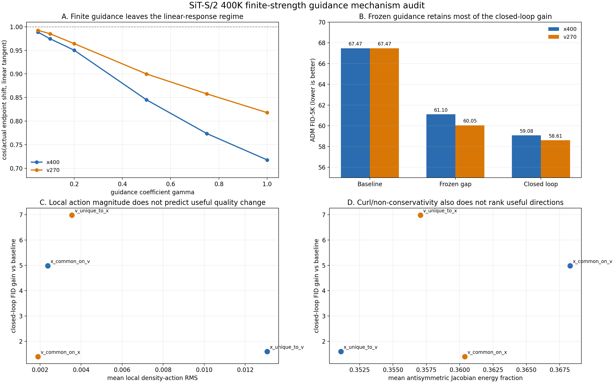
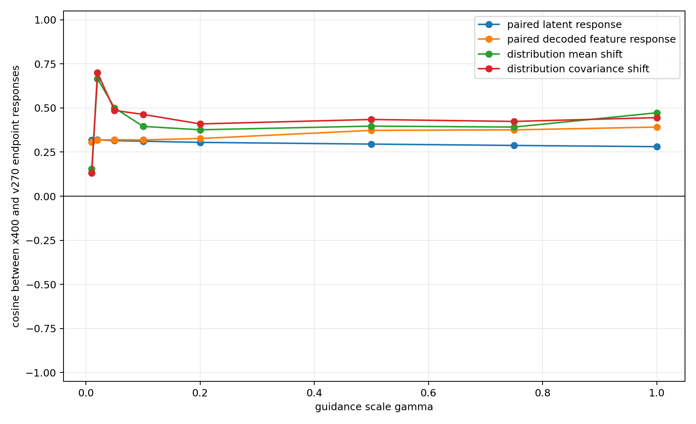
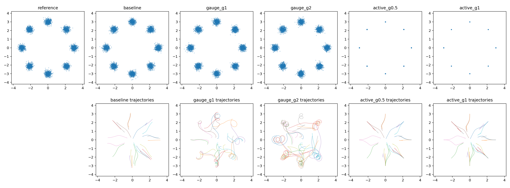

# ImageNet-100 SiT 400K 有限强度 Guidance 动力学审计

## 1. 结论

本轮研究回答的是一个很窄但关键的问题：

> `v400 - x400` 与 `v400 - v270` 带来的 FID 改善，主要是小扰动的局部 density-ratio 效应，还是依赖有限强度闭环反馈？

结果不是二选一，而是一个边界清楚的混合结论：

1. **`gamma=1` 明确不是线性小扰动。** 相对 `gamma=0` 的变分切向，`x400` 方向的 endpoint cosine 降到 `0.718`，相对残差达到 `0.830`；`v270` 方向分别为 `0.818` 和 `0.724`。不能用一阶 Taylor 展开直接解释正式 FID 改善。
2. **闭环反馈不是收益存在的必要条件。** 将 weak-strong gap 冻结在配对的无 guidance 轨迹上，`x400` 方向仍把 FID 从 `67.47` 降到 `61.10`，保留闭环总改善的 `75.9%`；`v270` 方向降到 `60.05`，保留 `83.7%`。
3. **闭环反馈有稳定但次要的增益。** 重新在 guided state 上计算 gap，FID 进一步变为 `59.08` 和 `58.61`。闭环反馈分别贡献总改善的约 `24.1%` 和 `16.3%`。
4. **普通 Euclidean geometry 不足以解释质量。** common/unique 分量的场能量、局部 density-action 大小、curl/非保守程度，都不能正确排列它们的 FID 收益。
5. **AutoGuidance 的局部 density-ratio 解释只能覆盖一部分。** 三个单独模型场都近似 conservative，但两个 weak-strong gap 以及 common/unique 分量都显著 non-conservative。有限模型差值不能整体视为某个严格的 log-density ratio 梯度。
6. **精确 gauge toy 给出非微扰反例。** 一个很大的有限强度向量场可以显著改变单条轨迹，却精确保持所有时刻的 marginal density；相同逐点范数的 density-active 场则明显改变终点分布。

目前最准确的机制表述是：

> 400K weak-to-strong guidance 的主要收益，已经编码在无 guidance 轨迹上的有限幅度控制场中；state feedback 会继续放大收益，但不是主因。终点质量取决于一个有符号、经过时间运输的密度响应，而不是场的范数、cosine、局部 action 绝对值或 curl 中任意一个标量。

本轮没有训练 800K 模型，也没有把 800K 结果混入结论。



## 2. 实验对象与记号

固定强模型为：

```text
v400 = SiT-S/2 native velocity, 400K, EMA
```

比较两个弱模型：

```text
x400 = SiT-S/2 clean-x output + velocity-space loss, 400K, EMA
v270 = SiT-S/2 native velocity, 270K, EMA
```

两条 guidance 方向为：

```text
u_x(z,t) = v400(z,t) - x400(z,t)
u_v(z,t) = v400(z,t) - v270(z,t)
```

完整闭环采样使用：

```text
dz/dt = v400(z,t) + gamma * u(z,t)
```

正式主结果使用 `gamma=1`，即 `2 * v400 - weak`。

为分离反馈作用，frozen-gap 条件同时积分一条无 guidance 基线轨迹 `z_base`：

```text
dz_base/dt   = v400(z_base,t)
dz_frozen/dt = v400(z_frozen,t) + gamma * u(z_base,t)
```

这里强模型仍在当前 `z_frozen` 上计算，只有 guidance increment 冻结在 `z_base` 上。因此它隔离的是 weak-strong gap 的反馈，不是把整个 ODE 变成预录速度序列。

## 3. 配对与公平性

正式 FID 条件满足：

- ImageNet-100，同一 validation reference；
- 5000 张样本；
- CFG=`1`；
- EMA 权重；
- fp32 模型输出；
- 相同 Dopri5 容差与采样协议；
- baseline、frozen-gap、closed-loop 使用完全相同的初始噪声和类别。

两组 frozen/closed 的配对哈希均为：

```text
noise_sha256 = bb460ea94ef337bca3b15f07d0d136d2fe286168c5afef96aeda2e4757f5c143
label_sha256 = dd55c4ee2ce9e86812f5dd9dbf7262467ac6fda3d319e21ec8716ce7292f6e46
```

类别直方图也逐项一致。采样峰值 PyTorch 显存约 `1.12 GiB`；ADM evaluator 的 TensorFlow 显存上限固定为单卡 `25%`。

两种条件使用同一个 adaptive Dopri5 和相同误差容差，但实际 NFE 由各自动力学决定，并非固定计算量：`x400` 的 frozen/closed 总 NFE 为 `37166/42632`，`v270` 为 `32996/35402`。因此本表是数值精度协议匹配，不是 FLOPs 匹配。独立 solver audit 显示 Heun-100 与严格 Dopri5 endpoint 的相对差只有约 `0.1%-0.3%`，没有看到闭环优势由积分未收敛制造的迹象。

## 4. Finite-gamma 线性度

令 `z_1(gamma)` 是 guided endpoint，`xi_1` 是 `gamma=0` 处由变分 ODE 得到的严格切向：

```text
d xi / dt = J_v(z_base,t) xi + u(z_base,t),  xi(0)=0
```

比较真实 endpoint shift 与 `gamma * xi_1`：

| gamma | x400 cosine | x400 相对残差 | v270 cosine | v270 相对残差 |
|---:|---:|---:|---:|---:|
| 0.02 | 0.996 | 0.047 | 0.996 | 0.041 |
| 0.10 | 0.974 | 0.187 | 0.985 | 0.139 |
| 0.20 | 0.950 | 0.307 | 0.964 | 0.248 |
| 0.50 | 0.845 | 0.581 | 0.900 | 0.481 |
| 1.00 | 0.718 | 0.830 | 0.818 | 0.724 |

结论：`gamma<=0.1` 仍可作为局部线性近似，`gamma=0.5` 已有明显非线性，`gamma=1` 不能再由一阶响应定量解释。`x400` 方向比同 target 的 `v270` 方向更非线性。

JVP 数值核验通过：在同一个异常样本上把有限差分步长降到 `0.001` 后，`x400` 与 `v270` 的 JVP 相对误差分别约 `0.0028/0.0059`，cosine 均大于 `0.99999`。因此大 `gamma` 偏离不是 JVP 实现错误。

## 5. Frozen-gap 与闭环反馈

### 5.1 轨迹与解码特征

在 `gamma=1` 时：

| 方向 | latent frozen/closed cosine | latent frozen/closed RMS | feature frozen/closed cosine | feature frozen/closed RMS |
|---|---:|---:|---:|---:|
| `x400` | 0.894 | 0.839 | 0.814 | 0.880 |
| `v270` | 0.962 | 0.926 | 0.920 | 0.941 |

这说明 `x400` 的 gap 更依赖 state feedback；`v270` 的 frozen 与 closed 更接近。但两者都没有因为关闭 feedback 而失去主要响应。

### 5.2 正式 FID-5K

| 方向 | 条件 | FID ↓ | sFID ↓ | IS ↑ | 相对 baseline 的 FID 改善 |
|---|---|---:|---:|---:|---:|
| `x400` | baseline | 67.4735 | 68.8711 | 26.6705 | 0.0000 |
| `x400` | frozen gap | 61.1014 | 68.0803 | 26.5985 | 6.3721 |
| `x400` | closed loop | 59.0766 | 67.6016 | 27.3436 | 8.3969 |
| `v270` | baseline | 67.4735 | 68.8711 | 26.6705 | 0.0000 |
| `v270` | frozen gap | 60.0490 | 68.2210 | 29.3149 | 7.4245 |
| `v270` | closed loop | 58.6062 | 68.0129 | 29.8652 | 8.8673 |

所以正式判别为：

```text
收益主体 = baseline trajectory 上已有的 finite-strength guidance action
额外收益 = guided state 上重新计算 gap 的 feedback correction
```

不能把本结果描述成“只有闭环非线性才有效”，也不能把它描述成“小 gamma 的线性 density response”。

## 6. Conservativity 审计

若某个 velocity field 严格对应合法 score-induced field，其 Jacobian 应近似对称。这里使用 Hutchinson JVP/VJP 比较 Jacobian 与其转置。

在 `v400` rollout states 上，三个单独模型场为：

| 场 | antisymmetric energy fraction | `cos(J probe, J^T probe)` |
|---|---:|---:|
| `v400` | 0.0172 | 0.9656 |
| `x400` | 0.0173 | 0.9654 |
| `v270` | 0.0173 | 0.9655 |

它们都接近 conservative。

但 common/unique guidance 分量为：

| 分量 | antisymmetric energy fraction | `cos(J probe, J^T probe)` | 已知闭环 FID 改善 |
|---|---:|---:|---:|
| `x_common_on_v` | 0.368 | 0.269 | 4.987 |
| `x_unique_to_v` | 0.351 | 0.299 | 1.603 |
| `v_common_on_x` | 0.360 | 0.283 | 1.399 |
| `v_unique_to_x` | 0.357 | 0.288 | 6.988 |

两个近似 conservative 场相减时，共同的梯度结构被抵消，有限模型 residual 被凸显出来。这个 residual 明显 non-conservative，不能整体写成严格的 `grad log(p_strong / p_weak)`。

同时，四个分量的非保守程度几乎相同，而 FID 改善从 `1.40` 到 `6.99`。因此 curl 大小本身也不是 quality predictor。

## 7. Local density-action 审计

对 perturbation `u`，使用 `v400` 构造 linear-flow score proxy：

```text
s_hat(z,t) = (t * v400(z,t) - z) / (1 - t)
```

再估计：

```text
A[u] = div(u) + u^T s_hat
```

这是局部 source `div(pu)/p` 的近似，不等于终点 FID，也不使用小 `gamma` 假设。`div(u)` 使用 4 个 Hutchinson probes；另一个 probe seed 独立重复。

在 `v400` rollout states 上，对时间取平均：

| 分量 | field RMS | density-action RMS | action / field | 已知闭环 FID 改善 |
|---|---:|---:|---:|---:|
| `x_common_on_v` | 0.0311 | 0.00238 | 0.0653 | 4.987 |
| `x_unique_to_v` | 0.1028 | 0.01307 | 0.0979 | 1.603 |
| `v_common_on_x` | 0.0162 | 0.00190 | 0.1039 | 1.399 |
| `v_unique_to_x` | 0.0533 | 0.00356 | 0.0577 | 6.988 |

原先最直接的假设被反证：`x_unique_to_v` 的局部 action 比 `x_common_on_v` 大约高 `5.5` 倍，但 FID 收益只有后者约三分之一。局部 action 的绝对值只说明“会不会改变密度”，不说明改变方向是否有利，也没有包含后续 transport。

独立 probe-seed 重复中，全部 time/source/component 的 density-action RMS 与首轮相关系数为 `0.9982`；分量主排序保持不变。该负结论不是单次 Hutchinson 噪声。

## 8. 两条 Guidance 的终点响应

`u_x` 与 `u_v` 在局部 latent 场中的 cosine 只有约 `0.27-0.32`。小系数时，终点均值和协方差的响应更接近：

| gamma | paired latent response cosine | paired feature response cosine | mean-shift cosine | covariance-shift cosine |
|---:|---:|---:|---:|---:|
| 0.02 | 0.320 | 0.318 | 0.666 | 0.700 |
| 0.10 | 0.312 | 0.319 | 0.396 | 0.464 |
| 1.00 | 0.281 | 0.392 | 0.473 | 0.445 |

这不是“两个不同局部方向最终变成同一个终点方向”的强证据。更符合数据的说法是：生成分布中存在不止一个有益控制方向；它们可以产生相似质量收益，但作用于不同样本、不同 feature 和不同统计量。



## 9. 有限强度 Exact Gauge Toy

为排除 Taylor 展开的依赖，额外构造了一个解析的二维 8-mode Gaussian mixture linear flow。

令 `s=grad log p_t`，定义：

```text
u_gauge  = R s      # R 为 90 度旋转
u_active = s
```

两者逐点范数完全相同。由于：

```text
div(p_t * R grad log p_t) = div(R grad p_t) = 0
```

`v + gamma * u_gauge` 对任意有限 `gamma` 都保留同一组 marginals，不是一阶近似。

| 条件 | gamma | paired endpoint RMS | SWD | target NLL |
|---|---:|---:|---:|---:|
| baseline | 0 | 0.000 | 0.1166 | 1.5029 |
| gauge | 1 | 1.386 | 0.1190 | 1.4960 |
| gauge | 2 | 2.356 | 0.1142 | 1.5002 |
| density-active | 1 | 0.181 | 0.2167 | 0.4877 |

reference 对另一批 reference 的有限样本 SWD 为 `0.1350`。因此 baseline 与 gauge 的 SWD 差异处在 sampling floor 内；轨迹却已经发生很大旋转。density-active 场则把每个 mode 明显压向中心，NLL 降低但 SWD 变差。



这给出一个不依赖神经网络、不依赖小系数的严格事实：

> 向量场很大、轨迹变化很大，并不推出 marginal distribution 变化很大；反过来，较小的场也可以具有很强的密度作用。

## 10. 数值核验

本轮完成了以下实现和数值检查：

- toy tensor 检查 coupled frozen ODE 的公式；
- `gamma=0` 精确退化为当前状态上的 `v400`；
- JVP 对中心有限差分；
- SDPA math 与 efficient backend endpoint 相对差约 `1.8e-6`；
- Heun-100 与严格 Dopri5 endpoint 相对差约 `0.1%-0.3%`；
- frozen 与 closed 正式样本的 noise/label hash 和类别直方图完全一致；
- density-action 使用第二个 probe seed 独立重复；
- exact gauge 的解析 `div(pu)=0` 和 radial active control 单元测试；
- notebook、模型权重、5K NPZ 和大 trajectory arrays 均未写入仓库。

## 11. 证据边界

这些结论足以判断本轮机制，但不能扩大为普遍定理：

- 正式图像实验只有一个训练 seed 和一个 5K sampling seed；
- finite-gamma trajectory/feature 审计为 128 个配对样本；
- Jacobian 与 density-action 审计为 16-32 个样本和随机 trace probes；
- `s_hat` 是由有限的 `v400` 得到的 score proxy，不是真实 ImageNet latent score；
- FID-5K 适合内部配对比较，不等同正式 FID-50K；
- frozen 与 closed 使用相同 adaptive solver 容差，但 NFE 不完全相同；
- 结果说明 simple density-action/curl scalar 不够，不说明不存在更完整的 functional operator。

因此本轮可以确认的是机制边界，而不是宣布一个新 guidance 方法：

```text
small-gamma linear response          只覆盖局部区间
finite-strength baseline-path action 是主要实证来源
closed-loop feedback                 有额外但次要收益
exact density-ratio interpretation   对有限模型 gap 不完整
field norm / cosine / action / curl  均不能单独预测 endpoint quality
```

## 12. 代码与数据

核心代码：

| 文件 | 用途 |
|---|---|
| `experiments/finite_guidance_dynamics.py` | coupled ODE、变分 ODE 和统计工具 |
| `experiments/run_imagenet100_sit_finite_guidance.py` | solver、linearity、feedback 主实验 |
| `experiments/analyze_imagenet100_sit_finite_guidance_features.py` | 解码后 Inception feature 响应 |
| `experiments/sample_imagenet100_sit_frozen_guidance_fid.py` | frozen-gap 正式 5K 采样 |
| `experiments/run_imagenet100_sit_guidance_conservativity.py` | 完整 gap 与单场 conservativity |
| `experiments/run_imagenet100_sit_component_conservativity.py` | common/unique conservativity |
| `experiments/run_imagenet100_sit_guidance_density_action.py` | 局部 density-action |
| `experiments/analyze_imagenet100_sit_cross_direction_response.py` | 两方向 endpoint response |
| `experiments/run_finite_guidance_exact_gauge_toy.py` | finite-strength exact gauge toy |

轻量结果位于：

[`docs/data/imagenet100_sit_400k_finite_guidance_dynamics/`](data/imagenet100_sit_400k_finite_guidance_dynamics/)

原始本机结果位于：

```text
/home/zhoushunyu/data/eqvae/imagenet_sit_flow/finite_guidance_400k_mechanism/
/home/zhoushunyu/data/eqvae/experiments/finite_guidance_exact_gauge_toy/
```
