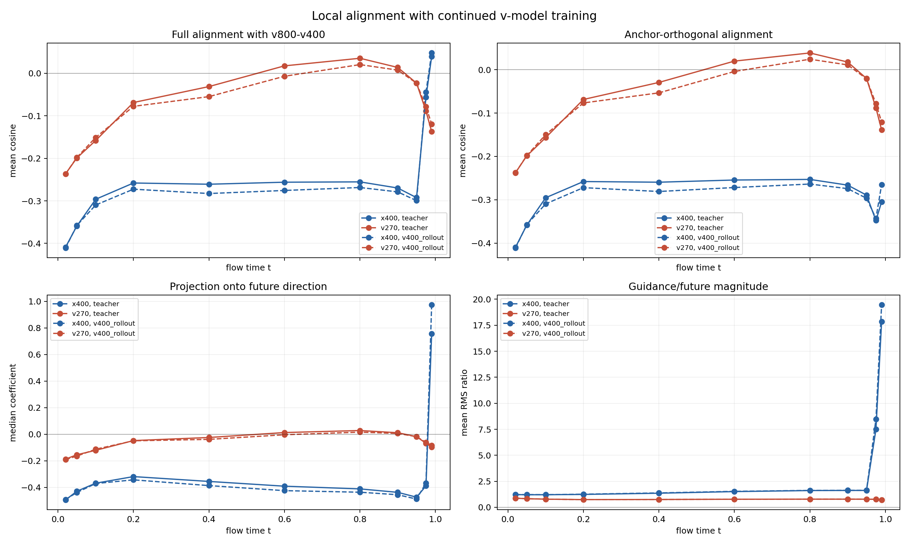
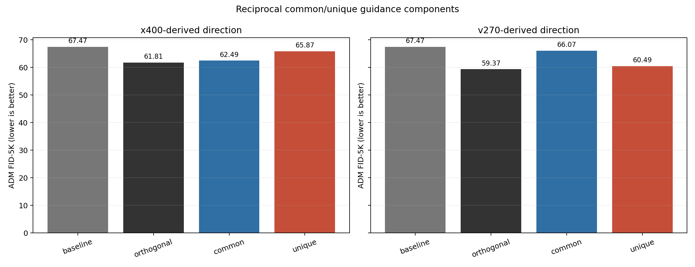

# ImageNet-100 SiT 400K 训练方向与共同分量实验记录

更新时间：2026-08-13

本文只登记实验定义、运行配置、数值结果和数据文件，不包含机制解释或后续研究建议。

## 1. 实验对象

本轮使用四个 EMA checkpoint：

| 名称 | prediction target | step | denominator floor |
|---|---|---:|---:|
| `v270` | velocity | 270,000 | 0.001 |
| `v400` | velocity | 400,000 | 0.001 |
| `v800` | velocity | 800,000 | 0.001 |
| `x400` | clean `x`，推理时转换为 velocity | 400,000 | 0.05 |

统一配置：

- 数据：ImageNet-100 validation latent cache；
- tokenizer/decoder：`stabilityai/sd-vae-ft-mse`；
- latent shape：`[4, 32, 32]`；
- 模型：SiT-S/2；
- 权重：EMA；
- 采样：linear flow、Dopri5、CFG `1.0`；
- FID 实验：每个条件 5,000 张，ADM TensorFlow FID/sFID/IS；
- 局部方向实验：512 个样本、11 个时刻、seed `20260813`；
- 时刻：`0.02, 0.05, 0.1, 0.2, 0.4, 0.6, 0.8, 0.9, 0.95, 0.975, 0.99`。

## 2. 训练方向对齐实验

定义：

```text
d_future = v800 - v400
g_x      = v400 - x400
g_v      = v400 - v270
```

`full` 直接使用完整向量。`orthogonal` 表示先移除相对当前 `v400` 速度向量的平行
分量，再比较 cosine、squared cosine、正 cosine 比例和投影系数。

### 2.1 Teacher linear bridge

| guidance | space | cosine mean | cosine² mean | positive fraction | projection coefficient mean |
|---|---|---:|---:|---:|---:|
| `v400-x400` | full | -0.243068 | 0.087138 | 0.095526 | -0.283164 |
| `v400-x400` | orthogonal | -0.299670 | 0.105234 | 0.014915 | -0.375713 |
| `v400-v270` | full | -0.079658 | 0.031479 | 0.329723 | -0.064752 |
| `v400-v270` | orthogonal | -0.078344 | 0.031186 | 0.340732 | -0.063737 |

### 2.2 Unguided `v400` rollout

| guidance | space | cosine mean | cosine² mean | positive fraction | projection coefficient mean |
|---|---|---:|---:|---:|---:|
| `v400-x400` | full | -0.250252 | 0.090959 | 0.103693 | -0.280305 |
| `v400-x400` | orthogonal | -0.304125 | 0.106349 | 0.011719 | -0.388893 |
| `v400-v270` | full | -0.083493 | 0.029354 | 0.286222 | -0.067526 |
| `v400-v270` | orthogonal | -0.082197 | 0.029089 | 0.301136 | -0.066499 |

两个 context 各包含 `512 x 11 = 5,632` 条记录，总计 11,264 条。逐时刻的 mean、
median、q10 和 q90 保存在随报告提交的 CSV 中。



## 3. 共同与独有分量实验

先定义相对 `v400` 的两条正交 guidance：

```text
g_x_perp = Orth_v400(v400 - x400)
g_v_perp = Orth_v400(v400 - v270)
```

再分别作双向投影：

```text
x_common_on_v = Proj_g_v_perp(g_x_perp)
x_unique_to_v = g_x_perp - x_common_on_v

v_common_on_x = Proj_g_x_perp(g_v_perp)
v_unique_to_x = g_v_perp - v_common_on_x
```

所有分量均以 `scale=1` 加到 `v400`，并在 ODE 每次函数求值处重新计算。

| family | component | FID ↓ | FID gain vs `v400` | sFID ↓ | IS ↑ | total NFE |
|---|---|---:|---:|---:|---:|---:|
| baseline | `v400` | 67.473505 | 0.000000 | 68.871120 | 26.670500 | 0 |
| `x400` | orthogonal | 61.810335 | 5.663170 | 68.535951 | 27.369190 | 40,598 |
| `x400` | common | 62.486377 | 4.987128 | 68.615852 | 28.405699 | 35,570 |
| `x400` | unique | 65.870418 | 1.603087 | 68.784004 | 25.821350 | 40,724 |
| `v270` | orthogonal | 59.366598 | 8.106907 | 68.595898 | 29.590796 | 34,970 |
| `v270` | common | 66.074026 | 1.399480 | 68.666325 | 26.971363 | 33,608 |
| `v270` | unique | 60.485207 | 6.988298 | 68.789219 | 28.980753 | 34,940 |

`v400` 行复用配对 baseline，其 NFE 未写入该汇总表，因此显示为 `0`。其余四个
common/unique 条件均满足 `total_model_forwards = 3 x total_nfe`。



## 4. 配对与完整性记录

- 七个 FID 条件均为 5,000 张图；
- 七个条件的初始 noise SHA256 完全相同；
- 七个条件的 class-label SHA256 完全相同；
- anchor、`x400` 和 `v270` 在每次 ODE 函数求值时读取同一 state、time 和 class；
- 所有正式 FID 条件的记录值均为有限数；
- 局部方向表包含 11,264 行，无 NaN；
- common/unique 采样的单卡显存记录均低于 8 GiB；
- 本轮没有训练或修改模型权重。

## 5. 随报告提交的数据

目录：[`docs/data/imagenet100_sit_400k_future_common_unique/`](data/imagenet100_sit_400k_future_common_unique/)

| 文件 | 内容 |
|---|---|
| `common_unique_fid5k.csv` | 七个 FID 条件的完整汇总表 |
| `common_unique_summary.json` | 配对状态、公式、FID/sFID/IS、NFE 与原始产物路径 |
| `common_unique_fid5k.png` | common/unique FID 图 |
| `future_alignment_by_time.csv` | 两个 context、11 个时刻的方向统计 |
| `future_alignment_summary.json` | checkpoint metadata、总体统计和实验定义 |
| `future_alignment.png` | 训练方向 cosine、投影和尺度图 |

未提交到 Git：checkpoint、ImageNet 数据、latent cache、5K 生成样本、FID reference 和
7.2 MB 的逐样本方向表。它们保留在本机 `/home/zhoushunyu/data/eqvae/` 下。
