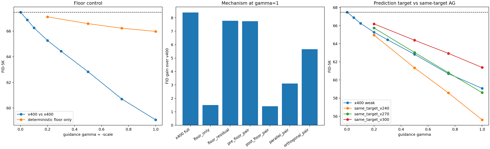
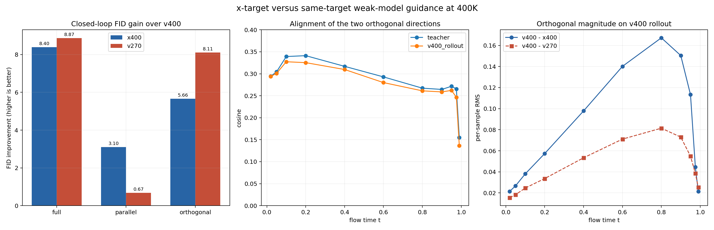
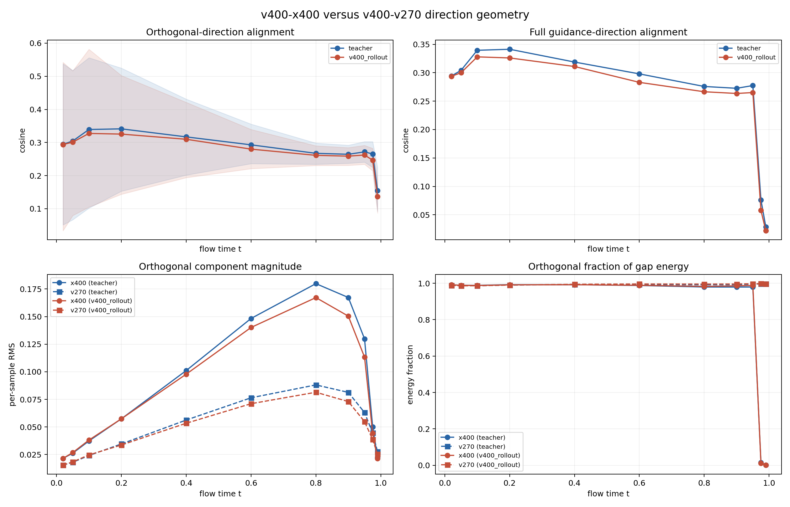

# ImageNet-100 SiT 400K Guidance 对照实验记录

更新时间：2026-08-13

## 1. 实验摘要

本报告记录以 400K `SiT-v` 为锚点、使用 400K JiT-style `x` 模型构造的外推实验：

```text
v_guided = v400 + gamma * (v400 - x400)
```

在 `gamma=1` 时，配对 FID-5K 从 `67.4735` 降到 `59.0766`，改善
`8.3969`。本轮记录以下四组结果：

1. deterministic floor-only 的 FID 改善为 `1.4957`；完整 `v400-x400` 外推改善
   `8.3969`。
2. 与 `x400` 端点 FID 接近的同目标弱模型 `v270`，在相同 `gamma=1` 下把 FID
   降到 `58.6062`，改善 `8.8673`。
3. 在未引导 `v400` rollout 状态上，两条正交 guidance 方向的平均 cosine 为
   `0.2730`，平均 squared cosine 为 `0.0907`。
4. `x400` 的平行、正交分量分别改善 `3.1047/5.6632` FID；`v270` 分别改善
   `0.6744/8.1069`。

## 2. 问题与符号

### 2.1 三个速度场

本轮固定一个强模型和两个弱模型：

| 符号 | checkpoint | prediction target | 配对端点 FID-5K |
|---|---:|---|---:|
| `A=v400` | 400K | velocity | `67.4735` |
| `B_x=x400` | 400K | clean `x`，再转为 velocity | `75.9490` |
| `B_v=v270` | 270K | velocity | `75.4111` |

`v270` 与 `x400` 的端点 FID 相差 `0.5379`，因此它是本轮预先选择的
quality-matched same-target weak model。

### 2.2 外推定义

代码统一使用：

```text
v_s = A + s * (B - A)
```

本报告用 `gamma=-s` 表示向强模型外侧的外推强度，因此：

```text
v_guided = A + gamma * (A - B)
```

`gamma=1` 即 `2A-B`。所有组合都发生在 ODE solver 的每一次函数求值处，不是最终
latent 或图像的线性组合。

### 2.3 平行与正交分解

令实际外推方向为 `g=A-B`。每个样本、状态和时刻都在完整 `[C,H,W]` latent
速度场上作一次标量投影：

```text
g_parallel   = <g,A> / ||A||^2 * A
g_orthogonal = g - g_parallel
```

这里的“正交”仅表示**相对于当前 `v400` 速度向量正交**。它不是相对于数据流形法向、
decoder 感知度量或真实最优 transport field 正交。

## 3. `t_eps=0.05` 对照

JiT-style `x` 模型转换到 velocity 时使用：

```text
v_x = (x_hat - z_t) / max(1-t, 0.05)
```

用于 floor-only 对照的系数定义为：

```text
c(t) = (1-t) / max(1-t, 0.05)
v_x  = c(t) * v_Bayes
```

本轮使用 `v400` 构造对应的 deterministic floor schedule，并把完整差值拆为 floor
分量与 residual 分量。

| `gamma=1` 条件 | FID-5K | 相对 `v400` 改善 |
|---|---:|---:|
| `v400` baseline | `67.4735` | `0.0000` |
| 完整 `v400-x400` | **`59.0766`** | **`8.3969`** |
| deterministic floor only | `65.9778` | `1.4957` |
| floor residual only | `59.6948` | `7.7787` |
| 只在 floor 前使用完整差值 | `59.7288` | `7.7447` |
| 只在 floor 后使用完整差值 | `66.0604` | `1.4132` |



上图左侧比较完整差值和 deterministic floor schedule，中间展示 `gamma=1` 的各机制
干预，右侧比较 prediction-target weak model 与同目标弱 checkpoint。

floor-only 的数值改善是完整改善的约 `17.8%`；floor 前的完整差值对应 `7.7447`
FID 改善。由于每个干预都会产生不同的闭环轨迹，这些 FID 数值不能作可加分解。

### 3.1 推理 floor 扫描

只在推理时把 `x400` denominator floor 从训练时的 `0.05` 改小，得到：

| inference floor | `x400` FID-5K | 总 NFE |
|---:|---:|---:|
| `0.020` | `74.7485` | `38,216` |
| `0.010` | `74.4891` | `41,960` |
| `0.005` | `74.4815` | `48,728` |
| `0.001` | `74.3216` | `61,430` |

该实验是 inference-only mismatch，不是按新 floor 重新训练的 JiT 模型。随着 floor
从 `0.020` 降到 `0.001`，FID 从 `74.7485` 变为 `74.3216`，总 NFE 从
`38,216` 增加到 `61,430`。

## 4. 同目标 checkpoint 对照

以相同 `v400` 为强模型，用较早的 velocity checkpoint 作为弱模型：

```text
v_AG = v400 + gamma * (v400 - v_weak)
```

| weak checkpoint | weak 端点 FID | `gamma=0.2` | `0.5` | `0.75` | `1.0` |
|---|---:|---:|---:|---:|---:|
| `x400` | `75.9490` | `65.2661` | `62.8293` | `60.6991` | `59.0766` |
| `v240` | `78.3279` | `64.9483` | `61.3374` | `58.5753` | **`55.6101`** |
| `v270` | `75.4111` | `65.7337` | `63.0311` | `60.8108` | `58.6062` |
| `v300` | `73.0536` | `66.1834` | `64.3847` | `62.9369` | `61.3810` |

`v270` 与 `x400` 的端点 FID 分别为 `75.4111/75.9490`，四个已测 guidance
scale 的 FID 曲线接近。`gamma=1` 时，`v240/v270/v300` 分别得到
`55.6101/58.6062/61.3810`。

## 5. 方向分解与几何结果

### 5.1 闭环分量干预

在 `gamma=1` 下分别只保留相对 `v400` 的平行或正交分量：

| weak model | full FID | full 改善 | parallel FID | parallel 改善 | orthogonal FID | orthogonal 改善 |
|---|---:|---:|---:|---:|---:|---:|
| `x400` | `59.0766` | `8.3969` | `64.3688` | `3.1047` | `61.8103` | `5.6632` |
| `v270` | `58.6062` | `8.8673` | `66.7991` | `0.6744` | `59.3666` | `8.1069` |



左图列出 full、parallel-only 和 orthogonal-only 三组闭环 FID 改善；中图给出两条
正交方向的 cosine；右图给出未引导 `v400` rollout 上的正交分量 RMS。

parallel-only、orthogonal-only 和 full 会各自产生不同的后续采样状态，因此表中的
FID 改善不作加法汇总。

### 5.2 直接方向几何

方向几何使用 ImageNet-100 validation 中固定抽取的 512 个样本、11 个时刻和 seed
`20260813`，分别在两种状态上测量：

- `teacher`：真实 latent 与同一份噪声按训练线性路径构成的状态；
- `v400_rollout`：从同一噪声出发，由未引导 `v400` ODE 实际访问的状态。

| 状态 | full cosine | orthogonal cosine | orthogonal cosine 中位数 | mean cosine^2 | `x400` 正交能量占比 | `v270` 正交能量占比 |
|---|---:|---:|---:|---:|---:|---:|
| teacher | `0.2570` | `0.2830` | `0.2734` | `0.0960` | `0.8088` | `0.9918` |
| `v400` rollout | `0.2469` | `0.2730` | `0.2632` | `0.0907` | `0.8100` | `0.9931` |



两种状态下的总体数值接近。`mean cosine^2` 只表示逐样本两条向量的一维投影重合量，
不等同于子空间重合度。

`v270` 与 `x400` 的平行分量 RMS 在 rollout 上分别为 `0.00276` 和 `0.10314`。

## 6. 实验协议与数据完整性

### 6.1 统一协议

- 数据集：ImageNet-100，`256x256`；
- latent/decoder：`stabilityai/sd-vae-ft-mse`，latent `[4,32,32]`；
- 强模型：`SiT-S/2` velocity，400K，EMA；
- 采样：class-conditioned、CFG `1.0`、官方 SiT linear-path Dopri5；
- 每个条件：5000 张生成图；
- 指标：ADM TensorFlow FID、sFID、Inception Score；
- 所有 FID 条件共用同一 5K reference、初始噪声和类别标签。

### 6.2 完整性检查

- 机制审计汇总包含预注册的 28 条结果，系列数均符合预期；
- 所有结果均为 5000 张；
- 全部条件的 noise SHA256 相同；
- 全部条件的 label SHA256 相同；
- `v400/x400` 比较要求同 step、模型、数据 manifest、seed 和官方 SiT 源；
- `v240/v270/v300` 只显式放宽 checkpoint step，其他兼容性检查保留；
- FID 表、各条件 JSON 和汇总 JSON 已逐层读取并重新生成图表；
- 方向几何同时在 teacher state 与真实未引导 rollout state 上复核。

代码测试覆盖了 scale 端点、floor 代数分解、窗口互补、平行/正交重构、不同 step 的显式
许可、配对 fingerprint 检查、方向正反号与汇总图生成。

## 7. 仓库中的复现材料

### 代码

- 场语义与机制分解：
  [`experiments/imagenet100_sit_static_pair.py`](../experiments/imagenet100_sit_static_pair.py)
- 配对采样：
  [`experiments/sample_imagenet100_sit_static_pair_fid.py`](../experiments/sample_imagenet100_sit_static_pair_fid.py)
- FID 编排：
  [`experiments/run_imagenet100_sit_static_pair_fid5k.py`](../experiments/run_imagenet100_sit_static_pair_fid5k.py)
- 400K 审计入口：
  [`experiments/run_imagenet100_sit_400k_floor_audit.sh`](../experiments/run_imagenet100_sit_400k_floor_audit.sh)
- 方向几何：
  [`experiments/analyze_imagenet100_sit_400k_direction_geometry.py`](../experiments/analyze_imagenet100_sit_400k_direction_geometry.py)
- 机制与方向汇总：
  [`experiments/summarize_imagenet100_sit_400k_mechanism_audit.py`](../experiments/summarize_imagenet100_sit_400k_mechanism_audit.py)、
  [`experiments/summarize_imagenet100_sit_400k_direction_comparison.py`](../experiments/summarize_imagenet100_sit_400k_direction_comparison.py)

### 便携数据

仓库保存小型汇总 CSV/JSON 和三张 PNG：

[`docs/data/imagenet100_sit_400k_guidance_mechanism/`](data/imagenet100_sit_400k_guidance_mechanism/)

未提交 checkpoint、ImageNet、VAE latent cache、5K 生成样本 NPZ、FID reference 或
3.3 MB 的逐样本方向中间表。完整大文件仍保留在本机 `/home/zhoushunyu/data` 下。
