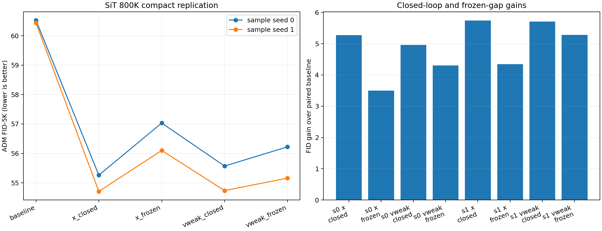

# SiT 800K finite-guidance 紧凑复验

## 结论

800K 的核心结论与 400K 基本一致，而且在两个独立采样 seed 上都成立：

1. `strong + (strong - weak)` 在更强的 `v800` anchor 上仍能明显改善 FID。
2. prediction-target 弱模型不是必要条件。`x800` 和质量近似匹配的 same-target `v500` 都能产生接近的闭环收益。
3. 把 weak-strong gap 冻结在配对 baseline trajectory 上以后，仍能保留大部分闭环收益。因此主要校正信息已经存在于 baseline trajectory。这里冻结的只是 gap 的在线重算；strong field 仍在当前 guided state 上求值，不能把该条件解释为“没有状态反馈”。
4. same-target `v800-v500` 的 frozen-gap 保留率始终高于 `v800-x800`，说明 same-target gap 对状态变化更稳定，而 prediction-target gap 更依赖闭环重计算。

800K 的绝对 FID 改善约为 `5.0-5.7`，小于 400K 的 `8.4-8.9`。这符合更强 anchor 可改进空间变小的解释，不构成机制反转。

## 实验设置

- 数据与指标：ImageNet-100，ADM FID-5K。
- 强模型：`v800`，原生 velocity SiT 的 800K EMA checkpoint。
- prediction-target 弱模型：`x800`，x-output、velocity-space loss、训练和推理 denominator floor 均为 `0.05` 的 800K EMA checkpoint。
- same-target 弱模型：在相同 5K 噪声和类别上比较 `v400/v500/v600/v700`，按与 `x800` 端点 FID 的绝对差最小原则预先锁定 `v500`。
- 引导系数：`gamma=1`。
- 采样：CFG=1、fp32、TF32、Dopri5、同一 reference statistics。
- 稳定性：两个独立采样 seed；训练 checkpoint 仍来自单一训练 seed。

闭环条件为：

```text
z' = v800(z,t) + [v800(z,t) - weak(z,t)]
```

frozen-gap 条件中，强模型仍在当前 guided state 上求值，但方括号内的差值固定在配对 baseline trajectory 上求值。

后续 replay 对照进一步确认：若连 strong field 也固定在 baseline trajectory 上，大部分 FID 收益会消失。因此 frozen-gap 结果只证明“在线重算 gap 不是主要收益的必要条件”，并不证明“当前状态上的 strong-field 反馈不必要”。

## 端点质量匹配

| 模型 | ADM FID-5K |
|---|---:|
| `v800`，历史单模型评估 | 61.00 |
| `x800`，标准 floor=0.05 | 65.24 |
| `v400` | 67.47 |
| `v500` | 63.29 |
| `v600` | 61.21 |
| `v700` | 67.69 |

`x800` 不优于 `v800`。`v500` 与 `x800` 的绝对 FID 差为 `1.96`，是候选中最接近者，因此作为 same-target weak control。这个匹配是近似匹配，不是完全相等。

## 800K 配对结果

| 采样 seed | 条件 | FID-5K | 相对配对 baseline 改善 |
|---:|---|---:|---:|
| 0 | `v800` baseline | 60.5285 | 0.0000 |
| 0 | `x800` closed-loop | 55.2582 | 5.2703 |
| 0 | `x800` frozen-gap | 57.0309 | 3.4976 |
| 0 | `v500` closed-loop | 55.5686 | 4.9600 |
| 0 | `v500` frozen-gap | 56.2211 | 4.3074 |
| 1 | `v800` baseline | 60.4423 | 0.0000 |
| 1 | `x800` closed-loop | 54.7054 | 5.7370 |
| 1 | `x800` frozen-gap | 56.0995 | 4.3428 |
| 1 | `v500` closed-loop | 54.7336 | 5.7088 |
| 1 | `v500` frozen-gap | 55.1581 | 5.2842 |

frozen-gap 对闭环收益的保留率：

| 采样 seed | `x800` | `v500` |
|---:|---:|---:|
| 0 | 66.36% | 86.84% |
| 1 | 75.70% | 92.56% |

预设门槛要求两类方向在两个采样 seed 上都满足：闭环改善大于 0，且 frozen-gap 保留至少 60% 的闭环改善。四组均通过。



## 与 400K 的对照

400K 结果见 [400K finite-guidance dynamics 报告](IMAGENET100_SIT_400K_FINITE_GUIDANCE_DYNAMICS_ZH.md)。

| 尺度 | 弱模型方向 | 闭环 FID 改善 | frozen-gap FID 改善 | frozen 保留率 |
|---|---|---:|---:|---:|
| 400K | prediction-target `x400` | 8.3969 | 6.3721 | 75.9% |
| 400K | same-target `v270` | 8.8673 | 7.4245 | 83.7% |
| 800K seed 0 | prediction-target `x800` | 5.2703 | 3.4976 | 66.4% |
| 800K seed 0 | same-target `v500` | 4.9600 | 4.3074 | 86.8% |
| 800K seed 1 | prediction-target `x800` | 5.7370 | 4.3428 | 75.7% |
| 800K seed 1 | same-target `v500` | 5.7088 | 5.2842 | 92.6% |

两种训练尺度共同支持的是同一条高层机制：prediction target 不是有效 guidance 的必要来源；weak-strong gap 的大部分校正方向已经写在 baseline trajectory 上。这里不能把 frozen-gap 与 open-loop 混为一谈，因为 frozen-gap 始终保留当前状态上的 strong-field 响应。

本轮 800K 复验没有重做 400K 的 gamma 线性审计、curl/conservativity、density-action、common/unique decomposition 和 exact gauge toy。因此它验证的是上述高层结论的训练尺度与采样稳定性，不代表 400K 的每一个局部机制指标都已在 800K 独立复现。

## 审计与边界

- 每个采样 seed 内五个条件的 noise/label SHA256 完全相同；两个 seed 之间哈希不同。
- 共 30 份资源审计均通过，最大观测显存为 2858 MiB，低于 8192 MiB 限制。
- 相关测试共 28 项通过。
- 这里只改变了采样 seed，不等同于多训练 seed 验证。
- FID-5K 适合内部配对机制比较，不等同于正式 ImageNet FID-50K。
- Git 仅保存轻量汇总、图和复现代码；checkpoint、采样 NPZ 及约 14GB 原始产物保留在本机数据目录。

## 文件

- `docs/data/imagenet100_sit_800k_compact_replication/quality_match.json`：same-target 弱模型选择记录。
- `docs/data/imagenet100_sit_800k_compact_replication/compact_replication_rows.csv`：作图和核对用长表。
- `docs/data/imagenet100_sit_800k_compact_replication/compact_replication_summary.json`：完整轻量汇总与审计字段。
- `docs/data/imagenet100_sit_800k_compact_replication/compact_replication.png`：结果图。
