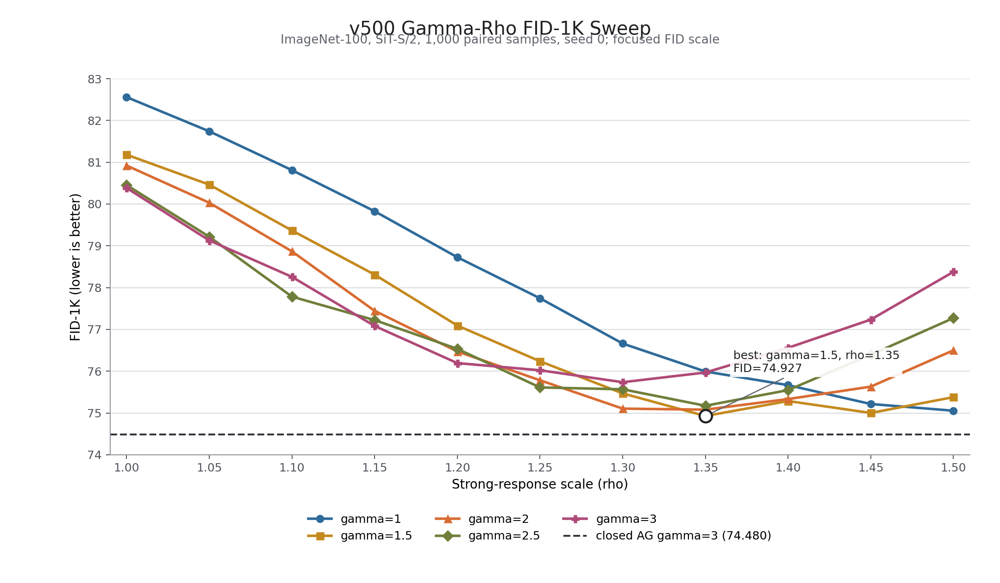

# SiT 800K 强模型响应放大实验

## 技术摘要

本轮从 frozen AutoGuidance 的机制诊断中得到一个直接的推理时控制：固定 baseline trajectory 上的 weak-to-strong forcing 不变，只放大 strong model 对 guided state 偏移的响应。

记 strong field 为 `S`、weak field 为 `W`，baseline trajectory 为：

```text
b' = S(b,t)
g_b = S(b,t) - W(b,t)
```

本轮候选方法为：

```text
z' = S(b,t) + rho * [S(z,t) - S(b,t)] + gamma * g_b
```

其中 `rho=0` 等于 replay，`rho=1` 精确等于 frozen guidance；`rho>1` 只放大 strong field 的离轨响应，不增大 weak-to-strong forcing。本轮正式配置使用 `rho=1.3, gamma=1`。

在 ImageNet-100、SiT-S/2、一个训练 seed、两个严格配对的 5K 采样 seed 上，`v800` strong + `x800` weak 得到：

- tuned closed AutoGuidance：平均 FID `54.735`；
- response amplification：平均 FID `51.954`；
- response amplification 相对 tuned closed 再降低 `2.780 FID`，约 `5.08%`；
- sFID 同时降低 `0.480`，IS 同时提高 `0.434`；
- 两个采样 seed 都独立保持相同方向的改善。

这是一个值得保留的正结果，但还不是完整方法结论。当前最可靠的贡献是：**nominal forcing 的强度与 strong-flow response 可以被因果分离，而且后者存在可利用的有限幅度增益。**理论目前只给出局部 ODE 响应解释，没有说明为什么 `rho=1.3` 改善感知分布、何时稳定、或为什么该效果尚未在 `v500` weak family 上复现。

补充的 `v500` 二维细扫进一步限定了这个结论：在 `gamma={1,1.5,2,2.5,3}`、`rho=1.00...1.50` 的 55 个唯一 FID-1K 条件中，factorized response 最好达到 `74.927`，仍未超过同协议 tuned closed AutoGuidance 的 `74.480`。因此 `rho` 调节确实能恢复大部分 closed 收益，但当前正结果仍只在 `x800` weak family 上得到正式确认。

## 正式 FID-5K 结果

正式比较使用同一组 initial noise、class label、reference statistics 和采样协议。`closed` 的 `gamma=1.125` 与 response 的 `rho=1.3` 均先由 1K sweep 选择；seed 1 因而是未参与选参的额外采样 seed。

| sample seed | unguided `v800` | tuned closed `gamma=1.125` | response `rho=1.3` | response - closed |
|---:|---:|---:|---:|---:|
| 0 | 60.529 | 55.023 | **52.343** | -2.680 |
| 1 | 60.442 | 54.446 | **51.566** | -2.881 |
| mean | 60.485 | 54.735 | **51.954** | **-2.780** |

正式均值的辅助指标：

| condition | FID | sFID | IS | aggregate NFE |
|---|---:|---:|---:|---:|
| tuned closed | 54.735 | 68.648 | 29.994 | 41,525 |
| response amplification | **51.954** | **68.168** | **30.428** | **40,775** |
| response - closed | **-2.780** | **-0.480** | **+0.434** | **-750** |

NFE 较低不代表总计算更低。部署时，closed 每次 field query 需要 `S(z)` 与 `W(z)` 两份模型样本前向；response 需要 `S(b)`、`S(z)` 与 `W(b)` 三份，理论模型样本前向量约为 closed 的 `1.5x`。`S(b)` 与 `S(z)` 可以合批，因此实际 wall time 不必严格增加 50%，但当前结果不能宣称采样加速。

## 为什么它不是简单增大 guidance

若只改变 frozen forcing 的系数：

```text
z' = S(z,t) + gamma * g_b
```

FID-1K 在 `gamma=1` 附近最好，继续增大反而稳定恶化：

| frozen `gamma` | 0.50 | 0.75 | 1.00 | 1.25 | 1.50 | 2.00 | 3.00 |
|---:|---:|---:|---:|---:|---:|---:|---:|
| FID-1K | 82.850 | 82.482 | **82.262** | 82.793 | 83.560 | 86.008 | 93.730 |

保持 `gamma=1`，只改变 strong response 的 `rho`，则出现明确的内部最优点：

| response `rho` | 1.00 | 1.20 | 1.30 | 1.40 | 1.50 | 2.00 |
|---:|---:|---:|---:|---:|---:|---:|
| FID-1K | 82.262 | 79.918 | 78.441 | **78.021** | 78.986 | 101.344 |
| IS | 29.116 | 29.751 | **29.898** | 28.638 | 26.786 | 19.244 |

`rho=1.4` 的 FID-1K 略低，但 IS 已明显下降，因此正式实验锁定更平衡的 `rho=1.3`。`rho=2` 出现明显崩溃，说明该控制不是无条件放大，稳定区间本身是尚未解决的理论问题。

这组对照排除了最直接的平凡解释：正式收益不是把同一条 frozen gap 推得更用力，而是改变 strong flow 对离轨状态的反馈。

## 方法来自哪条机制证据

前两轮实验给出了三条直接动机：

1. replay 使用相同 `g_b`，但去掉 `S(z)-S(b)` 后几乎没有 FID 收益；因此 strong field 的 current-state response 是 frozen 有效的必要组成。
2. `gamma=1` 的 finite frozen endpoint 与 `gamma=0` transported tangent 仍有约 29 至 31 度夹角，但 frozen endpoint 投影到 tangent 的分量保留了 `87.1%-93.4%` 的数值 FID 收益；正交余量单独使用反而恶化。
3. 由此最自然的可控量不是继续增大 nominal forcing，而是单独改变 strong field 对已产生偏移的响应。

令 `delta=z-b`，候选动力学可以精确写成：

```text
delta' = rho * [S(b+delta,t) - S(b,t)] + gamma * g_b
```

在 baseline 附近才可近似为：

```text
delta' ~= rho * J_S(b,t) * delta + gamma * g_b
```

因此 `rho` 的局部意义是改变 nominal forcing 经 strong-flow Jacobian 传播时的反馈增益。这个解释与实验构造一致，但它只是局部动力学描述，不是生成质量定理；正式最优点位于有限幅度 `rho=1.3`，不能直接由一阶展开推出。

## 在线方向修正没有继续带来稳定收益

更一般的实现还允许加入 current gap 相对 nominal gap 的正交分量：

```text
z' = S(b) + rho*[S(z)-S(b)]
     + gamma*[g_b + lambda*Orth_gb(g(z))]
```

在 `x800` 的 12 个 FID-1K 条件中，加入 `lambda>0` 没有形成三指标一致的额外改善：

- `rho=1.4, lambda=0`：FID `78.021`、sFID `218.508`、IS `28.638`；
- `rho=1.4, lambda=0.25`：FID `78.324`、sFID `219.004`、IS `28.099`；
- `rho=1.3, lambda=0`：FID `78.441`、sFID `218.772`、IS `29.898`；
- `rho=1.3, lambda=0.5`：FID `78.369`，但 sFID 恶化到 `219.371`、IS 降到 `29.035`。

所以当前正结果应归因于 **strong-response amplification**，而不是把此前的 online direction-only 消融与 response 简单叠加。早期 `beta/lambda` factorized screen 同样没有发现稳健的新最优点。

## v500 的 gamma-rho 细扫仍未超过 closed

使用同 target 的 `v500` 作为 weak model 时，本轮固定：

```text
z' = S(b,t) + rho * [S(z,t) - S(b,t)] + gamma * g_b
g_b = S(b,t) - W(b,t)
```

并扫描：

```text
gamma = {1.0, 1.5, 2.0, 2.5, 3.0}
rho   = {1.00, 1.05, ..., 1.50}
```

55 个唯一条件使用同一组 initial noise、class labels、reference statistics、采样 seed 和 1,000 个样本。FID 曲线如下：



每个 `gamma` 的最优点为：

| gamma | 最优 rho | FID-1K | sFID | IS | NFE |
|---:|---:|---:|---:|---:|---:|
| 1.0 | 1.50 | 75.053 | 215.696 | 29.837 | 7,852 |
| 1.5 | **1.35** | **74.927** | 215.434 | 30.756 | 7,828 |
| 2.0 | 1.35 | 75.079 | 215.354 | 29.671 | 8,002 |
| 2.5 | 1.35 | 75.172 | **215.217** | 29.842 | 8,110 |
| 3.0 | 1.30 | 75.736 | 215.397 | 30.066 | 8,170 |

完整 FID 矩阵为：

| gamma / rho | 1.00 | 1.05 | 1.10 | 1.15 | 1.20 | 1.25 | 1.30 | 1.35 | 1.40 | 1.45 | 1.50 |
|---:|---:|---:|---:|---:|---:|---:|---:|---:|---:|---:|---:|
| 1.0 | 82.560 | 81.741 | 80.812 | 79.828 | 78.727 | 77.744 | 76.661 | 75.992 | 75.666 | 75.215 | **75.053** |
| 1.5 | 81.182 | 80.464 | 79.367 | 78.310 | 77.092 | 76.237 | 75.468 | **74.927** | 75.285 | 75.000 | 75.379 |
| 2.0 | 80.922 | 80.031 | 78.868 | 77.445 | 76.472 | 75.782 | 75.104 | **75.079** | 75.333 | 75.630 | 76.500 |
| 2.5 | 80.455 | 79.218 | 77.784 | 77.222 | 76.534 | 75.611 | 75.566 | **75.172** | 75.547 | 76.393 | 77.270 |
| 3.0 | 80.385 | 79.130 | 78.257 | 77.082 | 76.193 | 76.022 | **75.736** | 75.968 | 76.560 | 77.234 | 78.375 |

二维扫描表现出一条宽的低 FID 区域，而不是单点异常：`gamma>=1.5` 时最优 `rho` 集中在 `1.30-1.35`；随着 `gamma` 增大，最佳 `rho` 略向下移动。这说明 nominal forcing 和 strong-response amplification 存在补偿关系，不能独立地越大越好。

但是，二维调参没有改变跨 weak-family 的主结论：

| condition | FID-1K | sFID | IS |
|---|---:|---:|---:|
| factorized best `gamma=1.5, rho=1.35` | 74.927 | **215.434** | 30.756 |
| tuned closed `gamma=3` | **74.480** | 217.869 | **32.369** |

factorized best 在 sFID 上更低，但 FID 高 `0.447`、IS 低 `1.613`。相较此前 `gamma=1,rho=1.5` 的 `75.053`，联合细扫只额外改善 `0.126 FID`；这个量级小于 FID-1K 足以支持的精度，不能宣称新的组合显著更优。因此当前不能声称这是通用的 AutoGuidance 改进；它只在 `v800` strong + `x800` cross-target weak 这一组上得到正式正证据。

这条负结果也限制了理论解释：如果 `rho>1` 只是普遍增强有益 transport，它不应如此依赖 weak family。更可能的情况是，nominal forcing 的时空结构与 strong-flow response 之间需要匹配，而当前还没有可计算的匹配准则。

作为数值稳定性检查，`rho=1.50` 的四个重复端点独立重跑后，FID 差异最大仅 `0.0033`；全部条件的 noise/label fingerprint 一致。结果根目录中的 134 份采样/FID 显存审计均无违规，观测到的最高总显存为 `5,529 MiB`。

## 证据边界

- 一个 SiT-S/2 strong 训练 run、一个 x-target weak 训练 run；没有多个训练 seed。
- 正式指标是 ImageNet-100 FID-5K，不是 ImageNet-1K FID-50K。
- `rho=1.3` 与 closed `gamma=1.125` 由 seed 0 的 1K sweep 选择；seed 1 是额外确认，但不是独立训练复验。
- 方法依赖一条同步 baseline trajectory，并增加约 50% 的模型样本前向量；当前不是低成本 guidance。
- x800 仍包含既有的 `t_eps=0.05` denominator floor。本轮证明的是 response 控制有效，不是 floor 与 prediction target 的贡献已经被彻底分离。
- FID、sFID 与 IS 是有限样本估计；两次采样 seed 的一致性降低了偶然性，但不能替代训练 seed 与 50K 评估。
- `v500` 的 gamma-rho 细扫只有一个 1K 采样 seed，并在同一数据上选出最优组合；小于约 `0.5 FID` 的排序只应视为筛查结果。
- 当前理论只解释控制变量是什么，不解释它为什么优化图像分布；“响应放大”本身是标准 ODE 操作，理论新意暂时不足。

## 当前判断

这轮结果可以定性为：**一个由机制实验推导出的、效果明显但理论和泛化尚薄的候选方法。**

它比继续盲扫 AutoGuidance `gamma` 更有内容，因为实验已经因果分离了两个原本绑在一起的量：

```text
weak model 提供什么 nominal forcing
strong model 如何把该 forcing 引起的离轨偏移运输到 endpoint
```

真正可能形成研究贡献的部分，不是公式本身，而是后续能否找到一个无需昂贵 sweep、能预测 `rho` 稳定区间与收益的 response criterion，并在多个 strong/weak family、训练 seed 与数据设置上复现。当前报告不对这一步作提前承诺。

## 数据与实现

- 便携聚合数据：[`docs/data/imagenet100_sit_800k_response_amplification/`](data/imagenet100_sit_800k_response_amplification/)
- 正式结果：[`formal_fid5k.csv`](data/imagenet100_sit_800k_response_amplification/formal_fid5k.csv)
- response sweep：[`response_screen_fid1k.csv`](data/imagenet100_sit_800k_response_amplification/response_screen_fid1k.csv) 与 [`response_refinement_fid1k.csv`](data/imagenet100_sit_800k_response_amplification/response_refinement_fid1k.csv)
- frozen gamma 对照：[`frozen_low_gain_control_fid1k.csv`](data/imagenet100_sit_800k_response_amplification/frozen_low_gain_control_fid1k.csv) 与 [`frozen_high_gain_control_fid1k.csv`](data/imagenet100_sit_800k_response_amplification/frozen_high_gain_control_fid1k.csv)
- response + direction 对照：[`joint_response_direction_fid1k.csv`](data/imagenet100_sit_800k_response_amplification/joint_response_direction_fid1k.csv)
- v500 gamma-rho 唯一网格：[`v500_gamma_rho_fid1k.csv`](data/imagenet100_sit_800k_v500_gamma_rho/v500_gamma_rho_fid1k.csv)
- v500 每个 gamma 的最优点：[`v500_gamma_rho_best_by_gamma_fid1k.csv`](data/imagenet100_sit_800k_v500_gamma_rho/v500_gamma_rho_best_by_gamma_fid1k.csv)
- v500 重复端点审计：[`v500_gamma_rho_duplicate_audit.csv`](data/imagenet100_sit_800k_v500_gamma_rho/v500_gamma_rho_duplicate_audit.csv)
- v500 与 closed 的头部比较：[`v500_gamma_rho_headline_fid1k.csv`](data/imagenet100_sit_800k_v500_gamma_rho/v500_gamma_rho_headline_fid1k.csv)
- v500 gamma-rho 启动脚本：[`experiments/launch_imagenet100_sit_800k_v500_gamma_rho_grid.sh`](../experiments/launch_imagenet100_sit_800k_v500_gamma_rho_grid.sh)
- 本地完整结果根目录：`/home/zhoushunyu/data/eqvae/imagenet_sit_flow/factorized_guidance_800k_v1/`
