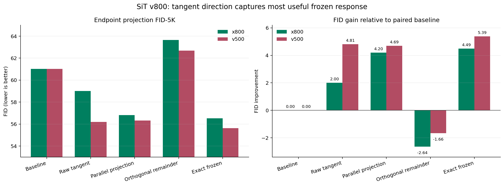

# SiT 800K Tangent Endpoint 投影实验

## 问题

上一轮实验已经验证，`gamma=1` 的 exact frozen endpoint response 与
`gamma=0` 处的 transported tangent 仍有约 29 至 31 度夹角。实验进一步检查：

> frozen 改善生成质量的部分，是否主要位于 transported tangent 的方向上？

以 `v800` 为 strong field，分别使用 `x800` 和 `v500` 构造 nominal gap。记：

```text
z_b       = baseline endpoint
xi        = d z_f(gamma) / d gamma | gamma=0
delta     = z_f(gamma=1) - z_b
a         = <delta, xi> / ||xi||^2
delta_par = a * xi
delta_orth= delta - delta_par
```

投影系数 `a` 对每个样本独立计算，但在该样本完整 latent 的所有 `C,H,W`
维度上只使用一个标量。随后解码五个严格配对的 endpoint：

```text
baseline            z_b
tangent_raw         z_b + xi
tangent_parallel    z_b + delta_par
tangent_orthogonal  z_b + delta_orth
frozen              z_b + delta
```

## 协议

- strong checkpoint：`v800` EMA；
- weak checkpoints：`x800` EMA 与 `v500` EMA；
- ImageNet-100，5000 个严格配对的 initial noise 与 class label；
- seed：`20260814`；
- fixed Heun，100 steps，FP32，TF32 关闭；
- official SD-VAE decode 与像素量化；
- ADM ImageNet-100 validation 5K reference；
- 无 CFG；
- x800 和 v500 的 rank seed、noise hash、label hash 完全相同；
- 两组 baseline 图像逐像素相同，NPZ SHA256 均为
  `e76c326721a60b497772b742c69fd66d589c17a195f1bd7d74b996b2d3442b5f`。

GPU 2、3 上使用四个逻辑 rank 保持原有样本划分。采样峰值显存为每张
`5271 MiB`；ADM 评估单卡峰值为 `7653 MiB`。所有资源审计均无越界。

## Endpoint 几何

| weak direction | mean cosine | mean angle | parallel energy | orthogonal energy | projection coefficient |
|---|---:|---:|---:|---:|---:|
| `v800-x800` | 0.8389 | 30.94 deg | 71.92% | 28.08% | 0.6753 |
| `v800-v500` | 0.8537 | 28.89 deg | 74.47% | 25.53% | 0.7573 |

平行与正交分量的重构最大绝对误差不超过 `2.39e-7`；两者 cosine 的均值
绝对值小于 `5e-9`，说明投影实现数值上闭合。

## 正式指标

| direction | condition | FID | FID gain | sFID | IS |
|---|---|---:|---:|---:|---:|
| `v800-x800` | baseline | 61.0117 | 0.0000 | 69.3201 | 29.5379 |
| `v800-x800` | raw tangent | 59.0067 | 2.0049 | 71.5546 | 27.0675 |
| `v800-x800` | parallel projection | **56.8156** | **4.1961** | 69.5152 | 29.3734 |
| `v800-x800` | orthogonal remainder | 63.6504 | -2.6387 | 70.0000 | 29.1690 |
| `v800-x800` | exact frozen | **56.5187** | **4.4930** | 69.0958 | 29.4431 |
| `v800-v500` | baseline | 61.0160 | 0.0000 | 69.3197 | 29.5417 |
| `v800-v500` | raw tangent | 56.2018 | 4.8142 | 69.3553 | 29.7443 |
| `v800-v500` | parallel projection | **56.3253** | **4.6907** | 69.0968 | 30.4535 |
| `v800-v500` | orthogonal remainder | 62.6806 | -1.6646 | 69.6678 | 29.4581 |
| `v800-v500` | exact frozen | **55.6288** | **5.3871** | 68.6401 | 31.3420 |



按同组 baseline 计算：

- `v800-x800` 的平行投影保留 `4.1961 / 4.4930 = 93.4%` 的数值 FID 收益；
- `v800-v500` 的平行投影保留 `4.6907 / 5.3871 = 87.1%` 的数值 FID 收益；
- 两组正交余量单独使用时均比 baseline 更差。

## 实验结论

1. 两种 weak model 都得到同一结果：exact frozen response 中真正改善 FID 的
   作用主要位于 gamma-zero transported tangent 方向。
2. exact response 仍有约 25% 至 28% 的正交能量，但该部分不承载主要收益；
   单独解码正交余量反而使 FID 恶化。
3. `v800-x800` 的 raw tangent 只改善约 2.00 FID，并同时恶化 sFID 与 IS。
   该方向存在少量很大的 tangent 幅值离群点，因此 tangent 的方向比未经校准的
   `gamma=1` 幅值更可靠。
4. `v800-v500` 的 raw tangent 已能接近投影结果，说明 same-target 方向在本组
   checkpoint 上具有更好的有限幅度标定。
5. 结果支持“strong-flow tangent transport 抓住主要有益 endpoint 方向”的解释，
   但不说明完整 finite-strength frozen dynamics 是线性的。

## 使用边界

- `tangent_parallel` 使用 exact frozen endpoint 才能得到逐样本投影系数，因此它是
  机制 oracle，不是可以直接部署的采样方法。
- FID 是非线性分布指标。`93.4%` 和 `87.1%` 只表示本次 FID 数值收益之比，
  不能直接解释为相同百分比的因果机制。
- 当前是一个训练 seed、一个采样 seed和 FID-5K。它足以构成两类 weak direction
  的一致机制证据，但不等同于多训练 seed 或 FID-50K 的论文级最终估计。

## 文件

- [`tangent_projection_fid5k.csv`](data/imagenet100_sit_800k_tangent_projection/tangent_projection_fid5k.csv)：十组 ADM 指标与样本 SHA256；
- [`tangent_projection_summary.json`](data/imagenet100_sit_800k_tangent_projection/tangent_projection_summary.json)：完整指标与 geometry summary；
- [`x800_sampling_manifest.json`](data/imagenet100_sit_800k_tangent_projection/x800_sampling_manifest.json)：x800 checkpoint、配对和资源信息；
- [`v500_sampling_manifest.json`](data/imagenet100_sit_800k_tangent_projection/v500_sampling_manifest.json)：v500 checkpoint、配对和资源信息；
- 原始 5K NPZ、projection geometry、日志和逐条件资源审计保存在
  `/home/zhoushunyu/data/eqvae/imagenet_sit_flow/tangent_projection_800k_v1/`，未写入 Git。
