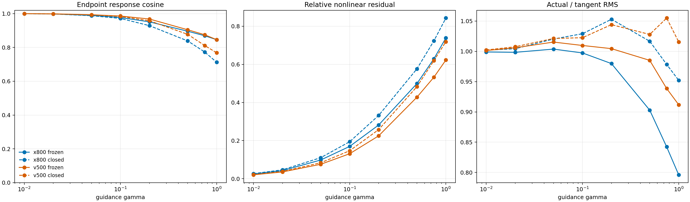

# SiT 800K Tangent Transport 首轮实验分析

## 问题

以 `v800` 为 strong field `S`，分别使用 `x800` 与 `v500` 构造 nominal gap：

```text
g_b(t) = S(z_b(t), t) - W(z_b(t), t)
```

exact frozen trajectory 为：

```text
dz_f/dt = S(z_f, t) + gamma * g_b(t)
```

在 `gamma=0` 处的 tangent response 满足：

```text
dxi/dt = J_S(z_b, t) * xi + g_b(t),  xi(0)=0
```

本轮检查 `z_b(1) + gamma * xi(1)` 能在多大程度上复现 exact frozen endpoint，并用 closed AutoGuidance 作为额外参照。

## 协议

- strong checkpoint：`v800` EMA；
- weak checkpoints：`x800` EMA、`v500` EMA；
- 128 个严格配对的 initial noise 与 class label；
- seed：`20260814`；
- fixed Heun，100 steps，FP32，TF32 关闭；
- gamma：`0.01`（中心差分）、`0.02, 0.05, 0.1, 0.2, 0.5, 0.75, 1.0`；
- 两组的 noise/label SHA256 完全相同；
- 每组 32 个 shard，全部张量有限，无缺批、重复或样本区间重叠。

## 数值正确性

| direction | 中心差分 cosine | 中心差分相对残差 | 通过 |
|---|---:|---:|---:|
| `v800-x800` | 0.999779 | 0.011697 | 是 |
| `v800-v500` | 0.999892 | 0.009570 | 是 |

中心差分阈值为 cosine >= 0.99 且相对残差 <= 0.05。两组都通过，说明 JVP、时间方向、Heun correction 和 frozen tangent 方程实现一致。

## Exact Frozen 与 Tangent

下表比较 actual endpoint shift 与 `gamma * xi(1)`。`relative residual` 为：

```text
||(z_f-z_b) - gamma*xi|| / ||z_f-z_b||
```

| gamma | x800 cosine | x800 residual | x800 actual/tangent RMS | v500 cosine | v500 residual | v500 actual/tangent RMS |
|---:|---:|---:|---:|---:|---:|---:|
| 0.01 | 0.9994 | 0.0251 | 0.9990 | 0.9996 | 0.0207 | 1.0013 |
| 0.02 | 0.9981 | 0.0426 | 0.9984 | 0.9984 | 0.0357 | 1.0059 |
| 0.05 | 0.9893 | 0.0983 | 1.0037 | 0.9933 | 0.0759 | 1.0153 |
| 0.10 | 0.9768 | 0.1697 | 0.9974 | 0.9856 | 0.1313 | 1.0097 |
| 0.20 | 0.9511 | 0.2819 | 0.9798 | 0.9679 | 0.2249 | 1.0045 |
| 0.50 | 0.8957 | 0.4990 | 0.9029 | 0.9043 | 0.4277 | 0.9851 |
| 0.75 | 0.8691 | 0.6289 | 0.8422 | 0.8750 | 0.5323 | 0.9386 |
| 1.00 | 0.8455 | 0.7384 | 0.7961 | 0.8457 | 0.6228 | 0.9119 |

按预注册阈值 cosine >= 0.95 且 relative residual <= 0.20，两组最大通过 gamma 都是 `0.1`。



## Gamma=1 的 Closed 参照

| direction | response | tangent cosine | relative residual | actual/tangent RMS |
|---|---|---:|---:|---:|
| `v800-x800` | frozen | 0.8455 | 0.7384 | 0.7961 |
| `v800-x800` | closed | 0.7120 | 0.8427 | 0.9522 |
| `v800-v500` | frozen | 0.8457 | 0.6228 | 0.9119 |
| `v800-v500` | closed | 0.7682 | 0.7188 | 1.0156 |

配对 bootstrap，20,000 次：

- `v500 - x800` frozen cosine 差为 `0.0002`，95% CI `[-0.0172, 0.0170]`，没有可分辨差异；
- `x800 - v500` frozen relative residual 差为 `0.1156`，95% CI `[0.0548, 0.1799]`；
- frozen 与 closed endpoint shift cosine：`x800=0.8878 [0.8778,0.8972]`，`v500=0.9436 [0.9342,0.9518]`。

## 首轮结论

1. `xi' = J_S xi + g_b` 是正确的一阶 strong-flow transport 方程，真实 SiT checkpoint 上的 JVP 实现已被中心差分验证。
2. tangent transport 在 `gamma <= 0.1` 的小扰动区间能够定量预测 exact frozen endpoint response。
3. 实际有较大 FID 收益的 `gamma=1` 不在线性区间。tangent 仍抓住一个明显主方向，但相对残差达到 `0.62-0.74`，不能单独作为 exact frozen 的定量解释。
4. `v800-v500` 与 `v800-x800` 在 `gamma=1` 的 tangent 方向一致性几乎相同；same-target 的差别主要是幅值结构更接近线性 transport、非线性残差更小。
5. closed response 比 frozen response 更偏离 baseline tangent，符合在线重算 gap 会继续增加 state-dependent direction change 的既有结果。
6. 本轮没有评估 `z_b + gamma*xi` 解码后的 FID，因此结论只针对 latent endpoint dynamics。它否定的是“gamma=1 可由 tangent transport 定量复现”的强命题，不是否定 tangent direction 对生成质量可能仍有解释力。

## 文件

- [`tangent_frozen_metrics.csv`](data/imagenet100_sit_800k_tangent_transport/tangent_frozen_metrics.csv)：完整 gamma / response 指标；
- [`tangent_frozen_summary.json`](data/imagenet100_sit_800k_tangent_transport/tangent_frozen_summary.json)：两组汇总与 paired bootstrap；
- [`x800_manifest.json`](data/imagenet100_sit_800k_tangent_transport/x800_manifest.json) 与 [`v500_manifest.json`](data/imagenet100_sit_800k_tangent_transport/v500_manifest.json)：checkpoint 哈希和配对协议；
- 原始 shard、每组本地 summary 与日志保存在 `/home/zhoushunyu/data/eqvae/imagenet_sit_flow/tangent_frozen_800k_v1/`，未写入 Git。
