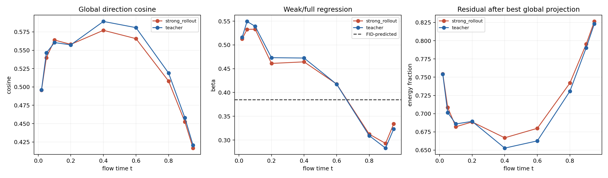
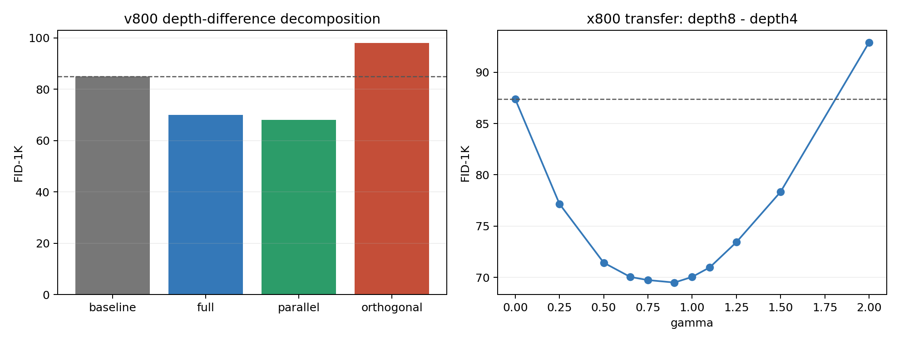

# SiT 深度有限差分机制实验

本记录整理 `depth8-depth4` 弱头差值的几何、因果分解和跨强头
parameterization 复验。所有 FID 扫描均使用 ImageNet-100、1,000 个样本、
EMA、无 CFG 和相同的初始噪声及类别标签。

## 定义

冻结 `v800` 及其 depth4/depth8 velocity 读出，定义：

\[
F=v_{800}-h_4,
\qquad
W=h_8-h_4.
\]

`F` 是完整强头相对 depth4 弱头的差，`W` 只使用两个中间弱头。

## 同状态几何

在 512 个验证样本、9 个时刻上，同时测量 teacher linear bridge 和无引导
`v800` rollout state。每个 context 包含 `512 x 9 = 4,608` 个向量对。

在 `v800` rollout 上，把

\[
W=\beta F+r
\]

按全体样本做最小二乘汇总，得到：

| 指标 | 数值 |
|---|---:|
| 全局投影系数 `beta` | 0.370567 |
| 由已有最优 guidance 系数比得到的参照值 `0.25/0.65` | 0.384615 |
| 全局 cosine | 0.511215 |
| 最佳全局投影后的残差能量占比 | 0.738659 |
| 逐样本平行能量占比均值 | 0.279102 |
| 逐样本正投影系数比例 | 1.000000 |

`beta(t)` 并非常数：rollout 上从低噪声端之前的约 `0.53` 逐渐降到后段的
约 `0.29`，在 `t=0.95` 回到约 `0.33`。完整逐时间数据保存在便携 CSV 中。

## 因果投影

在每次 ODE 求值的当前 state 上做逐样本投影：

\[
W=W_{\parallel F}+W_{\perp F}.
\]

三个非基线条件均使用 `gamma=0.65`，因此完整差值严格满足
`W_parallel + W_orthogonal = W`。

| 条件 | FID | sFID | IS | total NFE |
|---|---:|---:|---:|---:|
| baseline | 84.966485 | 222.249270 | 29.519506 | 6,676 |
| 完整 `W` | 69.943032 | **213.638274** | **35.138874** | 8,548 |
| 仅 `W_parallel` | **68.004452** | 214.140925 | 34.442341 | 8,098 |
| 仅 `W_orthogonal` | 97.973271 | 223.623157 | 27.070549 | 7,552 |

平行分量单独保留了全部 FID 改善，并进一步比完整差值低 `1.938580` FID；
正交余项则相对 baseline 恶化 `13.006786` FID。

作为同一批 1K 输入上的历史参照，固定 `0.25 * (v800-depth4)` 的 FID 为
`69.738686`。本次 `0.65 * W_parallel` 等价于一个逐样本、逐状态变化的
`v800-depth4` 缩放，其 FID 比该固定系数低 `1.734234`。

## x800 迁移

冻结 `x800`，使用在同一 x800 backbone 上训练的 depth4/depth8 velocity 读出：

\[
v_\gamma
=
v(x_{800})+\gamma(h_8^v-h_4^v).
\]

| gamma | FID | sFID | IS |
|---:|---:|---:|---:|
| 0.00 | 87.379013 | 220.390486 | 28.3577 |
| 0.25 | 77.168750 | 215.835822 | 31.2762 |
| 0.50 | 71.436100 | **214.080936** | 33.1989 |
| 0.65 | 70.047838 | 214.231749 | **33.5906** |
| 0.75 | 69.740386 | 214.626743 | 33.5759 |
| **0.90** | **69.500162** | 215.870046 | 33.3582 |
| 1.00 | 70.047366 | 216.949366 | 32.1792 |
| 1.10 | 70.982859 | 217.845230 | 31.7870 |
| 1.25 | 73.430148 | 219.389958 | 30.1831 |
| 1.50 | 78.341518 | 223.847756 | 28.2852 |
| 2.00 | 92.904519 | 232.917474 | 24.1296 |

最优 FID 相对 x800 baseline 改善 `17.878852`。此前 x800 使用完整
`v(x800)-depth4_v` 差值的最好 FID 为 `70.271217`；本次两个中间读出的
差值进一步低 `0.771055`。

## 完整性检查

- 几何原始表共 9,216 行，无缺失或非有限值；
- 两组 FID 表分别包含预期的 4 和 11 个条件；
- 所有条件均为 1,000 个样本；
- 每组内 noise SHA256 和 label SHA256 各只有一个唯一值；
- checkpoint 与 head 的来源及 SHA256 保存在 summary JSON；
- 相关测试为 `16 passed`。

## 文件

便携数据位于：

`docs/data/imagenet100_sit_depth_difference_mechanism_v1/`

本地完整产物位于：

`/data/users/zhoushunyu/eqvae/imagenet_sit_flow/depth_difference_mechanism_v1/`

仓库不包含 checkpoint、ImageNet、latent cache、生成样本 NPZ 或运行日志。
