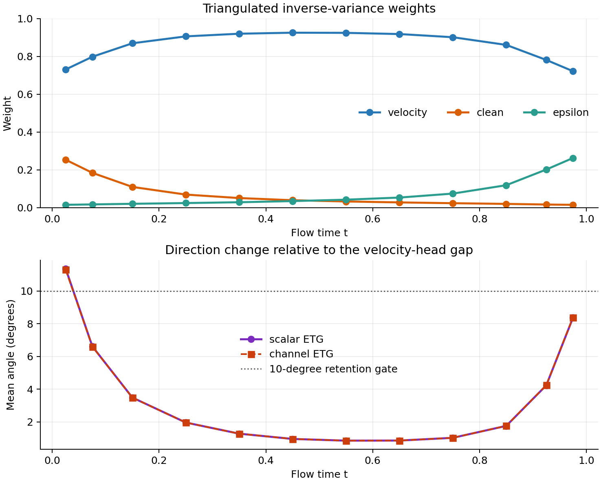
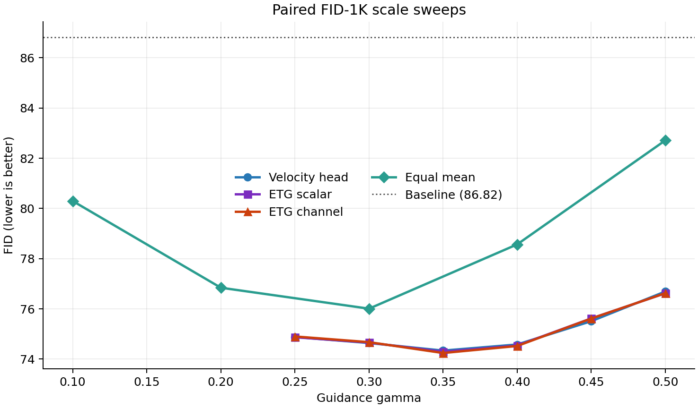

# ImageNet-100 SiT v800 Error-Triangulated Guidance 验证

## 结论

本轮在 `v800` 上找到了现成且严格匹配的 depth-8 三头资产，因此没有重新训练。三个弱头都连接到同一个冻结的 SiT-S/2 `v800` EMA backbone，在相同中间特征上分别预测 velocity、clean latent 和 epsilon，并各自训练 50K step。

**ETG 在这组资产上没有通过保留门。** 最佳 channel ETG 的 FID-1K 为 `74.2426`，最佳单 velocity 头为 `74.3389`，差值仅 `0.0963`。这个差异远低于当前 FID-1K 筛查约 `0.5` 的可信分辨率，也远低于预注册的 `1.0` FID 保留门；同时 ETG 的 sFID 还略差。几何上，ETG 与 velocity 单头 guidance 的全局夹角仅 `3.57` 度，非平行能量只有 `0.255%`。因此它没有恢复一个新的、可辨识的共同方向，而是基本退化成了自动选择 velocity 头。

这不是因为校准样本太少或权重不稳定。两组独立 calibration seed 的最大权重差只有 `0.00120`。真正的问题是三角帽模型与现有三头的误差结构不匹配：velocity 的原始私有方差估计在 12/12 个时间 bin 中均为负，三个头对真实 velocity 的总误差 cosine 为 `0.77-0.91`，说明共享表示产生的共同误差占主导，无法从三组 pairwise disagreement 中按“不相关、零均值私有噪声”模型可靠拆出各头误差。

## 实验定义

线性 flow 为：

$$
x_t=(1-t)\epsilon+t x,\qquad v=x-\epsilon.
$$

三个 depth-8 弱头的原生输出统一转换到 velocity：

$$
W_v=\hat v,
\qquad
W_x=\frac{\hat x-x_t}{\max(1-t,0.05)},
\qquad
W_\epsilon=\frac{x_t-\hat\epsilon}{\max(t,0.05)}.
$$

三角帽假设为：

$$
W_i=W_c+\eta_i,
\qquad
\mathbb E[\eta_i]=0,
\qquad
\mathbb E[\eta_i\eta_j^\top]=0\ (i\ne j).
$$

由两两差分风险恢复三组私有方差，再进行逆方差融合：

$$
r_v=\frac{d_{vx}+d_{v\epsilon}-d_{x\epsilon}}2,
\qquad
\widehat W_c=\sum_i a_iW_i,
\qquad
a_i\propto\frac1{r_i+\lambda}.
$$

部署权重只使用两组独立的 unguided `v800` rollout 校准，不使用 clean target、FID、图像或终端奖励。另取 512 个 teacher-forced 样本只做诊断，不参与权重估计。

## 资产与公平性

| 项目 | 配置 |
|---|---|
| strong | SiT-S/2 `v800` EMA |
| weak feature | 12 个 block 中第 8 个 block 的输出 |
| weak heads | velocity / clean / epsilon，各 `301,840` 参数 |
| head training | 各 50K step，global batch 256，LR `1e-4`，uniform time |
| head weights | EMA |
| calibration | 2 seeds x 256 条独立 baseline rollout |
| time bins | 12 |
| teacher audit | 独立 512 个 validation latent |
| FID screen | 46 个条件，各 1,000 张；相同 noise、labels、ODE、VAE、reference |
| sampling | Dopri5，FP32/TF32，CFG=1 |

新 ETG sampler 的 baseline 与旧 v800 sampler 在相同 16 个输入上的最终 uint8 图像逐元素完全一致，最大绝对误差为 0。全部 46 个正式条件具有相同的 noise 和 label fingerprint。

需要注意：clean 与 epsilon 转换使用 `0.05` endpoint floor，因此在最初和最后 5% 时间内并非严格 Bayes 等价。该边界被保留在校准元数据中；几何结果也显示 ETG 相对 velocity 的主要方向变化集中在这两个 endpoint 区间。

## 三角估计审计

### 原始估计与正则化

| 统计量 | scalar-time | channel-time |
|---|---:|---:|
| 负方差 entry 比例 | 33.33% | 33.33% |
| 负质量比例 | 4.96% | 4.96% |
| PSD clipping 相对 L2 改变量 | 4.10% | 4.10% |
| 平均最大 head 权重 | 85.45% | 85.44% |
| 最大权重大于 0.9 的 bin 比例 | 50.0% | 50.0% |

33.33% 并不是随机散落的负值：每个时间 bin 中的 velocity 私有方差都为负，而 clean 与 epsilon 均为正。PSD clipping 的总能量改变量不算大，但它系统性地把 velocity 变成“近零私有方差”的测量，于是逆方差融合自然塌缩到 velocity。

### 时间权重

| t | velocity | clean | epsilon |
|---:|---:|---:|---:|
| 0.025 | 0.731 | 0.254 | 0.016 |
| 0.075 | 0.798 | 0.184 | 0.018 |
| 0.150 | 0.869 | 0.110 | 0.021 |
| 0.250 | 0.906 | 0.070 | 0.025 |
| 0.350 | 0.920 | 0.051 | 0.029 |
| 0.450 | 0.925 | 0.040 | 0.035 |
| 0.550 | 0.924 | 0.033 | 0.043 |
| 0.650 | 0.918 | 0.028 | 0.054 |
| 0.750 | 0.901 | 0.024 | 0.075 |
| 0.850 | 0.861 | 0.020 | 0.119 |
| 0.925 | 0.781 | 0.017 | 0.202 |
| 0.975 | 0.722 | 0.015 | 0.263 |

clean 只在噪声端获得一定权重，epsilon 只在数据端获得一定权重；中间主体区间几乎完全由 velocity 决定。这与参数化分母的 endpoint 条件数一致，但没有形成贯穿采样过程的新共同方向。

两组校准 seed 的平均绝对权重偏差为 `0.000118`，最大差为 `0.00120`。因此这个退化结果是稳定的，不是小样本抖动。



## Teacher 诊断

| 弱预测 | 平均 velocity MSE ↓ |
|---|---:|
| velocity | 0.882534 |
| clean | 1.589602 |
| epsilon | 1.264625 |
| equal mean | 1.008689 |
| ETG scalar | **0.881062** |
| ETG channel | **0.881062** |

ETG 相对最佳 velocity 头只降低 `0.001473` MSE，约 `0.17%`。三个真实误差的平均 cosine 为：

| 误差对 | cosine |
|---|---:|
| velocity-clean | 0.9028 |
| velocity-epsilon | 0.9074 |
| clean-epsilon | 0.7700 |

这些 cosine 是包含共同 weak bias 的总误差相关性，不能直接等同于不可观测的私有误差相关性；但结合 12/12 个 velocity 负方差，它们说明经典三角帽所需的独立、零均值私有测量模型没有得到数据支持。

## 方向审计

在独立的 256 条 unguided `v800` rollout 上比较：

$$
g_v=S-W_v,
\qquad
g_{\mathrm{ETG}}=S-\widehat W_c.
$$

| 指标 | scalar ETG | channel ETG |
|---|---:|---:|
| global cosine with velocity gap | 0.998630 | 0.998628 |
| mean per-sample cosine | 0.996326 | 0.996326 |
| mean angle | 3.570 deg | 3.566 deg |
| projection coefficient onto velocity gap | 0.9810 | 0.9810 |
| gap RMS ratio | 0.9912 | 0.9912 |
| nonparallel energy fraction | 0.254% | 0.255% |

中间时间段的夹角只有约 `0.86-3.49` 度；较大的变化只出现在 `t=0.025` 的 `11.37` 度与 `t=0.975` 的 `8.37` 度。ETG 没有达到预注册的平均夹角大于约 10 度要求。

## 配对 FID-1K

每类方法独立扫描自己的 guidance scale。核心结果如下：

| 方法 | 最佳 gamma | FID ↓ | sFID ↓ | IS ↑ |
|---|---:|---:|---:|---:|
| baseline | 0 | 86.8151 | 219.9254 | 29.2797 |
| single velocity | 0.35 | 74.3389 | **215.2056** | 30.5725 |
| single clean | 0.15 | 80.3499 | 216.0251 | 29.6964 |
| single epsilon | 0.18 | 79.6268 | 220.0345 | 28.9397 |
| equal mean | 0.30 | 76.0083 | 216.7352 | 29.3897 |
| ETG scalar | 0.35 | 74.2922 | 215.2242 | 30.6141 |
| ETG channel | 0.35 | **74.2426** | 215.2185 | **30.6750** |

ETG channel 相对最佳 velocity 头的 FID 差为：

$$
74.3389-74.2426=0.0963.
$$

三条 `single velocity / scalar ETG / channel ETG` 曲线在所有共同 gamma 上几乎重合。最佳点的 sFID 没有改善，IS 只增加 `0.103`。这组结果不足以证明 ETG 的方向净化有效。



private-velocity residual 的最佳已测条件仅把 baseline 从 `86.8151` 改到 `86.2730`；这是 FID-1K 下 `0.542` 的边缘变化。clean/epsilon private residual 的 RMS 分别约为 common gap 的 `2.74x/2.08x`，未做 RMS 匹配时大 gamma 会严重恶化，因此这些极端值只能作为稳定性警告，不能拿来证明“所有 private residual 必然有害”。核心否定不依赖这组干预，而来自最佳单头比较与方向退化。

## 预注册保留门

| 保留条件 | 结果 | 判定 |
|---|---|---|
| ETG 比最佳单头至少低约 1.0 FID-1K | 只低 0.096 | 失败 |
| 每种方法独立优化 gamma 后仍有优势 | 已独立扫描，曲线几乎重合 | 失败 |
| 与最佳单头存在非平凡方向差异 | 平均约 3.57 度 | 失败 |
| private-only 明显弱于 common | velocity private 近无效；x/eps 未做 RMS 匹配 | 部分支持，不作为定论 |
| PSD 修正不应过大 | clipping L2 4.10% | 通过，但原始 v 方差系统性为负 |
| sFID/IS 不反向崩坏 | sFID 持平略差，IS 持平略好 | 通过 |

最佳单头比较、独立 scale 校准和非平凡方向差异这三项核心条件均未通过。按照原方案的停止约定，当前 ETG 版本应在 `v800` 上结束，不再增加第四头、频率分解、token router 或更复杂在线权重来挽救。

## 最终解释

三角帽理论本身没有算错；失败发生在把三头看成“同一潜在弱预测加相互不相关的私有测量噪声”这一步。三个头共享冻结 backbone 和同一中间表示，有限容量造成的主误差高度共同；parameterization 只在 endpoint 附近添加少量差异。pairwise disagreement 因而不足以辨识一个独立于最佳 velocity 头的新共同预测。

所以本轮得到的是一个清楚的负结论：

> 在现有 `v800` depth-8 三头上，ETG 的可辨识性假设不成立到足以产生新 guidance 方向的程度；正则化后的三角融合稳定地退化为 velocity-head selection，终端质量也没有可信地超过独立调参后的 velocity 单头。

完整生成样本与日志保存在本机数据盘：

```text
/data/users/zhoushunyu/eqvae/imagenet_sit_flow/error_triangulated_guidance_v800_depth8_v1
```

便携 CSV、JSON 和图位于：

```text
docs/data/imagenet100_sit_etg_v800_depth8_v1
```
