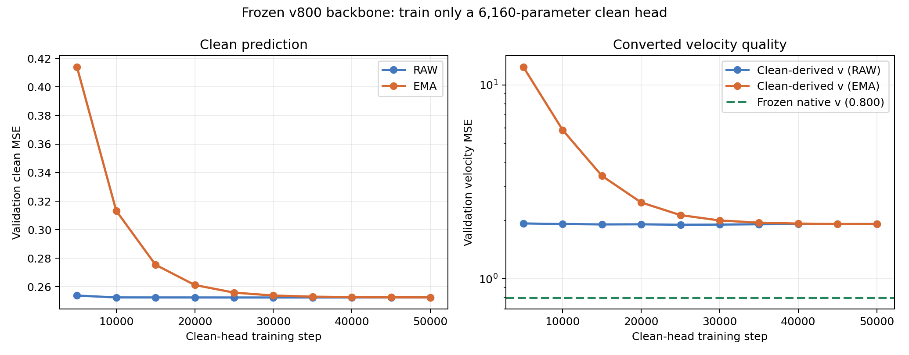
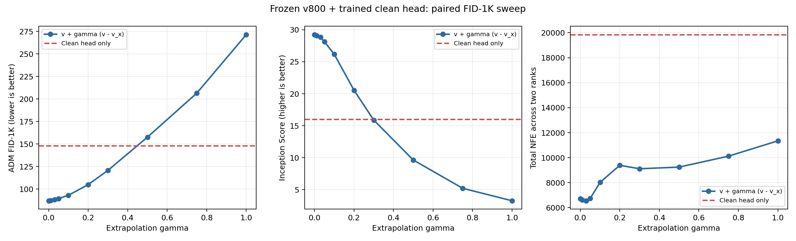
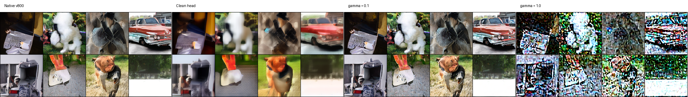

# SiT 冻结 v800 后训练 clean head 的结果

## 实验目的

本轮检查一个严格受控的问题：保留已经训练好的 `v800` SiT-S/2，只在相同 backbone 的最后增加一个很小的 clean-latent 输出头；这个弱头与强 `v` 头的差异，能否直接构成有效的 AutoGuidance 方向？

训练路径为：

```text
z_t = (1 - t) * epsilon + t * z_0
```

冻结的原生速度头输出：

```text
v_frozen(z_t, t)
```

新增头直接预测 SD-VAE clean latent：

```text
x_hat(z_t, t)
```

采样时把 clean prediction 转成速度：

```text
v_x = (x_hat - z_t) / max(1 - t, 0.05)
```

并扫描：

```text
v_gamma = v_frozen + gamma * (v_frozen - v_x)
```

其中 `gamma=0` 精确退化为冻结的 `v800`。

## 模型与训练

- source：SiT-S/2 `step=800K` EMA；
- dataset：ImageNet-100 的固定 SD-VAE latent cache；
- total parameters：`32,617,760`；
- trainable parameters：只有 clean output linear 的 `6,160` 个参数；
- backbone、AdaLN 和原生 velocity output 全部冻结；
- clean head loss：原生 clean-latent MSE；
- global batch：`256`；
- learning rate：`1e-4`；
- time distribution：`Uniform[0,1)`；
- precision：BF16，启用 `torch.compile` 和 TF32；
- train steps：`50,000`；
- head EMA：`0.9999`。

官方 SiT-S/2 的最终投影原本为 `learn_sigma=True` 预留 `2C` 输出。source checkpoint 的未使用半边严格为零，因此本实验把它显式拆成 `velocity_head` 与 `clean_head`：前半完整拷贝原生 velocity 参数，后半作为零初始化的 clean head。参数总数没有变化。

## 冻结审计

实现和正式 artifact 共同验证了：

- optimizer 只包含 clean head；
- frozen backbone 始终处于 `eval` 模式，class dropout 关闭；
- 拆分采用每个 patch 内的 channel 布局，而不是错误地从扁平输出中点切分；
- 真实 `v800` checkpoint 拆分前后的 velocity 输出最大绝对差为 `0`；
- `gamma=0` 与原生 velocity 分支逐值相等；
- 十次 validation 中 frozen velocity MSE 始终严格为 `0.8004864817`；
- 最终 head checkpoint 和 source checkpoint 的 SHA256 均与采样 manifest 一致。

相关测试与原 SiT FID 测试合计 `13 passed`。

## 训练结果

50K 时的正式 validation：

| 权重 | clean MSE | clean-derived velocity MSE | frozen velocity MSE |
|---|---:|---:|---:|
| raw | 0.252554 | 1.918102 | 0.800486 |
| EMA | 0.252590 | 1.913318 | 0.800486 |

EMA clean-derived velocity 的分时结果为：

| 时间区间 | clean MSE | clean-derived velocity MSE | frozen velocity MSE |
|---|---:|---:|---:|
| `[0.0, 0.2)` | 0.523449 | 0.644770 | 0.621261 |
| `[0.2, 0.4)` | 0.358381 | 0.713941 | 0.697298 |
| `[0.4, 0.6)` | 0.222466 | 0.884079 | 0.809868 |
| `[0.6, 0.8)` | 0.109868 | 1.329072 | 0.881532 |
| `[0.8, 1.0]` | 0.044629 | 6.346690 | 0.998804 |

clean MSE 已经稳定，但只训练线性 readout 得到的 clean-derived vector field 明显弱于原生 `v800`；数据端附近的 velocity error 尤其大。



## 配对 FID-1K

所有条件使用：

- 同一个 clean-head 50K EMA checkpoint；
- 相同的 1,000 个 initial noise 与 class labels；
- 两张 GPU、相同 Dopri5 ODE、FP32/TF32、CFG=1；
- 相同 SD-VAE decoder 和 ImageNet-100 ADM reference；
- sample seed `0`。

逐 rank noise SHA256 与 label SHA256 在 11 个条件中完全一致。

| 条件 | `gamma` | FID ↓ | sFID ↓ | IS ↑ | total NFE |
|---|---:|---:|---:|---:|---:|
| frozen velocity | 0 | **86.9043** | 220.1704 | **29.2454** | 6,714 |
| clean head only | - | 148.1405 | **210.3615** | 16.0080 | 19,848 |
| extrapolation | 0.01 | 87.2368 | 220.6556 | 29.0710 | 6,624 |
| extrapolation | 0.03 | 88.1927 | 221.6415 | 28.8512 | 6,552 |
| extrapolation | 0.05 | 89.3501 | 222.7397 | 28.1436 | 6,732 |
| extrapolation | 0.10 | 93.0170 | 225.7263 | 26.1721 | 8,028 |
| extrapolation | 0.20 | 104.8527 | 231.9129 | 20.5503 | 9,390 |
| extrapolation | 0.30 | 120.6884 | 236.3666 | 15.8833 | 9,114 |
| extrapolation | 0.50 | 157.6062 | 237.6529 | 9.6428 | 9,246 |
| extrapolation | 0.75 | 206.5844 | 262.0733 | 5.2210 | 10,122 |
| extrapolation | 1.00 | 271.5317 | 309.5106 | 3.2697 | 11,346 |





## 结果

本轮结果是明确的负结果：

1. 单独 clean head 的 FID 为 `148.14`，明显弱于冻结 velocity 的 `86.90`，且 ODE 总 NFE 约为后者的三倍。
2. 最小正外推 `gamma=0.01` 已把 FID 从 `86.9043` 推高到 `87.2368`。
3. 扫描范围内 FID 随正 `gamma` 严格单调恶化；IS 同步下降，较大系数还显著增加 NFE。
4. 图像上 clean head 更平滑、模糊；`gamma=0.1` 已有可见退化，`gamma=1` 出现强烈过锐化和结构破坏。

因此，这个实验否定的是下面这个具体构造：

> 在一个强模型的冻结表示上任意训练一个很弱的 clean 线性 readout，再直接使用 `strong - weak-head` 外推，并不会自动得到有用的 AutoGuidance。

它没有否定共享 backbone 或双头训练本身；这里的 clean head 没有参与 representation learning，也没有与 `v` 头联合训练。结果说明“弱”本身不够，过去有效的 weak model 很可能还需要与 strong model 共享连贯、可运输的结构性偏差。

由于 1K 筛查中没有任何正 `gamma` 优于 baseline，本轮按预注册逻辑没有继续做 5K 扩大评估。

## 结果边界

- 一个 head 训练 seed；
- 一个 FID-1K sample seed；
- 固定 ImageNet-100 latent cache，不含在线 horizontal flip；
- FID-1K 不适合判断十分之几的微小差异，但本轮趋势单调且大系数退化幅度远高于评估噪声；
- clean-derived velocity 使用与 JiT-style x predictor 一致的 `0.05` denominator floor。

## 数据与代码

- 便携数据：[`docs/data/imagenet100_sit_frozen_v_clean_head_50k/`](data/imagenet100_sit_frozen_v_clean_head_50k/)
- 双头投影与 field 公式：[`experiments/imagenet100_sit_vx_dual_head.py`](../experiments/imagenet100_sit_vx_dual_head.py)
- frozen-head 训练：[`experiments/train_imagenet100_sit_frozen_v_clean_head.py`](../experiments/train_imagenet100_sit_frozen_v_clean_head.py)
- 四卡训练入口：[`experiments/run_imagenet100_sit_frozen_v800_clean_head_4gpu.sh`](../experiments/run_imagenet100_sit_frozen_v800_clean_head_4gpu.sh)
- 采样：[`experiments/sample_imagenet100_sit_frozen_v_clean_head_fid.py`](../experiments/sample_imagenet100_sit_frozen_v_clean_head_fid.py)
- FID-1K 流水线：[`experiments/run_imagenet100_sit_frozen_v_clean_head_fid1k.py`](../experiments/run_imagenet100_sit_frozen_v_clean_head_fid1k.py)
- 聚合与绘图：[`experiments/summarize_imagenet100_sit_frozen_v_clean_head.py`](../experiments/summarize_imagenet100_sit_frozen_v_clean_head.py)
- 测试：[`tests/test_imagenet100_sit_vx_dual_head.py`](../tests/test_imagenet100_sit_vx_dual_head.py)

本机完整 artifact：

```text
/home/zhoushunyu/data/eqvae/imagenet_sit_flow/runs/sit-s-2_v800-ema_frozen-clean-head_seed0/
/home/zhoushunyu/data/eqvae/imagenet_sit_flow/fid1k_v800_frozen_clean_head_step50000/
```

11 份生成样本 NPZ 合计约 `2.16 GB`，以及 head checkpoint、日志和中间文件均保留在本机数据盘，不写入 Git。
