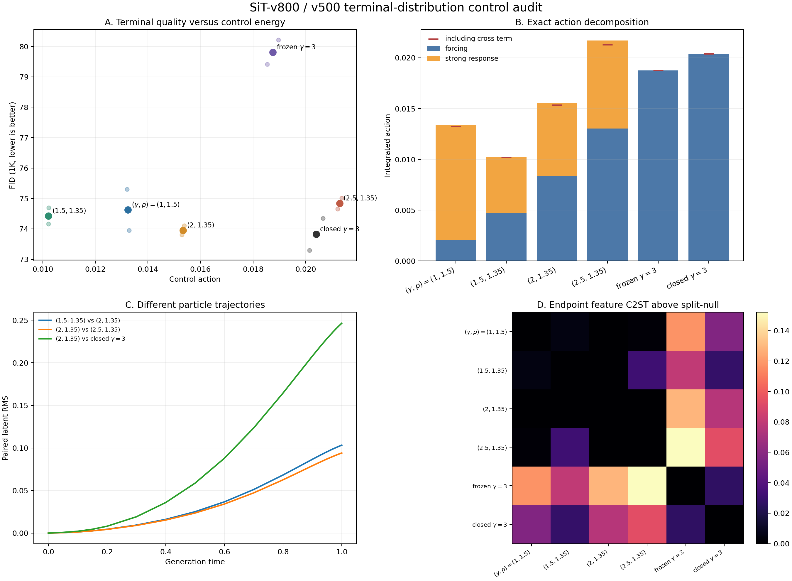

# SiT 终端分布控制审计

## 实验目的

此前 `v800` strong + `v500` weak 的二维扫描出现一条宽的低 FID 区域。不同 `(gamma, rho)` 可以获得相近 FID，但这只能证明终端质量相近，不能证明终端生成分布相近。

本轮固定现有模型，不训练新参数，回答三个问题：

1. 相近 FID 的控制是否产生明显不同的粒子轨迹？
2. 这些控制的 control action 是否明显不同？
3. 它们解码后的终端分布是否仍可被简单统计检验区分？

## 动力学定义

设 strong field 为 `S`，weak field 为 `W`，baseline 为：

```text
b' = S(b,t)
g_b = S(b,t) - W(b,t)
```

factorized 系统为：

```text
z' = S(b,t) + rho * [S(z,t) - S(b,t)] + gamma * g_b
```

相对于原 strong dynamics `S(z,t)`，它施加的控制是：

```text
u = gamma * g_b + (rho - 1) * [S(z,t) - S(b,t)]
```

因此 action 可以精确分解为 nominal forcing、strong-response control 和二者的 cross term：

```text
A = 0.5 * integral E[mean(u^2)] dt
```

本轮还加入 `closed gamma=3`，即每一步都在当前 guided state 上重新计算 weak-strong gap 的正常 AutoGuidance。

## 实验协议

- ImageNet-100，SiT-S/2；
- strong：`v800` EMA；weak：`v500` EMA；
- 每个条件 1,000 张图，使用两个配对 sample seeds；
- 同一 seed 内所有条件共享 initial noise、class labels 和 ADM reference；
- 记录 20 个生成时刻的完整 paired latent trajectory；
- 使用官方 ADM FID/sFID/IS；
- 终端分布检验使用 ADM pool-3 features，经 pooled PCA-128 后计算 SWD、MMD、Frechet 和线性 C2ST；
- C2ST AUC 越接近 `0.5`，两个条件越难被线性分类器区分；cross-condition 与 split-null 使用相同的每类 500 个 group。

以下均为 **FID-1K**，只能在本表协议内横向比较，不能与此前 FID-5K 的绝对数值直接比较。

## 跨种子主结果

| 条件 | FID-1K | sFID | IS | control action |
|---|---:|---:|---:|---:|
| baseline | 87.859 +/- 0.261 | 219.693 | 29.080 | - |
| `(gamma,rho)=(1,1.5)` | 74.629 +/- 0.951 | 216.442 | 31.780 | 0.013242 |
| `(1.5,1.35)` | 74.429 +/- 0.374 | **216.302** | 32.058 | **0.010216** |
| `(2,1.35)` | 73.955 +/- 0.215 | 216.373 | 31.505 | 0.015338 |
| `(2.5,1.35)` | 74.836 +/- 0.249 | 216.667 | 30.653 | 0.021295 |
| frozen `gamma=3` | 79.809 +/- 0.567 | 219.967 | 29.996 | 0.018753 |
| closed `gamma=3` | **73.822 +/- 0.749** | 218.415 | **32.249** | 0.020399 |

两个采样 seed 中，四个 factorized 低谷点都保持在约 `73.8-75.3`。action 的跨 seed 波动极小，例如 `(1.5,1.35)` 为 `0.010216 +/- 0.000009`，`closed gamma=3` 为 `0.020399 +/- 0.000363`。

## 粒子轨迹和控制代价

低 FID 区域不是同一条粒子轨迹的数值重复：

| pair | endpoint latent paired RMS | ADM feature paired RMS | action ratio |
|---|---:|---:|---:|
| `(1.5,1.35)` vs `(2,1.35)` | 0.1033 | 0.1264 | 1.50x |
| `(2,1.35)` vs `(2.5,1.35)` | 0.0941 | 0.1137 | 1.39x |
| `(1.5,1.35)` vs `(2.5,1.35)` | 0.1724 | 0.1803 | 2.08x |
| `(2,1.35)` vs closed `gamma=3` | 0.2465 | 0.2432 | 1.33x |

baseline endpoint latent 的逐样本 RMS 约为 `0.81`。因此 `(1.5,1.35)` 与 `(2,1.35)` 的同样本终点差异约为 latent 尺度的 `13%`；`(2,1.35)` 与 closed 的差异约为 `30%`。

control action 与质量不是单调关系：

- `(1.5,1.35)` 到 `(2,1.35)` 的 action 增加约 `50%`，FID 只改善约 `0.47`；
- `(2.5,1.35)` 的 action 是 `(1.5,1.35)` 的约 `2.08x`，FID 反而高约 `0.41`；
- `(2,1.35)` 与 closed 的 FID 均约为 `73.9`，但前者 action 低约 `25%`。

action 的 forcing/response cross term 在所有 factorized 条件中都很小且略为负，因此低 action 不是由两个巨大分量相互抵消造成的。`(1.5,1.35)` 的 forcing action 为 `0.004688`，response-control action 为 `0.005574`，二者接近均衡。

## 终端分布检验

下面比较解码图像的 ADM feature distribution。`C2ST excess` 是 cross-condition AUC 减去两个条件 split-null AUC 的均值：

| pair | C2ST AUC | C2ST excess | 判断范围 |
|---|---:|---:|---|
| `(1.5,1.35)` vs `(2,1.35)` | 0.526 | 0.000 | 当前检验分辨率内难区分 |
| `(2,1.35)` vs `(2.5,1.35)` | 0.521 | -0.006 | 当前检验分辨率内难区分 |
| `(1.5,1.35)` vs `(2.5,1.35)` | 0.555 | 0.032 | 存在较弱但跨 seed 稳定的差异 |
| `(2,1.35)` vs closed `gamma=3` | 0.600 | 0.077 | 终端 feature distribution 明显不同 |
| baseline vs `(2,1.35)` | 0.731 | 0.203 | 检验能够识别 guidance 引起的分布变化 |

前两组相邻 factorized 条件虽然使用明显不同的 action、逐样本终点也不同，但在当前 1K/线性 ADM feature 检验下难以区分。这构成了“不同粒子控制可以产生近似相同终端 marginal”的第一条局部证据。

但整个低 FID 区域不能称为同一个终端分布：

- `(1.5,1.35)` 与 `(2.5,1.35)` 已出现可重复的 C2ST/IS 差异；
- `(2,1.35)` 与 closed `gamma=3` 的 FID 几乎相同，但 C2ST 明显可分。

因此当前得到的是两层结论：

1. **terminal quality control 存在稳定且宽的冗余区间；**
2. **factorized 低谷内存在局部、受当前检验分辨率限制的 terminal-distribution 近似等价，但不存在全局等价证据。**

随机投影 latent 检验甚至无法稳定区分 baseline 与 guided 条件，说明该诊断在当前高维 latent 上功效不足；报告没有把这一负结果作为“latent distribution 相同”的证据。

## 数值与证据边界

- factorized 多条件合批积分在两个 seed 的首批样本上均与逐条件独立积分核对，最大 endpoint RMS difference 为 `0.00373`，低于预注册阈值 `0.005`；
- high-gamma closed 分支因更刚性而独立使用更严格的 `rtol=1e-5`；
- action 用 20 个含密集端点的时间快照做梯形积分；缩减到 11 点后各条件均值变化不超过 `1.2%`；
- 结果只有一个训练 run、两个 sampling seeds 和每条件 1K 样本；不能替代多训练 seed 或 FID-50K；
- C2ST 只检验 pooled PCA-128 中线性可分的 ADM feature 差异，接近 `0.5` 只能解释为“当前检验未能区分”，不是数学上的分布相等证明；
- action 是相对于原 strong dynamics 的逐坐标均方控制积分，不等于推理 FLOPs、物理能量或 Wasserstein transport cost。

## 便携结果



- 主表：[`aggregate_condition_summary.csv`](data/imagenet100_sit_terminal_distribution_audit_800k_v1/aggregate_condition_summary.csv)
- 终端 feature pairwise：[`aggregate_feature_pairwise.csv`](data/imagenet100_sit_terminal_distribution_audit_800k_v1/aggregate_feature_pairwise.csv)
- 同样本 feature 差异：[`aggregate_paired_feature.csv`](data/imagenet100_sit_terminal_distribution_audit_800k_v1/aggregate_paired_feature.csv)
- action 分解：[`aggregate_action.csv`](data/imagenet100_sit_terminal_distribution_audit_800k_v1/aggregate_action.csv)
- 逐时间动力学：[`aggregate_diagnostics.csv`](data/imagenet100_sit_terminal_distribution_audit_800k_v1/aggregate_diagnostics.csv)
- 数据说明：[`docs/data/imagenet100_sit_terminal_distribution_audit_800k_v1/README.md`](data/imagenet100_sit_terminal_distribution_audit_800k_v1/README.md)
- 本机完整结果：`/home/zhoushunyu/data/eqvae/imagenet_sit_flow/terminal_distribution_audit_800k_v1/`
