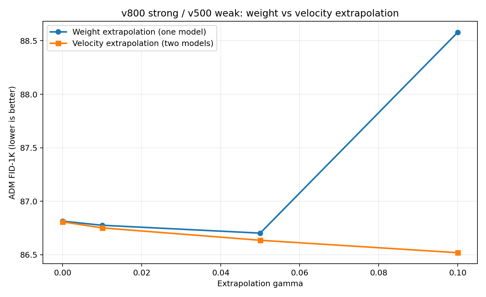
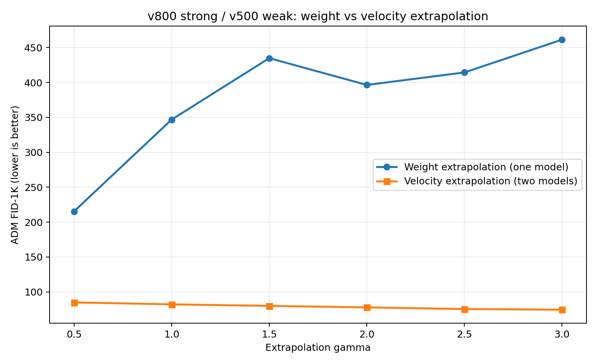

# SiT EMA 权重外推实验

## 实验目的

本轮检查一个直接问题：标准 AutoGuidance 在输出速度上做 strong-minus-weak 外推；能否改为在 checkpoint 权重上做相同代数外推，从而只运行一个模型？

实验使用同一训练轨迹上的两个 native velocity SiT-S/2 checkpoint：

```text
strong = v800 EMA
weak   = v500 EMA
```

它们的架构、ImageNet-100 latent cache、训练配置和训练 seed 相同，只相差训练进度。

权重空间方法为：

```text
theta_gamma = theta_800 + gamma * (theta_800 - theta_500)
```

速度空间对照为：

```text
v_gamma(z,t) = v_800(z,t) + gamma * (v_800(z,t) - v_500(z,t))
```

前者采样时只运行一个派生模型，后者每次 ODE 求值运行 strong 与 weak 两个模型。

## 实现与审计

实现首先严格检查两个 checkpoint 的：

- protocol；
- model name；
- prediction target 与 loss space；
- time sampler 与 denominator floor；
- global batch、训练 seed 与数据 manifest；
- official SiT 源码 metadata；
- state-dict key、顺序、shape、dtype 与非浮点 buffer。

只有训练 step 允许不同。所有浮点 tensor 统一使用：

```text
strong + gamma * (strong - weak)
```

非浮点 state 必须在两个 checkpoint 中完全相同。`gamma=0` 单独走精确 clone 分支，并已验证与 strong EMA 每个 tensor 完全相等。

派生 checkpoint 保存公式、源 checkpoint SHA256、step、权重类型和 `gamma`。采样 manifest 新增逐 rank noise/label SHA256，因此可以检查权重外推与速度外推是否真正使用相同随机输入。

## 小尺度结果

小尺度先筛查：

```text
gamma = {0, 0.01, 0.05, 0.1}
```

每个条件使用相同的 1,000 个 initial noise、相同 class labels、同一 ADM reference 和 sample seed 0。

| `gamma` | 权重 FID | 速度 FID | 权重 sFID | 速度 sFID | 权重 IS | 速度 IS |
|---:|---:|---:|---:|---:|---:|---:|
| 0 | 86.8140 | 86.8070 | 219.9294 | 219.9474 | 29.2870 | 29.3088 |
| 0.01 | 86.7754 | 86.7510 | 220.0104 | 219.9246 | 29.3480 | 29.3108 |
| 0.05 | **86.7020** | 86.6353 | 220.6788 | **219.9039** | **29.4714** | 29.4025 |
| 0.10 | 88.5788 | **86.5191** | 221.8537 | 219.9757 | 29.3932 | **29.4439** |

按各自 `gamma=0` 基线计算：

| `gamma` | 权重 FID 变化 | 速度 FID 变化 |
|---:|---:|---:|
| 0.01 | -0.0386 | -0.0560 |
| 0.05 | -0.1120 | -0.1717 |
| 0.10 | **+1.7648** | **-0.2880** |

`0.01/0.05` 的 FID 变化很小，且 sFID 并未同步改善，因此只能登记为筛查信号。到 `gamma=0.1`，权重外推已经明显退化，而速度外推仍沿改善方向变化。



## 大尺度结果

原始 AutoGuidance 常用有限强度系数，因此还扫描：

```text
gamma = {0.5, 1, 1.5, 2, 2.5, 3}
```

| `gamma` | 权重 FID | 速度 FID | 权重 sFID | 速度 sFID | 权重 IS | 速度 IS |
|---:|---:|---:|---:|---:|---:|---:|
| 0.5 | 215.3378 | 84.8532 | 225.9120 | 219.6608 | 5.2360 | 30.2124 |
| 1.0 | 346.7866 | 82.1577 | 288.2247 | 219.0167 | 2.1536 | 31.1671 |
| 1.5 | 434.8092 | 79.9545 | 315.3588 | 218.6511 | 2.0119 | 32.5021 |
| 2.0 | 396.4338 | 77.7844 | 304.7521 | 218.5660 | 1.4506 | 31.9951 |
| 2.5 | 414.3360 | 75.3956 | 368.5279 | 218.3022 | 1.4844 | **32.8173** |
| 3.0 | 461.3254 | **74.4795** | 325.3892 | **217.8690** | 1.1736 | 32.3689 |

大尺度下，权重外推全部失效；速度场外推则随 `gamma` 增大持续降低 FID。两种方法不能在同一个 `gamma` 标度下互换。



## 同点速度比较

为避免只比较最终 FID，实验还在同一批 `v800` rollout states 和相同 `(z,t)` 上计算：

```text
v_weight(theta_gamma; z,t)
v_direct = v800(z,t) + gamma * [v800(z,t) - v500(z,t)]
```

完整速度的 cosine 在很小 `gamma` 时接近 1，但这主要是两者都被未修改的 strong 输出主导。真正比较相对 strong 的增量时：

| `gamma` | 完整速度 cosine | 完整速度相对 L2 | 增量 cosine | 权重/速度增量范数比 |
|---:|---:|---:|---:|---:|
| 0.001 | 0.9999998 | 0.00057 | 0.0947 | 12.10 |
| 0.005 | 0.9999988 | 0.00151 | 0.1688 | 6.34 |
| 0.010 | 0.9999957 | 0.00279 | 0.1765 | 5.82 |
| 0.050 | 0.9998826 | 0.01462 | 0.1606 | 6.06 |
| 0.100 | 0.9994527 | 0.03131 | 0.1343 | 6.39 |
| 0.500 | 0.9454049 | 0.28946 | -0.0346 | 10.42 |
| 1.000 | 0.7051497 | 0.72394 | -0.0436 | 15.54 |
| 3.000 | 0.0470737 | 4.94153 | -0.0012 | 40.24 |

因此，即使在 `gamma=0.01`，权重空间产生的函数增量也没有近似速度场 AutoGuidance 的增量：方向 cosine 只有约 `0.18`，范数约大 `5.8` 倍。小尺度只让总输出保持接近，并没有建立两种外推的一阶等价性。

## 结果边界

- 所有结果来自 EMA；没有把 raw training weights 与 EMA 混合比较。
- 只有一个训练 seed 和一个 1K sample seed。
- FID-1K 适合筛查明显失效，不足以确认 `0.04-0.11` FID 的微小收益。
- `gamma=0` 的两条采样包装器不是逐位相同，但 FID 只差 `0.0070`；生成像素 `93.47%` 精确相等，平均绝对差为 `0.0668/255`。
- 大尺度失败足以否定“用相同 AutoGuidance 系数直接做 EMA 权重外推”；小尺度是否存在可重复最优点尚未由正式样本量证明。

## 数据与代码

- 便携数据：[`docs/data/imagenet100_sit_weight_extrapolation_v800_v500/`](data/imagenet100_sit_weight_extrapolation_v800_v500/)
- 权重运算与配对验证：[`experiments/imagenet100_sit_weight_extrapolation.py`](../experiments/imagenet100_sit_weight_extrapolation.py)
- checkpoint 构建：[`experiments/build_imagenet100_sit_weight_extrapolation_checkpoints.py`](../experiments/build_imagenet100_sit_weight_extrapolation_checkpoints.py)
- 采样与 FID：[`experiments/run_imagenet100_sit_weight_extrapolation_fid1k.py`](../experiments/run_imagenet100_sit_weight_extrapolation_fid1k.py)
- 同点速度诊断：[`experiments/compare_imagenet100_sit_weight_velocity_extrapolation.py`](../experiments/compare_imagenet100_sit_weight_velocity_extrapolation.py)
- 聚合与绘图：[`experiments/summarize_imagenet100_sit_weight_extrapolation.py`](../experiments/summarize_imagenet100_sit_weight_extrapolation.py)
- 大尺度流水线：[`experiments/launch_imagenet100_sit_weight_extrapolation.sh`](../experiments/launch_imagenet100_sit_weight_extrapolation.sh)
- 小尺度流水线：[`experiments/launch_imagenet100_sit_weight_extrapolation_small_scale.sh`](../experiments/launch_imagenet100_sit_weight_extrapolation_small_scale.sh)
- 测试：[`tests/test_imagenet100_sit_weight_extrapolation.py`](../tests/test_imagenet100_sit_weight_extrapolation.py)

本机完整 artifact 根目录：

```text
/home/zhoushunyu/data/eqvae/imagenet_sit_flow/weight_extrapolation_v800_v500_v1/
```
