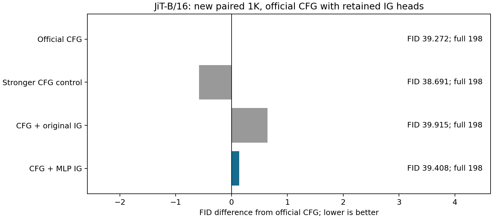
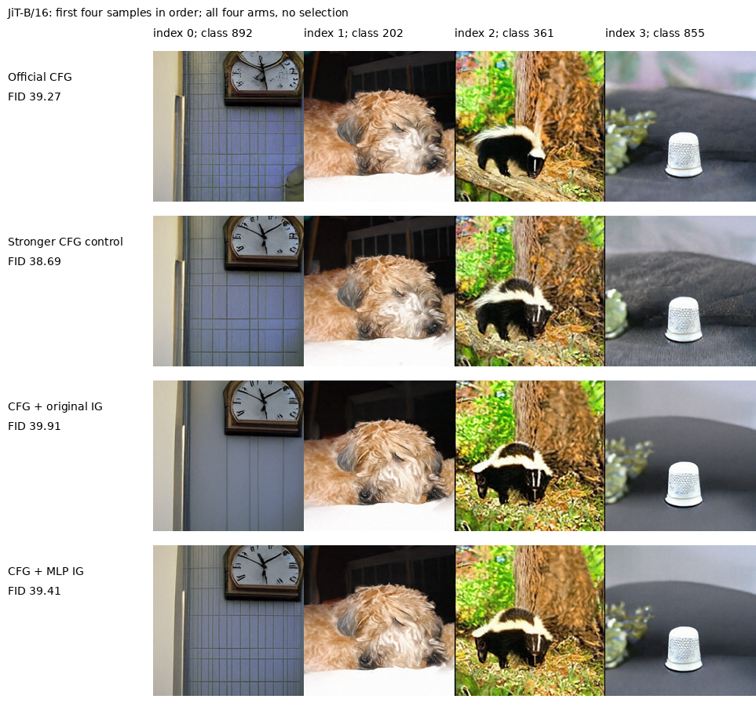

# JiT读出在官方CFG设置中的应用结果

固定MLP组合没有通过本轮1K应用门槛，停止该组合，不追加系数或窗口搜索。

| arm           |     fid |   inception_score |   full_calls_per_output |   prefix_calls_at_inference |   head_calls_per_output |
|:--------------|--------:|------------------:|------------------------:|----------------------------:|------------------------:|
| cfg_reference | 39.2715 |           59.0248 |                     198 |                           0 |                       0 |
| cfg_more      | 38.6909 |           62.4971 |                     198 |                           0 |                       0 |
| cfg_native    | 39.9146 |           57.5197 |                     198 |                           0 |                      50 |
| cfg_mlp       | 39.4083 |           58.4255 |                     198 |                           0 |                      50 |

MLP组合相对单独CFG的FID差为0.1368，相对原IG组合为-0.5063，相对增强CFG为0.7174。预设门槛要求三者都≤−1，且IS≥单独CFG的90%。它是继续/停止规则，不是统计显著性检验。

四臂各1000张，每类1张，共4000张新质量样本，numpy seed2026121401。初始噪声、标签、权重、Heun50末步Euler、CFG=3和区间(.1,1)全部配对。未合并之前的1K或5K样本，也没有新增训练。两个组合均在既有CFG场上加.3*(strong−weak)，使用原depth4；前25个Heun完整步的两个RHS都启用IG，之后关闭。增强CFG控制在相同窗口把weak换成已经计算的unconditional，使每个RHS的strong总系数与组合相同；它包括基础CFG未开启的早期，不能简称为全程CFG=3.3。MLP采用保留3000步EMA，原弱头采用既有50K EMA。

四个采样器均为每图198次完整前向；组合的50次小头读出发生在已计算的条件主干第4层。没有独立弱前缀、附加条件主干或第二条生成路径。MLP相对单独CFG增加整个1,777,152参数读出，仅相对原IG组合是替换净增4,608参数。

同卡batch4，轮换预热后各三次完整采样及像素量化，所有臂保留相同调用计数hook。计时重复数少，不以完整前向次数相同宣称延迟严格相等。

| arm           |   median_seconds |   min_seconds |   max_seconds |   relative_to_cfg |   batch |   repeats |
|:--------------|-----------------:|--------------:|--------------:|------------------:|--------:|----------:|
| cfg_reference |          3.15943 |       3.12412 |       3.17191 |        0          |       4 |         3 |
| cfg_more      |          3.19664 |       3.11242 |       3.22383 |        0.0117761  |       4 |         3 |
| cfg_native    |          3.17678 |       3.10992 |       3.20739 |        0.00548971 |       4 |         3 |
| cfg_mlp       |          3.18728 |       3.18574 |       3.61019 |        0.00881529 |       4 |         3 |

官方CFG完整轨迹与冻结原实现一致；两个组合和增强CFG在附加项为0时逐项退回CFG；三条非零修改轨迹均与独立参考实现逐项一致，组合的独立实现调用原features接口。所有图像、像素前状态、输入、标签、请求SHA、完整及各12层block调用、头调用均核验。同缓存特征FP64复算FID最大绝对差6.37581e-06，不属于独立特征提取验证。评价沿用nanogen imagenet_256_fid_stats，不与论文50K或不同参考统计的数值比较。

本实验检验已有读出在更强实际配置中的应用价值。[IG](https://github.com/CVL-UESTC/Internal-Guidance)及[SGG](https://arxiv.org/html/2603.20584v1)已有相关引导先例，不将相加形式当成核心创新；这也不是纯CFG的新改进。单个1K不能证明统计显著性或普适组合规律。

[冻结协议](JIT_READOUT_CFG_APPLICATION_PROTOCOL_20260913_ZH.md) · [独立5K的IG确认](JIT_READOUT_CONFIRM_RESULTS_20260913_ZH.md) · [源数据工作簿](data/jit_readout_cfg_application_20260913/source_data.xlsx) · [核验记录](data/jit_readout_cfg_application_20260913/verification.json)。
