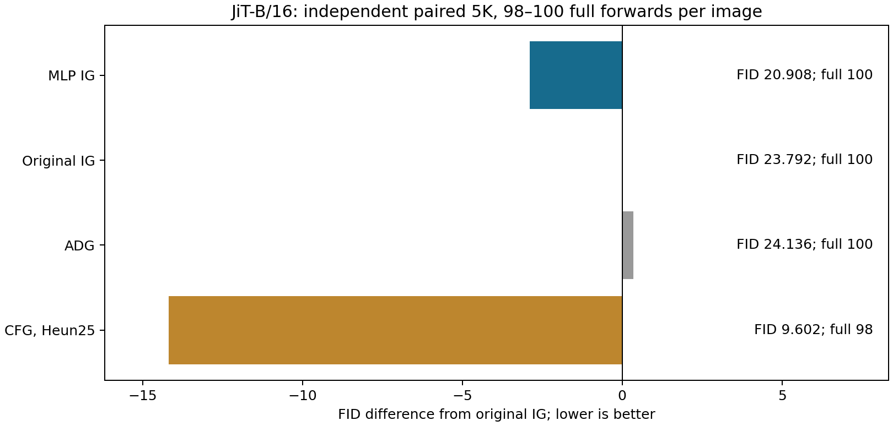
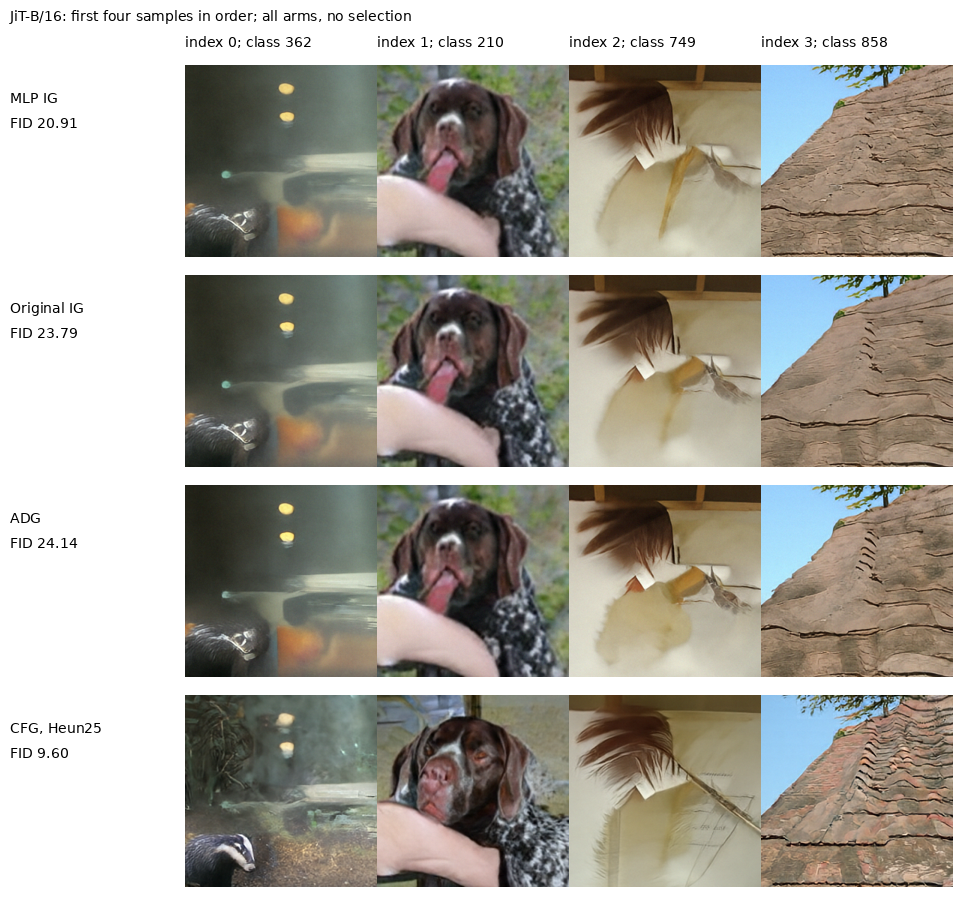

# JiT-B/16中间读出：独立5K确认与CFG预算对照

MLP读出在JiT-B/16的全新5K中保持了相对原IG及ADG的收益，通过预设确认门槛。接近同查询预算的CFG25仍有更低FID。因此，读出对IG的改善不能写成已优于CFG的实用方法。

| arm         |      fid |   inception_score |   primary_samples |   full_calls_per_output |   prefix_calls_at_inference |
|:------------|---------:|------------------:|------------------:|------------------------:|----------------------------:|
| mlp         | 20.9082  |           65.3125 |              5000 |                     100 |                           0 |
| native_base | 23.7918  |           60.4439 |              5000 |                     100 |                           0 |
| adg         | 24.1363  |           59.7778 |              5000 |                     100 |                           0 |
| cfg_heun25  |  9.60224 |          167.203  |              5000 |                      98 |                           0 |

MLP相对原IG的FID差为-2.8836，相对ADG为-3.2281，相对CFG25为11.3059。门槛要求前两者均≤−1，且MLP IS≥原IG的90%；它是预设继续/停止规则，不是统计显著性检验。



本轮四臂各5000张，共20000张；ImageNet-1K每类5张，numpy seed2026121391，batch4。四臂完全配对初始噪声和标签；原1K未合并进入本轮FID。没有重新训练或挑选checkpoint，MLP仍为原3000步最终EMA，depth4、alpha=.3、Euler100、前50步启用保持原样。ADG保持原弱头、强度和窗口。

CFG使用官方CFG=3、区间(.1,1)、Heun25且末步Euler。49次RHS各计算条件和无条件输出，合计98次主干前向；三个IG相关臂100次主干前向。CFG25与官方Denoiser两条完整轨迹逐项相同，三个IG相关臂直接调用冻结1K函数，并通过原强/弱输出、旧IG轨迹及零引导一致性预检。CFG与IG求解器和时间网格不同，这是一项接近同查询预算的实用比较，不能用于单独识别求解器或引导公式的因果贡献。

同GPU、batch4，轮换预热后各三次完整采样和像素量化；所有臂保留相同主干与block调用计数hook。仅三次计时不能支持精确的加速幅度或延迟置信区间。

| arm         |   median_seconds |   min_seconds |   max_seconds |   relative_to_native |   batch |   repeats |
|:------------|-----------------:|--------------:|--------------:|---------------------:|--------:|----------:|
| mlp         |          1.64464 |       1.60109 |       1.68408 |            0.0162695 |       4 |         3 |
| native_base |          1.61831 |       1.60732 |       1.67027 |            0         |       4 |         3 |
| adg         |          1.63779 |       1.6321  |       1.66918 |            0.0120356 |       4 |         3 |
| cfg_heun25  |          1.5681  |       1.56704 |       1.6466  |           -0.0310279 |       4 |         3 |

MLP弱头1,777,152参数，原弱头1,772,544参数，替换净增4,608。只在原主干第4层输出后计算选中的小头，每图额外prefix为0；比较进程为了切换方法加载多个小头，上述参数差针对部署时仅保留一个弱头的替换，不是进程总显存差。相对无IG的裸主干，MLP整个小头都是额外参数。

另提供只加载一个主干和一个MLP弱头的[采样入口](../experiments/jit_readout_confirm_20260913/reference.py)。它重放本轮前8张，最终FP32状态及uint8像素逐项一致；零引导退回条件模型也逐项一致。这些8张是重放核验，不计入新质量样本。运行前设置所需CUDA_VISIBLE_DEVICES；noise为CUDA上的FP32张量[N,3,256,256]，labels为CUDA上的int64类别索引[N]，范围0–999。

```python
from experiments.jit_readout_confirm_20260913.reference import Reference
rt = Reference()
states, counts = rt.sample(noise, labels)
images = rt.pixels(states)
rt.close()
```

等训练原结构对照已在前一轮独立1K完成，本5K未重复该臂。因此，这里验证的是固定MLP对既有IG/ADG的迁移收益，不将其写成5K的等训练结构因果实验，也不把读出参数化、标准化及位置输入的联合变化全部归因于非线性。

全部图像、像素前状态、量化、输入噪声、标签、源码/资产SHA和每批12层调用数核验通过。同一缓存特征用FP64对称协方差形式复算FID，最大绝对差1.87583e-12。沿用同一nanogen imagenet_256_fid_stats；未换成JiT仓库统计，不能将本5K绝对FID与论文50K数值比较，复算也不等于独立特征提取器验证。



展示采样顺序的前四张及相同类别，未按观感选择。该结果不能证明共同误差分布、平滑或加性误差抵消，也不能仅凭冻结小读出宣称新的核心原理。[JiT官方实现](https://github.com/LTH14/JiT)是模型与CFG来源；[SSG](https://arxiv.org/html/2607.29122v1)已有冻结中间adapter的先例。

[冻结5K协议](JIT_READOUT_CONFIRM_PROTOCOL_20260913_ZH.md) · [前轮1K及等训练控制](JIT_READOUT_TRANSFER_RESULTS_20260913_ZH.md) · [源数据工作簿](data/jit_readout_confirm_20260913/source_data.xlsx) · [核验记录](data/jit_readout_confirm_20260913/verification.json)。
