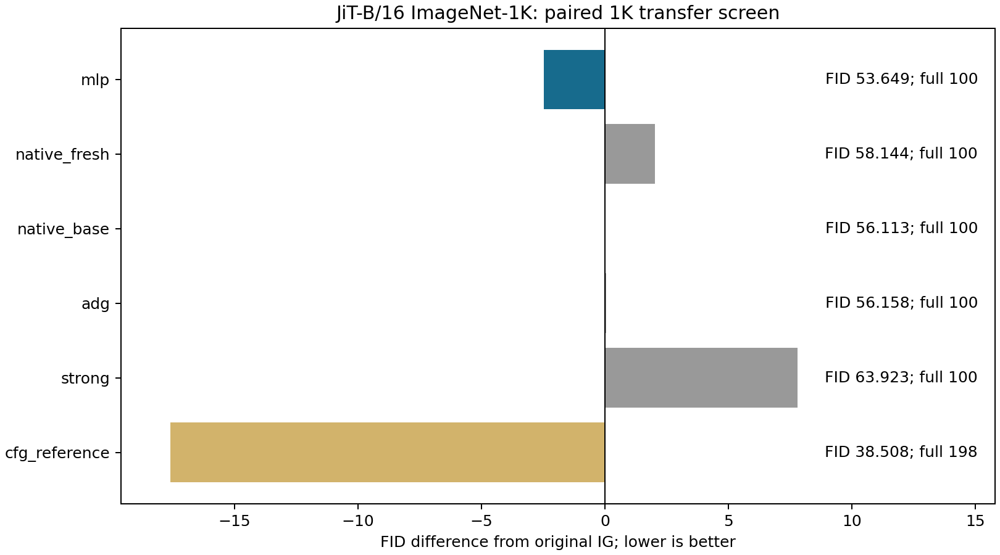
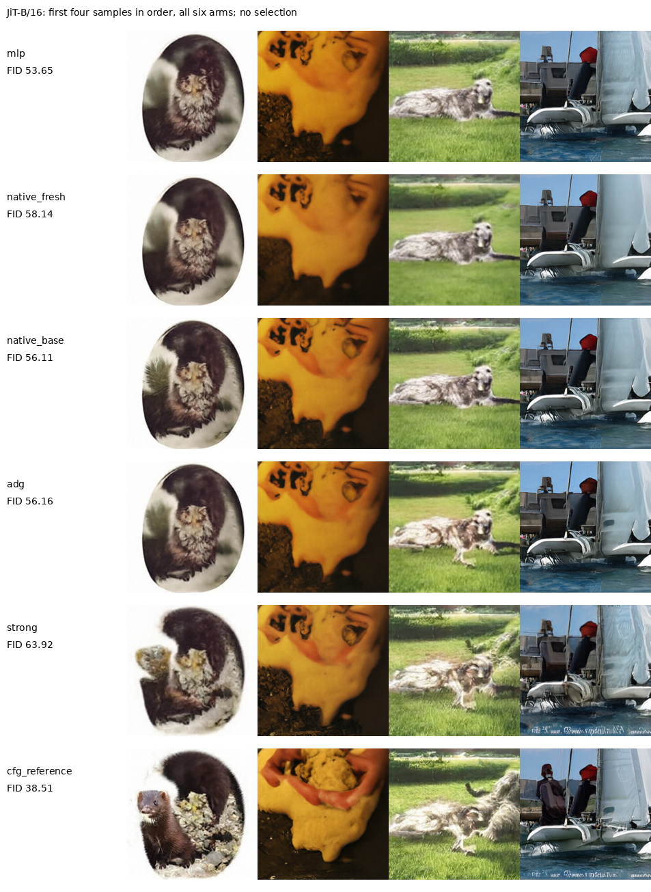

# JiT-B/16中间MLP读出的实际生成检验

MLP读出在JiT-B/16的这组固定1K通过迁移门槛，值得用全新5K确认。MLP FID为53.6491，旧IG为56.1130，ADG为56.1578，等训练原结构为58.1444。

六臂各1000张新图，共6000张，ImageNet-1K每类1张；numpy seed2026121381，初始像素噪声和标签全部配对。MLP、等训练原结构和旧IG沿用depth4、Euler100、alpha=.3、前50步启用、后50步关闭；ADG使用旧弱头及同一强度和窗口。没有叠加CFG，没有重选层数、窗口或系数。

| arm           |     fid |   inception_score |   full_calls_per_output |   prefix_calls_at_inference |
|:--------------|--------:|------------------:|------------------------:|----------------------------:|
| mlp           | 53.6491 |           33.8117 |                     100 |                           0 |
| native_fresh  | 58.1444 |           30.4354 |                     100 |                           0 |
| native_base   | 56.113  |           31.7747 |                     100 |                           0 |
| adg           | 56.1578 |           32.1885 |                     100 |                           0 |
| strong        | 63.9226 |           27.8839 |                     100 |                           0 |
| cfg_reference | 38.5081 |           59.3642 |                     198 |                           0 |

官方CFG参考为CFG=3、Heun50末步Euler、区间(.1,1)、198次full；其余为100次full。CFG是更多主干计算的实用参考，不以其差异识别读出结构效果，也不将这里的1K FID与论文50K数值横向比较。

实际替换参数：旧弱头1,772,544，MLP 1,777,152，净增4,608。采样只在原模型第4层hook中计算选中的弱头，不重复前缀，也不同时计算原弱头。比较程序为切换方法同时加载三个小头；参数净差指部署时保留一个替换弱头的比较，不能当作比较进程总显存差。

同GPU、batch4，轮换预热后各三次完整采样及像素量化；全部方法保留相同调用计数hook。三次计时不提供精确的延迟置信区间。

| arm           |   median_seconds |   min_seconds |   max_seconds |   relative_to_native |   batch |   repeats |
|:--------------|-----------------:|--------------:|--------------:|---------------------:|--------:|----------:|
| mlp           |          1.66688 |       1.66197 |       1.74427 |          -0.0187424  |       4 |         3 |
| native_fresh  |          1.68291 |       1.65291 |       1.70892 |          -0.00930558 |       4 |         3 |
| native_base   |          1.69871 |       1.63753 |       1.72351 |           0          |       4 |         3 |
| adg           |          1.73388 |       1.6894  |       1.75141 |           0.0206997  |       4 |         3 |
| strong        |          1.65969 |       1.63854 |       1.69908 |          -0.0229704  |       4 |         3 |
| cfg_reference |          3.25776 |       3.2565  |       3.36205 |           0.917778   |       4 |         3 |

两个新头共享3000步真实图像训练，batch32；更新循环约160.16秒，不含加载、统计批和最终验证。MLP沿用SiT有效结构，但输出改为JiT原生clean patch，采用原生logit-normal时间和velocity loss分母下限。每类48张，共48000张真实训练图，两次打乱遍历；训练外另有32批统计估计。主干与原条件末层权重及梯度隔离均核验。没有strong生成数据或蒸馏。

| arm          |   validation_mse |   parameters |
|:-------------|-----------------:|-------------:|
| mlp          |        0.0840616 |      1777152 |
| native_fresh |        0.0971817 |      1772544 |
| native_base  |        0.0948328 |      1772544 |

原结构对照使用官方RMSNorm权重1、输出及AdaLN末层为0的初始化。新头的优化预算相同，但原结构与MLP的标准化、位置输入及参数化不同；固定3000步不证明都已收敛。旧IG使用既有50K弱头，与新训练预算不同。预测MSE未用于选择checkpoint或判断生成收益。

共享强输出、旧弱输出、旧IG完整轨迹、零引导退回条件模型、官方CFG完整轨迹均逐项一致。每个采样批都记录12层实际调用与完整调用数，全部为0额外prefix。所有图像、状态量化、标签、输入及请求SHA核验通过；缓存特征FP64复算FID最大差2.79815e-05。评价使用既有nanogen的imagenet_256_fid_stats，未换成JiT仓库自带统计；所有臂使用同一参考，不将复算称为独立特征提取器验证。

每类只有一张，这轮不支持类别内质量估计或多种子统计显著性。它检验固定SiT结构迁移到JiT的结果，不证明共同误差分布、平滑、加性误差抵消或普适跨模型规律。[JiT官方代码](https://github.com/LTH14/JiT)提供模型与CFG来源；[SSG](https://arxiv.org/html/2607.29122v1)已有冻结中间adapter先例，小MLP本身不构成核心新意。

[冻结协议](JIT_READOUT_TRANSFER_PROTOCOL_20260913_ZH.md) · [源数据工作簿](data/jit_readout_transfer_20260913/source_data.xlsx) · [核验记录](data/jit_readout_transfer_20260913/verification.json)。
