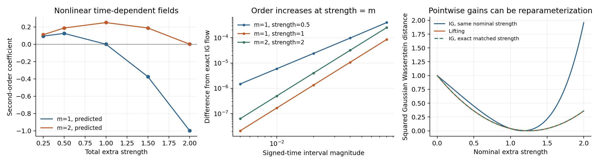

# Lifting 与普通 IG 的差别：局部流、离散误差和强度重标定

2026-09-09。当前得到的是算子层面的明确结论：部分 lifting 通常与同强度普通 IG
相差一个二阶局部项；该项随强度变号，但不能由它的符号判断图像质量。
一维线性例子进一步表明，较平稳的强度曲线可以完全来自强度重标定。
这些结果帮助解释正在进行的[四模型扫参](LIFTING_WIDE_SCALE_PROTOCOL_20260909_ZH.md)，
不预判扫参结论，也不构成新方法或论文目标已经实现的证据。

## 当前实验究竟实施什么

令 Strong 和 Weak 的速度场为 \(S(t,z),W(t,z)\)，差值为 \(D=S-W\)。
对有符号时间区间 \([t,t+h]\)，先用 Strong 推进，再用 Weak 返回，得到同一时刻的映射

\[
L=\Phi_W^{t\leftarrow t+h}\circ\Phi_S^{t+h\leftarrow t}.
\]

一次部分写入是 \(\Psi_c(z)=z+c(L(z)-z)\)。总额外强度为 \(\alpha\)、重复写入
\(m\) 次时，完整更新是

\[
M_{\alpha,m}=\Phi_S^{t+h\leftarrow t}\circ\Psi_{\alpha/m}^{\circ m}.
\]

正在运行的四模型扫描使用 \(m=1\)。lifting 已承担引导；主推进场仍为 Strong。
同强度普通 IG 的场是 \(F_\alpha=S+\alpha D\)，传统记法的 scale 为 \(1+\alpha\)。
方法与数值实现分别见[原始定义](IG_CAPACITY_LIFTING_CONSTANT_20260908_ZH.md)和
[本轮冻结源码](../experiments/lifting_scale_sweep_20260909.py)。Strong 去噪、Weak
反向推进这一基本构造已有 [W2SD](https://arxiv.org/html/2502.00473v2) 等先例；此处不宣称其原创。

## 精确流的首个差异项

假设局部场足够光滑、相关导数有界，\(\alpha\) 在该区间内固定，\(m\) 为固定正整数。
记 \(J_D=\partial_z D\)。独立展开得到

\[
\boxed{
M_{\alpha,m}(z)-\Phi_{F_\alpha}^{t+h\leftarrow t}(z)
=\frac{h^2}{2}\left(\alpha-\frac{\alpha^2}{m}\right)J_DD+O(h^3).
}
\]

这里 \(J_DD\) 是差值场沿自身方向的变化，不是 \(\|D\|^2\)，也不是质量梯度。
结果对正、负 \(h\) 都成立。随时间变化的情况可增广为
\(\overline S=(1,S),\overline W=(1,W),\overline D=(0,D)\)；于是
\(J_{\overline D}\overline D=(0,J_DD)\)，最终差异项中时间偏导恰好消去。

一个直接推导如下。对自治记法，先展开相对映射：

\[
L-I=hD+h^2E+O(h^3),\qquad
E=\tfrac12J_SS-J_WS+\tfrac12J_WW.
\]

将 \(\Psi_{\alpha/m}\) 复合 \(m\) 次得到

\[
\Psi_{\alpha/m}^{\circ m}(z)
=z+\alpha hD+h^2\left[\alpha E+
\frac{\alpha^2(m-1)}{2m}J_DD\right]+O(h^3).
\]

再由 Strong 推进，减去精确 \(F_\alpha\) 流的二阶 Taylor 展开，即得到上式。
对增广场实施同样计算即可覆盖非自治情况。

这解释了两个容易混淆的现象。第一，\(m=1,\alpha=1\) 的首个差异项为零：完整
Strong–Weak 逆流–Strong 构成对称的二阶分裂。同理 \(\alpha=m\) 的完整重复写入
也是对称构造。第二，在固定总强度下增加 \(m\)，并不自动让它更接近同一个精确
IG 流；二阶系数由 \(\alpha(1-\alpha)/2\) 变成
\(\alpha(1-\alpha/m)/2\)。例如 \(\alpha=1\) 时，\(m=1\) 的二阶项消失，
而 \(m=2\) 的二阶系数是 \(1/4\)。这些是局部精度判断，不是质量排序。

## 实际 Heun 辅助流与 Euler 主推进还包含另一项

SiT-XL、RAEv2 和 JiT 使用 Heun 计算辅助 Strong/Weak 流、Euler 做主推进；普通
IG 也使用 Euler。它们不满足上节的精确子流假设。设区间中细步为
\(\delta_j\)，\(\sum_j\delta_j=h\)，固定细步比例，并记

\[
q=\sum_j(\delta_j/h)^2,\qquad A_V=\partial_t V+J_VV.
\]

对相同网格比较实际 lifting 与普通 Euler IG，可得

\[
\boxed{
M^{\mathrm{Heun/Euler}}_{\alpha,m}-E_{F_\alpha}
=\frac{h^2}{2}\left[
\left(\alpha-\frac{\alpha^2}{m}\right)J_DD
+q(A_{F_\alpha}-A_S)\right]+O(h^3).
}
\]

原因是 Euler 近似相对子流的二阶误差为 \(-qh^2A_V/2\)，Heun 辅助流的误差则
从三阶开始。所需差值可完全展开为

\[
A_{F_\alpha}-A_S
=\alpha(\partial_tD+J_SD+J_DS)+\alpha^2J_DD.
\]

四个等长细步时 \(q=1/4\)；非均匀网格则由实际步长决定。因此，即便
\(m=1,\alpha=1\)，本轮 Euler 实现仍可能有二阶差异，不能把精确流的抵消点
直接当成神经模型的零差异预测。小 SiT 的主推进是自适应 Dopri5，需分别考虑
容差、分段重启与 Heun 辅助流误差，不套用这个 Euler 公式。

两套独立 CPU 检查均已完成。它们使用显式随时间变化的二维非线性场，并同时检查
正、负时间方向，未调用 GPU 生产采样器。

| 检查 | 规模 | 预测修正后余项的最小实测阶数 |
|---|---:|---:|
| DOP853 高精度子流，对比精确普通 IG | 800 个配置 | 2.995406 |
| Heun 辅助 / Euler 主流，一步、四步等距、四步非均匀网格 | 2,400 个配置 | 2.996484 |

数值阶数与 \(O(h^3)\) 一致。源码分别为
[精确流检查](../experiments/check_lifting_modified_flow_20260909.py)和
[离散实现检查](../experiments/check_lifting_discrete_expansion_20260909.py)，逐项数据及随机状态
保存在 [audit.json](data/lifting_modified_flow_20260909/audit.json)、
[discrete_audit.json](data/lifting_modified_flow_20260909/discrete_audit.json) 及同目录 CSV。
这些有限数值检查支持推导的实现一致性，不代替光滑条件下的代数证明。

## 平稳收益可以只是换了强度坐标

考虑一维线性精确流，Strong 的区间放大因子为 \(a>0\)，Weak 为 \(b>0\)，
记 \(r=a/b\)。一次部分 lifting 与普通 IG 的放大因子分别是

\[
A_{\mathrm{lift}}(\alpha)=a[1+\alpha(r-1)],\qquad
A_{\mathrm{IG}}(\gamma)=ar^\gamma.
\]

只要 \(1+\alpha(r-1)>0\) 且 \(r\ne1\)，取

\[
\boxed{\gamma_{\mathrm{eff}}(\alpha)=
\frac{\log[1+\alpha(r-1)]}{\log r}}
\]

就有逐样本完全相同的输出。\(r\to1\) 时该表达式的极限为 \(\alpha\)。
因此，同一组名义强度上的曲线可以相差明显，而连续调参后的生成分布族完全相同。

平台的横轴宽度也不是重参数化不变量。对任意质量曲线 \(Q(\gamma)\)，在最优区附近
选一个导数较小的单调映射 \(\gamma=f(\alpha)\)，\(Q(f(\alpha))\) 的平台就会变宽，
而生成分布族与最佳质量都没有增加。因此，“更宽的平台”至多先证明特定参数约定下
更易调节；若可由普通 IG 的标量映射得到同样效果，还必须解释额外计算为何值得。
这不否定实际稳健性的工程价值，但单凭平台宽度不能识别新的质量机制。

有效强度校准本身已有研究先例：[Guidance Matters（ICLR 2026）](https://proceedings.iclr.cc/paper_files/paper/2026/hash/559a0998fab1d19b80e7e43a5852401c-Abstract-Conference.html)
将新方法的更新投影到 CFG 方向并比较经过校准的 CFG。本次已核对正式版的相关方法段；
其沿轨迹平均的投影强度是一种实用对照，不等于证明非线性生成分布完全相同。
本文的一维精确恒等式和神经模型中尚未完成的对应检验也应作同样区分。

检查中的具体例子为 \(a=.8,b=.4\)，初始分布 \(N(0,1)\)，目标标准差为 1.8。
在本轮网格 \(0,.25,.5,1,1.5,2\) 上，lifting 在多个同强度点更接近目标；
两个方法连续调参后的最优平方 Wasserstein 距离却都为零。对 201 个强度点实施
上述重标定，最大放大因子差异仅为 \(4.44\times10^{-16}\)。

在可同时对角化的多维线性场中，各特征方向可以具有不同的 \(r_i\)，因而一般需要
不同的 \(\gamma_{\mathrm{eff},i}\)。这时一个全局强度未必能消掉差别。对非线性神经
场，是否发生这种无法被单强度解释的变化，需要实际证据，不能由一维例子推断。
当 \(\alpha>1,r\le1-1/\alpha\) 时部分写入的因子还可能为零或负值，上述实数
对数对应失效；不应把这个区域静默裁剪后继续称为同一算子。

## 对当前结果应如何解释

本轮先完成两种方法的预定宽强度曲线。同强度差异、同一离散网格上的最优值、各自
所有已观察点的最优值分别报告；最后一项会受到历史扫描密度不同的影响。
若 lifting 只是把最佳区域拉宽，结论应限于名义强度的稳健性；若连最佳质量也改善，
才有理由继续区分方向改变、有限步数值效应与额外计算的贡献。

局部差异公式没有给出 FID 改善的符号，也没有证明准确采样某个目标就必然更接近
真实图像分布。已有[质量与局部风险的反例及实证边界](RAEV2_GUIDANCE_THEORY_LESSONS_20260907_ZH.md)
仍然适用。这里保留可检验的算子结构，等待完整曲线来决定下一项值得做的实验。
