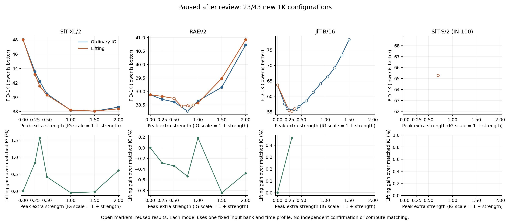

# Lifting 与普通 IG：四模型宽强度扫描

更新于 2026-09-09 11:48 UTC。按研究价值复核提前停止，保留部分扫描：新增完整 1K 配置 23/43，复用 25 份历史结果，记录 0 个数值失败配置。

这是一组配对探索曲线。单个强度上的改善、离散网格中的最优值、充分调参后的最优质量，是不同结论；当前实验不提供独立确认或等计算成本的优越性结论。

[冻结协议](LIFTING_WIDE_SCALE_PROTOCOL_20260909_ZH.md) · [全部数据](data/lifting_wide_scale_20260909/curves.csv) · [数值复核](data/lifting_wide_scale_20260909/audit.json) · [算子推导与强度重标定](LIFTING_MODIFIED_FLOW_AND_SCALE_20260909_ZH.md)

本轮已完成 SiT-XL 与 RAEv2 的全部预定点。经用户要求重新评估研究价值后，停止其余采样：JiT 首个新配置的部分 batch 原样保留，不计算 FID；小 SiT 的新配置未启动。下方 JiT、小 SiT 曲线来自此前的历史结果。提前停止是研究优先级决定，不是数值失败，也不表示四模型扫描完成。

[本轮决定与 IG 承载等式研究](IG_FIXED_POINT_CARRIER_RETHINK_20260909_ZH.md)

共同主网格为 α=0/.25/.5/1/1.5/2；历史锚点同时保留。普通 IG 的传统 scale 为 1+α。lifting 本身承担引导，每个活动区间写入一次；两个操作没有叠加。每个模型保持自身固定时间窗口和强度形状，因此横轴是该模型的峰值额外强度。

## 已有结果是否足够强

| 模型 | IG 已观察最低 FID | lifting 已观察最低 FID | lifting 相对改善 |
|---|---:|---:|---:|
| SiT-XL/2 | 38.05737（α=1.5） | 38.06559（α=1.5） | -0.022% |
| RAEv2 | 38.26424（α=0.78） | 38.45230（α=0.65） | -0.491% |
| JiT-B/16 | 55.48033（α=0.3） | 55.22358（α=0.3） | +0.463% |
| SiT-S/2（ImageNet-100） | 未完成，已暂停 | 65.28696（α=0.7） | — |

这一表回答目前是否观察到更好的最低 FID；它包含不同密度的历史扫描，不能视为对称搜索后的最终比较。小 SiT 的旧未分段 IG 另列在文末，未混入本轮重启曲线。

较宽的平台也需要保持足够好的质量。本轮扫描前，RAEv2 已有 α=.65/.78/.85/.90 的 lifting FID 为38.4523/38.4685/38.4566/38.4972，较平但均差于原生 IG38.2642；JiT 当时已有 α=.24/.30/.36 的 lifting 为55.4558/55.2236/56.0385，尚不能据三个锚点确定平台宽度。这些具体观察不替代下方宽网格尚未完成的点。

## 共同主网格上的当前观察

| 模型 | 共同主网格：IG 最低 FID | 共同主网格：lifting 最低 FID | 完成状态 |
|---|---:|---:|---|
| SiT-XL/2 | 38.05737（α=1.5） | 38.06559（α=1.5） | 队列完成 |
| RAEv2 | 38.60686（α=0.5） | 38.57011（α=1） | 队列完成 |
| JiT-B/16 | 55.62258（α=0.25） | 63.67457（α=0） | 尚未完成，最低值仅限已完成点 |
| SiT-S/2（ImageNet-100） | 未完成，已暂停 | 未完成，已暂停 | 尚未完成，最低值仅限已完成点 |

表中 α=0 是两种方法共用的 Strong 结果，未重复计入采样量。历史采样网格密度不同，因此不把“所有已观察点”的最低值混入共同主网格比较。

## SiT-XL/2

| α | 普通 IG FID ↓ | lifting FID ↓ | 同强度改善率 | lifting / IG 耗时 |
|---:|---:|---:|---:|---:|
| 0 | 48.01338 | 48.01338 | +0.000% | — |
| 0.25 | 43.54871 | 43.18441 | +0.837% | 3.542× |
| 0.35 | 42.21295 | 41.55015 | +1.570% | 3.540× |
| 0.5 | 40.47908 | 40.30916 | +0.420% | 3.561× |
| 1 | 38.19029 | 38.20819 | -0.047% | 3.529× |
| 1.5 | 38.05737 | 38.06559 | -0.022% | 3.562× |
| 2 | 38.61597 | 38.38128 | +0.608% | 3.545× |

已完成 6 个非零同强度对照，其中 4 个 lifting FID 较低。此计数不代表统计显著性，也不代表未测强度的行为。

## RAEv2

| α | 普通 IG FID ↓ | lifting FID ↓ | 同强度改善率 | lifting / IG 耗时 |
|---:|---:|---:|---:|---:|
| 0 | 38.87413 | 38.87413 | +0.000% | — |
| 0.25 | 38.70298 | 38.81327 | -0.285% | 3.485× |
| 0.5 | 38.60686 | 38.73797 † | -0.340% | 3.461× |
| 0.65 | 未完成，已暂停 | 38.45230 † | — | — |
| 0.78 | 38.26424 † | 38.46848 † | -0.534% | — |
| 0.85 | 未完成，已暂停 | 38.45658 † | — | — |
| 0.9 | 未完成，已暂停 | 38.49721 † | — | — |
| 1 | 38.64248 | 38.57011 | +0.187% | 3.483× |
| 1.5 | 39.15159 | 39.48150 | -0.843% | 3.478× |
| 2 | 40.72684 | 40.92065 | -0.476% | 3.480× |

已完成 6 个非零同强度对照，其中 1 个 lifting FID 较低。此计数不代表统计显著性，也不代表未测强度的行为。

## JiT-B/16

| α | 普通 IG FID ↓ | lifting FID ↓ | 同强度改善率 | lifting / IG 耗时 |
|---:|---:|---:|---:|---:|
| 0 | 63.67457 † | 63.67457 † | +0.000% | — |
| 0.15 | 57.55909 † | 未完成，已暂停 | — | — |
| 0.2 | 56.13985 † | 未完成，已暂停 | — | — |
| 0.24 | 未完成，已暂停 | 55.45583 † | — | — |
| 0.25 | 55.62258 † | 未完成，已暂停 | — | — |
| 0.3 | 55.48033 † | 55.22358 † | +0.463% | 2.336× |
| 0.35 | 55.79321 † | 未完成，已暂停 | — | — |
| 0.36 | 未完成，已暂停 | 56.03855 † | — | — |
| 0.4 | 55.86267 † | 未完成，已暂停 | — | — |
| 0.45 | 56.77981 † | 未完成，已暂停 | — | — |
| 0.5 | 未完成，已暂停 | 未完成，已暂停 | — | — |
| 0.6 | 58.52994 † | 未完成，已暂停 | — | — |
| 0.75 | 61.25827 † | 未完成，已暂停 | — | — |
| 0.9 | 64.06199 † | 未完成，已暂停 | — | — |
| 1 | 未完成，已暂停 | 未完成，已暂停 | — | — |
| 1.05 | 66.33615 † | 未完成，已暂停 | — | — |
| 1.2 | 69.21218 † | 未完成，已暂停 | — | — |
| 1.35 | 73.42528 † | 未完成，已暂停 | — | — |
| 1.5 | 78.30884 † | 未完成，已暂停 | — | — |
| 2 | 未完成，已暂停 | 未完成，已暂停 | — | — |

已完成 1 个非零同强度对照，其中 1 个 lifting FID 较低。此计数不代表统计显著性，也不代表未测强度的行为。

## SiT-S/2（ImageNet-100）

| α | 普通 IG FID ↓ | lifting FID ↓ | 同强度改善率 | lifting / IG 耗时 |
|---:|---:|---:|---:|---:|
| 0 | 未完成，已暂停 | 未完成，已暂停 | — | — |
| 0.25 | 未完成，已暂停 | 未完成，已暂停 | — | — |
| 0.5 | 未完成，已暂停 | 未完成，已暂停 | — | — |
| 0.7 | 未完成，已暂停 | 65.28696 † | — | — |
| 1 | 未完成，已暂停 | 未完成，已暂停 | — | — |
| 1.5 | 未完成，已暂停 | 未完成，已暂停 | — | — |
| 2 | 未完成，已暂停 | 未完成，已暂停 | — | — |

## 可比范围与历史基准

† 表示同一输入 bank 的历史结果，已核对像素、来源文件和参考统计的身份；不是新的独立抽样。耗时是各 batch 采样与解码 GPU 秒之和，不含模型加载、预检和 FID 评估；未记录的旧成本留空。

SiT-XL 本轮主推进为 Euler100；旧 Euler115 调优结果 FID38.18548（IG scale=2.5）属于不同步数。JiT 的官方 CFG 基准 FID38.77898 仍明显强于此前内部头 IG 的55.48033，不能只赢弱头对照就称为该模型最佳采样。小 SiT 的旧未分段普通 IG 为64.85130，本轮普通 IG 特意使用与 lifting 一致的分段重启，二者不混成一条曲线。这些历史基准的原始语境见[研究状态中的既有结果](RESEARCH_STATUS.md)及[XL 多指标报告](OFFICIAL_SIT_XL_MULTIMETRIC_RESULTS_20260909_ZH.md)。

1K 的有限样本 FID、同一 bank 上选强度、以及小 SiT 的历史批次 RNG 约定限制了外推。独立复核使用相同缓存 Inception 特征的另一套 FP64 算术，并非独立图像采样或第二特征模型。

当前局部流推导说明，lifting 的差异包含强度依赖项和数值积分项；一维 Gaussian 中甚至可以完全重标定为普通 IG。所以即使曲线更平稳，也应先报告强度稳健性；是否存在额外质量机制需要完整曲线、计算成本与后续独立证据。

研究目标尚未实现；本报告不把扫参、推导或局部正结果写成 ICLR 级研究成功。
