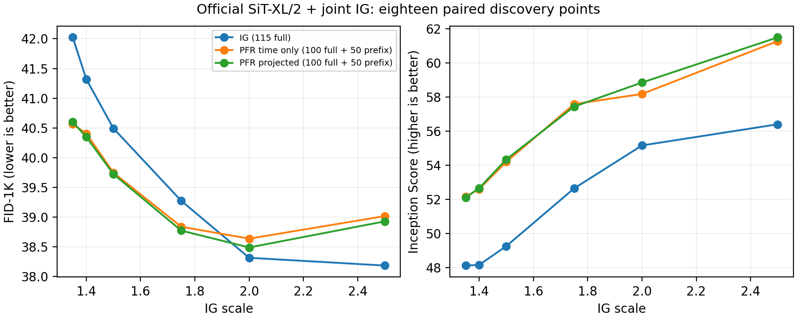

# 官方 SiT-XL：补足上侧网格后，PFR 的最低 FID 未领先

十八个共同网格点已完成并通过核验。当前探索网格内，普通 IG 最低 FID-1K 为 **38.18548（scale=2.5）**，time-only PFR 为 **38.63782（2.0）**，完整 projected PFR 为 **38.48965（2.0）**。PFR 在较低强度的优势真实存在，但没有变成这份更宽网格上的最低 FID 优势。普通 IG 的最低点仍在上界，尚不能宣称充分调优；同一批 1K 的选择也不能代替新的独立确认。

## 完整共同网格

官方 800EP SiT-XL/2 EMA、联合 depth-8 弱头、ImageNet-1K、同一历史平衡 1K 输入银行，每类一图、B4。网络 FP32、状态 FP64、采样 TF32 关闭，MSE VAE。普通 IG 为 Euler115（3220 block/图），PFR 为 Euler100＋50 次 depth-8 前缀（3200 block/图）；本轮各臂实测推理 1022–1027 GPU 秒。

| scale | 普通 IG FID ↓ | time-only PFR FID ↓ | projected PFR FID ↓ |
|---:|---:|---:|---:|
| 1.35 | 42.02391 | 40.56543 | 40.60214 |
| 1.40 | 41.32023 | 40.40504 | 40.34867 |
| 1.50 | 40.49286 | 39.74632 | 39.72330 |
| 1.75 | 39.27349 | 38.83823 | 38.77339 |
| 2.00 | 38.31590 | 38.63782 | 38.48965 |
| 2.50 | 38.18548 | 39.01736 | 38.92857 |

time-only / projected 各自最低点比普通 IG 当前最低点差 +0.45234 / +0.30417。这里比较的是三种方法相同网格上的各自最低点，保留全部点，没有以调优普通 IG 对比固定低强度 PFR。空间投影在 scale=2.0 相对 time-only 改善 0.14817；它不是没有作用，但尚未使 PFR 超过当前普通 IG 最低点，也没有独立复现。

## 统计变化与解释边界

| 方法与强度 | 均值项 ↓ | 协方差项 ↓ | IS ↑ |
|---|---:|---:|---:|
| 普通 IG 2.0 | 0.25971 | 38.05621 | 55.15806 |
| time-only PFR 2.0 | 0.83829 | 37.79955 | 58.17766 |
| projected PFR 2.0 | 0.80911 | 37.68056 | 58.84818 |
| 普通 IG 2.5 | 0.34467 | 37.84083 | 56.39755 |
| time-only PFR 2.5 | 1.39152 | 37.62586 | 61.27762 |
| projected PFR 2.5 | 1.37453 | 37.55405 | 61.49899 |

随着强度从 2.0 到 2.5 增大，PFR 的协方差项继续减小、IS 继续增大，但均值项的恶化使总 FID 反而上升。相对于普通 IG 各自最低点，projected PFR 的均值项差约 +0.46444，协方差项差约 −0.16027。这是终点特征统计的分解，不能直接说成类别偏差、覆盖率或产生质量变化的因果机制。

旧固定低强度 XL 5K 的正结果和小 SiT 的 PFR 正结果仍保留；新网格没有重跑或否定那些指定配置。反过来，那些旧结果也不能证明本次选择后的最低点领先。各强度的有限样本 FID 偏差可能不同，不能用本批 1K 的差距宣布 PFR 在更大样本下必然无效。

[全部二十组现有图像的辅助评价](OFFICIAL_SIT_XL_MULTIMETRIC_RESULTS_20260909_ZH.md)已完成，未建立全面质量优势。[原生 SDE 的预算对照](OFFICIAL_SIT_SDE_PFR_CONTROL_PROTOCOL_20260909_ZH.md)中普通 SDE281 已完成，随后自动启动的 time-only PFR 已中止；新配置无独立 5K 确认。结合用户对理论和实验基础的质疑，[PFR 已不再作为论文主线，新增扩展停止](PFR_MAINLINE_DECISION_20260909_ZH.md)。

## 核验与审阅入口

新增六臂各 1000 张图像、每个索引恰好一次，实际执行的完整/前缀调用符合预算；三种方法各 16 张旧图像逐像素复现，共 16 个独特输入、48 个方法输出。新旧源码与输入哈希保持一致。全部十八行的 FID 算术已核验，其中旧十二行通过已锁定 CSV/审计哈希复用，新六行逐一用相同特征的 float64 样本空间谱公式复算；全表最大差 2.79762e-5。它不是独立特征或抽样复现。

新增六臂推理合计约 6142.92 GPU 秒，四卡控制器 1689.24 秒；加载前的资产准备、复现预检与评估不算推理时间。新增运行与独立复算都正常退出。

审阅入口：[冻结上侧协议](OFFICIAL_SIT_PFR_UPPER_PROTOCOL_20260909_ZH.md)、[十八行 CSV](data/guidance_goal_20260909/official_sit_pfr_extended.csv)、[核验与选择记录](data/guidance_goal_20260909/official_sit_pfr_extended_audit.json)、[新增诊断](data/guidance_goal_20260909/official_sit_pfr_upper_diagnostics.json)。原始数据在 `/home/zhoushunyu/data/eqvae/experiments/official_sit_pfr_upper_20260909`；采样及分析脚本分别为 `experiments/run_official_sit_pfr_upper_20260909.py` 和 `experiments/analyze_official_sit_pfr_upper_20260909.py`。

研究目标仍未达成：尚无具有实质新意且机制闭合的核心方法，也没有可将这些探索结果写成正面主张的投稿论文。
