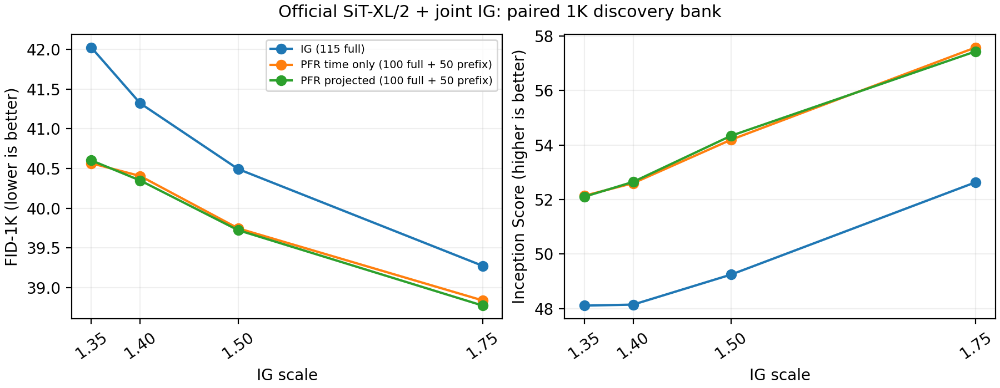

# 官方 SiT-XL：对等强度网格仍保留 PFR 收益

后续已完成[更宽的十八点网格](OFFICIAL_SIT_PFR_EXTENDED_RESULTS_20260909_ZH.md)：PFR 在 2.0/2.5 处落后，当前各自最低点也未领先普通 IG。下文保留较低四个强度的原始结果及当时的解释边界。

七个新增 PFR 实验已完成，连同五个复用点共十二行证据全部通过样本、计算和 FID 数值核验。**PFR 在四个共同强度上都优于普通 IG；当前网格内完整 PFR 最低 FID-1K 为 38.77339，普通 IG 为 39.27349。** 这是一次有价值的探索结果，仍未证明各方法全局最优、独立泛化或新的质量机制，研究目标尚未达成。

## 对称比较结果

官方 800EP SiT-XL/2、ImageNet-1K、联合 depth-8 弱头、EMA、MSE VAE、FP32 网络 / FP64 状态，TF32 关闭。全部行共享同一历史 1K 探索银行、每类一图、B4。普通 IG 用 Euler115；PFR 用 Euler100 与每图 50 次 depth-8 前缀。普通为 3220 block/图，PFR 为 3200，另有不同头和投影开销；实测推理时间接近。

| scale | 普通 IG FID ↓ | time-only PFR FID ↓ | 完整 projected PFR FID ↓ |
|---:|---:|---:|---:|
| 1.35 | 42.02391 | 40.56543 | 40.60214 |
| 1.40 | 41.32023 | 40.40504 | 40.34867 |
| 1.50 | 40.49286 | 39.74632 | 39.72330 |
| 1.75 | 39.27349 | 38.83823 | 38.77339 |

三个家族最低点均为当前上界 1.75，尚未夹住内部最优点。time-only 相对普通最低点改善 0.43526（1.1083%），完整 PFR 改善 0.50010（1.2734%）；这是点估计，没有独立确认或显著性结论。不能把旧的 PFR=1.35 与已调过的普通 IG=1.75 比较后就否定 PFR；补齐网格后，PFR 的优势仍在。

完整投影相对 time-only 的增量很小，四个点的 FID 差依次为 +0.03672、−0.05637、−0.02302、−0.06484，且最低强度处符号相反。当前证据不支持宣称 XL 上已验证稳定、实质的空间投影收益，也不排除更大样本下的小幅作用。

## 哪一部分统计量在改善

在同为 scale=1.75 的比较中，用同一 Inception 特征独立计算：

| 方法 | 均值项 ↓ | 协方差项 ↓ | IS ↑ |
|---|---:|---:|---:|
| 普通 IG | 0.35148 | 38.92203 | 52.63829 |
| time-only PFR | 0.58462 | 38.25363 | 57.58319 |
| 完整 PFR | 0.57907 | 38.19434 | 57.43829 |

完整 PFR 的均值项**恶化 0.22759**，协方差项改善 0.72769，净改善约 0.50010。time-only 也呈现同一方向。因此，旧固定低强度下“收益主要来自特征均值”的描述不能直接推广到这个工作点。该分解描述终点统计，不是时间查询为何改善质量的因果证明；有限样本协方差项也不能被直接解释为覆盖率改善。

空间查询诊断与两种 PFR 很接近这一现象相容：scale=1.35 时，在 noise-time 1/.9/.75，投影系数中位数分别为 0、0.000512、0.007197；取零比例为 67.3%、44.3%、26.7%。完整诊断包含所有七臂、1000 张图在预定五个时间点的数据，而非只挑这些数。它证明空间干预初期很小，不能据此独立推断质量收益的来源。

## 固定图像审阅与下一项机制问题

按索引 0、125、250、375、500、625、750、875 预先固定跨类别图像，无图像筛选：[配对图](data/guidance_goal_20260909/official_sit_pfr_fixed_examples.png)、[像素与来源清单](data/guidance_goal_20260909/official_sit_pfr_fixed_examples.json)。

目测这八行中，time-only 与完整投影结果很接近。与普通 IG 相比，PFR 可明显改变主体和构图，例如索引 375 的猴子外观、750 的被面布局、875 的人物与乐器关系；索引 250 还出现了明显不同的动物形体。不能把这些变化统一称为修复，也不能描述成“只改善纹理、保持实例内容”。八张图不能支持总体质量优劣或错误比例。

这使下一项问题更具体：PFR 是否主要补充了普通 IG 仍不足的条件引导，还是在已有 CFG 的强配置下仍带来额外质量收益？当前图像只能提出这个可失败的解释，不能回答它。已启动[原生 SDE＋CFG＋IG 基线](OFFICIAL_SIT_NATIVE_SDE_PROTOCOL_20260909_ZH.md)，使用作者明确发布的参数，并对同一潜变量分别做 EMA/MSE VAE 解码。该基线运行本身不构成方法创新；后续候选必须在相同配置及明确成本下比较。

原生配置之外，当前三条强度曲线均尚未找到最优点，需要对称补足上侧范围后才能冻结独立确认配置。不能将较低的 1K 相对收益直接用作拒绝 5K 的阈值，也不能把历史已经看过的 5K 重新命名为本次新配置的独立确认。

## 证据与限制

- 新增七臂各 1000 张真实图像，索引各覆盖一次；完整网络 / 前缀分别为每图 100 / 50，计算数由实际执行累计。
- 四卡共 16 张旧 time-only PFR 图像逐像素复现；前缀输出与 joint Base 同点相等；投影时间反向转换、零方向及反向射线处理通过核验。
- 全部十二行 FID 用 float64 样本空间特征值重新计算，与评估器最大差异 2.79762e-5。它使用同一特征，属于算术交叉核验，不是另一次采样或另一特征提取器。
- 原始输入、checkpoint、VAE、源码快照、各片段、像素及特征哈希可追溯。新增七臂推理时间合计 7155.65 GPU 秒，四卡控制器运行 1937.23 秒；前者不含加载、预检和评估。
- 小模型历史 PFR 正结果保持不变。小 SiT 与 XL 的数据范围、弱头训练方式和采样器也不同，不能把这里的空间增量差异只归因于模型大小。

审阅入口：[冻结协议](OFFICIAL_SIT_PFR_SYMMETRIC_PROTOCOL_20260909_ZH.md)、[完整 CSV](data/guidance_goal_20260909/official_sit_pfr_symmetric.csv)、[校验记录](data/guidance_goal_20260909/official_sit_pfr_symmetric_audit.json)、[诊断汇总](data/guidance_goal_20260909/official_sit_pfr_symmetric_diagnostics.json)。原始输出：`/home/zhoushunyu/data/eqvae/experiments/official_sit_pfr_symmetric_20260909`。复现入口为 `experiments/run_official_sit_pfr_symmetric_20260909.py`；它拒绝覆盖已存在的运行目录。分析与图像脚本也拒绝静默覆盖审阅产物。

目前仍缺少共同强基线下的充分调优、独立较大样本确认、质量与覆盖率评估、可区分替代解释的机制证据，以及围绕已验证核心贡献的论文稿。这里没有把补实验、统计分解或图像目测记作研究成功。
