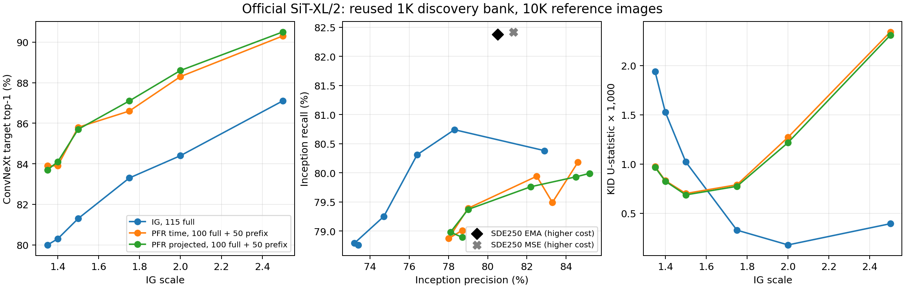

# XL 辅助指标：PFR 的精度与类别识别收益伴随分布取舍

全部十八个 Euler 点与原生 SDE 的两种解码已完成辅助评价。PFR 在相同强度上提高了固定分类器的目标识别率；在当前最低 FID 点之间比较，完整 PFR 的识别率与 Inception precision 更高，recall 与 FID 则较差。**这些结果没有建立全面质量优势或可靠的语义修复机制。**

| 已有配置 | FID-1K ↓ | precision % ↑ | recall % ↑ | 目标 top-1 % ↑ | 目标概率 ↑ | KID 统计量 ×1000 ↓ |
|---|---:|---:|---:|---:|---:|---:|
| 普通 IG 2.0 | 38.31590 | 78.3 | 80.74 | 84.4 | .60614 | .17861 |
| 普通 IG 2.5（当前最低 FID） | 38.18548 | 82.9 | 80.38 | 87.1 | .63340 | .39403 |
| time-only PFR 2.0（当前最低 FID） | 38.63782 | 83.3 | 79.49 | 88.3 | .63114 | 1.27155 |
| projected PFR 2.0（当前最低 FID） | 38.48965 | 84.5 | 79.93 | 88.6 | .63141 | 1.21769 |
| projected PFR 2.5 | 38.92857 | 85.2 | 79.99 | 90.5 | .65896 | 2.30811 |
| 原生 SDE250，EMA VAE | 38.05281 | 80.5 | 82.38 | 90.2 | .65556 | .10228 |
| 原生 SDE250，MSE VAE | 38.21555 | 81.3 | 82.42 | 90.1 | .65116 | .12393 |

SDE 具有 CFG、不同随机动力学与约 3.46 倍实测推理成本，以上表格不是同预算排序。前三种 Euler 家族的完整六点曲线都保留在[二十行 CSV](data/guidance_goal_20260909/official_sit_xl_multimetrics.csv)。

在相同 scale=2.0 时，完整 PFR 比普通 IG 的 top-1 高 4.2 个百分点、precision 高 6.2 个百分点，recall 低 0.81 个百分点，同时 FID 较差。若普通 IG 使用当前 FID 最低点 2.5，完整 PFR 2.0 的 top-1 净高 1.5 个百分点，但平均目标概率略低；不能描述成所有条件指标同步改善。

逐图对比进一步说明修正与新错并存：以普通 IG 2.5 为参照，projected PFR 2.0 有 85 张由分类器判断错误变为正确，另 70 张由正确变为错误；二者都正确 801 张、都错误 44 张。time-only PFR 2.0 相应为 84 / 72 / 799 / 45。projected PFR 1.75 则有 80 张改善、80 张退化，top-1 与普通 IG 2.5 相等。这里的“错误”仅指目标类分类结果，不是人类视觉错误判定；没有校准的显著性或机制结论。

## 执行核验与统计限制

实际重新提取了 10000 张参考 RGB 的 Inception 特征。对二十个生成 bank 各取前 32 张重新提取，640 个特征输出全部与原 FID 缓存逐位相同。参考像素、实际 Inception 状态、参考特征、ConvNeXt 状态、所有 logits 与逐图读数均有哈希。第一次实现因遗漏 cuDNN 开关未通过该入口检查，尚未产生辅助指标；原因和完整重跑见[修正记录](OFFICIAL_SIT_XL_MULTIMETRIC_CUDNN_AMENDMENT_20260909_ZH.md)，失败参考特征未参与本表。

precision/recall 使用 Inception、k=3、1000 个生成点与 10000 个参考点，距离用 float64。这是固定特征与有限邻域的覆盖诊断；绝对数值不等价于概率质量，也不能与 50K 论文设置直接对照。[指标原文](https://arxiv.org/abs/1904.06991)

KID 使用三次多项式核的去对角统计量，全部参考/生成点参与，没有反复重采子集制造独立标准误。固定每类一图不满足 IID 类别抽样，故不能在本设计下直接称它是目标分布距离的严格无偏估计。[KID 原文](https://arxiv.org/abs/1801.01401) 普通 IG 的 KID 最小点在 2.0，FID 最小点在 2.5；PFR 的 KID 最小点在 1.5，FID 最小点在 2.0。这种指标差异不能通过事后选择有利指标消除。

全部图像仍来自已经看过的 1K 探索银行。当前指标描述与强度及精度/覆盖率的替代解释相容，不能证明该替代解释就是 PFR 的完整机制，也不否定历史指定配置与小 SiT 的正结果。后续普通 SDE281 已完成，PFR 分支已中止；新的独立大样本比较仍然缺失。[当前决定是停止 PFR 主线与新增扩展](PFR_MAINLINE_DECISION_20260909_ZH.md)。

审阅入口：[冻结协议](OFFICIAL_SIT_XL_MULTIMETRIC_PROTOCOL_20260909_ZH.md)、[完整 CSV](data/guidance_goal_20260909/official_sit_xl_multimetrics.csv)、[执行核验](data/guidance_goal_20260909/official_sit_xl_multimetrics_audit.json)、[图像来源清单](data/guidance_goal_20260909/official_sit_xl_multimetrics_plot.json)。原始参考特征、邻域半径与逐图 logits 在 `/home/zhoushunyu/data/eqvae/experiments/official_sit_xl_multimetrics_fixed_20260909`；复现入口为 `experiments/evaluate_official_sit_xl_multimetrics_fixed_20260909.py`。
