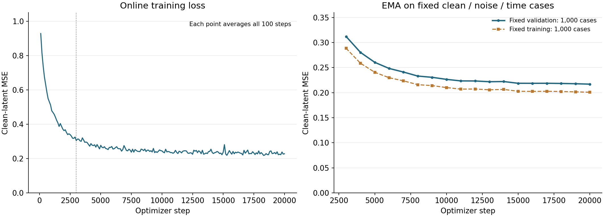

**RAEv2 Context MLP：延长至20K步的实际结果**

已完成用户要求的总计20000步训练与两档IG系数生成复测。旧3000步EMA、31个原训练loss记录点与原256次抽样验证值全部精确复现，然后使用重建出的在线参数、AdamW状态和训练随机流继续17000步。3000步以后仅更新Context，未改变主干、读出结构、训练bank、损失、学习率或采样窗口。

在同一批400图上，20K原强度相对3K的FID变化为-3.3672，半强度为-0.5145。20K两档中最低FID为96.0359，原生IG两档中最低为95.8752，差值为+0.1608。这些是该小规模配对筛选的观察值，不提供稳定收益或显著性结论。

新的固定1000例验证EMA MSE从3K时的0.312247降至20K时的0.217067，变化-30.48%；最后15K到20K变化-0.80%。原来的0.305192来自另一组256次随机抽取，不与新的固定1000例直接作跨设置差值。较低预测MSE不自动等于更好的生成质量。

|   训练步数 |   固定验证loss |   固定训练loss |
|-----------:|---------------:|---------------:|
|       3000 |       0.312247 |       0.288667 |
|       5000 |       0.260594 |       0.240754 |
|      10000 |       0.226636 |       0.210262 |
|      15000 |       0.218807 |       0.202883 |
|      20000 |       0.217067 |       0.200908 |

图左每个点是完整100个训练步的平均，前3K来自此次精确重放；图右是每次相同clean/noise/time的1000个训练与1000个验证样本，各覆盖1000类。二者使用独立固定种子。验证没有更新参数，不干扰训练随机流；最终20K EMA在生成前已固定，没有根据FID选择中间checkpoint。

**原400图配对复测，FID越低越好：**

|   额外系数alpha |   原生IG FID |   3K MLP FID |   20K MLP FID |   20K减原生 |   20K减3K |
|----------------:|-------------:|-------------:|--------------:|------------:|----------:|
|          0.7800 |      95.8752 |     100.0187 |       96.6515 |      0.7763 |   -3.3672 |
|          0.3900 |      96.1264 |      96.5504 |       96.0359 |     -0.0905 |   -0.5145 |

这里只新生成20K两档共800张；原生IG和3K MLP两档1600张复用旧产物，其noise、标签及样本SHA已核对。另有8张旧3K前四样本的实现重放，latent与像素逐位一致，不作为新增质量样本。每图100次full、0额外prefix；各30个Transformer block实际调用100次，活动步MLP调用数另行核对。原IG scale=1.78等价于额外alpha=.78，半强度alpha=.39对应scale=1.39。

400图门槛未通过，未启动1K确认或新的系数搜索。

400图仍只覆盖400类，门槛是本轮继续/停止规则，不是显著性检验。学习率保持3e-4，真实训练bank为每类5个、共5000个latent；即使训练到20K，也不等于已证明达到总体最优。

训练记录总耗时445.8秒，包含固定验证、特征缓存及checkpoint保存，不含此前准备过程。训练仅用GPU1，采样用GPU1–3，GPU0未使用。保留3K/5K/10K/15K/20K完整训练状态及最终20K EMA。

[冻结协议](RAEV2_CONTEXT_20K_PROTOCOL_20260914_ZH.md) · [源数据工作簿](data/raev2_context_20k_20260914/source_data.xlsx) · [完整记录](data/raev2_context_20k_20260914/verification.json)。

本轮回答延长训练是否改善这个具体弱读出及其IG效果；不将其作为共同误差分布或结构化mismatch的验证。长期核心方法目标未自动完成。
