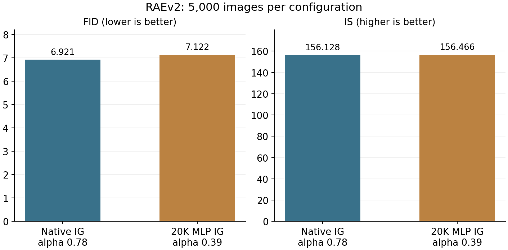
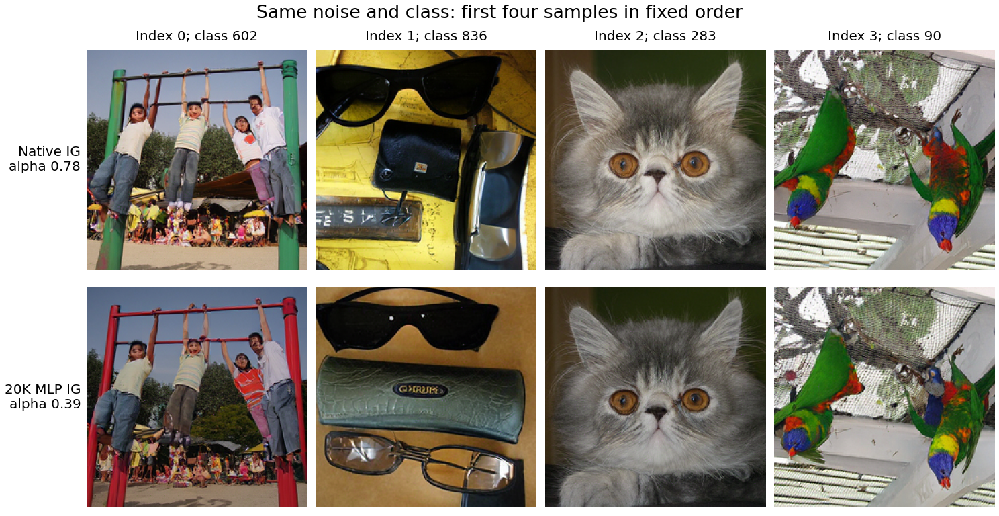

**RAEv2：原生IG与20K MLP的5K比较已完成。** 此次5K比较中，20K MLP设置的FID没有优于原生IG。

每臂全新生成5000张，覆盖1000类、每类5张；共享种子2026091421产生的初始噪声和标签顺序。20K MLP相对原生IG的FID变化为+0.2015（升高2.91%），IS变化为+0.3379。

| 设置               |   额外系数α |   图数 |   FID↓ |      IS↑ |   每16图耗时/秒 |
|:-------------------|------------:|-------:|-------:|---------:|----------------:|
| 原生IG             |        0.78 |   5000 | 6.9208 | 156.1279 |         10.0735 |
| 20K Context MLP IG |        0.39 |   5000 | 7.1223 | 156.4658 |         10.1362 |

原生IG使用额外α=.78，即官方scale=1.78；20K MLP使用额外α=.39，即scale=1.39。两者分别取此前各自两档400图测试中FID最低的设置，在本轮生成前固定。此次比较的是两个完整配置；因系数不同，差异不能单独归因于MLP结构、弱头训练或20K续训。5K采用新噪声，未复用旧400图质量样本。

两者均使用同一冻结RAEv2主干、解码器、Euler100、时间shift8和活动窗口[.1,1]；采样batch=16，最后一批8，bf16 autocast。每张图100次完整主干调用，0额外prefix调用；30个Transformer block的实际调用计数全部核对。MLP在99个活动步复用编码器第8层特征，新增5,635,744个参数；原生弱头仍随主干计算。本次没有新增训练。

耗时在同一张GPU1上测量，包含100步采样及解码；每臂预热1次，再交错测量3次，表中取中位数。MLP设置耗时变化为+0.62%。该短基准用于记录实际开销，不能据此宣称严格零成本。

所有10000张质量输出均进入评价，无筛图；两臂使用同一GPU2、FP32 Inception和batch64，同一nanogen-evals版本与imagenet_256_fid_stats。FID采用相同参考统计；用保存的5000×2048特征按FP64对称协方差公式复算，逐臂与原评价器结果核对。复算只是同一批特征的算术核验，不是独立特征提取或独立生成重复。

本轮单一生成bank和单一训练种子没有提供独立重复或置信区间；不将5K绝对FID与此前400图或论文50K结果直接比较，也不据此验证共同误差分布的机制。

上图仅展示固定顺序前4张；不是人工挑选的样例。新质量采样之前各重放4张旧样本，latent及像素逐位一致（旧重放batch4，两臂正式5K统一batch16）。另有耗时测试8批×16图，共128次生成，未计入FID/IS；本次共10000张质量样本、8张重放和128次基准生成。

[冻结协议](RAEV2_CONTEXT_5K_PROTOCOL_20260914_ZH.md) · [源数据工作簿](data/raev2_context_5k_20260914/source_data.xlsx) · [质量CSV](data/raev2_context_5k_20260914/quality.csv) · [核验记录](data/raev2_context_5k_20260914/verification.json)。

[原生IG完整5K样本](/home/zhoushunyu/data/eqvae/experiments/raev2_context_5k_20260914/raev2/confirm_5000/native_base/samples.npz) · [20K MLP完整5K样本](/home/zhoushunyu/data/eqvae/experiments/raev2_context_5k_20260914/raev2/confirm_5000/context20k_half/samples.npz)。

此次明确5K请求已执行完，两臂均完成全部5000张。此前400图自动扩展门槛失败记录保留；旧大队列未恢复，未自动开展新训练或系数搜索。
