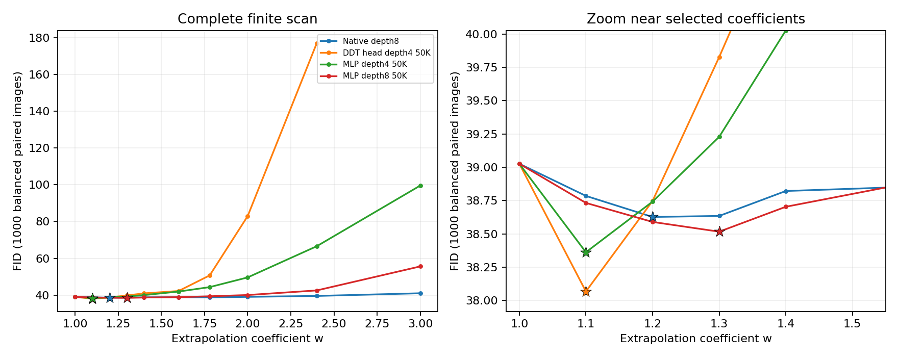
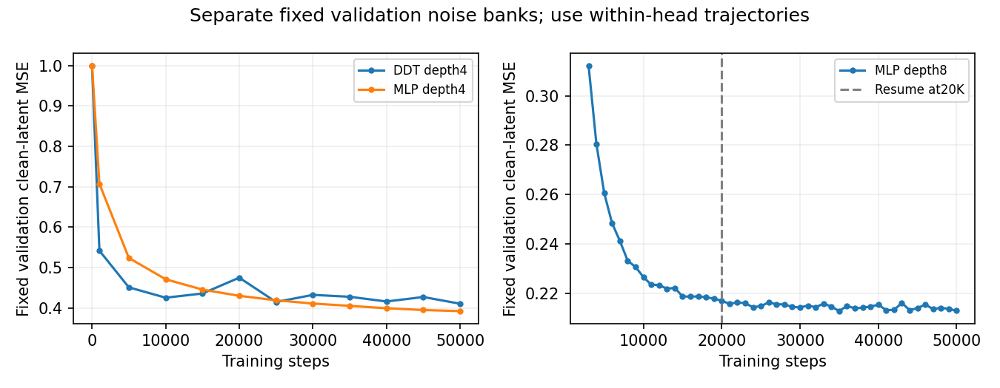
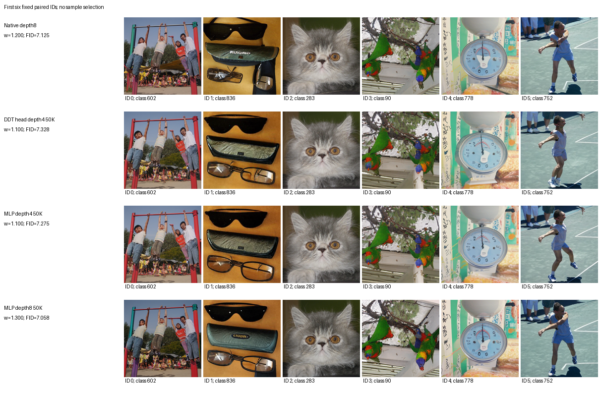

# RAEv2：50K冻结后训练头、外推系数搜索及独立5K

> 本页保留原 1K 选参阶段结果。原 confirm_5k 现已重新归为系数筛选数据；修订方案以另一个新种子做最终确认。[最新 5K 选参报告](RAEV2_SHALLOW_IG_5K_SELECTION_RESULTS_20260914_ZH.md)。

已完成。四种设置分别在均衡1K上选取外推系数，再生成独立5K。后训练头中最低FID来自 **MLP depth8 50K，w=1.300，FID=7.0583**。相对默认原生IG（w=1.78，既有同bank FID=6.9208）差值为 **+0.1375**；相对本次重新选参的原生IG差值为-0.0666。负数才是改善。

原生IG位于28层编码器的第8层，强分支另有2层DDT decoder。本轮新增第4层同结构DDTFinalLayer和Context MLP，各50K；既有第8层MLP从完整20K在线／EMA／AdamW／RNG状态续训至50K。所有主干权重冻结。第4层两种头参数数分别为5,627,104与5,635,744，训练输入、噪声与时间完全相同。第8层保留原训练随机流。

外推统一为weak+w×(strong−weak)，w=1是纯strong，当前原生默认w=1.78。扫描的是采样外推系数；每个头在共享类别均衡1000图bank上作粗网格和邻域中点细化，5K使用独立噪声bank且不再调参。因此“最优”仅指本次有限搜索与筛选样本上的最低FID，不能声称连续全局最优。

| 设置 | 选定w | 筛选FID（1000） | 独立5K FID↓ | IS↑ | 相对已调参原生IG | 相对默认原生IG |
|---|---:|---:|---:|---:|---:|---:|
| Native depth8 | 1.200 | 38.627 | 7.1248 | 147.843 | +0.0000 | +0.2041 |
| DDT head depth4 50K | 1.100 | 38.068 | 7.3283 | 159.314 | +0.2034 | +0.4075 |
| MLP depth4 50K | 1.100 | 38.362 | 7.2754 | 152.426 | +0.1506 | +0.3546 |
| MLP depth8 50K | 1.300 | 38.516 | 7.0583 | 154.686 | -0.0666 | +0.1375 |

最初400图原生扫描只覆盖400类；其结果保留作诊断，所有候选统一补成1000类均衡扫描后选参。已完成的原始400图批次逐位复用，缺失批次和剩余600图生成后合并，来源分别记录。

数值稳定性检查失败、未报部分样本FID的候选：native4 w=3.0 (balanced_1000, Invalid state at step 97)。原采样器同时检查非有限值和状态绝对值大于1e6；异常消息未区分两种触发条件，因此不把它一律解释为NaN。

同一个5K bank还有明确复用的历史参考：原生IG固定w=1.78：FID 6.9208；20K第8层MLP固定w=1.39：FID 7.1223。这些历史结果不是本次新生成或独立重复；不能由不同w的20K/50K差值单独归因于训练步数。

采样均为Euler100、shift8、活动窗口[.1,1]、FP32 velocity、BF16模型、batch16；每图100次全主干调用，无额外prefix。w>1时新头每图调用99次，原生弱头仍随主干计算。部分已完成的1K和5K指标计算曾与其余头的采样在GPU0重叠，记录的墙钟时间不作为独占GPU速度基准；计算量比较使用实际记录的全主干／前缀／读出头调用数。旧原生首16张latent和像素逐位重放通过；新头零外推与共享特征、全部30个block调用数也核对。

训练使用互斥的5,000个真实训练latent与1,000个验证latent，50K终点提前固定。第4层验证噪声与第8层沿用的验证噪声不同，误差记录用于各自收敛诊断，不据此作跨层因果比较。头容量、深度及初始化／训练历史存在差别，生成测试评价完整配置，不证明单一结构因素造成收益。

5K共覆盖1000类、每类5图；所有配置配对，未筛图。采用相同Nanogen FP32 Inception、batch64和参考统计，保存特征并重算FP64 FID。重算验证算术，仍使用同一个特征提取器。本轮只有一个5K生成bank；细小差异未获得独立重复或显著性保证。

[完整结果CSV](data/raev2_shallow_ig_50k_20260914/results.csv) · [选参记录](data/raev2_shallow_ig_50k_20260914/selected_coefficients.json) · [训练协议](RAEV2_SHALLOW_IG_50K_PROTOCOL_20260914_ZH.md) · [均衡1K补充协议](RAEV2_SHALLOW_IG_BALANCED_SEARCH_20260914_ZH.md) · [实现](../experiments/raev2_shallow_ig_20260914/core.py)。

原始完整结果：`/home/zhoushunyu/data/eqvae/experiments/raev2_shallow_ig_20260914`。
