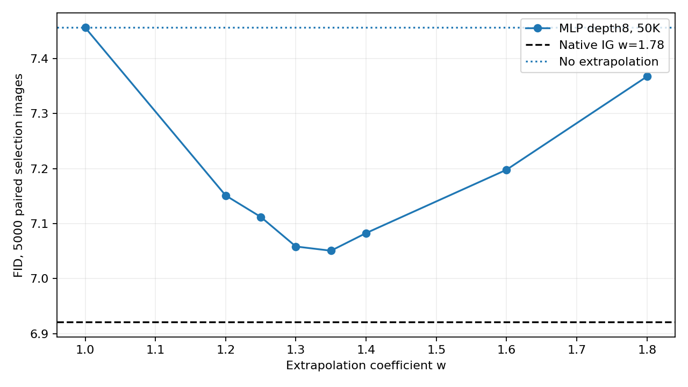
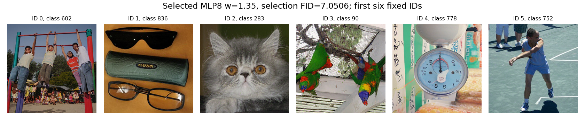

# RAEv2：第8层 MLP 的 5K 细扫结果

**已完成用户保留的第8层 MLP 细扫。已测点中最低调参 FID 为 7.0506，w=1.35。** 第4层后续搜索放弃；独立验证已取消。

| 设置 | w | 同组5K FID↓ |
|---|---:|---:|
| 不外推 | 1 | 7.4561 |
| 原生默认 IG | 1.78 | 6.9208 |
| 第8层 MLP，50K，已测最低 | 1.35 | 7.0506 |

第8层 MLP 相对原生默认 IG 的 FID 差为 +0.1299。负数表示改善；这是同一调参组上的选择结果，不是独立验证成绩。

第8层 MLP 的 w=1.8 已完整跑完，FID=7.3673，w=2已停止。用户进一步要求只完成w=1.35；因此细扫保留已完成的w=1.25、复用w=1.30和补完的w=1.35，各5000张。w=1.45、1.50、1.55、1.65、1.70、1.75全部取消，不生成或计算部分FID。

原有粗扫计划因用户调整而停止，不标记为原计划全部完成。已完成的其他头结果留在CSV中作参考；没有对第4层或原生IG做新的细扫。原生默认对照复用同一输入组的既有5K。

所有报告点均核对完整5000张、输入类别与噪声、像素和原始批次来源及实际调用数；FID从相同缓存特征以FP64重算。调参终点首批保留数组，其余保留精确摘要和运行时有限性检查，不声称经过事后逐值复核。

[完整 CSV](data/raev2_shallow_ig_5k_selection_20260914/results.csv) · [审计结果](data/raev2_shallow_ig_5k_selection_20260914/results.json) · [最新执行修订](RAEV2_MLP8_FINISH_135_20260914_ZH.md)。
