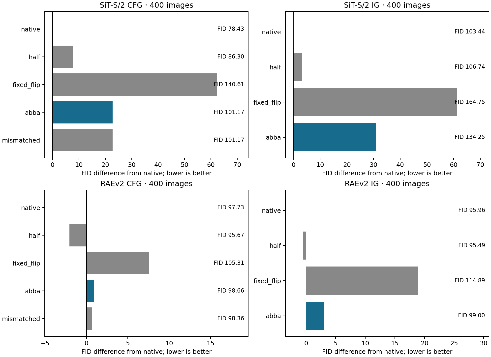
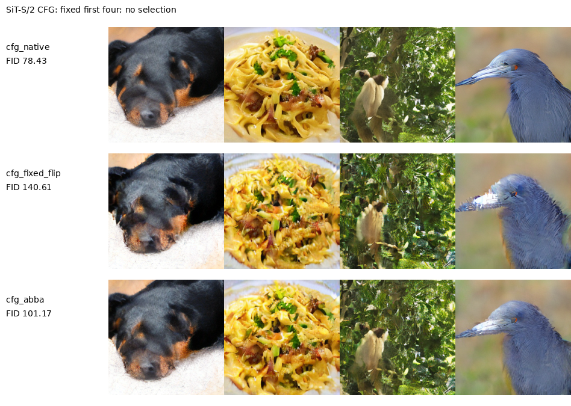
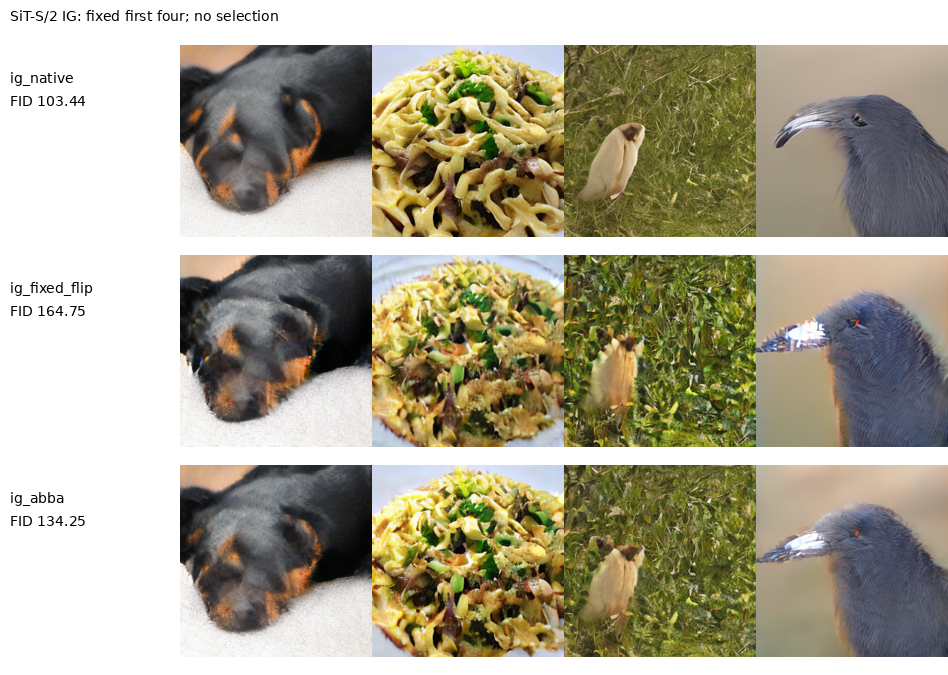
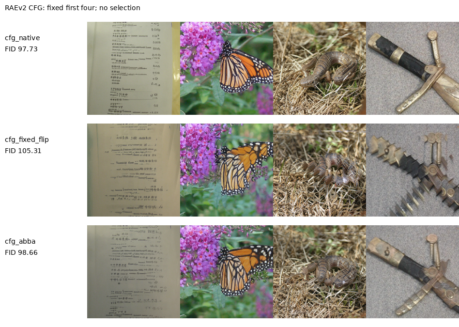
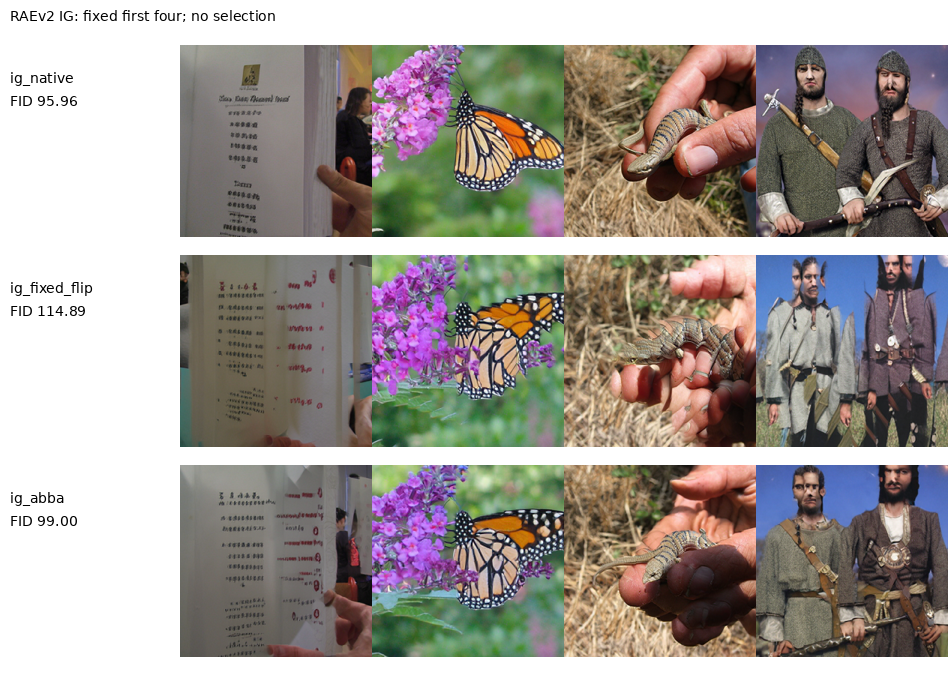

# 加性预测错配与固定预算反射交替

本轮检验整个引导场在原视图和水平反射视图之间固定ABBA交替，是否能在原CFG／IG调用预算内抑制一部分加性预测误差。两个模型各11臂，每臂400个单路径图像，共8800图；CFG和IG独立判断，使用同一全新输入bank。未训练新模型、未增加弱前缀，也未搜索周期、相位、强度或截止时间。

按预先冻结的筛选规则，进入全新1K确认的组数为 **0/4**。400样本特别是RAE的400类别子集不足以支持最终统计结论。

| model     | track   |   candidate_fid | best_control   |   best_control_fid |    delta |   inception_ratio | passes   |   strong_abba_minus_native |
|:----------|:--------|----------------:|:---------------|-------------------:|---------:|------------------:|:---------|---------------------------:|
| sit_small | cfg     |        101.172  | cfg_native     |            78.4263 | 22.7459  |          0.703416 | False    |                   51.0273  |
| sit_small | ig      |        134.251  | ig_native      |           103.439  | 30.8127  |          0.808769 | False    |                   51.0273  |
| raev2     | cfg     |         98.6586 | cfg_half       |            95.6662 |  2.99235 |          0.922608 | False    |                    5.85881 |
| raev2     | ig      |         98.9981 | ig_half        |            95.4893 |  3.50883 |          0.932844 | False    |                    5.85881 |

四组ABBA的FID都高于各自最佳固定对照，SiT CFG／IG分别退化约22.75／30.81，RAEv2分别约2.99／3.51。SiT的IS也明显降低。无引导Strong ABBA同样退化，说明本次变化没有获得可用于guidance的通用采样收益。本轮结束当前固定latent反射构造，未启动1K／5K晋级，不搜索其他周期、相位或强度。

## 解释性假设及其范围

设反射作用为R，$F^R(z)=R^{-1}F(Rz)$。若理想场满足该等变关系，且误差评价的状态测度也反射不变，群平均$(F+F^R)/2$是L2意义下的正交投影，不能增加场误差。这只去除不等变部分；共同污染或加性误差中的等变部分仍会保留。它没有要求强弱全部误差共线，也没有识别一般未知残差。

实际采样没有在同一个状态额外计算两个视图，而是每四个完整步用A、B、B、A。这只是在有限步下近似平均场。SiT同一Heun步保持同一视图，RAE保留非均匀Euler网格；后者不因使用回文顺序就获得二阶精度。反射步的总时间质量SiT为0.5、RAE约0.49727。

理论要求的latent分布对称性也没有保证：SD-VAE编码器和DINO表示不必与像素水平反射交换。即使单视图反射能解码出图像，交替后的场也可能改变模式覆盖，或引入新的表示偏差。L2场误差结论不能替代生成FID、条件正确性或多样性检验。

## 固定反射、错配视图和Strong对照

固定反射保持同一变换直到终点，已逐位验证等于对反射初始噪声运行原采样再反射latent输出。它有助于区分单次坐标变换与反复切换的影响。图像最终仍由原解码器得到，没有假设解码也严格交换。

固定反射退化后追加的[同端点解码检查](REFLECTION_REPRESENTATION_REVIEW_20260912_ZH.md)已经完成：先还原latent、解码后再反射像素，SiT CFG／IG的FID从140.61／164.75变为77.68／103.98，RAEv2从105.31／114.89变为97.71／96.04。新增1600个渲染视图，采样full／prefix调用均为0。它支持表示与解码不交换对固定反射的影响，不能归因ABBA的全部退化，也不能作为新方法正结果；原候选筛选未改动。

CFG错配对照让conditional和null使用相反视图。若二者共同的不等变误差分别为±e，匹配视图的组合只留下±e，错配视图的组合会留下±(1+2g)e。不过匹配与错配两种方案具有相同的理想双视图平均场；差异只能通过有限步的切换、状态传播及非理想误差体现。因此不能用它们的FID差证明不同的连续终点密度目标。

无引导ABBA也改变Strong的原采样，所以零guidance并不恢复原Strong轨迹。本轮显式保留Strong两臂，不把通用采样变化自动归因于guidance机制。两种Strong的FID与IS如下。

| model     | arm           |      fid |   inception_score |
|:----------|:--------------|---------:|------------------:|
| sit_small | strong_native | 126.315  |           28.73   |
| sit_small | strong_abba   | 177.342  |           16.0164 |
| raev2     | strong_native |  95.5364 |           25.6237 |
| raev2     | strong_abba   | 101.395  |           22.8219 |

## 实际生成结果与成本

| model     | arm            |      fid |   inception_score |   seconds |   primary_samples |   generated_paths |   full_calls_per_output |   prefix_calls_at_inference |
|:----------|:---------------|---------:|------------------:|----------:|------------------:|------------------:|------------------------:|----------------------------:|
| sit_small | strong_native  | 126.315  |           28.73   |   37.4526 |               400 |               400 |                     128 |                           0 |
| sit_small | strong_abba    | 177.342  |           16.0164 |   37.406  |               400 |               400 |                     128 |                           0 |
| sit_small | cfg_native     |  78.4263 |           61.3752 |   60.5268 |               400 |               400 |                     224 |                           0 |
| sit_small | cfg_half       |  86.3002 |           46.799  |   60.7998 |               400 |               400 |                     224 |                           0 |
| sit_small | cfg_fixed_flip | 140.61   |           30.5019 |   60.8521 |               400 |               400 |                     224 |                           0 |
| sit_small | cfg_abba       | 101.172  |           43.1723 |   60.5509 |               400 |               400 |                     224 |                           0 |
| sit_small | cfg_mismatched | 101.171  |           43.1697 |   60.2967 |               400 |               400 |                     224 |                           0 |
| sit_small | ig_native      | 103.439  |           32.9016 |   37.6603 |               400 |               400 |                     128 |                           0 |
| sit_small | ig_half        | 106.742  |           32.1758 |   37.9176 |               400 |               400 |                     128 |                           0 |
| sit_small | ig_fixed_flip  | 164.748  |           20.2385 |   38.2008 |               400 |               400 |                     128 |                           0 |
| sit_small | ig_abba        | 134.251  |           26.6098 |   38.9072 |               400 |               400 |                     128 |                           0 |
| raev2     | strong_native  |  95.5364 |           25.6237 |  317.265  |               400 |               400 |                     100 |                           0 |
| raev2     | strong_abba    | 101.395  |           22.8219 |  317.709  |               400 |               400 |                     100 |                           0 |
| raev2     | cfg_native     |  97.7336 |           30.7601 |  632.804  |               400 |               400 |                     200 |                           0 |
| raev2     | cfg_half       |  95.6662 |           30.0421 |  638.54   |               400 |               400 |                     200 |                           0 |
| raev2     | cfg_fixed_flip | 105.306  |           24.4981 |  636.523  |               400 |               400 |                     200 |                           0 |
| raev2     | cfg_abba       |  98.6586 |           28.3795 |  632.094  |               400 |               400 |                     200 |                           0 |
| raev2     | cfg_mismatched |  98.3607 |           28.1757 |  632.599  |               400 |               400 |                     200 |                           0 |
| raev2     | ig_native      |  95.9641 |           27.4541 |  317.256  |               400 |               400 |                     100 |                           0 |
| raev2     | ig_half        |  95.4893 |           26.8036 |  317.199  |               400 |               400 |                     100 |                           0 |
| raev2     | ig_fixed_flip  | 114.887  |           21.2033 |  317.336  |               400 |               400 |                     100 |                           0 |
| raev2     | ig_abba        |  98.9981 |           25.6104 |  318.382  |               400 |               400 |                     100 |                           0 |

CFG保持SiT224、RAE200次full，IG保持128、100次full；额外prefix均为0。每个单路径输出独立进入主评价，不使用双分支重复样本。质量采样总秒数是各batch采样和解码耗时之和，不是多GPU墙钟时间；模型加载、预检及CPU特征评价另属执行成本。

| model     | track   |   batch |   native_seconds |   candidate_seconds |   relative_change |
|:----------|:--------|--------:|-----------------:|--------------------:|------------------:|
| sit_small | ig      |       8 |         0.732313 |            0.732459 |       0.000198755 |
| sit_small | cfg     |       8 |         1.16637  |            1.17171  |       0.00457366  |
| raev2     | ig      |       4 |         3.19054  |            3.18745  |      -0.000969001 |
| raev2     | cfg     |       4 |         6.36719  |            6.37164  |       0.000698838 |

计时使用同卡、同批量、3次原方法／ABBA交替重复，包含解码。它只提供小规模开销估计。原方法包装与直接实现、固定反射的完整轨迹关系均逐位通过；没有通过增加隐藏前向取得效果。

## 与已有工作的关系

[Visual Anagrams](https://arxiv.org/html/2311.17919v2)已经研究变换后的预测平均及按步交替，在其错觉生成设置中平均优于交替，并讨论latent变换伪影。本轮保持同一条件，以生成质量和原调用预算为目标，但不据此认领“交替视图”本身。

[SymDiff](https://arxiv.org/abs/2410.06262)已经将随机对称化用于扩散生成。[Tong等的v2论文](https://arxiv.org/html/2502.09890v2)研究群轨道条件期望降低训练梯度方差；其v2标题为Rao-Blackwell Gradient Estimators for Equivariant Denoising Diffusion，不能只引用旧标题而忽略版本变化。本轮不把冻结模型上的一个采样实例等同于这些训练方法的新发现。

仓库9月10日第24项只对IG差值做额外反射平均，未超过原IG。此次针对整个场、共享既有时间查询的检验改变了预算和作用对象，但仍需要实际收益才能继续。生成未通过则停止当前反射构造，不用群平均的理论继续为它调参数。

## 固定样本与可复核数据

[冻结协议](REFLECTION_GUIDANCE_PROTOCOL_20260912_ZH.md) · [完整工作簿](data/reflection_guidance_20260912/source_data.xlsx) · [全部指标](data/reflection_guidance_20260912/quality.csv) · [最终核验](data/reflection_guidance_20260912/verification.json)。

共同污染＋结构化错配＋加性残差的主假设继续保留；本轮只检验了一个反射处理实例，没有验证一般残差可识别，也没有据此完成具有可靠同预算收益与实质新意的长期目标。
