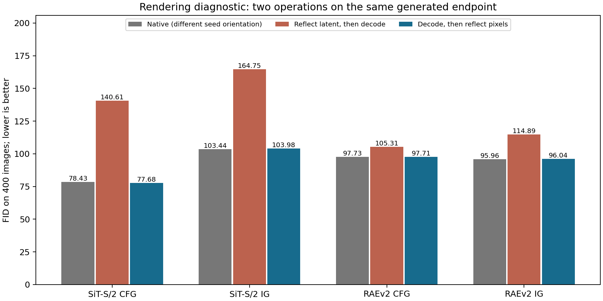
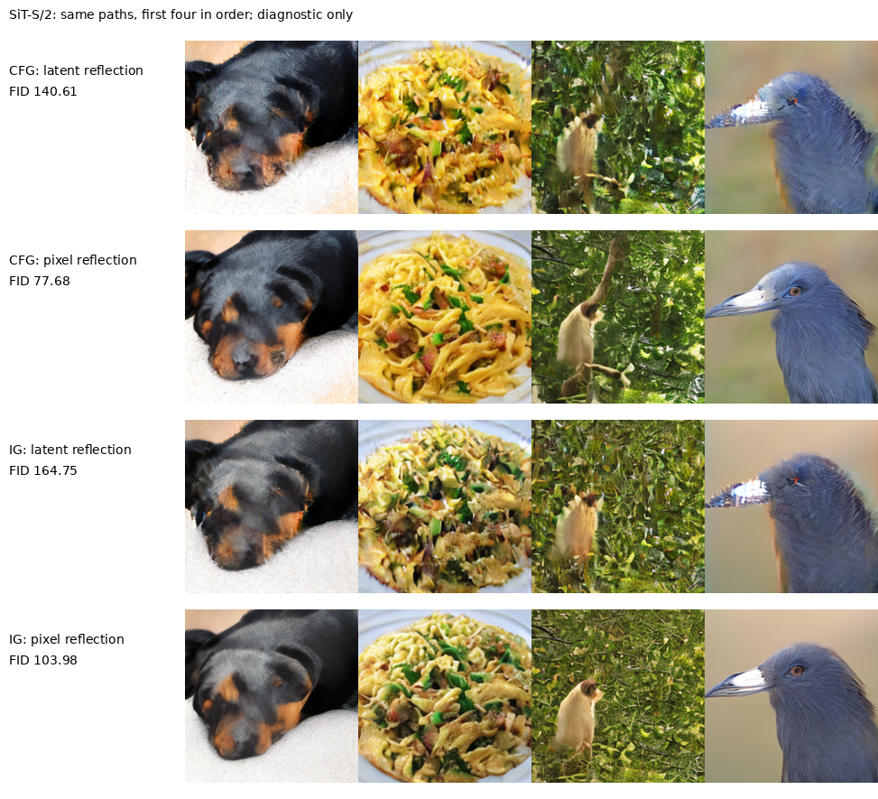
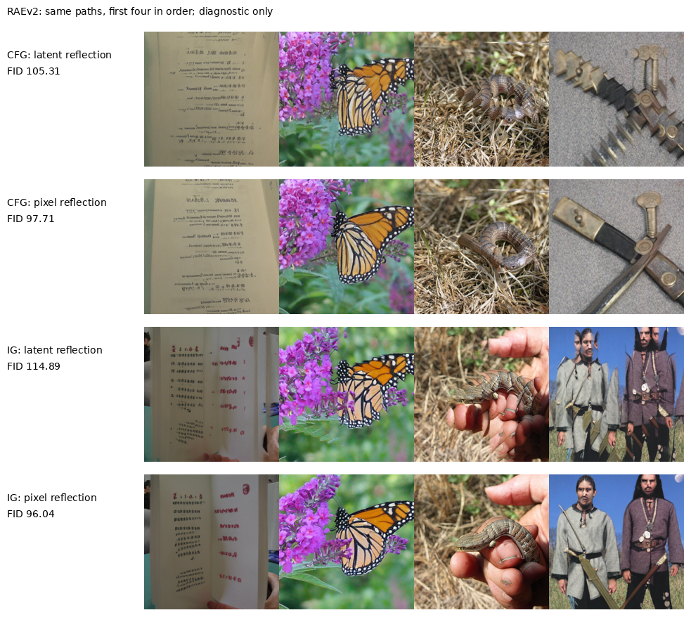

# 反射生成失败后的表示检查

在同一批既有生成端点上，把“latent反射后解码”改成“解码后像素反射”，两模型的CFG与IG质量差距明显收窄。这支持解码器与latent水平反射不交换，是固定反射臂退化的一个实际来源。它没有证明ABBA交替的全部退化都由解码器造成，也没有提供新的有效guidance方法。原候选与原晋级规则保持不变。

| model     | track   |   native_fid |   latent_flip_fid |   pixel_flip_fid |   render_mae_0_1 |
|:----------|:--------|-------------:|------------------:|-----------------:|-----------------:|
| sit_small | cfg     |      78.4263 |           140.61  |          77.6835 |        0.0600775 |
| sit_small | ig      |     103.439  |           164.748 |         103.976  |        0.0605941 |
| raev2     | cfg     |      97.7336 |           105.306 |          97.7077 |        0.0700947 |
| raev2     | ig      |      95.9641 |           114.887 |          96.0351 |        0.0779123 |

令R为latent水平反射，J为像素水平反射，D为原解码器。固定反射采样的端点是 $z_R=R\Phi(Rz_0)$，其原图为$D(z_R)$。补充诊断只输出 $JD(Rz_R)=JD(\Phi(Rz_0))$。两者复用完全相同的采样轨迹，差异在于D和反射操作的次序。

额外渲染结果从分布上属于反射初始高斯噪声下的原生采样，再做像素反射；高斯噪声分布本来就反射不变。所以它不是新的guidance候选。表中native来自原始噪声方向，和这两种同端点渲染并非同一条轨迹；有限样本FID及像素反射对Inception特征的影响也不保证完全消失。不能把小幅优于native的数值解释为方法收益。

该检查是在SiT固定反射退化后追加，属于事后诊断；不是预先注册的独立确认。两模型各增加800个渲染视图，合计1600视图，新增采样轨迹、full调用与prefix调用均为0，解码耗时单独保存在数据表。这些视图和原图相关，不能合并成更大独立样本来评价候选。

这对加性误差讨论的限制很具体：利用对称性消除预测残差，首先需要选定的变换确实保持模型所处的目标表示。在像素空间合理的对称性，不能直接假定为每个latent通道的相同空间置换。否则本来想消除误差的操作自身会增加表示错配。它没有否定“理想分布＋共同错误成分＋结构化错配＋加性残差”的一般结构，也不识别其中的密度残差或网络误差。

[Visual Anagrams](https://arxiv.org/html/2311.17919v2)已讨论latent变换产生的伪影，因此这次发现是本仓库两个具体表示上的实测约束，不作为普遍新原理。当前固定latent反射构造停止，不继续搜索周期、强度或变换来挽救它。

[原生成结果](REFLECTION_GUIDANCE_RESULTS_20260912_ZH.md) · [补充协议](REFLECTION_RENDER_AUDIT_20260912_ZH.md) · [源数据工作簿](data/reflection_representation_20260912/source_data.xlsx) · [核验记录](data/reflection_representation_20260912/verification.json)。
