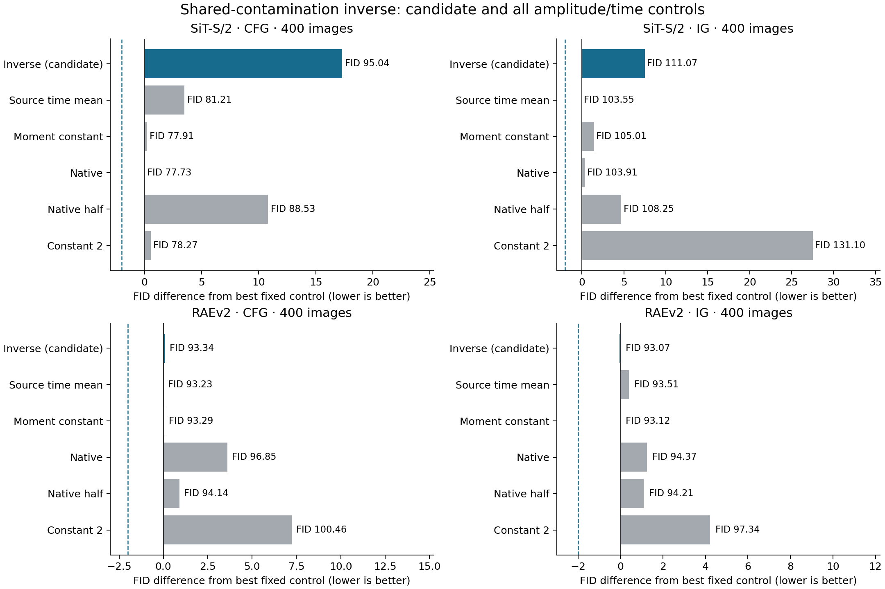
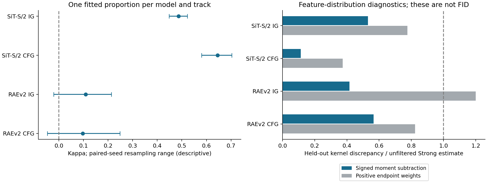
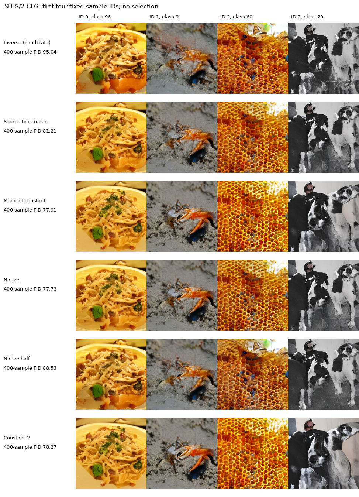
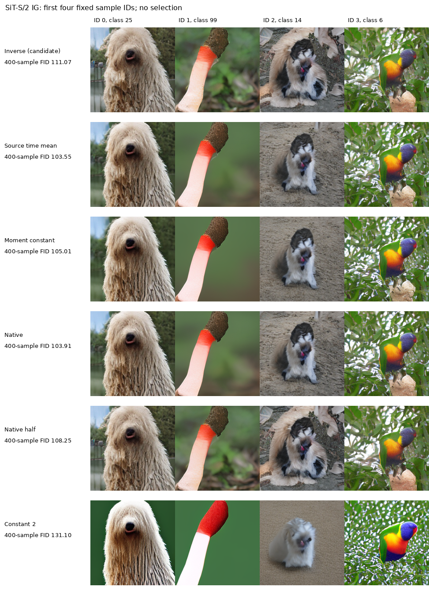
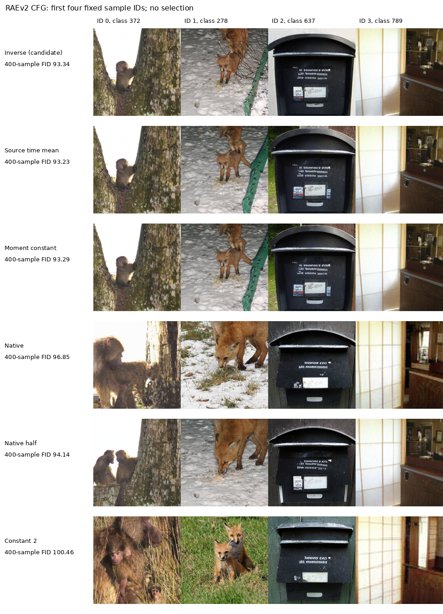
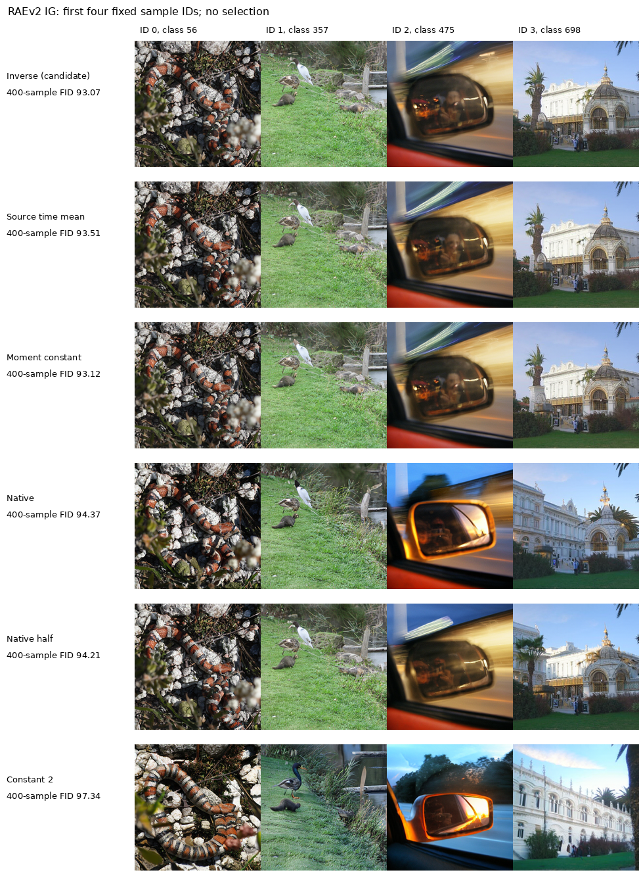

# 共同污染假设：真实分布、直接采样和当前结论
**这条假设仍是主线。** 本轮没有把局部参考替代成主线：其两个模型的训练产物保留，生成全部暂缓。本报告把同一个共同污染假设落实为端点分布检验、固定比例的自适应采样，以及一个使用既有图像的离线过滤诊断。没有重启蒸馏、旧大队列或新的参数网格。
## 最直接的生成结果
两个模型、CFG/IG 两条主线、每组1个候选和5个固定强度／时间对照，共24臂，每臂400个独立图像。同组使用相同噪声与类别；没有第二配对分支。400样本只做筛选，RAE只覆盖400类，不能据此声称统计显著。候选需比全部控制至少好2 FID且IS不低于native的90%才进入全新1K确认。
本轮满足该规则的组数：**0/4**。没有通过的组不自动进入1K/5K。不能把优于原幅度、但与另一个常数幅度几乎相同，写成自适应机制成功。
|模型／主线|去污染候选 FID|原 guidance FID|最好固定控制|候选减最好控制|是否通过|
|---|---:|---:|---|---:|---|
|SiT-S/2 CFG|95.0352|77.7287|Native：77.7287|+17.3066|否|
|SiT-S/2 IG|111.0669|103.9079|Source time mean：103.5505|+7.5164|否|
|RAEv2 CFG|93.3413|96.8533|Source time mean：93.2339|+0.1074|否|
|RAEv2 IG|93.0742|94.3657|Moment constant：93.1216|-0.0474|否|

[完整24臂 CSV](data/guidance_distribution_20260912/quality.csv)。全量IS、实际使用的平均引导强度、保护触发比例也在表中，没有按FID挑选或删掉差的配置。
## 实际检验的是哪个公式
原假设为 $p_S=(1-a)p_\star+a p_e$、$p_W=(1-b)p_\star+b p_e$，$0\le a<b\le1$。消去共同误差分布后，$p_S=(1-\kappa)p_\star+\kappa p_W$，其中 $\kappa=a/b$。固定时间与条件时，精确 score 形式为

$$s_\star=s_S+\frac{\rho}{1-\rho}(s_S-s_W),\qquad \rho=\kappa\frac{p_W}{p_S}.$$

若改用真实采样边缘与概率流，且 $q_S-\kappa q_W>0$ 在全程成立、$\kappa$ 为常数，相同系数也由连续性方程的线性性给出。这是本轮真实来源头的依据。它不是“任意训练网络都是精确 score”的假定。完整推导、空间／时间变系数的附加项和误差共线问题见[推导报告](AG_IG_SHARED_CONTAMINATION_DERIVATION_20260912_ZH.md)。
本轮 R 的定义对 IG 是窗口内用原弱场、窗口外用 Strong；对 CFG 是窗口内用 null、窗口外用 Strong。SiT 的 IG/CFG 窗口分别是生成前半程／前四分之三；RAE 沿用原 IG 噪声时间[.1,1]和全程CFG。不能把这些端点偷换为全程独立弱模型的分布。
公式与已有 FBG 的去污染代数同型，FBG 也使用最大引导保护；本轮不据此声称新颖公式。FBG 的实现还引入路径后验近似、温度和偏置，并搜索引导参数。这里固定比例来自新数据，密度比来自来源分类，不复现其调参结果。[FBG §§3.2–3.4](https://arxiv.org/html/2506.06085v2)
## 端点矩：SiT有可重复迹象，RAE仍不确定
每个模型新收集Strong、Weak、Null各1000个图像，共6000个端点。前500对拟合一个全局比例，后500对检验；比例不看之后的生成FID。使用固定二次核的一、二阶Inception特征矩，核尺度仅由官方参考二阶矩决定。排除同一噪声对的核对角项，避免共享噪声的交叉估计偏差。参考 covariance 按固定目标总体矩处理。它是必要的矩关系，不能识别完整图像密度。
|模型／主线|拟合κ|κ重采样范围|Strong留出MMD²|相减后MMD²|
|---|---:|---|---:|---:|
|SiT-S/2 IG|0.48702|[0.44851, 0.52208]|0.224071|0.119051|
|SiT-S/2 CFG|0.64511|[0.58060, 0.70342]|0.224071|0.0255076|
|RAEv2 IG|0.10895|[-0.02090, 0.21338]|0.000445497|0.000185067|
|RAEv2 CFG|0.09728|[-0.04660, 0.24801]|0.000445497|0.000252285|

RAE 的比例重采样范围跨过0，核误差变化范围也跨过0，不能把点估计改善当成可靠正结果。SiT 的迹象较明确，但“矩上可以相减”不保证非负密度、条件正确性或采样收益。重采样以完整配对seed为单位；固定类别平衡使其只是描述性范围，不是严格校准的置信区间。

## 正性：不要求分类器精确，也能检查一条必要关系
对任意事件 $A_t$，严格共同混合必须满足 $Q_S(A_t)-\kappa Q_R(A_t)\ge0$。用冻结分类器定义 $A_t=\{\widehat q_S/\widehat q_R<\kappa\}$ 后，直接在独立来源审计路径上数事件频率。判据用的是真实两源频率，不把分类器概率当真实密度；同一seed的所有时间先聚合后重采样。
|模型／主线|平均有符号事件质量|重采样范围|
|---|---:|---|
|SiT-S/2 IG|-0.10096|[-0.12955, -0.07132]|
|SiT-S/2 CFG|-0.19781|[-0.24815, -0.14816]|
|RAEv2 IG|+0.00569|[-0.00886, +0.02343]|
|RAEv2 CFG|+0.00000|[+0.00000, +0.00000]|

SiT 的结果对“把端点拟合的同一κ直接放到全程实际采样边缘”给出反面证据。这不等于否定端点共同污染、允许近似误差的模型或给定条件的更细假设；也不能据此把所有问题归咎于分类器不准。真实ODE轨迹边缘与对生成端点做共同前向加噪所得的边缘，是不同的密度族。
## 数值保护和来源头的边界
唯一候选为 $\tilde\rho=\min(\hat\rho,2/3)$、$\gamma=\tilde\rho/(1-\tilde\rho)$。固定上限2防止估计比值跨越极点，没有搜索上限。它是数值保护，不能当成混合定理。第一查询强制log ratio=0以符合共同初始噪声。分类器读共享浅层token的均值；只能直接估计这份特征的来源比，特征充分性未经证明。全局温度校准也不提供逐状态的密度比保证。
IG复用上一轮冻结、校准后的来源头。CFG新采800对来源路径，600训练、100校准、100审计。两源均在同一条件前缀特征上分类；null路径的额外条件前缀只在离线收集时使用。RAE这800个源只覆盖800类，训练/校准/审计的类别不重合，限制了来源头泛化。RAE CFG 的来源审计接近随机分类，故该分支的负结果不能单独检验精确比值下的理论。
| model     | track   |   inverse_temperature |   audit_nll |   audit_accuracy |   source_seconds |   head_fit_cpu_seconds |   trainable_parameters |
|:----------|:--------|----------------------:|------------:|-----------------:|-----------------:|-----------------------:|-----------------------:|
| sit_small | cfg     |             0.108369  |    0.555363 |         0.705313 |          113.945 |                3.28838 |                  49665 |
| raev2     | cfg     |             0.0348783 |    0.687894 |         0.53695  |         1427.56  |                5.98588 |                 184833 |

时间均值控制取来源审计的Strong路径均值，不取候选轨迹均值；因此它不保证新引导轨迹上的总剂量恰好匹配。表中的实际平均强度揭示这种差异，不能把候选的自衰减自动解释成质量校正。
## 离线终点过滤：保留假设的线索，不能当成部署方法
另用现有端点的前400对训练固定正则的来源逻辑回归，100对校准，后500对评估。采用接受权重 $[1-\kappa\widehat q_R/\widehat q_S]_+$；不生成新图像。此处用Inception仅为离线诊断，不进入部署。表中是自归一加权的核误差，不能冒充等样本量普通FID。
|模型／主线|未过滤MMD²|加权后MMD²|平均接受权重|理想接受率1−κ|有效样本量|
|---|---:|---:|---:|---:|---:|
|SiT-S/2 IG|0.224071|0.173659|0.8502|0.5130|455.8|
|SiT-S/2 CFG|0.224071|0.0838236|0.4957|0.3549|363.4|
|RAEv2 IG|0.00044551|0.000534286|0.8932|0.8910|492.7|
|RAEv2 CFG|0.00044551|0.000367057|0.9019|0.9027|499.6|

SiT 的加权误差下降为这条分布思路提供了额外线索，但接受率与严格预测有较大差距，且需要负权截断。RAE的变化仍处于较大重采样不确定性之内。过滤即使有效，也会增加每个接受输出的期望生成成本，因此没有将其升级为方法候选。
## 一个需要修正的识别问题：CFG不能只看图片边缘
CFG 的共同污染应在 $(x,c)$ 联合分布或固定 $c$ 下判断。若完美条件模型满足$\sum_c\pi_c p_\star(x\mid c)=p_\star(x)$，而null也精确给出 $p_\star(x)$，则汇总图片后，Strong、Null、目标完全相同；任意κ都满足汇总矩等式。但对有信息的条件，原条件模型已完美时，条件污染比例只能为0。因此仅用汇总FID特征不能识别条件污染；本轮κ是探索性全局估计，RAE的不稳定结果与这个问题相容。
这也是继续保留主假设时必须优先修正的地方：保持一个全局κ，但在包含类别匹配的联合分布上估计与检验，再决定是否需要更充分的密度比读出。不是给1000个类别各调一个系数，也不是把来源分类正确率改名为质量。本轮没有用已经看到的质量结果回头改κ，亦未暗中运行这项后续修订。
## 推理成本与执行检查
SiT IG/CFG 每个输出分别为128/224次完整调用，RAE分别为100/200次；部署额外弱前缀均为0。质量采样时所有控制也计算了来源诊断头，因此不能拿这些耗时声称候选无额外开销。另做同卡、同批量、3次交替重复的采样＋解码计时；原native基线移除来源头和hook。安装诊断的native输出与原native逐位一致，公式上限检查通过。
| model     | track   |   batch |   native_seconds |   candidate_seconds |   relative_change |   repeats | native_parity   |   parameters |
|:----------|:--------|--------:|-----------------:|--------------------:|------------------:|----------:|:----------------|-------------:|
| sit_small | ig      |       8 |         0.751424 |            0.780239 |         0.0383468 |         3 | True            |        49665 |
| sit_small | cfg     |       8 |         1.19312  |            1.23711  |         0.0368764 |         3 | True            |        49665 |
| raev2     | ig      |       4 |         3.19291  |            3.22511  |         0.0100831 |         3 | True            |       184833 |
| raev2     | cfg     |       4 |         6.36363  |            6.3966   |         0.0051813 |         3 | True            |       184833 |

以上仅是小规模计时，不代替大吞吐基准。离线端点、来源收集、来源头拟合成本分别在工作簿保留。暂缓的局部读出训练耗时也保留，SiT约30.24秒、RAE约67.09秒；其生成臂数为0。训练初次启动在配置校验时遇到字段类型错误，尚未训练即退出；旧请求、源代码和错误日志已归档，修复后才开始训练。
实际输出、噪声／类别覆盖、源与checkpoint哈希、成本累加，以及缓存特征FP64重算FID由独立审计脚本核对。这里的FID复算复用同一特征，不称独立特征提取器复现。最终检查记录见[final_verification.json](data/guidance_distribution_20260912/final_verification.json)。
## 固定样本图与可复核资产

[完整工作簿](data/guidance_distribution_20260912/source_data.xlsx) · [端点数据协议](GUIDANCE_DISTRIBUTION_DATA_PROTOCOL_20260912_ZH.md) · [采样协议](SHARED_CONTAMINATION_SAMPLING_PROTOCOL_20260912_ZH.md) · [离线过滤协议](CONTAMINATION_ENDPOINT_FILTER_PROTOCOL_20260912_ZH.md) · [实施代码](../experiments/guidance_distribution_20260912/mixture.py)。

本轮结果不构成具有可靠同预算收益的新方法，长期研究目标仍未完成。共同污染假设保留，后续保留“最优分布＋共同误差分布”的主要结构，允许误差成分经过简单扰动算子，并加入受约束的加性残差。本轮生成未测试这一扩展，不能用严格模型的负结果替代对扩展模型的检验。条件联合分布的识别问题仍需处理；结构化 mismatch 的推导与后续验证见[扩展分析](AG_IG_STRUCTURED_MISMATCH_20260912_ZH.md)。
