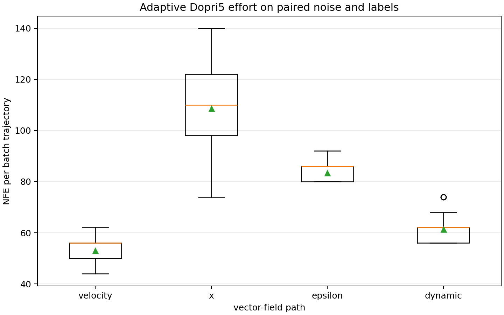
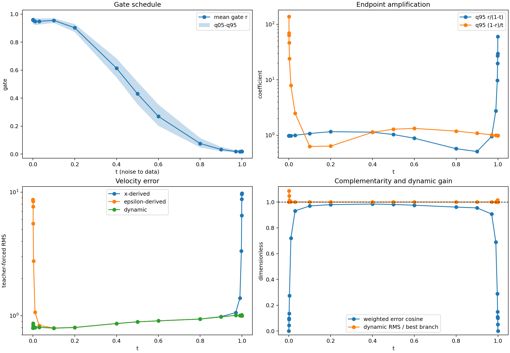

# SiT 双输出端点与 NFE 机制审计

更新时间：2026-08-11

## 结论

本轮使用现有 checkpoint，不训练模型，补齐了双输出实验最缺的两组证据：逐 batch
NFE 分布，以及细时间网格上的 gate、端点放大和三路 velocity error。

结果不支持“dynamic 路径整体因为端点奇异性而比 epsilon 更 stiff”这一强假设。
在 80 个完全配对的 batch 上，dynamic 的 NFE 全部分布都低于 epsilon：

| 路径 | mean NFE | std | min | q50 | q95 | max |
|---|---:|---:|---:|---:|---:|---:|
| 原始 velocity | 53.00 | 4.02 | 44 | 56 | 56 | 62 |
| dual x | 108.65 | 13.62 | 74 | 110 | 134 | 140 |
| dual epsilon | 83.38 | 3.53 | 80 | 86 | 86.3 | 92 |
| dual dynamic | 61.40 | 4.89 | 56 | 62 | 68.3 | 74 |

端点放大确实存在，但当前 `denominator_floor=1e-3` 和显式 endpoint branch
override 把它限制在阈值外的一条窄区域。它造成的 teacher-forced dynamic error
恶化最高约为 `8.6%`，不足以单独解释约 1--5 FID 的差距。

更清楚的新发现是：在主要时间区间里，两个加权分支误差几乎同向，cosine 约为
`0.95--0.98`。gate 虽有空间变化，却主要是在两个方向相近的误差之间选择，几乎
不能产生误差抵消。dynamic 的低 validation MSE 主要来自避开两个分支各自危险的
端点，而不是在中间轨迹形成了更准确的新 velocity field。

因此，当前失败更像三件事的组合：

1. `x/epsilon` 共享 trunk 的多任务训练没有达到单头 velocity 的表示质量；
2. 两个分支的剩余误差缺少 DDO mixing 所需的互补性；
3. teacher-forced bridge 上的逐时刻选择没有保证闭环 rollout 分布更好。

端点 objective mismatch 是真实风险，但不是当前数据支持的主要失败机制。

## 审计对象

- baseline：ImageNet-100 `SiT-S/2` 单头 velocity，400K EMA；
- dual：ImageNet-100 `SiT-S/2` 双输出，450K EMA；
- NFE：5000 个请求样本，四卡 padding 后 5120 个样本，batch 64/卡，共 80 个
  batch trajectory；
- solver：Dopri5，`atol=1e-6`、`rtol=1e-3`、FP32、TF32 开启；
- guidance：关闭；
- endpoint atlas：2000 张 class-balanced validation latent，100 类各 20 张；
- 每个时刻复用相同 clean latent、posterior sample 和 source epsilon；
- checkpoint、SD-VAE cache 和采样 NPZ 均未加入 Git。

NFE 审计中四条路径逐 batch 共享完全相同的初始噪声和标签。FID 对照也通过以下
一致性检查：

- 五组样本标签文件 SHA256 完全相同；
- 使用同一个 ImageNet-100 validation reference；
- sampler method、容差、输出时刻、精度和 TF32 设置相同；
- 所有 FID 均为无 guidance 的 5K ADM 评估。

## 逐 batch NFE



该结果有三层含义。

第一，派生的 x velocity 最难积分。它在数据端包含

\[
v_x=\frac{\hat x-x_t}{1-t},
\]

并且 NFE 分布最宽，最高达到 `140`。

第二，epsilon 路径也明显比原生 velocity 难积分，其平均 NFE 为 `83.38`。

第三，dynamic gate 确实发挥了数值切换作用。它将两条派生路径的 NFE 降至
`61.40`，只比原生 velocity 高 `15.8%`。dynamic 最大值 `74` 仍小于 epsilon
最小值 `80`，因此当前不能把 dynamic 的 FID 失败归因于“adaptive solver 为
dynamic 付出了更多数值求解代价”。

原始采样产物只保存每个 rank 的累计 NFE，无法恢复完整分布。本轮 NFE-only
审计重新使用正式模型和 sampler，仅省略 VAE decode 与样本保存；所得均值与原
产物的累计值逐项一致，因此不是另一套近似采样协议。

## 端点放大



当前两个派生速度为

\[
v_x=\frac{\hat x-x_t}{1-t},\qquad
v_\epsilon=\frac{x_t-\hat\epsilon}{t}.
\]

gate 混合后的误差贡献分别含有

\[
\frac{r}{1-t},\qquad \frac{1-r}{t}.
\]

细网格确认这两个系数会在端点附近迅速增大。例如：

| t | mean gate | q95 `r/(1-t)` | q95 `(1-r)/t` | dynamic/best error RMS |
|---:|---:|---:|---:|---:|
| 0.0010 | 0.9580 | 0.980 | 69.49 | 1.0000 |
| 0.0011 | 0.9578 | 0.980 | 63.34 | 1.0861 |
| 0.5000 | 0.4310 | 1.033 | 1.288 | 0.99994 |
| 0.9989 | 0.0191 | 27.06 | 0.990 | 1.0150 |
| 0.9990 | 0.0191 | 29.78 | 0.990 | 1.0000 |

`t=0.001` 与 `t=0.999` 的 dynamic error 恢复为最佳有限分支，不是 gate 突然学得
更好，而是 sampler 在 `t<=1e-3` 和 `t>=1-1e-3` 显式覆盖了混合结果。刚越过
阈值时，坏分支会短暂泄漏：

- `t=0.0011`：dynamic RMS 比 x 分支高 `8.6%`；
- `t=0.003`：高 `1.2%`；
- `t=0.9989`：比 epsilon 分支高 `1.5%`。

这证明普通 sigmoid gate 没有严格学出所需的 endpoint asymptotic rate。同时，
gate objective 的权重

\[
[t(1-t)]^2
\]

在 `t=0.0011` 约为 `1.21e-6`，比 `t=0.5` 的 `0.0625` 小约五万倍，确实会弱化
端点训练信号。

但是，泄漏区域很窄，dynamic 全局 NFE 又远低于两个派生分支。因此它更适合作为
一个需要修正的数值边界条件，而不是当前 FID 失败的完整解释。

## Gate 是否只是 time-only schedule

不是完全 time-only，但样本和空间自适应没有带来可见的误差收益。

在 `t=0.5`：

- gate mean：`0.4310`；
- gate std：`0.0495`；
- q05--q95：`0.3561--0.5167`；
- gate sample-mean std：`0.0194`；
- 平均 sample 内空间 std：`0.0447`；
- 约 `84.6%` 的 gate 方差来自 sample 内空间变化。

所以网络确实输出了 per-location variation，不能把它简单描述为纯时间表。

但关键不在 gate 有没有变化，而在两个可混合误差是否互补。定义

\[
e_x=r\frac{\hat x-x}{1-t},\qquad
e_\epsilon=(1-r)\frac{\epsilon-\hat\epsilon}{t}.
\]

两者的全局 cosine 为：

| t | weighted branch-error cosine | dynamic/best RMS |
|---:|---:|---:|
| 0.1 | 0.9697 | 1.000006 |
| 0.4 | 0.9845 | 0.999978 |
| 0.5 | 0.9812 | 0.999935 |
| 0.6 | 0.9751 | 0.999969 |
| 0.9 | 0.9545 | 1.000006 |

两个误差高度同向时，线性 mixing 几乎只能复制较优分支，而不能相互抵消。`t=0.5`
时 dynamic 相对最佳分支的 RMS 改善只有约 `0.0065%`。

这也重新解释了 450K validation：

| velocity metric | MSE |
|---|---:|
| dynamic | **0.8034** |
| epsilon | 1.0024 |
| x | 1.1055 |

dynamic 的 aggregate MSE 更低，主要因为它在噪声端选择 x、在数据端选择 epsilon，
避开了每条单分支最危险的端点。它并没有在中段制造出明显优于两者的新向量场。

## 与 FID 的关系

| 模型/路径 | step | FID |
|---|---:|---:|
| 单头 velocity | 400K | **68.6537** |
| 双输出 dynamic | 400K | 73.8274 |
| 双输出 epsilon | 450K | **70.7303** |
| 双输出 dynamic | 450K | 71.7942 |
| 双输出 x | 450K | 72.8160 |

目前可以可靠陈述：

1. learned gate 成功完成了端点分支切换，并显著降低派生速度场的 NFE；
2. 它没有创造足够的 branch-error complementarity；
3. 双输出的三个 rollout 都没有超过单头 velocity baseline；
4. teacher-forced aggregate MSE 最低不足以预测 rollout FID 最低。

目前仍不能仅凭这些数据断言：

- FID 差距全部来自 shared-trunk gradient conflict；
- rollout Jacobian 或 divergence 一定更差；
- fixed-NFE few-step 下 dynamic 仍然失败；
- x 或 epsilon 是 intrinsically 更差的 prediction target。

这些问题分别需要梯度审计、rollout/Jacobian probe、固定 NFE 采样，以及独立训练的
target baseline。

## 下一步

按信息增益排序：

1. 使用固定步长 Euler/Heun，在真正相同的 25/50 NFE 下比较四条路径；不得用
   `num_output_points` 代替 NFE。
2. 在同一 batch 分别反传 `L_x` 与 `L_epsilon`，逐 block 记录梯度范数和 cosine；
   同时比较 loss sum 与 average，分离梯度尺度和方向冲突。
3. 训练独立的 velocity-only、x-only、epsilon-only 同预算基线，确定 target ranking。
4. 在上述结果出来前，不继续把当前 learned-gate dual model 直接堆到 800K。
5. 后续复现 SC-Flow 时，先做原生 velocity + endpoint + consistency + fixed switch，
   再研究 residual disagreement，避免重新引入派生 velocity 的双端奇异性。

## 数据与复现

所有提交数据总计不足 1 MB：

| 文件 | 内容 |
|---|---|
| `endpoint_metrics.csv` | 23 个细时间点的完整端点统计 |
| `endpoint_audit.json` | checkpoint、抽样、指标定义和全部 rows |
| `endpoint_audit.png` | gate、端点系数、velocity error 与互补性图 |
| `nfe_per_batch_audit/nfe_per_batch.csv` | 四路径、四 rank、80 batch 的逐 batch NFE |
| `nfe_per_batch_audit/nfe_distribution_summary.csv` | NFE 分布摘要 |
| `nfe_per_batch_audit/nfe_audit_manifest.json` | 配对与 solver 协议 |
| `fid_summary.csv` | 正式 FID/sFID/IS 小表 |
| `validation_summary.csv` | 400K/450K raw/EMA validation 小表 |
| `validation_time_bins.csv` | time-bin gate 与 velocity MSE |
| `mechanism_summary.json` | 数据质量检查和汇总入口 |

端点审计：

```bash
python experiments/audit_imagenet100_sit_dual_endpoint.py \
  --sample-count 2000 \
  --batch-size 64 \
  --output-dir docs/data/imagenet100_sit_dual_endpoint_audit \
  --device cuda:0
```

逐 batch NFE：

```bash
CUDA_VISIBLE_DEVICES=0,1,2,3 torchrun --standalone --nproc_per_node=4 \
  experiments/audit_imagenet100_sit_nfe.py \
  --num-samples 5000 \
  --per-rank-batch-size 64 \
  --output-dir \
    docs/data/imagenet100_sit_dual_endpoint_audit/nfe_per_batch_audit
```

原始产物摘要：

```bash
python experiments/summarize_imagenet100_sit_dual_mechanism.py
```

该审计只提交代码、表格、JSON 和 PNG。ImageNet、SD-VAE cache、checkpoint、样本
NPZ、训练日志和 decoder 输出均保留在本机数据目录，不进入 Git。
