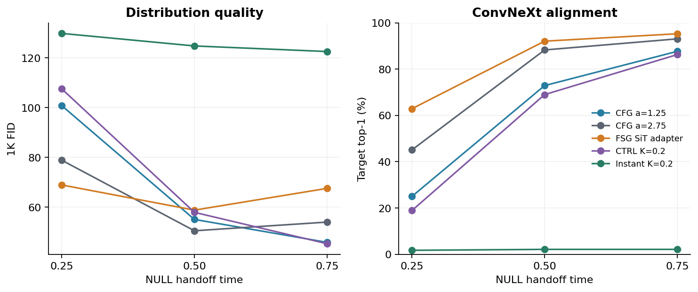
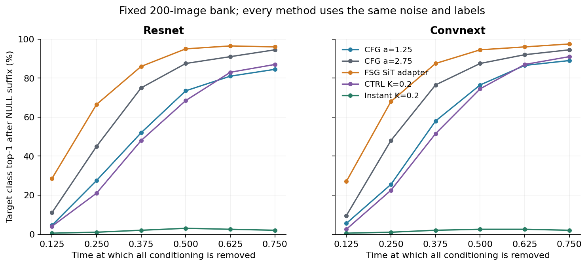
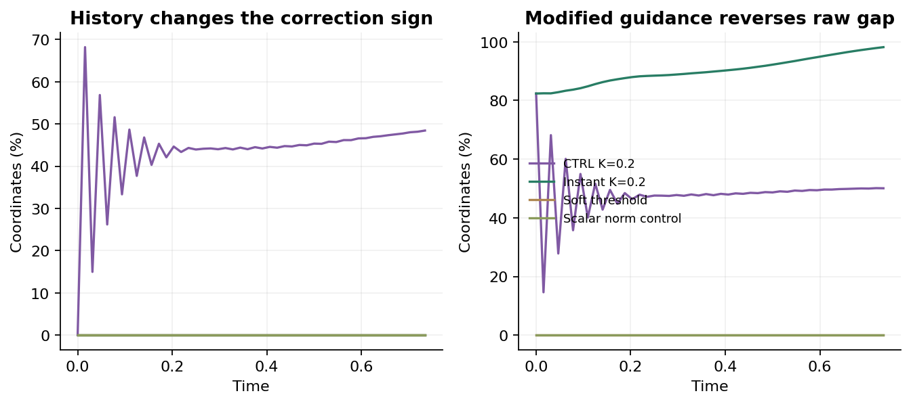

# FSG / CFG-Ctrl：图像机制与配对1K结果

**本轮SiT适配里，FSG在早期撤条件时有收益，完整轨迹的FID却更差；CTRL明显优于同参数的瞬时修正。** 调参后的原生CFG FID为 45.7073，CTRL为 44.7256，FSG适配为 68.1885。完整latent直接一致性实验也已完成：两条未来接近可以伴随共同退化，具体残差、图像和位移限制见[直接相等检验](SIT_GOLDEN_PATH_DIRECT_RESULTS_20260911_ZH.md)。

**实现范围需明确：当前FSG是SiT上的算子适配，不能称完整复现作者SDXL pipeline。** 作者代码的普通步执行CFG++，使用校准前缓存的NULL预测；本轮使用Heun CFG，并有预先固定的半径裁剪和不同的前瞻调度。已检查并执行作者真实函数体，调度器时间系数还存在需要单独区分的实际步距问题。代码版本、逐行依据、CPU重放与适用边界见[作者代码核对](SIT_FSG_AUTHOR_CODE_AUDIT_20260911_ZH.md)。

实验使用SiT-S/2 ImageNet-100 800K checkpoint、原VAE、256px、Heun64。时间从噪声0到图像1；CFG为v_c+a(v_c−v_u)，对应常见权重w=1+a。t≥0.75关闭附加guidance后仍使用条件分支；真正NULL后缀使用空类别100。机制集为全新200个噪声、100类各2张；1K质量集为同一套配对旧噪声、100类各10张，参考为固定5000张验证集的ADM Inception统计。a=1.25和CTRL参数来自此前1K选择，因此这些质量结果是机制探索，不是独立确认。

新增32项1K采样全部完成，另4条基线在首批latent与调用数逐位复现后复用。完整轨迹质量如下；分类器读取计算FID的同一份uint8像素，CN为ConvNeXt-Tiny，R18为ResNet18，top1仅衡量类别对齐。Full为每张轨迹的完整模型求值次数，耗时为采样加解码的累计batch GPU秒，倍数相对于调参后CFG。

|方法|FID↓|sFID↓|CN目标top1|Full|耗时倍数|同目标类Inception方差比|
|---|---:|---:|---:|---:|---:|---:|
|CFG a=1.25|45.7073|206.411|89.00%|224|1.00×|1.000|
|CFG a=2.75|54.6481|206.188|93.20%|224|0.98×|0.761|
|FSG SiT adapter|68.1885|208.222|95.20%|260|1.15×|0.533|
|FSG length / CFG direction|64.3008|210.310|93.20%|260|1.18×|0.701|
|FSG minus same-field error|65.5841|209.802|94.40%|296|1.34×|0.654|
|Same-field Euler cycle|60.1332|207.567|94.80%|260|1.19×|0.624|
|Heun refinement|54.6599|206.161|93.20%|260|1.18×|0.761|
|CTRL K=0.2|44.7256|207.754|87.60%|224|0.97×|1.064|
|Instant K=0.2|122.9979|208.557|2.50%|224|1.05×|2.434|
|Instant K=0.1|70.5870|211.769|52.60%|224|1.03×|1.785|
|Soft threshold|111.9753|220.090|22.30%|224|1.04×|2.276|
|Scalar norm control|62.9550|210.440|95.50%|224|1.02×|0.595|
|Local-gap fit|45.7018|206.312|89.30%|1005|4.22×|0.997|
|Agreement fit|45.7037|206.532|89.10%|1005|4.27×|1.004|
|Fixed conditional-target fit|45.8414|206.142|89.70%|1005|4.23×|0.968|
|Fixed guided-target fit|45.8464|206.090|89.70%|1005|4.23×|0.968|

把每次计算出的FSG位移长度改沿局部CFG方向施加，FID为 64.3008，好于FSG适配的 68.1885，但仍差于不加校准的强CFG 54.6481。同为260次Full的Heun加密为 54.6599。这些对照说明，方向变化和额外计算本身没有在本轮转化成质量收益；位移幅度、普通采样器与往返离散误差都需要分别评估。

四种fit是在4维子空间中、t=0.375做一次更新的预定方法，均需1005次Full；它们的FID接近原CFG，微小差值不能解释成可靠质量收益。这组结果不能代替后续完整4096维优化实验。FSG的同目标类Inception方差更小，是分布收缩的诊断线索；它不是经过验证的多样性指标。

撤除全部条件后，FSG适配的类别保持较早出现。下面是200个新噪声的ConvNeXt目标top1；后续NULL为真正无条件推进，不能与关闭额外CFG混称。

|前缀方法|t=0.25转NULL|t=0.5转NULL|t=0.75转NULL|继续原guidance|
|---|---:|---:|---:|---:|
|CFG a=1.25|25.50%|76.50%|89.00%|90.00%|
|CFG a=2.75|48.00%|87.50%|94.50%|95.00%|
|FSG SiT adapter|68.00%|94.50%|97.50%|97.50%|
|FSG length / CFG direction|60.50%|91.00%|94.50%|94.50%|
|CTRL K=0.2|22.50%|74.50%|91.00%|92.00%|
|Instant K=0.2|1.00%|2.50%|2.00%|2.50%|

类别保持的优势并不在所有切换时刻对应FID优势。以下是每组1000图的后缀FID，均从对应前缀继续生成：

|前缀方法|t=0.25转NULL|t=0.5转NULL|t=0.75转NULL|t=0.5转纯条件|
|---|---:|---:|---:|---:|
|CFG a=1.25|100.7705|55.0584|45.8411|47.4179|
|CFG a=2.75|78.8383|50.4993|53.9844|51.0942|
|FSG SiT adapter|68.9100|58.7916|67.5371|61.6128|
|CTRL K=0.2|107.5141|57.9051|45.2961|47.6413|
|Instant K=0.2|129.8010|124.7626|122.5203|127.4516|

在t=0.25转NULL时，FSG适配的FID 68.9100 优于同强度CFG的 78.8383；t=0.5时则为 58.7916 对 50.4993，排序翻转。因此，早期撤条件实验支持FSG适配较早保留条件内容，但不能把它当成在所有时刻都改善质量的机制。这一1K后缀组没有FSG长度沿CFG方向的完整质量对照，尚不能把早期FID优势单独归因于FSG的方向变化。

三个NULL切换时刻，CFG/CTRL的Full次数分别为 160/192/224，FSG适配为 172/216/260。较早撤条件减少模型查询，也改变质量；各配置的实际时间和类别读出保留在完整质量表。

同状态、同位移半径的干预进一步区分三种目标。下表对64个噪声、两档强度、三个时刻取配对均值，误差下降正值表示改善：

|更新方向|对原条件终点的误差下降|修改后U/C差下降|NULL目标top1变化|
|---|---:|---:|---:|
|CFG方向|25.77%|4.46%|+4.43 pp|
|FSG方向|12.32%|1.36%|+4.17 pp|
|局部gap负梯度|0.93%|3.13%|+0.78 pp|
|未来一致性负梯度|0.04%|6.84%|+2.08 pp|
|冻结条件终点负梯度|23.24%|5.31%|+4.95 pp|

前32个噪声的完整NULL反演oracle，把对原条件终点的误差降低 99.72%，但修改后U/C差只降低 9.79%，局部速度差反而增加 3.20%。它把冻结的原条件结果转移给NULL，并未让新状态的两条未来相等。oracle未受同一半径约束，不能把它的改善与小步对照直接作效率比较。

Jacobian实现已用独立自动微分和中心差分核对；原先“同长度CFG更接近”的解释必须加上目标定义。H=1/32时，以精细guided流终点为目标，Euler FSG误差26.82%，同长度CFG为18.28%；以FSG自己的Euler前向终点为目标，FSG为13.88%，同长度CFG为15.76%。未裁剪FSG对自己的离散目标更有优势，裁剪可能改变这一结果。这里比较的是直接终点误差，无需假定Jacobian线性化成立。

严格的逆流组合δ=Φᵤ⁻¹(Φw(x))−x，可以在局部写成 Jᵤ⁻¹[Φw(x)−Φᵤ(x)]；它作用于一个具体未来位移，并没有显式估计完整Jacobian矩阵。H→0时δ≈H(1+a)g。同长度CFG对照取‖δ‖g/‖g‖，不是另选一个更强超参数。数值检查、有限步余项和目标纠正见[Jacobian复核](SIT_FSG_JACOBIAN_AUDIT_RESULTS_20260911_ZH.md)。

CTRL的历史项有可见作用。公共离散形式为 mₖ=gₖ−K sign[gₖ+(λ−1)mₖ₋₁]，本轮K=0.2、λ=5。固定小正gap 0<g<0.16时，m在g−K和g+K之间形成二周期，平均值为g；瞬时式g−K sign(g)则持续反转这个小gap。实际轨迹第1步，历史项使约68.17%的坐标修正符号不同于sign(g)，并非罕见扰动。本轮Heun两阶段共用冻结历史，并提交左阶段的修改gap；这些离散证据不能直接当成连续时间导数控制的证明。

SiT-XL/2也已完成固定16噪声、12方法、5种续生成，共960张图片。使用官方SiT-XL-IG800EP checkpoint的full分支、NULL=1000，时间与速度映射通过原生Euler逐位核对。该checkpoint经过IG训练，不能等同于未训练IG的原始SiT模型；参数沿用小模型探针，未在16张上重新调参。这组单图用于检查现象是否可见，不提供大模型FID或普遍排名。

[小模型全部200样本图册](/home/zhoushunyu/data/eqvae/experiments/sit_fsg_ctrl_hypothesis_20260911/gallery.html) · [大模型全部16样本图册](/home/zhoushunyu/data/eqvae/experiments/sit_xl_fsg_ctrl_examples_20260911/gallery.html) · [完整36项质量表](data/sit_fsg_ctrl_hypothesis_20260911/quality_all_results.csv) · [直接一致性实验](SIT_GOLDEN_PATH_DIRECT_RESULTS_20260911_ZH.md)。

32项新1K的请求、源文件、权重、输入身份、样本覆盖与全部元数据通过核验；其中 6 项另逐批重算原始文件哈希、核对实际调用与计时，并从缓存特征独立重算FID/sFID，绝对偏差均小于0.001。没有重新提取Inception特征。分类器另从相同FID像素读取，并记录图像/权重哈希。[核验记录](/home/zhoushunyu/data/eqvae/experiments/sit_fsg_ctrl_hypothesis_20260911/hypothesis_1k/analysis_audit.json) · [固定协议](SIT_FSG_CTRL_HYPOTHESIS_PROTOCOL_20260911_ZH.md)。

机制请求SHA256：`d8420a3801e09e3b34726113712bf8329367fbbe2f53de59a09ed881948ce264`；质量请求SHA256：`77d09cc94e4978c880a068a46fc575be3ef1e0e8a9e920cb37c2bb010a038e3d`。
